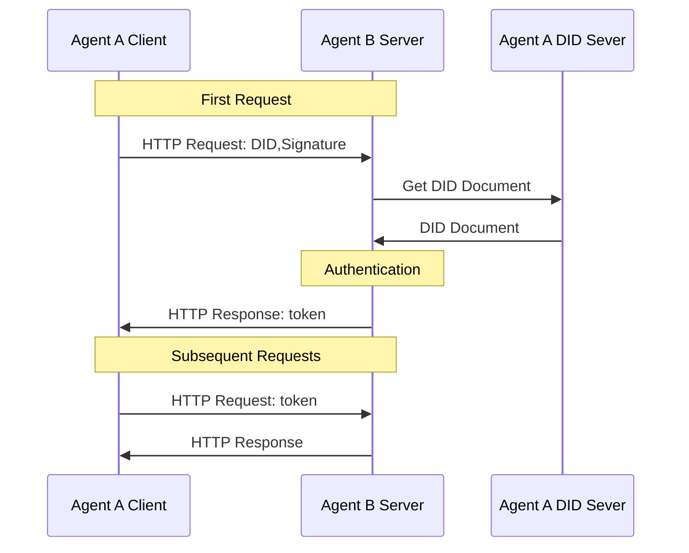

# Agent Network Protocol Framework: A Protocol Framework for Agent Communication

## Abstract

While current internet infrastructure is quite advanced, it lacks standardized communication and network connection solutions tailored to the specific needs of agent networks. To fully harness the potential of artificial intelligence, this paper proposes a protocol framework for agent communication—the Agent Network Protocol Framework. This framework aims to eliminate information silos, enabling seamless, decentralized identity authentication and efficient collaboration among agents. It consists of three layers: the Identity and Encrypted Communication Layer, the Meta-Protocol Layer, and the Application Protocol Layer. The Identity and Encrypted Communication Layer, based on the W3C DID standard, provides decentralized identity authentication and end-to-end encrypted communication, ensuring secure connections between agents. The Meta-Protocol Layer enhances collaboration flexibility and efficiency through natural language negotiation and AI code generation, reducing communication costs. The Application Protocol Layer simplifies agent interactions through standardized protocol descriptions and management. This paper focuses on the overall design of this protocol framework, offering an innovative solution for agent communication.

## 1. Introduction

With the rapid development of agent technology, it is gradually becoming the next significant platform following Android and iOS[^1]. However, there is still a lack of standardized solutions for communication and network connections between agents. Although internet infrastructure is quite mature, existing technologies cannot fully meet the unique needs of agent networks, primarily due to the following reasons:

Firstly, agents typically require comprehensive access to user information to make accurate decisions. However, the data silo effect in the current internet disperses user information across different platforms, limiting the functionality of agents. Secondly, current internet applications are primarily designed for human users, relying on graphical interfaces, whereas agents are more adept at directly processing underlying data through protocols or APIs. Graphical interfaces not only increase development costs but also reduce processing efficiency. Lastly, agents have the capability to use natural language for network connections and negotiations, enabling self-organization and self-collaboration for more personalized and efficient communication.

Therefore, there is an urgent need for a new protocol framework that can break down data barriers and enable seamless connections and communication between agents. This framework should have the following characteristics: eliminate information silos, allowing agents to make decisions in a complete context; provide AI-friendly data interfaces to reduce information processing costs; and support autonomous connection, negotiation, and collaboration among agents. To this end, this paper proposes a three-layer protocol framework, including the Identity and Encrypted Communication Layer, the Meta-Protocol Layer, and the Application Protocol Layer, aimed at addressing the challenges in agent communication.

## 2. Three-Layer Protocol Architecture

To address issues such as identity authentication, protocol negotiation, and application interaction in agent networks, we have designed a three-layer protocol architecture, as illustrated below:

  

- **Identity and Encrypted Communication Layer**: This layer defines a set of standards aimed at solving identity authentication issues between agents, particularly cross-platform authentication. We have designed a decentralized identity authentication scheme based on the W3C DID[^3], providing end-to-end encrypted communication to ensure secure identity authentication between agents on any platform.

- **Meta-Protocol Layer**: This layer defines how agents negotiate using natural language, including the negotiation and debugging of communication protocols. Through the flexibility of natural language, agents can dynamically adjust communication protocols to meet different interaction needs.

- **Application Protocol Layer**: This layer defines how agents describe their capabilities and supported protocols, as well as how to load and process protocol code. Through standardized protocol descriptions, agents can interact and collaborate more efficiently.
### 2.1 Identity and Encrypted Communication Layer

To achieve seamless connectivity among all agents, the primary task is to address the issue of identity authentication between agents. Currently, most internet applications use centralized identity technologies, making it difficult for systems to authenticate accounts across different implementations. Although OAuth2.0 technology has alleviated this issue to some extent[^2], it is not specifically designed for cross-system identity authentication, resulting in a relatively complex process and limitations in decentralization. Therefore, there is an urgent need for a convenient, cross-platform, and decentralized identity authentication technology.

While blockchain-based decentralized identity authentication schemes offer a potential solution, they face scalability challenges in large-scale applications and have not yet become the optimal solution.

To address these issues, we introduce the W3C Decentralized Identifier (DID) standard[^3]. DID is a new identifier standard designed to solve the dependency on traditional centralized identity management systems. It allows users to control their own identities and authenticate each other without relying on centralized systems. The core specification of DID does not mandate the use of specific computing infrastructure to construct decentralized identifiers, enabling us to leverage existing mature technologies and well-established web infrastructure to build DIDs. Additionally, various types of identifier systems can add support for DIDs, creating an interoperable bridge between centralized, federated, and decentralized identifier systems. This means that existing centralized identifier systems do not need to be completely restructured; they can achieve cross-system interoperability by creating DIDs on top of their existing infrastructure, significantly reducing the technical implementation difficulty.

  

The core component of DID is the DID document, which contains key information related to a specific DID, used to verify the identity of the DID owner and manage operations, permissions, and access control related to the DID.

  

During the authentication process, the DID document contains methods and corresponding public keys for verifying user identity (private keys are kept by users). The client can include DID and signature in HTTP headers during the initial HTTP request. Without increasing the number of interactions, the server can quickly verify the client's identity using the public key from the DID document. After initial verification, the server returns a token, which the client carries in subsequent requests. The server then only needs to verify the token instead of authenticating the client's identity each time. The core of this process lies in the verifier using trusted public keys to validate user signatures, enabling identity authentication, permission verification, and data exchange to be completed in a single request, making the process both concise and efficient.

The DID method defines how to create, resolve, update, and deactivate DIDs and DID documents, as well as how to perform authentication and authorization. Among the existing DID method drafts, the `did:web` method[^5] is built on mature web technologies, allowing systems to use centralized technologies (such as cloud computing) to create, update, and deactivate DIDs and DID documents. Different systems achieve interoperability through the HTTP protocol, similar to how email services work on the internet, enabling large-scale deployment and convenient cross-platform identity authentication.

Based on the `did:web` method, we have added cross-platform identity authentication processes and agent description services for agent communication scenarios, proposing a new DID method—`did:wba` (Web-Based Agent). The `did:wba` method inherits the advantages of `did:web`, further optimizing the identity authentication mechanism between agents and enhancing its applicability in agent networks.

Additionally, users typically create one or more public-private key pairs for their DIDs, which are used not only for identity authentication but also for end-to-end encrypted communication. Based on the public-private key pairs of DIDs, we have designed an end-to-end encrypted communication scheme using the Elliptic Curve Diffie-Hellman Ephemeral (ECDHE) protocol[^6], achieving secure communication between two DIDs and ensuring that intermediate nodes cannot decrypt the communication content.

### 2.2 Meta-Protocol Layer

The Meta-Protocol is a high-level protocol that defines the rules for operating, parsing, composing, and interacting with communication protocols. Essentially, it is a protocol for negotiating communication protocols, not directly handling specific data transmission but providing a flexible, general, and extensible communication framework.

Currently, there are two main methods for communication between agents:

1. **Human Engineers Design Communication Protocols**: For example, common industry standards. Human engineers design communication protocols for agents, develop protocol code, and perform debugging, testing, and deployment. However, this method often faces high development costs, slow protocol updates, and difficulty adapting to new scenarios.

2. **Agents Directly Use Natural Language Communication**: Agents use natural language for communication, internally utilizing large language models (LLMs) to process natural language data. However, this method has high data processing costs and low processing accuracy.

To solve these problems, we can use a combination of Meta-Protocol and AI code generation. By using Meta-Protocol and leveraging AI code generation technology, we can significantly improve communication efficiency between agents, reduce communication costs, and maintain flexibility and personalization in communication[^7].

The basic process of using Meta-Protocol for communication is as follows:

1. **Meta-Protocol Request**: Agent A first sends a Meta-Protocol request to Agent B. The request body uses natural language to describe its needs, inputs, expected outputs, and proposes candidate communication protocols. Candidate communication protocols generally include transport layer protocols, data formats, and data processing methods.

2. **Protocol Negotiation**: After receiving the Meta-Protocol request, Agent B uses AI to process the natural language description in the request and, based on its own capabilities, determines whether to accept A's request and candidate protocol. If B's capabilities cannot meet A's request, it directly rejects it; if B does not accept A's candidate protocol, it can propose its own candidate protocol, entering the next round of negotiation. The negotiation process continues until both parties reach an agreement or the negotiation fails.

3. **Code Generation and Deployment**: Once an agreement is reached, both parties generate protocol handling code based on the negotiated protocol and deploy it.

4. **Joint Debugging and Testing**: After code deployment, both parties conduct joint debugging and testing with test data to ensure the protocol and AI-generated protocol handling code work correctly.

5. **Formal Communication**: After joint debugging is completed, the protocol goes live. Agent A and Agent B then start communicating using the final negotiated protocol and process data with the AI-generated code.

6. **Handling Requirement Changes**: If requirements change, the above process is repeated until both parties reach a new agreement.

  

However, the Meta-Protocol negotiation process is time-consuming and relies on AI code generation capabilities. If every communication involves Meta-Protocol negotiation, it will result in significant cost consumption and poor interaction experience. Given that there are many similar communication processes between agents, agents can save the results of Meta-Protocol negotiations. When encountering similar needs in the future, they can directly use the previous negotiation results as the formal protocol for communication or as candidate protocols for negotiation. Additionally, agents can share negotiation results for other agents to query and use.

How to economically incentivize agents to actively upload negotiation results and select consensus protocols among agents is an issue that still requires in-depth research in the Meta-Protocol layer.

[^1]: https://arxiv.org/pdf/2410.11905

### 2.3 Application Protocol Layer

To reduce communication costs and improve interaction experience, agents should avoid negotiating communication protocols through meta-protocols in most communication scenarios. Therefore, at the application protocol layer, we will design a series of specifications based on semantic web standards, including **Agent Capability and Supported Protocol Description** and **Application Protocol Management Specification**, making communication between agents more convenient, efficient and cost-effective.

The **Agent Capability and Supported Protocol Description Specification** clarifies how agents describe their capabilities and supported protocols, as well as the protocol information required to invoke these capabilities. Agents can publish these description documents on the internet or specialized agent search services for other agents to query and invoke.

In the design of agent description specifications, we have used many semantic web standards, including RDF (Resource Description Framework), JSON-LD (JSON Linked Data), schema.org, etc. Repeatedly utilizing these technologies can enhance the consistency of data understanding between two agents.

The **Application Protocol Management Specification** defines the document format, metadata (such as protocol version, release date, creator, etc.), and methods for querying and downloading application protocol documents. Application protocols should include the following content:

- **Protocol Version**: Indicates the iteration and update information of the protocol, ensuring both parties use compatible protocol versions.
- **Function Description**: Details the protocol's functions, applicable scenarios, and expected outcomes.
- **Input and Output Data Formats**: Defines the format, type, and constraints of data during interaction.
- **Protocol Handling Process**: Describes the steps, sequence, and logical relationships of communication.
- **Protocol Code Signed by Trusted DID**: Includes the code for the requester to initiate requests and the responder to handle requests, ensuring the security and trustworthiness of the code.

The sources of application protocols can be diverse:

1. **Human-Defined Standard Protocols**: Developed by domain experts or industry organizations, with broad applicability and consistency.
2. **Consensus Protocols Negotiated Between Agents**: Reached through Meta-Protocol negotiation, suitable for specific collaborative tasks.
3. **Personalized Protocols Between Agents**: Customized protocols for specific needs or scenarios by agents.

To facilitate the sharing and reuse of application protocols, a protocol service platform similar to PyPI can be established in the future to centrally manage application layer protocols. Agents can search, download, and use existing protocols and their code on this platform to provide services. When invoking other agents' services, they can load the corresponding protocol code based on the supported protocols and communicate accordingly.

The following is an example process of **Agent A Invoking Agent B's Service**:

1. **Capability Discovery**: Agent A discovers that Agent B has the capability to meet its needs through search or query services.
2. **Protocol Matching**: A reviews B's capability description document to determine the available communication protocols.
3. **Protocol Loading**: A loads the corresponding protocol handling code through the protocol service platform.
4. **Communication Execution**: A uses the loaded protocol code to communicate with B according to the specified process.

  

In specific data exchanges, the data format of the protocol is not limited and can be chosen based on needs, such as JSON, OpenAPI, Protocol Buffers, etc., to meet the requirements of different application scenarios.

## 3. Future Prospects

While our proposed three-layer protocol architecture addresses key issues in agent network communication, several areas require further exploration.

Firstly, the optimization of **cross-platform identity authentication technology** is a pressing issue. Although the W3C DID standard offers potential for decentralized identity authentication, its infrastructure remains underdeveloped as a newly recommended standard.

Secondly, the **suitability of underlying communication protocols** needs reevaluation. Our approach relies on existing web infrastructure, which simplifies technical implementation but may overlook the specific needs of agent communication. Is the current HTTP protocol still the best choice for agents? Are there alternative protocols better suited for agent data exchange and communication efficiency? These questions warrant further investigation.

Lastly, the **application prospects of blockchain technology in agent networks** are promising. As blockchain technology matures, its inherent decentralization and emphasis on personal data sovereignty could provide an ideal foundation for building agent networks. Blockchain not only facilitates easier AI access to user data but also offers financial attributes that could address economic incentive challenges faced by agents during protocol negotiations.

Our research provides a foundational framework for agent network communication, yet significant work remains in areas such as identity authentication, communication protocols, and technology selection. Future research should focus on these critical issues to propose more innovative and practical solutions.

## 4. Conclusion

This paper presents a three-layer protocol architecture for agent network communication, aiming to address the lack of standardized communication and network connection solutions among agents. Firstly, by introducing a decentralized identity authentication scheme based on W3C DID, we provide agents with cross-platform identity authentication capabilities and design an end-to-end encrypted communication mechanism to ensure communication security and trustworthiness. Secondly, at the meta-protocol layer, we leverage natural language negotiation and AI code generation capabilities to enhance communication efficiency and flexibility among agents, reducing the complexity and cost of protocol negotiation. Finally, the application protocol layer, through standardized protocol description and management, simplifies the interaction process between agents, reduces communication costs, and enhances interaction experience.

Despite significant progress in addressing agent communication issues, challenges remain. For instance, further optimization of cross-platform identity authentication technology to improve scalability and practicality; exploring more suitable underlying protocols for agent communication to enhance data exchange efficiency and reliability. Additionally, the potential application of blockchain technology in agent networks deserves in-depth research, particularly in decentralized identity management and economic incentive mechanisms.

In summary, this study provides an innovative solution for agent network communication, laying a solid foundation. Future work will focus on refining this architecture, addressing existing issues, and advancing the development of agent technology.

## 5. References

[^1]: Bill Gates, AI is about to completely change how you use computers, [https://www.gatesnotes.com/AI-agents](https://www.gatesnotes.com/AI-agents)

[^2]: The OAuth 2.0 Authorization Framework, [https://tools.ietf.org/html/rfc6749](https://tools.ietf.org/html/rfc6749)

[^3]: Decentralized Identifiers (DIDs) v1.0:Core architecture, data model, and representations[https://www.w3.org/TR/did-core/](https://www.w3.org/TR/did-core/)

[^4]: Use Cases and Requirements for Decentralized Identifiers [https://www.w3.org/TR/did-use-cases/](https://www.w3.org/TR/did-use-cases/)

[^5]: did:web Method Specification, [https://w3c-ccg.github.io/did-method-web/](https://w3c-ccg.github.io/did-method-web/)

[^6]: The Transport Layer Security (TLS) Protocol Version 1.3，[https://www.rfc-editor.org/rfc/rfc8446.html](https://www.rfc-editor.org/rfc/rfc8446.html)

[^7]: A Scalable Communication Protocol for Networks of Large Language Models, [https://arxiv.org/pdf/2410.11905](https://arxiv.org/pdf/2410.11905)

## Copyright Notice
Copyright (c) 2024 GaoWei Chang  
This file is released under the [MIT License](./LICENSE). You are free to use and modify it, but you must retain this copyright notice.
