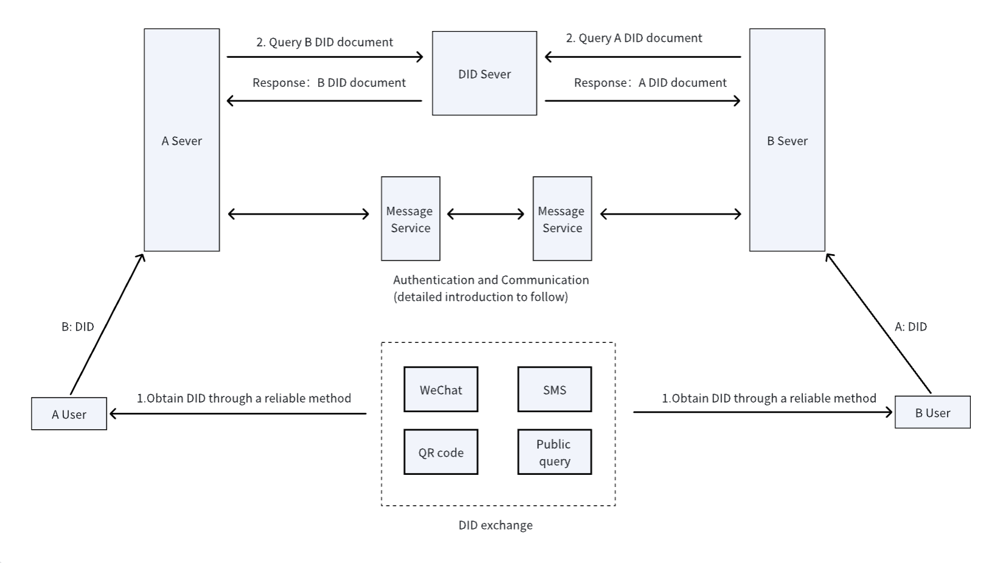

# AgentNetworkProtocol Technical White Paper: A Cross-Platform Identity Authentication and End-to-End Encrypted Communication Protocol Based on DID

**Authors:** 常高伟，chgaowei@gmail.com  
**Website:** [https://agent-network-protocol.com/](https://agent-network-protocol.com/)  
**GitHub:** [https://github.com/chgaowei/AgentConnect](https://github.com/chgaowei/AgentConnect)  

**Note:**  
If you want to quickly understand our technical overview, you can first read this article: [Technical Introduction for General Audience](https://egp0uc2jnx.feishu.cn/wiki/NS9qwPzNeiIlmmkGAP7cIwN0nZg) or [Simplified Technical Introduction](https://egp0uc2jnx.feishu.cn/wiki/Qg3DwA0VuiHAC6k7ubicZGJHndd).  
For comprehensive documentation, you can access it here: [AgentConnect Technical Documentation](https://egp0uc2jnx.feishu.cn/wiki/BqYiwiblRiu81FkQNUfcfaIwniK).  

## Abstract

This paper presents a decentralized identifier (DID) and end-to-end encrypted communication technology-based protocol designed to address the challenges of cross-platform identity authentication and secure communication among intelligent agents. By integrating the W3C DID specifications, blockchain technology, and the TLS protocol, this paper designs a low-cost, efficient, and secure cross-platform identity authentication and encrypted communication solution. The protocol introduces a DID method named "all," enabling intelligent agents to achieve identity interoperability across different platforms and perform identity authentication through standard protocols like HTTPS. The document details the generation and verification processes of DID documents, as well as the DID-based end-to-end encrypted communication mechanism, emphasizing efficient and secure short-term key negotiation and encryption communication flows. Finally, the paper explores future directions for intelligent agent collaboration networks and the broad application prospects of DID-based identity systems.

## 1. Introduction

Intelligent agents are poised to become the next significant platform following Android and iOS. In the future, individuals, organizations, and enterprises will each possess an intelligent agent to provide services. An intelligent agent cannot exist independently; it needs to collaborate with other intelligent agents to meet human needs. For example, a personal assistant is an intelligent agent that requires life-related intelligent agents such as those for clothing, food, and housing to provide life services. Similarly, an intelligent agent for a clothing store needs to closely collaborate with upstream and downstream agents like production, design, and distribution. A collaborative network composed of intelligent agents will be a crucial component of the next-generation internet, capable of providing more intelligent services to people.

The efficient operation of an intelligent agent network requires intelligent agents to establish connections, locate each other, perform identity authentication, conduct secure encrypted communication, and use standard protocols for efficient collaboration.

Currently, most intelligent agents rely on platform-specific identity IDs, making it impossible to interconnect identity systems across different platforms, thereby preventing low-cost cross-platform connections between intelligent agents. Additionally, existing secure communication solutions (such as TLS) are mostly used for client-server communications and depend on Certificate Authority (CA) issued certificates. There is currently no ideal solution that allows intelligent agents to perform low-cost, efficient, and secure encrypted communications.

To address this, by combining W3C DID (Decentralized Identifier) specifications, blockchain technology, and TLS (Transport Layer Security) technology, this paper proposes a low-cost solution to bridge different platform identity IDs and a method that enables intelligent agents to perform low-cost, efficient, and secure encrypted communications. It also presents a vision for intelligent agents collaborating based on protocols.

## 2. Cross-Platform Identity Authentication Based on DID

W3C DID (Decentralized Identifier) is a new type of identifier standard designed to address issues in traditional centralized identity management systems, such as centralized dependency, privacy and data control, interoperability, and security.

Based on the W3C DID specifications, we propose an identity authentication scheme by designing a new DID method. This method leverages DID's advantages in interoperability to simplify the identity verification process, solving the lack of interoperability and the complexity and redundancy of identity verification between different centralized systems.

### 2.1 DID Method "all" (Alliance)

A DID Method is an implementation of a Decentralized Identifier (DID) that specifies how to create, resolve, update, and deactivate a DID. Each DID method is associated with a specific blockchain or decentralized network and defines the concrete rules for interacting with that network.

Most existing DID methods are blockchain-based, which are limited by the current stage of blockchain technology and face significant issues in scalability and commercialization. Web-based DID methods are deeply tied to domain names, requiring web service providers to support DID-related operations, adding complexity to web service providers.

We propose a new DID method called "all" (Alliance), similar to a consortium blockchain. All service providers that support this method's standard can offer DID-related services externally. DID users can choose one or more providers based on factors like pricing, service levels, and reputation. All service providers supporting this method can register their service domains to a specific memory space on the blockchain to ensure that all users of the "all" method can access a complete list of service providers.

Additionally, DID creators can specify the hosting service domain for DID documents within the DID to inform DID resolvers to fetch the DID documents from specific service providers or user-hosted servers.

Finally, all operations of the "all" method use standard web protocols like HTTPS to leverage existing web infrastructure.

### 2.2 Design of the "all" Method

The core of the "all" method design is to use cryptographic techniques to ensure the immutability of DID documents and utilize consortium nodes to maintain system distribution.

All operations for creating, resolving, updating, and deactivating DIDs in the "all" method use HTTPS. The core process is as follows:


1. User A first retrieves the list of "all" method service domains from the blockchain or other distributed storage or uses a self-hosted DID service.

2. User A creates a DID and DID document, selects one or more nodes, and initiates an HTTP request to host the DID document.

3. User B also retrieves the "all" method service domain list from the blockchain or other distributed storage.

4. User B queries the DID document from service domain nodes using polling or concurrent queries.

DID "all" method design specifications: [02-did:all Method Design Specification](02-did:all%20Method%20Design%20Specification.md)

### 2.3 DID and DID Documents

An example of a DID document we use is as follows (for detailed description, refer to: [02-did:all Method Design Specification](02-did:all%20Method%20Design%20Specification.md)):

```json
{
  "@context": "https://www.w3.org/ns/did/v1",
  "id": "did:all:14qQqsnEPZy2wcpRuLy2xeR737ptkE2Www@example.com:443",
  "verificationMethod": [
    {
      "id": "did:all:14qQqsnEPZy2wcpRuLy2xeR737ptkE2Www@example.com:443#keys-1",
      "type": "EcdsaSecp256r1VerificationKey2019",
      "controller": "did:all:14qQqsnEPZy2wcpRuLy2xeR737ptkE2Www@example.com:443",
      "publicKeyHex": "04b11e73474896ad9e4b1a2d5a1190d5b25a916eb62f3d1db155bb64dc046bfb3868457a1912c8f9fcd603ff5b1078f883f6bf6b9f0dee60bad9e57e7fec9b439d"
    }
  ],
  "service": [
    {
      "id": "did:all:14qQqsnEPZy2wcpRuLy2xeR737ptkE2Www@example.com:443#communication",
      "type": "messageService",
      "router": "did:all:14qQqsnEPZy2wcpRuLy2xeR737ptkE2Www@example.com:443",
      "serviceEndpoint": "wss://example.com/endpoint"
    },
    {
      "id": "did:all:14qQqsnEPZy2wcpRuLy2xeR737ptkE2Www@example.com:443#didservice",
      "type": "didDocumentService",
      "serviceEndpoint": "https://example.com/endpoint"
    }
  ],
  "proof": {
    "type": "EcdsaSecp256r1Signature2019",
    "created": "2024-05-27T10:51:55Z",
    "proofPurpose": "assertionMethod",
    "verificationMethod": "did:all:14qQqsnEPZy2wcpRuLy2xeR737ptkE2Www@example.com:443#keys-1",
    "proofValue": "z58DAdFfa9SkqZMVPxAQpic7ndSayn1PzZs6ZjWp1CktyGesjuTSwRdoWhAfGFCF5bppETSTojQCrfFPP2oumHKtz"
  }
}
```

Here, the DID is "did:all:14qQqsnEPZy2wcpRuLy2xeR737ptkE2Www@example.com:443".

In the "all" method, the unique identifier is generated based on the public key in the verificationMethod, following a process similar to Bitcoin address generation (for detailed description, refer to: [02-did:all Method Design Specification](02-did:all%20Method%20Design%20Specification.md)):

- The verifier reads a DID document and first verifies the correctness of the DID (obtained through a secure channel).
- Then, it checks if the DID generated from the public key matches the DID in the document. If they match, the public key is correct.
- Finally, it verifies the signature information in the proof section using the public key. If the verification succeeds, the DID document has not been tampered with.

This is an efficient and low-cost solution to prevent the DID document from being tampered with and to prevent DID document hosting services from privately modifying the DID document.

If the user's private key corresponding to the public key is compromised, the user can trigger the corresponding DID revocation and DID update processes to notify relevant parties to update the DID.

### 2.4 Cross-Platform Identity Authentication Process

In cross-platform identity authentication based on DID, users do not need to abandon their existing identity systems. DIDs can be used solely for identity authentication between two systems, allowing the internal logic of the original systems to remain unchanged. For example, a user can apply for one or multiple DIDs and bind them to their existing identity IDs.

Suppose there are two users, A and B, registered on Platform A and Platform B respectively. The following describes how A and B find each other's DID documents, obtain message services, and communicate:



**Process Explanation:**

1. Users A and B first exchange DIDs through reliable means, such as in-person scanning, SMS, WeChat, or public queries.
2. Users A and B send each other's DIDs to their respective servers, which query the DID documents via DID.
3. Based on the returned DID documents, they verify the ID, public key, and signature for correctness. If correct, it indicates that the DID document has not been tampered with. They then extract the message service endpoints and initiate the encrypted communication process.

## 3. End-to-End Encrypted Communication

This section describes how two parties holding DIDs can conduct secure and efficient end-to-end communication after mutually verifying each other's identities. Security is paramount in the communication process, ensuring data encryption, data integrity, forward secrecy, prevention of man-in-the-middle attacks, and replay attacks.

### 3.1 Overview of the Scheme
This solution leverages high-security technologies that have been proven in practice, such as TLS and blockchain, and combines them to design an end-to-end encrypted communication scheme based on DID. This scheme can be used for secure encrypted communication between users on two different platforms.

We have designed a DID-based message routing mechanism and short-term key negotiation mechanism on top of the websocket protocol. Both parties holding DIDs can use the public key in the DID document and their private key to perform short-term key negotiation using ECDHE (Elliptic Curve Diffie-Hellman Ephemeral). Afterward, they can use the key to encrypt messages within the key's validity period to achieve secure communication. ECDHE ensures that messages cannot be maliciously decrypted even if they are forwarded by third-party message agents or intermediaries.

We chose the websocket protocol because it is widely used on the internet and has a lot of available infrastructure, which is crucial for the early promotion of the scheme. Additionally, since we designed an end-to-end encryption scheme on top of websocket, there is no need to use the websocket secure protocol, thus avoiding the issue of redundant encryption and decryption.

Our current scheme essentially uses application layer encryption to replace transport layer encryption, thereby reducing the difficulty of protocol promotion while utilizing existing infrastructure.

The overall process is as follows:


Note: The third-party Message service may not exist, and users can use their own message service.

Currently, we only support the websocket protocol because it is a bidirectional protocol. In the future, we will consider supporting the HTTP protocol to expand more scenarios. Additionally, we will consider implementing our end-to-end encryption scheme at the transport layer in the future, allowing it to be used in more scenarios.

### 3.2 Encrypted Communication Process

Suppose there are two platform users, A (DID-A) and B (DID-B). Both A and B can obtain each other's DID documents from the DID SERVER, which include their respective public keys.

To perform encrypted communication, A and B first need to initiate the creation of short-term keys. The process of creating short-term keys is similar to TLS's generation of temporary encryption keys. These keys have an expiration time, and before they expire, the creation process needs to be restarted to generate new keys and update them.

Once A and B hold the negotiated short-term keys, if A wants to send a message to B, A can encrypt the message using the key and then send it to B through the messaging protocol via the message server. Upon receiving the message, B retrieves the corresponding key using the key ID, decrypts the message using the key. If the corresponding key is not found or has expired, B sends an error message to notify A to initiate the short-term key update process. After updating the short-term key, A can resend the message.

### 3.3 Short-Term Key Negotiation Process

The short-term key creation process is fundamentally similar to the key exchange process in TLS 1.3, with the following differences:

- The entire process involves only three messages: SourceHello, DestinationHello, and Finished, corresponding to TLS's ClientHello, ServerHello, and Finished messages. Unlike TLS, which has distinct client and server roles, our process involves only source and destination.
- Other messages such as EncryptedExtensions, Certificate, and CertificateVerify are not required. Specifically:
  - EncryptedExtensions are omitted for now but may be added later to convey encryption extensions.
  - Certificate and CertificateVerify are unnecessary because these messages primarily ensure the server's public key is secure. We use the DID address and public key correspondence to verify the correctness of the DID's public key, meaning each public key corresponds to only one DID, and each DID corresponds to only one public key.
- The Finished messages no longer hash and encrypt handshake messages because the SourceHello and DestinationHello messages already include their respective signatures, ensuring message integrity.
- Source and Destination can initiate multiple short-term key negotiations simultaneously, allowing multiple keys to exist concurrently for encrypting different types of messages.

The overall process diagram is as follows:

```plain
Client (A)                                          Server (B)
   |                                                    |
   |  ---------------- SourceHello ---------------->    |
   |                                                    |
   |         (Include public key and signature)         |
   |                                                    |
   |                                                    |
   |  <------------- DestinationHello ------------      |
   |                                                    |
   |         (Include public key and signature)         |
   |                                                    |
   |                                                    |
   |  -------- Finished (Include verify_data) ------->  |
   |                                                    |
   |  <-------- Finished (Include verify_data) -------- |
   |                                                    |
   |                                                    |
```

Short-term key negotiation process: [03-End-to-End Encrypted Communication Protocol Based on did:all Method](03-End-to-End%20Encrypted%20Communication%20Technology%20Protocol%20Based%20on%20did:all%20Method.md)

## 4. Outlook

### 4.1 Protocol-Based Intelligent Collaboration

Although this paper does not discuss the specific design of communication protocols, such design is crucial for forming a network of intelligent agents.

With the advancement of large language model technologies, software systems' understanding of natural language has significantly improved, greatly impacting human-computer interaction. It is widely anticipated that natural language could become an essential interface for human-computer interactions. Will natural language become an important communication language between software systems? We believe this is a very interesting topic.

Traditional software systems, such as those providing voice call services or internet applications, generally use strictly defined binary or text protocols for interaction. If one party does not strictly adhere to the standards, it can lead to interaction failures, often requiring programmers to manually fix bugs and redeploy code.

When AI can understand natural language and automatically generate code, can we define a more flexible interaction protocol with detailed descriptions of fields in natural language to enable AI to accurately understand the protocol? The initial integration and testing process between two systems could also be handled by AI, which could negotiate specific fields agreed upon by both parties, modify code to adapt to the negotiated protocol, automatically test, fix bugs, verify results, and ultimately achieve low-cost integration between the two systems.

### 4.2 Technical Implementation Recommendations

Our proposed scheme fully considers users' autonomy, allowing them to choose between using third-party DID hosting services and message services or self-hosted services. Both options offer equivalent security.

If users opt to self-host services, they need to consider essential features such as disaster recovery, scalability, and security (e.g., protection against DoS and replay attacks).

Considering development and operational costs, we recommend that users, especially small to medium-sized ones, use professional third-party services.

### 4.3 DID-Native Identity Systems

In this paper, we only utilize DIDs for cross-platform identity authentication. However, we believe that the future applications of DIDs extend far beyond this. We hope to see the emergence of DID-native identity systems that thoroughly solve issues related to centralized dependency, privacy and data control, interoperability, and security in traditional centralized identity management systems.

### 4.4 Multimedia Format Support

Currently, the protocol design only supports transmitting textual content. The internet hosts a vast amount of multimedia content, such as audio, video, and files, as well as real-time audio and video content like live streaming and RTC.

We plan to support these multimedia formats in the future, enabling more comprehensive collaboration between intelligent agents.

### 4.5 Decentralized Solutions Based on Blockchain

The DIDs we designed are essentially equivalent to blockchain addresses and can also serve as wallet addresses for blockchains. This makes it an option to build a fully decentralized identity system based on blockchain. We can publish DID documents to the blockchain for public querying; create business-related tokens on the blockchain to facilitate DID-based transactions and settlements, making value transfer between intelligent agents more convenient; and utilize distributed computing power organized by the blockchain to form a decentralized intelligent agent message service network. There should be more possibilities in the future.

### 4.6 Binary Communication Protocols

Current communication protocols are primarily based on WSS+JSON, which inherently has efficiency disadvantages compared to binary protocols like TLS. Considering our goal to become future infrastructure, we plan to develop transport-layer binary protocols in the future.

## 5. Conclusion

This paper introduces an innovative cross-platform identity authentication and end-to-end encrypted communication solution based on DID, aiming to address the challenges of identity verification and secure communication in intelligent agent networks. By introducing the "all" method for DIDs, the paper solves interoperability issues between identity systems across different platforms and simplifies the identity verification process. The solution leverages HTTPS protocols and blockchain technology to ensure the immutability of DID documents and the distributed nature of the system. Additionally, by drawing from TLS and blockchain technologies, it designs an efficient and secure short-term key negotiation mechanism to achieve end-to-end encrypted communication, ensuring data confidentiality and integrity. The paper also presents a vision for intelligent agent network collaboration and explores the potential applications and future directions of DID-based identity systems. Overall, this paper provides a solution with broad application prospects, laying the foundation for the efficient and secure operation of intelligent agent networks.

## References

[1] Bill Gates, AI is about to completely change how you use computers, [https://www.gatesnotes.com/AI-agents](https://www.gatesnotes.com/AI-agents)

[2] W3C DID (Decentralized Identifier) Specification, [https://www.w3.org/TR/did-core/](https://www.w3.org/TR/did-core/)

[3] TLS (Transport Layer Security) 1.3 Specification, [https://www.rfc-editor.org/info/rfc8446](https://www.rfc-editor.org/info/rfc8446)

[4] DID "all" Method Design Specification, [02-did:all Method Design Specification](02-did:all%20Method%20Design%20Specification.md)

[5] End-to-End Encrypted Communication Technology Based on DID, [03-End-to-End Encrypted Communication Protocol Based on did:all Method](03-End-to-End%20Encrypted%20Communication%20Technology%20Protocol%20Based%20on%20did:all%20Method.md)


