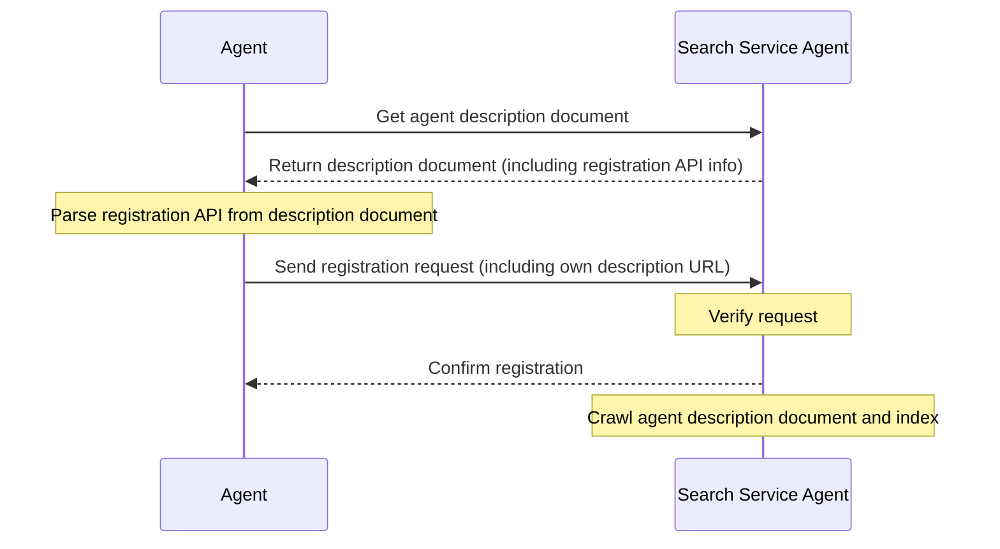

# ANP-Agent Discovery Protocol Specification (Draft)

## Abstract

This specification defines the Agent Discovery Service Protocol (ADSP), a standardized protocol for discovering agents. Based on the JSON-LD format, it provides two discovery mechanisms: active discovery and passive discovery, aimed at enabling agents to be effectively discovered and accessed by other agents or search engines in the network.

The core elements of the protocol include:
1. Using JSON-LD as the foundational data format, supporting linked data and semantic web features
2. Defining an active discovery mechanism, using .well-known URI paths as agent discovery entry points
3. Providing a passive discovery mechanism, allowing agents to submit their descriptions to search services
4. Supporting pagination and linking of agent descriptions, facilitating the management of large numbers of agent information

This specification aims to enhance the discoverability of agents in the network, providing foundational support for building agent network ecosystems.

## Introduction

As the number of agents continues to increase, how to effectively discover and access these agents has become a key issue. The Agent Discovery Service Protocol (ADSP) aims to address this problem by providing a standardized way for agents to be discovered by other agents or search engines.

This specification defines two agent discovery mechanisms: active discovery and passive discovery. Active discovery allows search engines or other agents to discover all public agents under a known domain; passive discovery allows agents to actively register their descriptions with search services. These two mechanisms complement each other, jointly enhancing the discoverability of agents.

## Overview

We use [JSON-LD](https://www.w3.org/TR/json-ld11/) (JavaScript Object Notation for Linked Data) as the format for agent discovery documents, consistent with the Agent Description Protocol. By using JSON-LD, we can achieve rich semantic expression and linking relationships while maintaining simplicity and ease of use.

Agent description documents are detailed expressions of agent information, as referenced in the [ANP-Agent Description Protocol Specification](07-ANP-Agent-Description-Protocol-Specification.md). The agent discovery document serves as a collection page, containing URLs of all public agent description documents under a domain, facilitating indexing and access by search engines or other agents.

## Protocol Details

### Active Discovery

Active discovery refers to search engines or agents only needing to know a domain to discover all public agent description documents under that domain. We adopt the Web standard `.well-known` URI path as the entry point for agent discovery.

#### .well-known URI

According to [RFC 8615](https://tools.ietf.org/html/rfc8615), `.well-known` URI provides a standardized way to discover services and resources. For agent discovery, we define the following path:

```
https://{domain}/.well-known/agent-descriptions
```

This path should return a JSON-LD document containing URLs of all public agent description documents under the domain.

#### Discovery Document Format

Active discovery documents adopt the JSON-LD format, using the `CollectionPage` type, containing the following core properties:

- `@context`: Defines the JSON-LD context used in the document
- `@type`: Document type, value is "CollectionPage"
- `url`: URL of the current page
- `items`: Array of agent description items
- `next`: (Optional) URL of the next page, used for pagination scenarios

Each agent description item contains:
- `@type`: Type, value is "ad:AgentDescription"
- `name`: Agent name
- `@id`: URL of the agent description document (unique identifier of the resource)

Example:

```json
{
  "@context": {
    "@vocab": "https://schema.org/",
    "did": "https://w3id.org/did#",
    "ad": "https://agent-network-protocol.com/ad#"
  },
  "@type": "CollectionPage",
  "url": "https://agent-network-protocol.com/agent-descriptions",
  "items": [
    {
      "@type": "ad:AgentDescription",
      "name": "Smart Assistant",
      "@id": "https://agent-network-protocol.com/agents/smartassistant/ad.json"
    },
    {
      "@type": "ad:AgentDescription",
      "name": "Customer Support Agent",
      "@id": "https://agent-network-protocol.com/agents/customersupport/ad.json"
    }
  ],
  "next": "https://agent-network-protocol.com/agent-descriptions/page2.json"
}
```

#### Pagination Mechanism

When there are a large number of agents under a domain, a pagination mechanism should be adopted. Pagination is implemented through the `next` property, pointing to the URL of the next page. Clients should recursively retrieve all pages until there is no `next` property.

### Passive Discovery

Passive discovery refers to agents actively submitting their agent description URLs to other agents (typically search service agents), enabling them to index and crawl their information.

#### Registration API

Passive discovery typically requires using the registration API provided by search service agents. These APIs are defined by the search service agents themselves and should be clearly stated in their agent description documents. Agents can register their description URLs with search services by calling these APIs.

#### Registration Process

1. Agent obtains the description document of the search service agent
2. Finds the registration API endpoint and parameter requirements from the description document
3. Constructs a registration request, including its own agent description URL and other necessary information
4. Sends the registration request to the search service
5. Search service verifies the request and indexes the agent



### Security Considerations

To ensure the security of agent discovery, the following measures are recommended:

1. **Content Validation**: Search services should verify the validity and integrity of agent description documents
2. **DID Authentication**: Use the did:wba method for identity authentication, ensuring the authenticity of agent identities
3. **Rate Limiting**: Implement appropriate rate limiting measures to prevent malicious requests and DoS attacks
4. **Permission Control**: Distinguish between public and private agents, only including public agents in discovery documents

## Relationship with Other Protocols

The Agent Discovery Protocol is closely related to the following protocols:

1. **Agent Description Protocol**: The discovery protocol provides indexing and access mechanisms for description documents
2. **DID:WBA Method**: Provides identity authentication and security guarantees
3. **Meta-Protocol**: In agent communication, protocol negotiation can be based on discovery results

## Copyright Notice
Copyright (c) 2024 GaoWei Chang  
This document is released under the [MIT License](./LICENSE), you are free to use and modify it, but you must retain this copyright notice.
