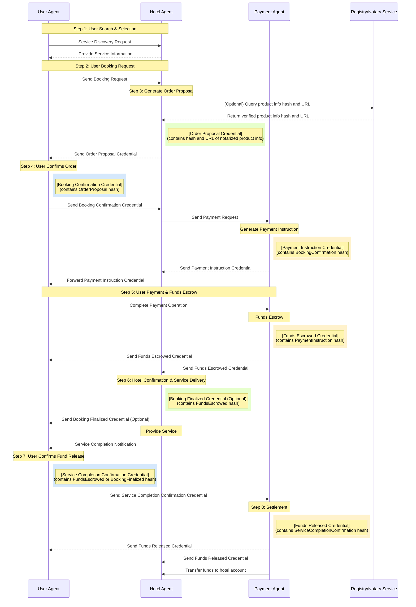

# ANP-based Agent Transaction Framework: Requirements and Technical Design Document (Draft)

## 1. Introduction

### 1.1. Problem Statement: The Need for Secure, Interoperable Agent Transactions

With the rapid development of artificial intelligence technology, AI agents are becoming increasingly prevalent and will increasingly replace humans in accessing the internet, processing information, and executing tasks. In this era of agent proliferation, a new interaction paradigm is forming.

The future internet may no longer be characterized by human-to-human or human-to-website interactions, but rather by direct connections and communications between agents. This peer-to-peer agent interaction model will be more efficient than traditional intermediary models, reducing intermediate steps and accelerating information transmission and decision-making processes.

However, the internet is inherently an untrusted environment, and when agents represent users in transactions, they face several core challenges:

- **Authentication**: How to ensure the identity of interacting agents is authentic and reliable?
- **Information Authenticity**: How to verify that information exchanged between agents has not been tampered with?
- **Transaction Security**: How to ensure transaction security without central platforms?
- **Dispute Resolution**: How to effectively handle disputes when transaction issues arise?

Therefore, designing a secure, efficient, and intuitive agent peer-to-peer transaction framework becomes particularly important as it serves as the infrastructure for the agent economy. The vision of the Agent Network Protocol (ANP) is precisely to address the interconnection and efficient collaboration issues of agent networks, breaking data silos and allowing AI to access complete context information (1).

### 1.2. Solution Overview: An ANP-based Agent Transaction Framework

This proposal presents an agent-based transaction framework designed to address the aforementioned issues. The framework leverages agents representing various participants (such as users, hotels, payment platforms, arbitration institutions) to interact through the Agent Network Protocol (ANP) (2). The core technology stack includes:

1. **Agent Network Protocol (ANP)**: Serves as the foundational protocol for communication between agents, defining discovery, interaction, and message delivery mechanisms, aiming to achieve secure, interoperable communication (2).
2. **Decentralized Identifiers (DIDs)**: Used to uniquely identify each participant and their agents, and to associate public keys and other information required to verify their identity, forming the basis of trust (3).
3. **W3C Verifiable Credentials (VCs) and Data Integrity Proofs**: Used to exchange structured, verifiable data claims (such as order proposals, payment confirmations) during transactions, ensuring the authenticity, integrity, and non-repudiation of information (6). By including the hash of previous credentials in the credential subject, the immutability of the credential chain is achieved.

This document will use hotel booking and payment as an example to elaborate on the framework's requirements, core processes, technical design, and security mechanisms. The entire design follows principles of minimal trust, traceability, automation, user control, and interoperability, aiming to build a more secure, transparent, and efficient decentralized transaction ecosystem.

## 2. System Requirements

### 2.1. Functional Requirements

- **Agent Capabilities**:
  - **User Agent**: Must be able to discover services, request bookings, verify hotel credentials, generate confirmation credentials, process payment instructions, initiate payments, confirm service completion, or initiate disputes.
  - **Hotel Agent**: Must be able to publish service information, generate order proposal credentials (including quotes), temporarily lock inventory, verify user confirmation credentials, initiate payment requests to the payment party, confirm payment receipt and finalize booking, record service fulfillment, and handle cancellations or dispute responses.
  - **Payment Agent**: Must be able to receive and verify payment requests, generate payment instruction credentials (such as escrow links), process user payments and place funds in escrow, send fund status notification credentials, and release funds to the hotel or refund to the user based on instructions (user confirmation, timeout, adjudication).
  - **Arbitration Agent** (optional): Must be able to receive evidence credentials submitted by both parties, mediate or adjudicate according to rules, and generate binding "dispute resolution credentials".

- **Transaction Lifecycle**: The system must support a complete transaction process, including: service discovery, quotation and proposal, order confirmation, payment request and instruction generation, fund escrow, service fulfillment confirmation, fund settlement or refund, dispute initiation and resolution. These steps need to map to the core processes described in Part Four.

- **Credential Processing**: All agents must have the capability to issue, present, receive, and verify specific types of verifiable credentials (VCs). The verification process must include cryptographic verification of the credential's data integrity (via proof) and issuer signature, as well as verification of the credential chain integrity (via the hash of the preceding credential in the credentialSubject). Credential types need to cover key transaction nodes, such as order proposals, booking confirmations, payment requests, fund escrow confirmations, etc. (6).

- **State Management**: The system must maintain the precise state of transaction orders, with state transitions triggered by valid VCs received or predefined events (such as timeouts). Core states include: new, pending payment, in escrow, in fulfillment, pending settlement, settled, and may include cancelled, in dispute, etc.

- **Exception Handling**: The system must be able to handle various exceptional situations described in Part Five, including: credential verification failure, user payment timeout, hotel no vacancy/oversold, user cancellation (before/after payment), service disputes, payment failure, automatic payment release timeout, key compromise/identity anomalies, agent/network interruptions, etc. The handling methods need to be clearly defined, typically involving sending specific error or status notification VCs.

### 2.2. Non-Functional Requirements

- **Security**:
  - **Communication Security**: Agent-to-agent communication must use end-to-end encryption to prevent eavesdropping and tampering (relying on ANP's security layer (1)).
  - **Identity Authentication**: Must use DID-based strong authentication mechanisms to ensure the authenticity of interacting agents' identities (1).
  - **Data Integrity**: All exchanged critical credentials must be protected by cryptographic proofs (such as Data Integrity proofs) to prevent tampering (12).
  - **Non-Repudiation**: Credential issuers cannot deny their issued valid credentials (through digital signatures).
  - **Immutability**: Transaction flow credentials should form a verifiable chain, VC Hash Chain, to prevent tampering with early credentials (by including the hash of the preceding credential in the credentialSubject).
  - **Key Management**: Must have secure mechanisms for generating, storing, using, rotating, and recovering each agent's private keys.
  - **Identity Authentication**: Must use DID-based strong authentication mechanisms to ensure the authenticity of interacting parties' identities (1).
  - **Data Integrity**: All exchanged critical credentials must be protected by cryptographic proofs (such as Data Integrity proofs) to prevent tampering (12).
  - **Non-Repudiation**: Credential issuers cannot deny their issued valid credentials (implemented through digital signatures).
  - **Immutability**: Transaction flow credentials should form a verifiable chain, VC Hash Chain, preventing after-the-fact tampering with early credentials (implemented by including the hash of preceding credentials in the credentialSubject).
  - **Key Management**: Must have secure mechanisms for generating, storing, using, rotating, and recovering each agent's private keys.

- **Interoperability**: System design must strictly adhere to open standards such as ANP, W3C DID, W3C VC, etc., to ensure seamless interaction between agents implemented by different developers (2).

- **Traceability/Auditability**: All key transaction steps and state changes must be recorded through verifiable credentials with timestamps and signatures, forming an immutable, auditable record chain. VCs, Data Integrity mechanisms, and the hash chain in credential subjects are core to achieving this goal (12).

- **Reliability/Availability**: The system should have high availability and be able to tolerate temporary failures of some agents or network nodes. The message delivery guarantee mechanism (for example, whether ANP provides message queues or retry mechanisms) and the state persistence capability of the agents themselves (1) need to be clarified. There is a dependency on the robustness of the ANP protocol itself.

- **Scalability**: The architectural design should support the growth of both the number of agents and transaction volume in the future. The actual performance of the ANP protocol in large-scale application scenarios needs to be considered (2).

- **Privacy**: While meeting transaction requirements, user privacy should be considered. For example, limiting unnecessary order details disclosed to the payment agent. The adoption of the W3C VC standard also provides the possibility for future adoption of selective disclosure technologies (such as VCs based on BBS+ signatures (13)).
## 3. Core Concepts and Architecture

### 3.1. Key Terminology

- **ANP (Agent Network Protocol)**: An open-source protocol framework designed to enable secure, interoperable communication between agents. It defines agent discovery, interaction, and message delivery mechanisms, with the goal of becoming the HTTP of the agent era (15).
- **Agent**: An autonomous software program representing a specific entity (user, hotel, etc.) that executes tasks and can interact through the ANP protocol.
- **DID (Decentralized Identifier)**: A new type of globally unique identifier that allows entities to generate and control their own identifiers without depending on centralized registration authorities (3). A DID can be resolved to a DID document.
- **DID Document**: A dataset containing information associated with a DID, such as cryptographic materials for verification (public keys), service endpoints, etc. (16).
- **Verifiable Credential (VC)**: A set of claims made by an issuer about a subject, accompanied by cryptographic proof, allowing verifiers to independently verify its authenticity and integrity (6). Typically represented in JSON-LD format (18).
- **Data Integrity Proof**: A cryptographic proof mechanism used to protect the authenticity and integrity of VCs or other digital documents, typically embedded in the proof property of a VC (12).
- **VC Hash Chain**: A mechanism adopted in this proposal that links multiple VCs in sequence by including the hash value of the previous VC in each VC's credentialSubject, ensuring the integrity and tamper-resistance of the credential sequence.
- **State Machine**: Describes a series of clearly defined states that a transaction (such as an order) goes through in its lifecycle, as well as the events and conditions that trigger state transitions.
- **Issuer**: The entity that creates and issues a VC (for example, the hotel agent issues an order proposal VC) (6).
- **Holder**: The entity that holds and presents VCs as needed (for example, the user agent holds the hotel's order proposal VC) (7).
- **Credential Subject**: The entity involved in the claims in a VC (for example, the subject of a hotel booking VC is the user and booking details) (6). In this proposal, except for the first VC, it also includes the hash value of the previous VC.
- **Cryptosuite**: Defines the specific cryptographic algorithm combination used to generate and verify Data Integrity proofs (such as transformation algorithm, hash algorithm, signature algorithm) (12).
- **DID Resolution**: The process of converting a DID into its corresponding DID document, typically performed by a DID resolver (16).
- **Verifiable Data Registry (VDR)**: A system used to record and manage data related to VCs and DIDs, such as DID documents, VC schemas, revocation lists, etc. It can be a database, distributed ledger, or other trusted system.

### 3.2. 系统架构概述

本方案采用基于智能体的分布式架构。各个参与方（用户、酒店、支付平台、仲裁机构）由其各自的智能体代表。这些智能体分布在网络中，通过ANP协议进行点对点或多点通信。

核心交互流程不依赖中心化的业务平台进行状态协调，而是通过在智能体之间传递和验证带有密码学证明（Data Integrity Proofs）的可验证凭证 (VCs) 来驱动状态转换和建立共识。信任的建立基于密码学而非平台信誉：

2. **Data Verification**: Ensure the authenticity, integrity, and source reliability of information by verifying the Data Integrity proofs in VCs (12).
3. **Process Integrity**: Form a VC hash chain by including the hash value of preceding VCs in the credentialSubject, ensuring the immutability of historical records.

The ANP protocol stack provides underlying secure communication (encryption) and identity authentication (based on DID) capabilities, as well as possible upper-layer protocol negotiation (Meta-Protocol) and application protocol frameworks (15). This proposal primarily utilizes its identity/encryption layer and message delivery capabilities to exchange predefined VCs.

The following diagram shows an architectural overview of the various roles and their relationships in the system:


*Figure 1: ANP Agent Peer-to-Peer Transaction System Architecture - Shows the interaction relationships between users, hotels, payment systems, and optional arbitration and notary services. All communication between agents is based on the ANP protocol, with information transmission and verification through verifiable credentials (VCs).*

### 3.3. Participant Roles and Responsibilities

The following table details the main participants in the system and their agent responsibilities:

**Table 1: Participant Roles**
| Role | Responsibility Keywords | Detailed Description |
|------|------------|----------|
| **User** | End Consumer | An individual requiring hotel services. |
| **User Agent** | Browse → Confirm → Pay → Feedback / Dispute | Software agent representing the user. Manages the user's DID and private keys, discovers services via ANP, requests bookings, verifies hotel credentials, generates confirmation credentials, processes payment instructions, initiates payments, confirms service completion or initiates disputes, all interactions through ANP. Responsible for storing and verifying the credential chain (through hash links). |
| **Hotel** | Service Provider | Entity providing accommodation services. |
| **Hotel Agent** | Quote → Lock Inventory → Verify Confirmation → Request Payment → Provide Service | Software agent representing the hotel. Manages the hotel's DID and private keys, publishes service information, generates order proposal credentials (including quotes), temporarily locks inventory, verifies user confirmation credentials, initiates payment requests to the payment party, confirms receipt and finalizes booking, records service fulfillment, handles cancellations or dispute responses, all interactions through ANP. Responsible for storing and verifying the credential chain (through hash links). |
| **Payment Infrastructure** | Funds Processing Platform | Platforms such as payment processors, banks, etc., providing payment, escrow, and settlement services. |
| **Payment Agent** | Escrow Funds → Status Notification → Settlement / Refund | Software agent representing the payment infrastructure. Manages its DID and private keys, receives and verifies payment requests, generates payment instruction credentials (e.g., escrow links), processes user payments and places funds in escrow, sends fund status notification credentials, releases funds to the hotel or refunds to the user based on instructions (user confirmation, timeout, adjudication), all interactions through ANP. Responsible for storing and verifying the credential chain (through hash links). |
| **Arbitration Agent** (optional) | Process Disputes → Mediate / Adjudicate | Software agent representing a neutral third-party dispute resolution entity. Manages its DID and private keys, intervenes when users and hotels cannot negotiate dispute resolution, receives evidence credentials submitted by both parties, mediates or adjudicates according to rules, and generates binding "dispute resolution credentials", relevant interactions through ANP. |
| **Notary/Registry Service** (optional) | Store/Certify Service Information | Provides a trusted third-party service for storing and certifying hash values or other key attributes of hotel/product information for VC reference. |

Table 1 Value Statement: This table clearly defines each participant in the system and their core responsibilities. This is crucial for understanding the subsequent process design, agent interaction logic, and allocation of functional requirements. It ensures the completeness of the system design and clarifies the expected behavior of each role. The optional notary service role has been added.

## 4. Process Specifications

### 4.1. Ideal Transaction Flow and State Transitions

The following is the ideal process for a user booking and paying for a hotel, with all interactions between agents driven by VC messages transmitted via the ANP protocol. Key credentials are linked by including the hash value of the preceding credential in the credentialSubject, ensuring sequence and immutability.

**Step 1: Offer & Lock Inventory**
- **Trigger**: User agent sends a price inquiry or booking request to the hotel agent (can be discovered via ANP service).
- **Processing**: Hotel agent checks inventory and pricing.
- **Credential Generation**: Hotel agent generates an "Order Offer Credential" (VC Type: OrderOfferCredential).
  - credentialSubject must include key service details: room type, price, validity period, cancellation policy, temporary order ID, etc.
  - (Optional) May include hash value of service details and pointer to external notary/registry service.
  - Signed with hotel private key, generating proof.
- **State**: Hotel temporarily locks the corresponding inventory. Order enters "Offered" state.
- **Interaction**: OrderOfferCredential is sent to the user agent via ANP.

**Step 2: User Confirmation**
- **Trigger**: User agent receives and verifies the signature and content of OrderOfferCredential. User decides to confirm booking.
- **Credential Generation**: User agent generates a "Booking Confirmation Credential" (VC Type: BookingConfirmationCredential).
  - credentialSubject includes reference to OrderOfferCredential ID, indicating acceptance of the offer, and includes hash of previous VC (OrderOfferCredential) (e.g., stored in previousCredentialHash attribute).
  - Signed with user private key, generating proof.
- **Interaction**: BookingConfirmationCredential is sent to hotel agent via ANP.
- **State**: After hotel agent verifies BookingConfirmationCredential and its proof and previousCredentialHash, order status is updated to "Pending Payment".

**Step 3: Payment Request**
- **Trigger**: Hotel agent receives valid BookingConfirmationCredential.
- **Credential Generation**: Hotel agent generates a "Payment Request Credential" (VC Type: PaymentRequestCredential).
  - credentialSubject includes only necessary payment information: orderId (or reference to BookingConfirmationCredential ID), amount, currency, payeeDid (Hotel), payerDid (User), paymentAgentDid. Doesn't include detailed hotel or product information to protect privacy. Includes hash of previous VC (BookingConfirmationCredential) (e.g., previousCredentialHash).
  - Signed with hotel private key, generating proof.
- **Interaction**: PaymentRequestCredential is sent to the designated payment agent via ANP.
- **State**: Order status updated to "Payment Initiation Pending".

**Step 4: Escrow Instruction Generation & Forwarding**
- **Trigger**: Payment agent receives and verifies PaymentRequestCredential and its proof and previousCredentialHash.
- **Credential Generation (Payment Agent)**: Payment agent generates a "Payment Instruction Credential" (VC Type: PaymentInstructionCredential), including payment transaction ID, amount, payment method details (such as escrow payment link/QR code), payment deadline, etc.
  - credentialSubject includes hash of previous VC (PaymentRequestCredential) (e.g., previousCredentialHash).
  - Signed with payment platform private key, generating proof.
- **Interaction 1 (Payment Agent → Hotel Agent)**: Payment agent sends PaymentInstructionCredential to hotel agent via ANP.
- **Interaction 2 (Hotel Agent → User Agent)**: After hotel agent receives and (optionally) verifies PaymentInstructionCredential, it forwards it to user agent via ANP.
- **State**: Payment task enters "Awaiting Payment" state.

**Step 5: User Payment & Escrow**
- **Trigger**: User agent receives (forwarded from hotel agent) and verifies PaymentInstructionCredential and its proof and previousCredentialHash. User completes payment through the link/method provided in the credential.
- **Processing**: Funds enter the payment platform's escrow account.
- **Credential Generation**: Payment agent confirms funds receipt (into escrow), generates a "Funds Escrowed Credential" (VC Type: FundsEscrowedCredential).
  - credentialSubject includes transaction ID, order ID, amount, timestamp, etc., and includes hash of previous VC (PaymentInstructionCredential) (e.g., previousCredentialHash).
  - Signed with payment platform private key, generating proof.
- **Interaction**: FundsEscrowedCredential is sent to user agent and hotel agent via ANP.
- **State**: Order status updated to "Escrowed".
**Step 6: Hotel Confirmation & Service Delivery**
- **Trigger**: Hotel agent receives and verifies FundsEscrowedCredential along with its proof and previousCredentialHash.
- **Processing**: Hotel formally confirms the booking and locks the resources.
- **Credential Generation (Optional)**: Hotel agent may generate a "Booking Finalized Credential" (VC Type: BookingFinalizedCredential) to send to the user, with credentialSubject including the hash of the previous VC (FundsEscrowedCredential).
- **Service**: User arrives as per booking, and hotel provides service.
- **State**: Order enters the "In Service / Fulfillment" state.
- **Service Completion**: After service ends, hotel agent may push a service completion notification or credential to the user agent via ANP (e.g., ServiceCompletedNotification, which can also be linked to the credential chain as a VC).

**Step 7: User Confirms Service Completion**
- **Trigger**: User (via user agent) confirms that the service has been completed as agreed.
- **Credential Generation**: User agent generates a "Service Completion Confirmation Credential" (VC Type: ServiceCompletionConfirmationCredential).
  - credentialSubject includes order/transaction ID and confirmation timestamp, as well as the hash of the previous VC (FundsEscrowedCredential or optional credential from Step 6).
  - Signed with user's private key, generating proof.
- **Interaction**: ServiceCompletionConfirmationCredential is sent to the payment agent via ANP.
- **Timeout Mechanism**: If the user neither confirms nor initiates a dispute within the specified time, automatic confirmation logic can be designed to trigger automatic fund release.
- **State**: Order status updated to "Pending Settlement".

**Step 8: Settlement**
- **Trigger**: Payment agent receives and verifies ServiceCompletionConfirmationCredential along with its proof and previousCredentialHash, or automatic fund release conditions are triggered.
- **Fund Operation**: Payment agent transfers the escrowed funds to the hotel's account.
- **Credential Generation**: Generates a "Funds Released Credential" (VC Type: FundsReleasedCredential).
  - credentialSubject records the final settlement status and transaction details, and includes the hash of the previous VC (ServiceCompletionConfirmationCredential).
  - Signed with payment platform's private key, generating proof.
- **Interaction**: FundsReleasedCredential is sent to user agent and hotel agent via ANP.
- **State**: Order's final status updated to "Settled".

**Ideal Flow Diagram:**



*Figure 2: ANP Agent Ideal Transaction Flow Diagram - Shows the complete process from user search to settlement, clearly marking credential generation steps (VC markers), and clearly demonstrating the interaction between user agent, hotel agent, and payment agent.*

**Core State Transition Diagram (Conceptual):**
```stateDiagram-v2
    [*] --> New
    New --> Pending_Payment: User confirms (credential contains order proposal hash)
    Pending_Payment --> Escrowed: Funds escrowed (credential contains payment instruction hash)
    Pending_Payment --> Cancelled: Payment timeout / User cancels
    Escrowed --> In_Service: Hotel confirms booking (optional credential contains escrow credential hash)
    Escrowed --> Cancelled: User cancels (policy compliant)
    Escrowed --> In_Dispute: Dispute initiated (credential contains escrow credential hash)
    In_Service --> Pending_Settlement: User confirms service (credential contains escrow/booking finalized credential hash) / Automatic confirmation timeout
    In_Service --> In_Dispute: Dispute initiated (credential contains in-service state hash)
    Pending_Settlement --> Settled: Funds released (credential contains service completion confirmation hash)
    Pending_Settlement --> In_Dispute: Dispute initiated (credential contains pending settlement state hash)
    In_Dispute --> Settled: Arbitration decision (credential) -> Release funds
    In_Dispute --> Cancelled: Arbitration decision (credential) -> Refund
    Cancelled --> [*]
    Settled --> [*]
```

*Figure 3: Core State Transition Diagram Based on VC Credential Hash Chain - Clearly shows the transition of all states throughout the booking process, as well as the credential hash chain relationships driving these state changes.*

**Table 2: Core State Transitions (Credential Hash Chain Relationships)**

| Current State | Triggering Event/Credential Type | Main Action/Verification | Next State | Notes |
|---------|-----------------|--------------|--------|------|
| New/Offered | Booking Confirmation Credential (User) | Verify user signature, proposal reference, verify hash in credentialSubject matches OrderOfferCredential | Pending_Payment | |
| Pending_Payment | Funds Escrowed Credential (Payment Platform) | Verify payment platform signature, escrow amount, verify hash in credentialSubject matches PaymentInstructionCredential | Escrowed | |
| Pending_Payment | Payment Timeout | Payment agent detects timeout, sends notification | Cancelled | Timeout duration needs definition |
| Escrowed | (Internal logic/Optional Booking Finalized Credential) | Hotel confirms booking resources, (if VC exists) verify hash in credentialSubject matches FundsEscrowedCredential | In_Service | Assumes service starts as scheduled |
| In_Service | Service Completion Confirmation Credential (User) | Verify user signature, confirm service completion, verify hash in credentialSubject matches FundsEscrowedCredential or BookingFinalizedCredential | Pending_Settlement | |
| In_Service | User Confirmation Timeout | Payment agent triggers based on preset rules | Pending_Settlement | Auto-confirmation rules and duration need clear definition |
| Pending_Settlement | (Internal Fund Transfer Completion) | Payment agent executes settlement, generates Funds Released Credential (with credentialSubject containing service completion confirmation credential hash) | Settled | |
| Escrowed/In_Service/Pending_Settlement | Dispute Initiation Credential (User/Hotel) | Verify signature, pause fund operation, verify hash in credentialSubject matches last VC of current state | In_Dispute | |
| In_Dispute | Dispute Resolution Credential (Arbitrator) | Verify arbitrator signature, execute fund operation based on decision, (if VC exists) verify hash in credentialSubject matches dispute initiation credential | Settled/Cancelled | Arbitration result drives final state |
| Any State | Cancellation Request Credential (User) | Process based on current state and cancellation policy, (if VC exists) verify credential hash chain | Cancelled/(Unchanged) | Cancellation policy may be complex |
| Any State | Credential Verification Failure | Reject credential (including signature or hash chain verification failure), send error notification | (Unchanged) | Process paused |

**Table 2 Value Note**: This table provides a precise description of the state transition logic in the ideal process and emphasizes the role of VC chain verification through hashes in credentialSubject during state transitions. It clarifies the triggering conditions for each state transition, the verifications or actions that need to be executed, and the final state achieved, ensuring the determinism, consistency, and tamper-resistance of the process.

**Ideal VC Hash Chain**

The following diagram illustrates the hash linking relationships between various credentials (VCs) in the ANP protocol under ideal conditions. Each credential forms an immutable chain structure by including the hash of the previous credential, ensuring the integrity and verifiability of the entire transaction process. Different colors in the diagram represent credentials issued by different agents, and arrows indicate hash reference relationships.


*Figure 4: VC Hash Chain in ANP Protocol - Shows the complete credential chain from order proposal to final settlement, where each credential forms an immutable chain structure by including the hash of the previous credential, ensuring the integrity and verifiability of the transaction.*

Key features of the credential chain:
1. **Complete Process Traceability**: The final funds release credential can be traced back to the initial order proposal through the hash chain
2. **Tamper-Proof Mechanism**: Any modification to a credential will cause hash verification failures in subsequent credentials
3. **Clear Issuer Responsibilities**: Different colors identify credentials issued by different agents, clarifying responsibility boundaries
4. **Selective Verification Paths**: Supports both mandatory and optional hash reference paths, enhancing system flexibility
5. **State Transition Consistency**: The generation and verification of each credential simultaneously drives the corresponding state changes in the state transition diagram

## 4.2. Exception Handling Processes

The system must be able to handle various exceptional situations robustly. Below are key exception scenarios and their handling processes, with all notifications and state changes driven by corresponding VCs or error messages transmitted via ANP. Exception-related VCs should also be linked to relevant credentials in the credential chain through hashes in the credentialSubject whenever possible.

Table 3: Exception Handling Summary

| Scenario | Trigger Point | Brief Handling via ANP/VCs |
|------|------------------------|-----------------------------------|
| Credential Validation Failure | Any credential reception step | Receiving agent rejects invalid credentials (invalid signature, incorrect format, non-compliant content, invalid VC hash chain link, etc.), returns notification credential containing error information (e.g., CredentialValidationError VC) via ANP. Process pauses, awaiting correction or manual intervention. |
| User Payment Timeout | After Step 4 payment instruction is issued, timeout occurs | Payment agent detects payment timeout, generates and sends "Payment Timeout Credential" (PaymentTimeoutCredential) to user and hotel agents (its credentialSubject includes PaymentInstructionCredential hash). Order status transitions to Cancelled. Hotel agent releases locked inventory upon notification. |
| Hotel No Availability/Oversold | Step 1 or 2 | If hotel agent discovers inability to fulfill during inquiry or confirmation (e.g., insufficient inventory), it should generate and send "Order Cancellation Credential" (OrderCancellationCredential) to user agent, explaining the reason (its credentialSubject includes hash of relevant request or OrderOfferCredential). Order status transitions to Cancelled. |
| User Cancellation (Before Payment) | Before Step 5 | User agent sends "Cancellation Request Credential" (CancellationRequestCredential) to hotel agent (its credentialSubject includes BookingConfirmationCredential hash). Hotel agent verifies request, if agreed, returns "Cancellation Confirmation Credential" (CancellationConfirmationCredential) (its credentialSubject includes CancellationRequestCredential hash). Order status transitions to Cancelled. |
| User Cancellation (After Payment/Before Service) | After Step 5, before service begins in Step 6 | User agent sends CancellationRequestCredential to hotel and payment agents (its credentialSubject includes FundsEscrowedCredential hash). Hotel agent calculates refund amount based on cancellation policy, generates and sends "Cancellation Processed Credential" (CancellationProcessedCredential) to payment agent (its credentialSubject includes CancellationRequestCredential hash). Payment agent executes refund based on this credential and sends final status credential (e.g., FundsRefundedCredential) (its credentialSubject includes CancellationProcessedCredential hash). Order status transitions to Cancelled. |
| Check-in/Service Dispute | During or after service in Step 6 | User agent (or hotel agent) generates and sends "Dispute Initiation Credential" (DisputeInitiationCredential) to the other party and payment agent (its credentialSubject includes hash of relevant VC causing the dispute). Payment agent pauses fund release upon receipt. Order status transitions to In Dispute. Both agents attempt negotiation; if unsuccessful, submit evidence VCs to arbitration agent. Arbitration agent makes decision, generates and sends "Dispute Resolution Credential" (DisputeResolutionCredential) (its credentialSubject includes DisputeInitiationCredential hash). Payment agent executes fund operation based on this credential and sends final status credential. |
| Payment Failure or Rejection | When user attempts payment in Step 5 | Payment infrastructure (via payment agent) detects payment failure, generates and sends "Payment Failed Credential" (PaymentFailedCredential) to notify user agent and hotel agent (its credentialSubject includes PaymentInstructionCredential hash). Order status may revert to Pending Payment or directly transition to Failed/Cancelled. |
| Automatic Fund Release Timeout | User confirmation step in Step 7 times out | If automatic confirmation mechanism is configured, payment agent automatically triggers fund release, executes settlement, and sends FundsReleasedCredential to both parties via ANP (its credentialSubject includes FundsEscrowedCredential or BookingFinalizedCredential hash). Order status transitions to Settled. |
| Key Compromise/Identity Anomaly | Any stage | Party detecting key compromise or identity anomaly should immediately attempt to revoke the key and broadcast or directly notify relevant transaction parties with "Security Alert Credential" (SecurityAlertCredential) via ANP. Related agents should pause the transaction. |
| Agent/Network Interruption | Any stage | Relies on underlying robustness of ANP protocol (e.g., message queues, retry mechanisms) and agents' own state persistence and timeout handling capabilities. Sender should retry. Receiver should handle duplicate messages. Prolonged interruptions may cause transaction failure due to timeout. |

**Table 3 Value Note**: This table systematically outlines various non-ideal situations that may occur during the transaction process and provides an overview of ANP and VC-based response strategies, while emphasizing the importance of maintaining credential chain links through hashes in credentialSubject during exception handling. It ensures the robustness of system design, considers failure paths, and provides developers with a guidance framework for handling exceptional situations.

## 5. Technical Design Specifications

### 5.2. Identity and Trust Layer (DID)

- **DID Purpose and Identification**: All core participating entities and their agent systems in the ecosystem will be uniquely identified through DIDs (3). DIDs provide a foundation for persistent, verifiable, and decentralized identities.
- **DID Document Structure and Verification Methods**: Each DID is associated with a DID Document following the W3C DID Core v1.0 specification. DID Documents contain verificationMethod entries (including id, type, controller, and public key information such as publicKeyJwk or publicKeyMultibase) and verification relationships (such as assertionMethod for issuing VCs and authentication for authentication).
- **DID Resolution Requirements**:
  - Resolution Infrastructure Dependency: The system's trust chain relies on reliable DID resolution mechanisms. Deployment of or access to DID resolvers capable of resolving the DID methods used (such as did:wba (1)) is mandatory. Resolution failures will prevent credential verification.
- **Key Management Considerations**:
  - Key Management Burden: The core of DIDs is public-private key pair control (3). Securely managing the private keys for various agents presents a significant challenge, especially for users. A comprehensive strategy covering generation, storage (HSM/TEE/wallets), usage, rotation, and recovery is necessary. This remains a major barrier to the adoption of decentralized systems (21).
  - Method-Specific Authentication: The ANP examples are primarily based on did:wba (1). Different DID methods have different dependencies. Interacting with agents using other DID methods may require support for multiple method resolution, increasing complexity. Dependence on did:wba may limit interoperability in a heterogeneous DID ecosystem.

### 5.3. Credential Management (Verifiable Credentials)

- **Credential Design Philosophy and Requirements**: Critical state proofs and responsibility demarcation in the transaction process rely on verifiable credentials. These credentials must be: independently verifiable for source and integrity, non-repudiable after issuance, machine-readable and parsable, support cross-platform interoperability, and be linkable into a tamper-evident chain through hash values in credentialSubject.

- **Selected Standard**: W3C Verifiable Credentials Data Model v2.0:
  - Standardization and Interoperability: W3C standards facilitate open ecosystems
  - Native Integration with DIDs: Designed to work seamlessly with DIDs
  - Rich Semantic Expression: Based on JSON-LD, allowing clear semantics through @context
  - Flexibility and Extensibility: Flexible data model, easily extensible
  - Privacy Protection Potential: Supports advanced techniques like selective disclosure (e.g., BBS+)
  - Standard Maturity Consideration: VC DM v2.0 was at W3C Candidate Recommendation (CR) status at time of writing

- **Core VC Structure (JSON-LD)**: Each VC must be a valid JSON-LD object containing key properties:
  - `@context`: (Required) Defines term context, first item must be "https://www.w3.org/ns/credentials/v2"
  - `id`: (Optional, recommended) Unique identifier for the VC (URL)
  - `type`: (Required) Array of types, including "VerifiableCredential" and specific types
  - `issuer`: (Required) Issuer's DID or object containing DID
  - `issuanceDate` / `validFrom` / `validUntil`: (Optional/Required) Timestamps
  - `credentialSubject`: (Required) Collection of objects containing claims. For OrderOfferCredential, must include key service details. For all VCs except the first one, must include previousCredentialHash attribute storing the hash of the previous VC
  - `proof`: (Required) Contains proof object for verifying integrity and origin
  - `credentialSchema`: (Optional) Describes the data schema followed by the VC
  - `credentialStatus`: (Optional) Points to credential status information (e.g., revocation status)

- **VC Hash Chain Implementation**:
  - Mechanism: Starting from the second VC, each VC's credentialSubject must include a previousCredentialHash attribute containing the hash value of the previous VC
  - Hash Calculation: The hash calculation process must be clearly defined. Recommended approach is to normalize the previous VC (e.g., using JCS) before calculating its hash using algorithms like SHA-256
  - Verification: Verifiers must not only verify the proof but also calculate the hash of the previous VC and compare it with the previousCredentialHash value in the current VC

- **Optional: Using External Services to Verify Service Information**:
  - Information Hash: Include a hash of the hotel's complete service description in the OrderOfferCredential's credentialSubject
  - Notarization/Registry Service Reference: Register the hotel service description (or its hash) with a trusted third-party notarization service or VDR, and include a link to this registry entry and hash in the OrderOfferCredential

- **Specific Credential Type Definitions**:

**Table 4: Verifiable Credential Types (v3 - VC Hash Chain)**

| Credential Type | Issuer Role | Subject Role(s) | Key credentialSubject Attributes Example | Purpose | Privacy/Security Notes |
|-------------------|------------------------|--------------------------|--------------------------------|---------------------|--------------|
| OrderOfferCredential | Hotel Agent | User Agent, Order Details | orderId, hotelDid, roomType, price, checkInDate, checkOutDate, cancellationPolicy, offerExpiry, (optional)serviceDescriptionHash, (optional)registryPointer | Hotel provides quote and booking terms | Must include key service details. Optional external validation. First VC in chain, no previousCredentialHash. |
| BookingConfirmationCredential | User Agent | Hotel Agent, Order Details | orderId, offerCredentialId, userDid, confirmationTimestamp, previousCredentialHash: <hash_of_OrderOfferCredential> | User confirms acceptance of order proposal | credentialSubject includes hash of previous VC. |
| PaymentRequestCredential | Hotel Agent | Payment Agent, User Agent | orderId (or confirmationCredentialId), amount, currency, payeeDid (Hotel), payerDid (User), paymentAgentDid, previousCredentialHash: <hash_of_BookingConfirmationCredential> | Hotel requests payment from payment platform | Does not include detailed order/item information. credentialSubject includes hash of previous VC. |
| PaymentInstructionCredential | Payment Agent | User Agent, Hotel Agent | transactionId, orderId, amount, currency, paymentMethodDetails (e.g., URL), paymentDeadline, previousCredentialHash: <hash_of_PaymentRequestCredential> | Payment platform provides payment instructions (first sent to hotel for forwarding) | credentialSubject includes hash of previous VC. |
| FundsEscrowedCredential | Payment Agent | User Agent, Hotel Agent | transactionId, orderId, amount, currency, escrowTimestamp, previousCredentialHash: <hash_of_PaymentInstructionCredential> | Payment platform confirms funds are in escrow | credentialSubject includes hash of previous VC. |
| BookingFinalizedCredential (Optional) | Hotel Agent | User Agent | orderId, bookingReference, confirmationTimestamp, previousCredentialHash: <hash_of_FundsEscrowedCredential> | Hotel finalizes booking (after funds received) | credentialSubject includes hash of previous VC. |
| ServiceCompletionConfirmationCredential | User Agent | Payment Agent, Hotel Agent | orderId, transactionId, confirmationTimestamp, previousCredentialHash: <hash_of_FundsEscrowed_or_BookingFinalized> | User confirms service completion, approves payment release | credentialSubject includes hash of previous VC. |
| FundsReleasedCredential | Payment Agent | User Agent, Hotel Agent | transactionId, orderId, amountReleased, settlementTimestamp, payeeDid, previousCredentialHash: <hash_of_ServiceCompletionConfirmation> | Payment platform confirms escrowed funds released to payee | credentialSubject includes hash of previous VC. |
| FundsRefundedCredential | Payment Agent | User Agent, Hotel Agent | transactionId, orderId, amountRefunded, refundTimestamp, payerDid, previousCredentialHash: <hash_of_triggering_VC> | Payment platform confirms funds refunded to payer | credentialSubject includes hash of previous VC. |
| DisputeInitiationCredential | User Agent / Hotel Agent | Arbitration Agent, Counterparty | orderId, disputeReason, evidenceCredentialIds, initiatorDid, timestamp, previousCredentialHash: <hash_of_disputed_VC> | Initiates transaction dispute | credentialSubject includes hash of previous VC. |
| DisputeResolutionCredential | Arbitration Agent | User Agent, Hotel Agent, Payment Agent | disputeId, orderId, decision, resolutionDetails, resolvedTimestamp, previousCredentialHash: <hash_of_DisputeInitiation> | Arbitration agent publishes dispute resolution result | credentialSubject includes hash of previous VC. |
| CancellationRequestCredential | User Agent | Hotel Agent, Payment Agent | orderId, reason, requestTimestamp, previousCredentialHash: <hash_of_relevant_VC> | User requests order cancellation | credentialSubject includes hash of previous VC. |
| CancellationConfirmationCredential | Hotel Agent / Payment Agent | User Agent | orderId, cancellationResult, timestamp, previousCredentialHash: <hash_of_CancellationRequest> | Confirms order cancellation processing result | credentialSubject includes hash of previous VC. |
| CredentialValidationError | Any Agent | Sender Agent | invalidCredentialId, errorDescription, timestamp | Notifies credential validation failure | Not part of hash chain. |
| PaymentTimeoutCredential | Payment Agent | User Agent, Hotel Agent | transactionId, orderId, timeoutTimestamp, previousCredentialHash: <hash_of_PaymentInstruction> | Notifies payment timeout | credentialSubject includes hash of previous VC. |
| PaymentFailedCredential | Payment Agent | User Agent, Hotel Agent | transactionId, orderId, failureReason, timestamp, previousCredentialHash: <hash_of_PaymentInstruction> | Notifies payment failure | credentialSubject includes hash of previous VC. |
| SecurityAlertCredential | Any Agent | Relevant Parties | alertType, affectedDid, details, timestamp | Broadcasts security alert | Not part of hash chain. |

- *Table 4 Value Note*: This table concretizes the abstract transaction process steps into actual data credentials that need to be exchanged between agents. It defines the purpose, issuer, subject, and core data fields for each key credential, and **clearly specifies privacy protection measures (payment request), mandatory inclusion of key service information (order proposal), and the VC hash chain linking relationship implemented through the previousCredentialHash attribute in credentialSubject**.
### 5.4. Proof and Verification Mechanisms (Data Integrity & VC Hash Chain)

- **Selected Mechanism**: Data Integrity Proofs: Adopting W3C's Data Integrity specification to ensure VC authenticity and integrity

- **VC Hash Chain for Immutability**:
  - Mechanism: Starting from the second VC, each VC's credentialSubject contains a previousCredentialHash attribute storing the hash of the previous VC
  - Effect: Links all VCs in the transaction process in sequence, forming a verifiable chain. Any modification to earlier VCs in the chain will result in verification failure
  - Verification Requirements: Verifiers must not only verify the VC's own proof but also verify its hash link with the preceding VC

- **Cryptographic Suite Recommendations**: Recommend using cryptographic suites based on EdDSA or ECDSA, combined with JCS for normalization
  - Implementation Complexity: Implementing Data Integrity is more complex than simple signatures; using libraries compliant with W3C specifications is recommended
  - Future Privacy Enhancements: Consider introducing cryptographic suites supporting selective disclosure (such as BBS+)

- **Proof Generation and Verification Process (including VC Hash Chain)**:
  - Generation (Issuer):
    1. Prepare VC data, remove old proof
    2. (For non-first VC) Obtain previous VC, normalize and calculate its hash
    3. (For non-first VC) Add the calculated hash to the current VC's credentialSubject.previousCredentialHash
    4. Normalize the current VC
    5. Calculate the hash of the normalized data
    6. Sign the hash using the private key
    7. Construct the proof object, including type, cryptosuite, created and other fields
    8. Add the proof object to the VC data

  - Verification (Verifier):
    1. Separate proof and VC data
    2. Obtain verificationMethod and parse DID to get public key
    3. Get cryptosuite
    4. Normalize the current VC data
    5. Calculate hash
    6. Verify signature using public key and proofValue
    7. (For non-first VC) Get previousCredentialHash value
    8. (For non-first VC) Obtain previous VC, calculate its hash
    9. (For non-first VC) Compare calculated hash with previousCredentialHash value
    10. (Optional) Check created timestamp, proofPurpose, etc.

- **Traceability Enhancement (Hash Anchoring)**:
  - Inherent Traceability of Credential Chain: The VC hash chain mechanism itself provides strong traceability and tamper resistance
  - Optional On-chain Anchoring: Consider anchoring hash digests of key VCs to public ledgers as additional proof points

### 5.5. Security Design

- **Authentication and Authorization**:
  - Authentication: Relies on ANP identity layer and DIDs
  - Authorization: Capability-based authorization model, authorizing operations by verifying valid VCs and their position in the VC hash chain

- **Message Integrity and Confidentiality**:
  - Integrity: Guaranteed through Data Integrity proofs on VCs and the VC hash chain
  - Confidentiality: Relies on ANP's end-to-end encrypted communication layer

- **Non-repudiation**: Implemented through digital signatures (Data Integrity proofs) on VCs

- **Tamper Resistance**: Prevents modification of historical credentials through the VC hash chain mechanism

- **Privacy Protection**: Protects order details privacy by limiting data transmitted in PaymentRequestCredential

- **Dispute Resolution Security**: Evidence submitted to arbitration agents must be verifiable VCs linked to the credential chain

- **Key Management Security**: Secure management of private keys is foundational, requiring strong measures to protect private keys

- **ANP Protocol Security Considerations**:
  - Need to assess risks in the ANP protocol itself, such as DID resolution DoS, communication vulnerabilities, etc.
  - LLM-driven meta-protocol negotiation requires vigilance against prompt injection and similar attacks
  - Independent security audit of ANP is recommended

- **Security Mechanism Mapping**:

**Table 5: Security Mechanisms Mapping (v3)**

| Security Goal | Mechanism | Components/Protocols | Notes/References |
|---------------|-----------|---------------------|------------------|
| Identity Authentication | DID Authentication | DID, DID Document, ANP Identity Layer | Based on cryptographic proofs, decentralized [1] |
| Data Integrity | Data Integrity Proofs on VCs | VC, Data Integrity, Cryptosuites | Ensures credential content hasn't been tampered with [12] |
| Data Confidentiality | End-to-end Encrypted Communication | ANP Encryption Layer | Protects message content during transmission [1] |
| Non-repudiation | Digital Signatures (via Data Integrity Proofs) | VC Proof, DID Keys | Issuers cannot deny valid credentials they've issued [12] |
| Tamper Resistance (Historical Records) | VC Hash Chain (via credentialSubject) | VC credentialSubject (previousCredentialHash), Hashing Algorithm | Prevents modification of issued credentials |
| Authorization | VC-based Capability Verification (including VC hash chain verification) | VC Verification Logic | Holding and verifying specific VCs and their chain position implies permissions |
| Traceability/Auditability | Signed Credential Chain (VC Hash Chain) (Optional on-chain hash anchoring) | VC Sequence, Data Integrity Proofs, Hashing | Provides tamper-resistant transaction history [12] |
| Privacy Protection (Payment) | Limiting PaymentRequestCredential Content | VC Design (PaymentRequestCredential) | Minimizes information disclosed to payment party |
| Privacy Protection (Future) | Selective Disclosure (e.g., BBS+), ZKP | Advanced Cryptosuites | Allows proving attributes without exposing all information [18] |
| Key Security | Secure Key Management Policies | Agent Key Management Module | Critical challenge [21] |
| Protocol Security | ANP Protocol's Own Security Design (needs assessment), Security Audit | ANP Protocol Stack | Depends on ANP project robustness |
| DoS Resistance | (Needs consideration in ANP and DID resolver design) | ANP Network, DID Resolvers | Countering denial of service attacks |

  - *Table 5 Value Note*: This table updates the security architecture mapping, **specifically incorporating the VC hash chain (implemented through credentialSubject) as a core mechanism for achieving tamper resistance, and clarifying protection measures for payment privacy**.

## 6. Conclusion and Future Considerations

### 6.1. Solution Review

This solution details a comprehensive agent transaction process based on the ANP open protocol framework, DIDs, W3C Verifiable Credentials (VCs), and Data Integrity proofs. Using hotel booking as an example, it articulates a complete loop from service discovery to final settlement and exception handling. The core advantages of this solution include:

- **Automation**: Utilizes agents to automatically execute most transaction interactions.
- **Security**: Implements strong identity authentication through DIDs, ensures data integrity and non-repudiation via VCs and Data Integrity, and enables end-to-end encrypted communication through ANP. The VC hash chain mechanism ensures the immutability of transaction history.
- **Traceability**: Provides transparent and tamper-resistant transaction records through the signature-based VC hash chain.
- **Interoperability**: Relies on open standards (ANP, DID, VC) to facilitate collaboration between different systems.
- **Decentralization**: Reduces dependence on centralized intermediaries, enhancing user control and system resilience.
- **Privacy Enhancement**: Limits unnecessary order details transmitted to payment parties.

### 6.2. Implementation Challenges

Despite its numerous advantages, the solution faces significant challenges in practical implementation:

- **ANP Maturity and Dependency Risk**: The solution heavily depends on the ANP project and its development (1).
- **Key Management Complexity**: Securely and effectively managing private keys is a major challenge (21).
- **VC/Data Integrity/VC Hash Chain Implementation Complexity**: Implementing W3C VCs, Data Integrity, and the custom VC hash chain mechanism demands high expertise from development teams (12). The VC hash chain is not a W3C standard mechanism and requires custom implementation and agreement.
- **DID Resolution Infrastructure**: Requires stable, efficient, and secure DID resolution services.
- **Standard Evolution**: The W3C standards relied upon (such as VC DM v2.0, Data Integrity) may still be evolving (6).
- **System Integration**: Integration with existing systems requires adaptation or development of agent proxies.
- **User Experience and Trust**: Designing user-friendly, easy-to-understand, and trustworthy interfaces and processes is essential.

### 6.3. Potential Enhancement Directions

Future enhancements to consider include:

- **Privacy Enhancement**: Introduce cryptographic suites supporting selective disclosure (such as BBS+).
- **Protocol Negotiation**: Deeper utilization of ANP's meta-protocol layer (1).
- **Cross-Protocol Interoperability**: Research interoperability between ANP and other agent communication protocols (such as Langchain Agent Protocol, Google A2A).
- **Standardization Deepening**: Promote standardization of industry-specific VC Schemas (6).
- **Key Management Innovation**: Explore more convenient and secure key management solutions.
- **Stronger Service Information Verification**: Mandate or standardize external notarization/registration services to verify the authenticity of hotel/product information.
- **Adopt Standard Proof Chains**: Consider switching back to the Proof Chains mechanism defined in W3C Data Integrity specification (12) to improve standardization and interoperability.

### 6.4. Ecosystem Context

When placing ANP in the broader ecosystem of agent communication protocols, its uniqueness lies in deeply integrating decentralized identity (DID) and verifiable credentials (VC) as core components, and including an innovative meta-protocol layer for automatic negotiation (15). This makes it particularly suitable for decentralized collaboration scenarios requiring strong identity verification, trusted data exchange, and high flexibility.

In contrast, other protocols may focus more on standard agent execution flows (such as Langchain Agent Protocol) or interoperability specific to enterprise environments (such as Google A2A). Understanding ANP's position in this ecosystem helps evaluate its applicability and provides reference for possible future cross-protocol integration or transition.

Choosing ANP means embracing its potential in decentralized trust and adaptive collaboration, while also addressing the challenges of its relative newness and ecosystem still under construction.