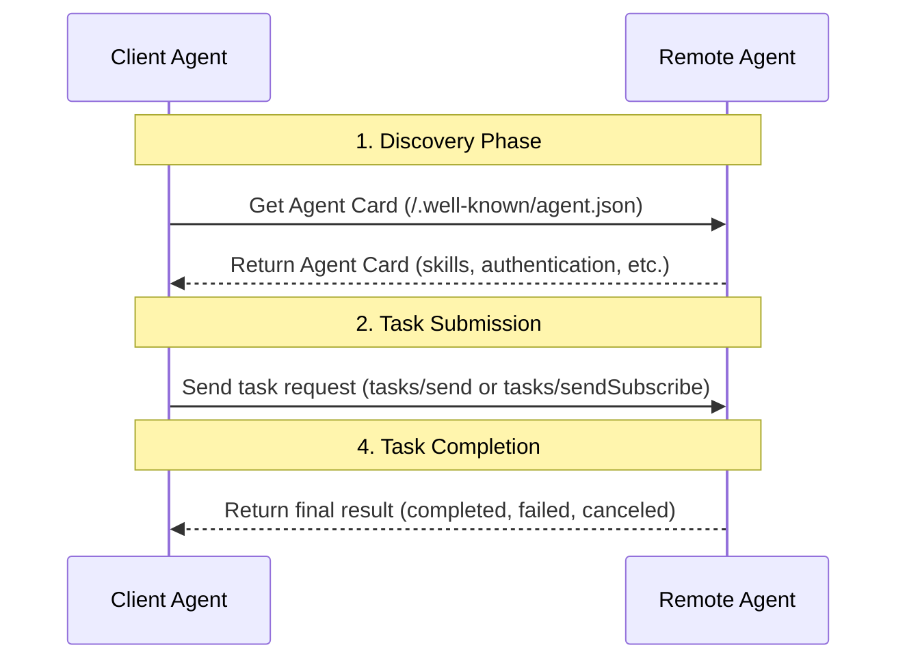
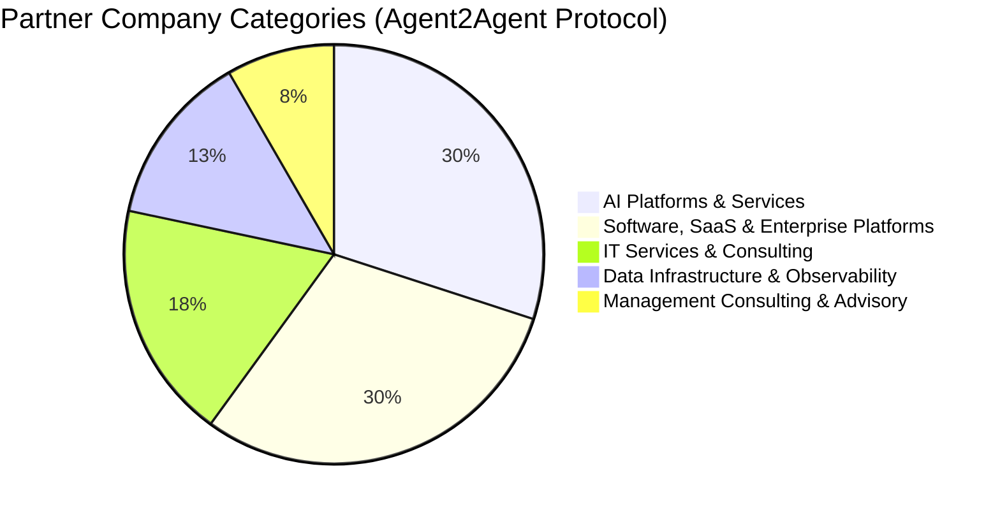

# In-depth Comparison of Google A2A and ANP: Finding the Origin of Protocols

After Google's A2A protocol was released, many friends who follow the ANP community immediately reached out, asking about its impact on us and offering suggestions. Thank you again for your support.

I believe that A2A's biggest impact on ANP is Google's "endorsement": ANP's approach is correct, ANP has a long-term vision, and now I'm joining in :). I no longer need to explain why agent communication and collaboration are important.

That day, I spent half a day researching and wrote an article: [Comprehensive Comparison of Google's Latest A2A, ANP, and MCP](/blogs/Comprehensive-Comparison-of-Google-A2A-ANP-MCP.md).

Later, I spent another day carefully studying A2A and making an in-depth comparison with ANP. I believe I've found the origin point of A2A and have seen the deeper differences between A2A and ANP.

To summarize in one sentence:
- MCP's origin is: **Connecting models with tools and resources**
- A2A's origin is: **Complex collaboration between agents within enterprises**
- ANP's origin is: **Connection and collaboration of agents on the internet**

## Technical Differences

Although both A2A and ANP aim to solve agent communication and collaboration, there are significant technical differences between them.

### Agent Description and Information Organization

In protocol design, how one agent exposes its information to another agent is a key issue.

For agent description, A2A uses a JSON format document called Agent Card to describe the agent's capabilities, skills, authentication methods, etc. The core of Agent Card is skills, expressing what the agent can do, such as map route planning.

ANP also uses JSON, but it's based on JSON-LD (Linked Data) and schema.org to describe agent information (basic information, authentication, external products/services, interaction interfaces). This is semantic web technology, aimed at improving consistency in information understanding between two agents and enabling public information from agents to be linked into a data network, with the agent description document serving as the entry point to the network:


For example, a hotel agent using ANP can describe its rooms, facilities, services, interaction interfaces, and other information (including images), linking them into a data network that other agents can crawl and understand.

This leads to significant differences in agent interaction between A2A and ANP:
- A2A describes agent skills through Agent Card. Other agents obtain these skills and then send a task request via JSON-RPC, describing the task in natural language and carrying relevant information needed for the task. After the task is completed, results are returned.



- ANP connects products, services, interaction interfaces, and other information exposed by the agent using URLs in the Agent Description document. Another agent, like a web crawler, continuously crawls the information it needs through URLs. During this process, it can interact with the agent through natural language interfaces or structured interfaces.


The core differences here:
- **A2A has agents publicly expose their skills, and other agents send processing tasks to them, returning results after completion.**
- **ANP has agents publicly expose their information (including interaction interfaces), and other agents crawl and process this information, interacting with the agent through natural language or structured interfaces when necessary.**

### Agent Discovery

In terms of agent discovery, A2A's approach is basically the same as ANP's. Both add a metadata document in the .well-known directory of a domain, with A2A's file named agent.json and ANP's named agent-descriptions.

Both also support agents actively registering with private registries, which is essential for collaboration in local networks.

The difference is that A2A directly places the Agent Card content in .well-known/agent.json, while ANP stores URLs of agent description files in .well-known/agent-descriptions.

Currently, A2A appears to have one Agent Card per domain (this needs further confirmation), while ANP allows multiple agents per domain.

### Authentication

A2A and ANP differ in authentication.

A2A agents do not exchange identity information in the A2A protocol. Instead, they obtain authentication materials (such as tokens) through out-of-band methods and pass these materials through HTTP headers.

"Out-of-band" means obtaining authentication materials through protocols other than A2A. A2A follows OpenAPI's authentication specifications, supporting multiple authentication methods including HTTP Basic Auth, API Key, OAuth 2.0, etc., as specified by each agent in its Agent Card.


ANP builds decentralized authentication based on W3C DID technology, directly carrying identity information, including authentication information, in the protocol. Agents can interact with all other agents using their own identity without needing to obtain authentication materials out-of-band.

However, in some scenarios, obtaining authentication materials out-of-band is necessary, especially in enterprise applications. ANP will support out-of-band authentication material acquisition in the future, with extensibility reserved in the design.


**Core differences:**
- A2A adopts out-of-band authentication material acquisition to maximize compatibility with security and compliance requirements of mainstream U.S. enterprise application ecosystems, reusing existing enterprise authentication systems, ensuring the protocol itself is lightweight, flexible, and secure. The core is to solve identity issues in enterprise applications, without addressing the issue of agent interconnection on the internet.

- ANP aims to solve how agents authenticate on the internet in the future, with the core being enabling any two agents on the internet to interconnect, requiring a more interoperable authentication scheme.

### Core Concepts

A2A and ANP have significant differences in core protocol concepts.

**A2A's core concepts** include Skill, Task, Artifact, Message, and Part.

Task also defines multiple states, including: submitted, working, input-required, completed, canceled, failed, and unknown.

Task also defines operations, including: Send, Get, Cancel, etc., as well as notification-related operations.

**ANP's core concepts** include description information and interfaces.

Description information is mainly JSON-LD format documents, as well as other resources linked through URLs in JSON-LD documents, including images, audio, video, and other multimedia files.

Interfaces are divided into Natural Language Interface and Structured Interface. Structured Interface supports most existing specifications, such as OpenAPI, JSON-RPC, etc.

**Core differences:**
- A2A defines detailed task collaboration concepts at the protocol level, including task states, operations, etc., which helps solve complex task collaboration problems between agents. The disadvantage is that it leads to higher coupling between two agents.

- ANP simplifies interaction between agents, reducing coupling between agents, with significant advantages in cross-platform agent collaboration scenarios. The disadvantage is that the native protocol does not support complex task collaboration and requires defining interfaces to implement it.

## The Origin of A2A and ANP

To truly understand a protocol's design, one must find the origin point of the protocol.

For example, ANP's origin has always been **connection and collaboration of agents on the internet**. MCP's origin has always been **connecting models with tools and resources** to build better agents.

Through the technical analysis above, we can confirm that A2A's origin is: **complex collaboration between agents within enterprises**.

The protocol's official website doesn't explicitly state this, but Google's press release mentions some aspects:

```
AI agents provide a unique opportunity for people to boost productivity by autonomously handling many routine or complex tasks. Today, businesses are increasingly building and deploying autonomous agents to help scale, automate, and optimize processes across work scenarios—from ordering a new laptop, to assisting customer service representatives, to aiding in supply chain planning. (https://developers.googleblog.com/en/a2a-a-new-era-of-agent-interoperability/)
```

This can also be seen from the distribution of A2A ecosystem companies, most of which are AI platforms and services, software, SaaS, and enterprise platforms.




From a technical perspective, A2A's current implementation is not well-suited for the needs of the agent internet.

For example, if a personal assistant uses A2A to book a room with a hotel agent, according to A2A's current implementation, the personal assistant needs to send a task, describing the user's requirements (price, room type, time, etc.) in natural language. The hotel agent processes this and returns task execution information. This may involve multiple task interactions and state transitions.

This creates two problems: one is that user privacy may be compromised because the personal assistant has to send the task to another agent for execution; the other is that the interaction coupling is too high.

ANP's logic is that the personal assistant crawls information from the hotel agent and processes it locally, only calling the hotel agent's interface when interaction is needed. This is a fundamental difference. Of course, beyond this, A2A has not solved the problem of agent identity interconnection on the internet.

However, it's possible that A2A could expand to agent internet scenarios through protocol upgrades in the future.

## Some Predictions for Future Agent Protocols

In the short term, MCP has become the de facto standard for connecting models with tools and resources, which is basically confirmed, and it's currently difficult for a second MCP to emerge.

In the medium to long term, I believe a trend is likely to occur: **tools becoming agents, agents becoming tools**. If this trend occurs, agent protocols will squeeze MCP's space.

In the longer term, after AGI is realized, perhaps human-designed protocols will constrain rather than aid AI, and AI will have ways to design protocols and reach consensus on its own.

However, agent protocols are very important at present. They are an important puzzle piece for agents and the most AI-native way for agents to interact with the internet, more efficient than Computer Use, Browser Use, or even AI browsers.

In any case, **the most valuable part of ANP is the community's vision for the future agent internet, the community's unique internet philosophy (connection is power), and the DID + semantic web technology route. This is the core driving force supporting ANP's continued development**.

## On Innovation

After A2A came out, seeing headlines like "explosive," "overnight transformation," and "disruption" was complicated, especially since we've been working on ANP for a year and promoting it for a long time.

We all talk about needing "0 to 1" innovation—we need not only innovators but also media that can discover these innovators.

Finally, thanks to every contributor and developer in the open-source community, now numbering over 40.

Also thanks to the public accounts and communities that support us, including RTE Developer Community, OSC Open Source Community, Founder Park, Juecha Flow, Hou Hongwen Cun, AIGCLink, Agent AI, etc. (possibly incomplete), as well as many organizations that provide us with sharing opportunities, and AWS and Alibaba Cloud for providing server resources for the community.
