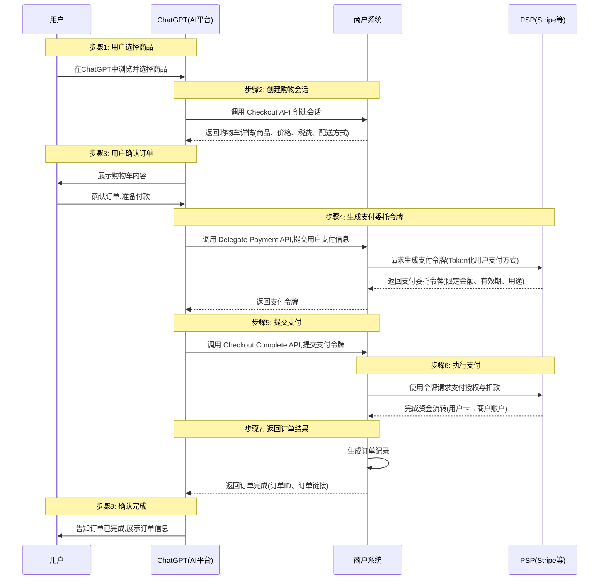

# OpenAI联手Stripe发布ACP协议，用智能体商务颠覆传统电商

传统电商的生态，开始出现裂痕。未来智能体商务，将不是简单的电子商务+AI，而是构建一个AI原生的生态。

## 前言

从9月16日，到9月29日，短短两周时间，谷歌、OpenAI，还有一个创业公司，先后发布了AP2、ATXP、ACP三个智能体交易和支付相关的协议。

协议虽然已经不是当前行业热点，但是其潜力显然是被大大低估的。我很多场合分享的时候，都会提到一个观点：“**协议是上下文传输最好的容器**”。巨头相继发布新的协议，意味着这个技术仍然在快速推进中。

回到OpenAI发布的ACP，全称是Agentic Commerce Protocol(智能体商务协议)。记得在谷歌AP2的介绍文章中（，提到过这个协议中出现的一个概念：Agent Commerce。OpenAI这次直接使用Agentic Commerce作为协议名。

可以看出，**智能体商务已经被巨头看到，并且开始构建新的生态，以颠覆传统的电子商务**。

今天简要介绍下OpenAI新出的ACP，以及与AP2、ATXP，还有我们社区的ANP交易协议的对比，还有对行业的影响与预测。

相关阅读：
[OpenAI ACP协议](https://github.com/agentic-commerce-protocol/agentic-commerce-protocol/)
[谷歌AP2协议解读](https://mp.weixin.qq.com/s/Up-DQi2qbU2ngqo401HbQw)
[ATXP协议解读](https://mp.weixin.qq.com/s/Hci06uO7gua8mqHphr8N0g)
[ANP交易方案解读](https://mp.weixin.qq.com/s/wFVUDs31e6CKLpu8F3LDWg)

## 全文核心要点

如果你没有时间读完全文,下面是这篇文章的核心要点:

- 一句话总结ACP：**ACP是一个以快速落地为目的而构建的协议，目的就是让ChatGPT用户直接在ChatGPT中购买商品**。让ChatGPT在生态和产品上继续保持领先。
- ACP要解决的问题是，让ChatGPT这类AI应用，连接到现有的电子商务生态，在不对商家和支付系统做大的修改的情况下，让AI应用能够完成购买行为。
- 从解决的问题上可以看到，谷歌的AP2致力于解决智能体商务核心的信任问题，ATXP致力于解决智能体微支付的问题，而ACP的目的就是快速落地。
- ACP的信任问题，是依赖ChatGPT和原有的电商生态的声誉来构建的。在这点上，我认为AP2和ANP的设计是要比ACP更好的。
- ACP也没有解决身份的问题，而是采用和A2A类似的带外身份。带外身份在消费领域并不是一个好的方案，会增加智能体之间连接的成本。在这一点上，我们始终认为did是最适合的方案，而且DID可以和AP2完美结合。
- AP2、ATXP、ACP的发布，把智能体商务推到了台前。也许巨头都看到了AI对传统电商的颠覆机会。
- 其他AI应用会陆续跟进，但是现在基础设施还不够完善，比如刚才提到的智能体身份带来的连接成本问题。我们也认为，智能体需要全新新的电商基础设施，而协议则是基础设施的核心。
- 最后，电子商务生态的裂痕已经出现，新的智能体商务生态正在孕育中，而新的生态绝对不是电商+AI，而是基于智能体重新构建。

## ACP详细介绍

### 背景

OpenAI希望越来越多用户 “直接在对话里买东西” —— 也就是让 AI 助手不仅给出推荐，还代为下单、支付、完成交易。 正是在这种需求驱动下推出了 Instant Checkout（即时下单） 功能，从 ChatGPT 内直接购买 Etsy 商品，并宣布开源了背后的协议标准 —— Agentic Commerce Protocol（ACP）。

Instant Checkout 的理念是：“ChatGPT 不只是帮你找要买什么，它还帮你完成买的动作”。在这个过程中，AI、用户、商家三方协作，背后需要一个既安全又能保持商家控制权的协议标准。ACP 就是为此而生：它让商家与 AI 平台之间建立一个标准化的接口，让 AI 能安全地发起订单，同时商家保留自己的订单、支付、履约系统不被替代。

在 Stripe 的官方说法里，ACP 是与 OpenAI 共同设计的开源标准，目的是帮助商户进入“agentic commerce”时代，利用 AI 助手直接触达新的销售渠道，同时维持其原有支付/订单系统的控制权。

### ACP 是什么

ACP（Agentic Commerce Protocol）是一个为 AI 驱动的购物场景设计的开放协议标准。它定义了商家与 AI 平台之间的 购物会话 (checkout session) 接口、支付凭证委托 (delegate payment) 接口、以及 webhook 机制等。其目标是使得 AI 助手可以像网页/App 一样，与商家系统进行无缝交互以完成购物流程，但前提是安全、受控、合规。

ACP 本身由多个子协议（RFC）组成，其中比较核心的是 Agentic Checkout（checkout 会话） 和 Delegate Payment（支付凭证委托）。这两个协议协同工作，使 AI 平台能够安全地发起、管理和完成交易。

### ACP 的核心流程

#### 角色设定

- **用户**：在 ChatGPT 界面中下单、支付的最终消费者。
- **ChatGPT**（AI 平台）：负责发起结算流程、渲染购物车、提交支付 token。
- **商户**（Merchant）：比如酒店、电商网站，负责订单、库存、发货，是交易的最终“系统记录者”。
- **PSP**（支付服务商，如 Stripe）：负责处理真实支付数据（卡号/钱包），完成资金结算。

#### ACP 交互过程

1. **用户选择商品**

用户在 ChatGPT 界面挑选商品（或酒店房间等），触发结算流程。

2. **ChatGPT 调用商户 Checkout API**

ChatGPT 请求商户系统创建 Checkout Session，商户返回购物车详情（商品、价格、税费、配送方式等）。

3. **用户确认订单**

用户在 ChatGPT 中确认购物车内容，准备付款。

4. **商户生成支付委托令牌（Delegate Payment Token）**

ChatGPT调用商户Delegate Payment API，输入用户支付信息，商户调用PSP的接口，生成支付委托令牌，把用户的支付方式（例如信用卡）token 化。这个令牌限定金额、有效期和用途。（这部分流程还需要再次确认下，官方文档不是很清晰）。

5. **ChatGPT 提交支付 (Complete)**

ChatGPT 在调用 Checkout Complete API 时，把令牌作为 payment_data.token 提交给商户系统。

6. **商户调用 PSP**

商户拿着令牌去调用 Stripe（或其他 PSP），请求支付授权与扣款。

PSP 完成资金流转（用户卡 → 商户账户）。

7. **商户返回订单完成结果**

商户确认支付成功，生成订单，返回给 ChatGPT（订单 ID、订单链接）。

8. **用户收到确认**

ChatGPT 告知用户订单已完成。

#### ACP流程图

### ACP与AP2、ATXP、ANP的对比

从ACP的设计，没有看到类似AP2和ANP这样解决智能体交易信任问题的方案，更多的是一个“务实、以电商为中心”的方案，优先解决 AI 与电商系统的集成问题。ACP的信任，则是通过AI应用与电商平台比如shopfiy的信誉来解决的：你信任ChatGPT，如果未来有了售后问题，ChatGPT或者shopify来帮你解决。

而谷歌的AP2和ANP的交易方案，则是希望在分布式环境下，基于可验证凭证技术构建智能体商务的信任基础。从技术的角度看，我是更加看好AP2和ANP这样的方案。不过ACP也可以先通过ChatGPT建立一个生态基础，然后持续迭代解决更多的问题，也是一个路径。

而ATXP则是希望解决智能体微支付的问题，与其他的协议差异有些大（还没有看到协议的细节，先不展开）。

## ACP对行业的影响

### 智能体商务正在成为现实

ACP的发布，以及ChatGPT退出的新功能，最大的意义在于:**智能体商务(Agent Commerce)从概念变成了现实**。

当你可以在ChatGPT中直接完成购买,当这种体验比打开浏览器、访问电商网站更加流畅时,传统电商的交互范式就面临挑战。

虽然目前ACP还只支持单品购买,功能相对简单,但这是一个重要的起点。一旦这个模式被验证,一旦用户习惯了"对话即购",智能体商务就可能快速普及。

### 对传统电商平台的挑战

比较有意思的一个问题是，ChatGPT为什么没有选择AWS？

我们认为根本的原因在于，以ChatGPT为代表的AI应用构建的智能体商务生态，在商业模式上天然与传统的电商平台是冲突。

比如，如果用户都在ChatGPT中购物，AWS是否会丧失入口，从而彻底的被管道化，进而丢失现在能够捕获的价值？

在中国电商生态，也可能会有类似的问题：电商平台与新兴的个人助手类的应用，在中短期来看，商业模式上是有冲突的。以AI应用为入口的智能体电商，会通过流量入口的迁移，进而一步步解构传统的电子商务链路。

新的生态已经启动，未来如何发展，拭目以待。
