# 在W3C-WebAgents-CG关于ANP的演讲

2025年2月14日，常高伟和James Waugh代表AgentNetworkProtocol（ANP）开源社区在W3C WebAgents CG会议上发表了关于ANP的演讲。

W3C WebAgents社区专注于设计基于Web的多智能体系统（MAS），旨在构建一种与Web架构相一致的新型MAS，继承Web的全球性、开放性和持久性等特性，同时确保系统的透明性和可追溯性，以便获得人们的广泛接受。该社区特别关注使用链接数据和语义Web标准，打造能够促进人、人工智能、设备、数字服务等异构实体统一互动的超媒体结构（hMAS）。社区地址：[https://www.w3.org/community/webagents/](https://www.w3.org/community/webagents/).

ANP的技术理念与WebAgents社区有很多一致的地方，并且同样看好链接数据与语义网技术。ANP在设计过程中也参考了WebAgents社区的讨论。这次演讲也向WebAgents社区介绍了我们在ANP上的思考与实践。

演讲内容由常高伟和Jmaes Waugh共同完成，以下为演讲PPT与演讲稿，以及在会议上讨论内容。

## 演讲内容

PDF文档：[ANP-Presentation-at-W3C-WebAgents-cg](../ANP-Presentation-at-W3C-WebAgents-cg.pdf)

### Page 1 

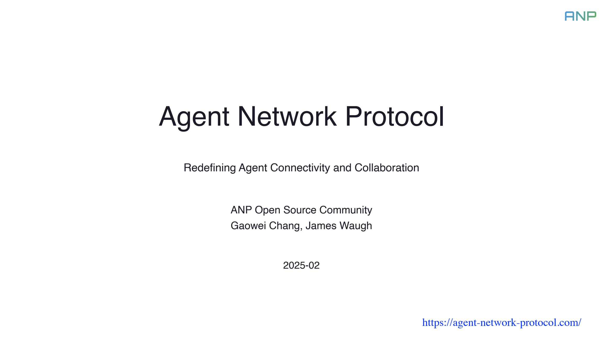

今天非常荣幸能在这里跟大家分享Agent Network Protocol（简称ANP）项目。

我们的愿景是打造"Agentic Web时代的HTTP协议"。我们致力于定义Agent之间如何互联互通，构建一个开放、安全、高效的智能体协作网络。

### Page 2

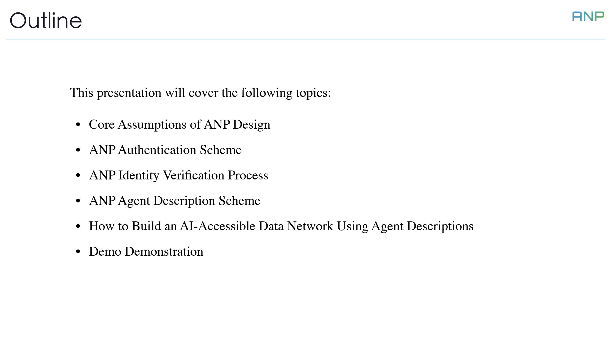

今天的演讲分几部分：
- 首先介绍下我们设计ANP的核心假设是什么，这是我们的基础与核心思考，也是我们对未来web的设想。
- 然后介绍下ANP身份认证的方案设计，以及如何使用它来进行身份认证。
- 接下来介绍下ANP的智能体描述方案，以及如何使用智能体描述协议，构建一个便于AI访问的数据网络。
- 最后展示下我们的demo

### Page 3

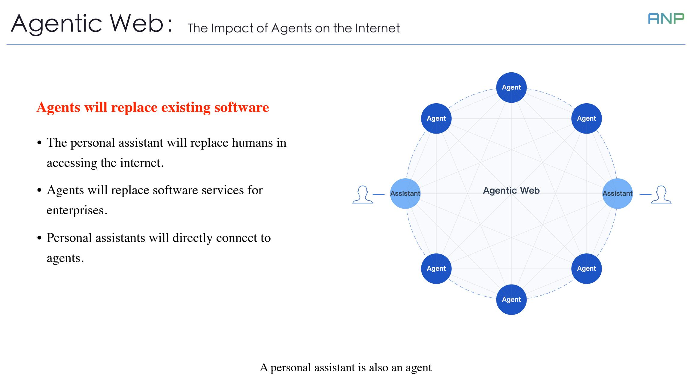

让我们先来看看为什么要设计ANP。在未来的Agentic Web时代，我们认为智能体将彻底改变互联网的使用方式。个人助手将替代人类访问互联网，企业服务也将被智能体取代。更重要的是，这些个人助手本身就是智能体，它们会直接与其他智能体进行连接和交互。

### Page 4

第二个核心假设是：智能体必须实现互联互通。当前互联网上的数据孤岛严重阻碍了AI的发展潜力。为了充分发挥AI的能力，我们需要确保AI能够获取完整的上下文信息，访问所有工具能力。更重要的是，智能体之间的连接度将远超过去的互联网。

### Page 5

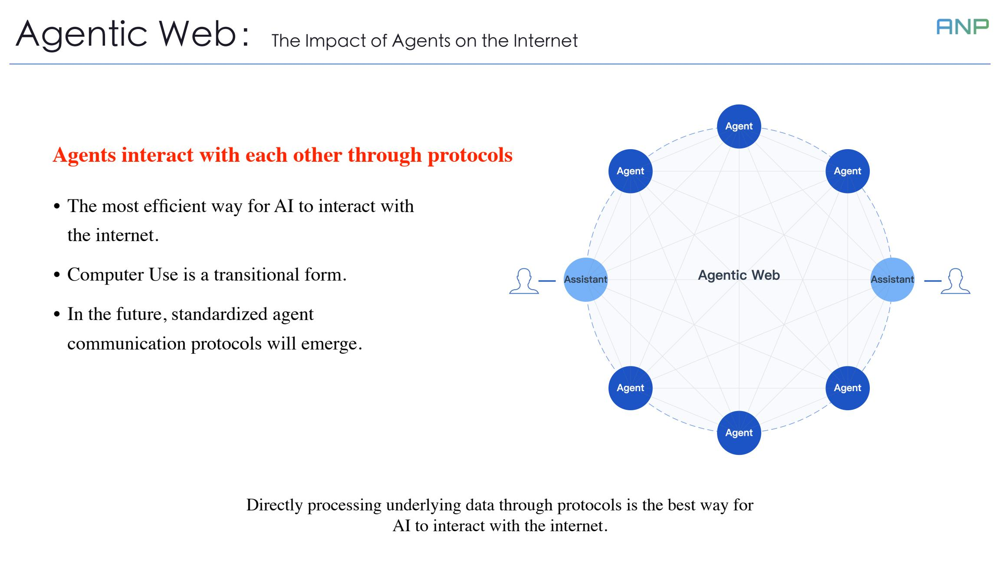

第三个核心假设是：智能体之间应该通过协议来交互。让AI通过协议直接处理底层数据，是其与互联网交互最高效的方式。当前的Computer Use方案只是一种过渡形态，未来会出现标准化的智能体通信协议，这正是我们正在做的事情。

### Page 6

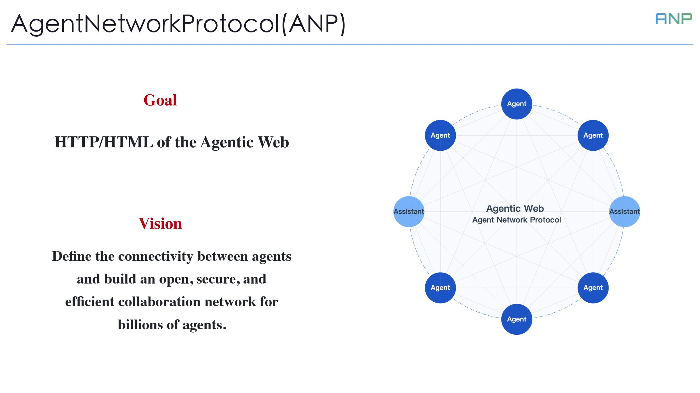

基于这三个核心假设，我们提出了ANP的目标：打造Agentic Web时代的HTTP/HTML。就像HTTP/HTML定义了人类如何访问互联网一样，ANP将定义智能体如何访问互联网。

我们的愿景是：定义智能体之间的连接方式，为数以亿计的智能体构建一个开放、安全、高效的协作网络。这不仅仅是一个协议，而是未来智能体互联网的基础设施。

### Page 7

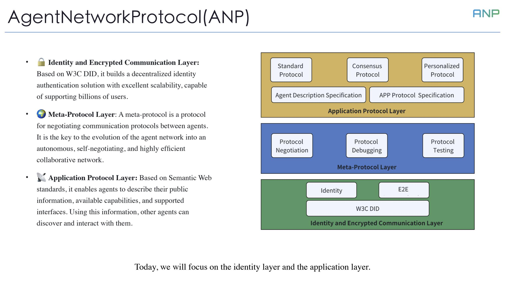

为了实现这个愿景，我们设计了ANP的三层架构：

首先是身份与加密通信层：基于W3C DID标准，我们构建了一个去中心化的身份认证方案，具有出色的扩展性，能支持数十亿用户规模。

其次是元协议层：这是一个用于协商智能体之间通信协议的协议，是智能体网络进化为自组织、自协商、高效协作网络的关键。

最后是应用协议层：基于语义网标准，使智能体能够描述自己的公开信息、可用能力和支持的接口，其他智能体可以据此发现并与之交互。今天我们将重点介绍身份层和应用层。

### Page 8

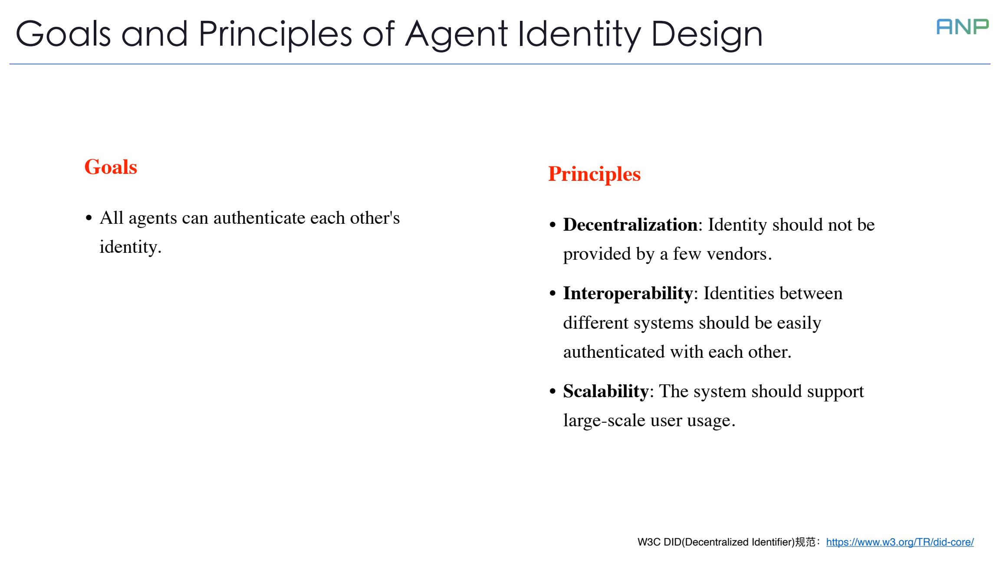

让我们先来看看智能体身份设计的目标与原则。我们的核心目标很简单：让所有智能体都能够相互认证对方的身份。

为了实现这个目标，我们遵循三个原则：去中心化，身份不应由少数厂商提供；互操作性，不同系统间的身份应该能够轻松地相互认证；可扩展性，系统应能支持大规模用户使用。

### Page 9

相信在座的各位对W3C DID都不陌生。DID全称Decentralized Identifier，是一种用户自主管理、自主控制的数字身份标识符，在去中心化系统中广泛应用。它于2022年成为W3C正式推荐标准。

我们选择DID作为智能体身份方案的基础，正是看中了它的去中心化、互操作性和隐私安全特性，这与我们的设计原则不谓而合。

### Page 10

我们设计了Web-Based Agent DID方法，其核心设计原则是务实可行。

首先，我们不追求完全去中心化，而是将可行性放在首位。其次，我们重用现有的Web基础设施，以降低实现成本。最后，我们基于现有的did:web方法进行扩展，增加了智能体相关特性。

比如，did:wba:example.com:user:alice就会解析到https://example.com/user/alice/did.json，这种方式简单直观。

### Page 11

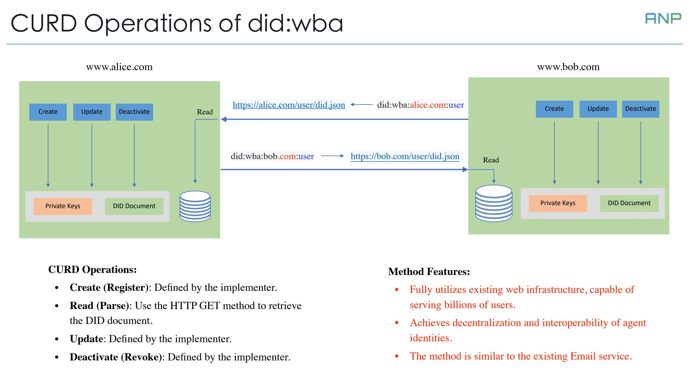

让我们来看看did:wba的CRUD操作。这里有个重要特点：创建、更新、停用这三个操作都是在系统内部进行的，而读取操作是跨系统的。

比如，当Alice的智能体要访问Bob的DID文档时，只需发起一个HTTP GET请求就可以了。这种设计充分利用了现有的Web基础设施，能够支持数十亿用户规模，并实现了智能体身份的去中心化和互操作性。

### Page 12

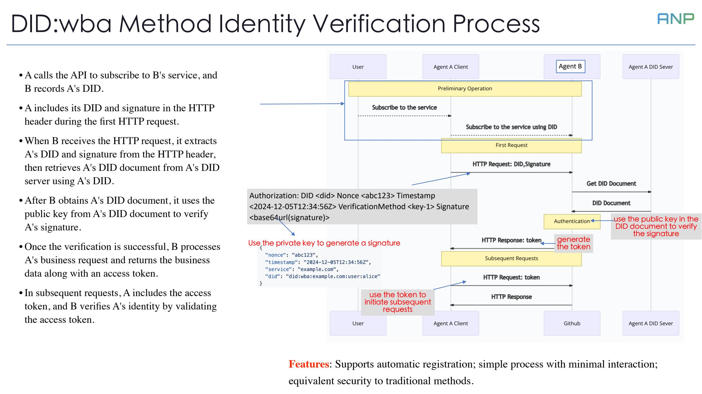

让我们来看看did:wba的身份认证流程。整个过程分为三个阶段：初始订阅、首次请求和后续请求。

首先，A调用API订阅B的服务，B记录A的DID。然后在首次HTTP请求时，A在请求头中包含其DID和签名。B收到请求后，会获取A的DID文档，DID文档中包含有A的公钥，B使用A的公钥验证签名。验证成功后，B会返回一个访问令牌。在后续请求中，A只需使用这个令牌即可。

### Page 13

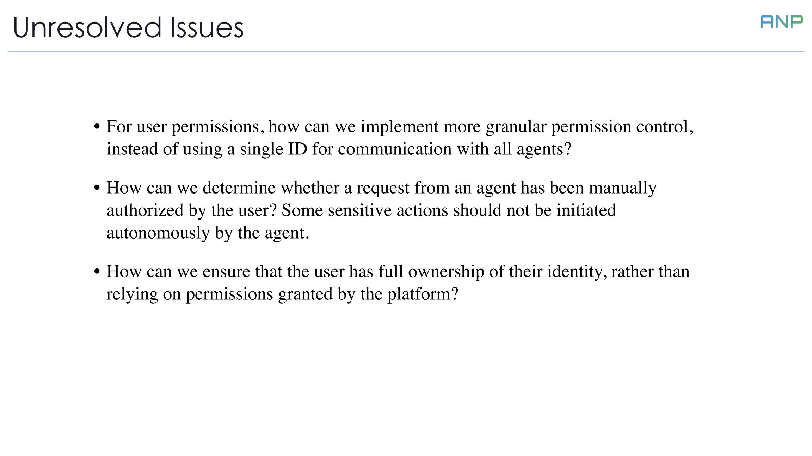

在身份认证技术上，我们还有一些待探索的问题。

首先是用户权限问题：如何实现更细粒度的权限控制，而不是使用单一ID与所有智能体通信？

其次是用户授权问题：如何判断一个请求是否由用户手动授权？某些敏感操作不应由智能体自主发起。

最后是身份主权问题：如何确保用户对其身份有完全的所有权，而不是依赖于平台授予的权限？

### Page 14

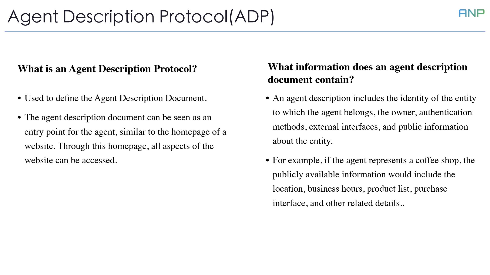

让我们进入ANP的另一个重要模块：Agent Description Protocol（ADP）。

什么是ADP？它是用来定义智能体描述文档的协议。这个文档可以被看作是智能体的“主页”，就像网站的主页一样，通过它可以访问智能体的所有功能。

一个智能体描述文档包含哪些内容？它包含了智能体所属实体的身份、所有者、认证方式、外部接口以及公开信息。比如，如果这个智能体代表一家咖啡店，那么它的公开信息就会包括地点、营业时间、产品列表、购买接口等信息。

### Page 15

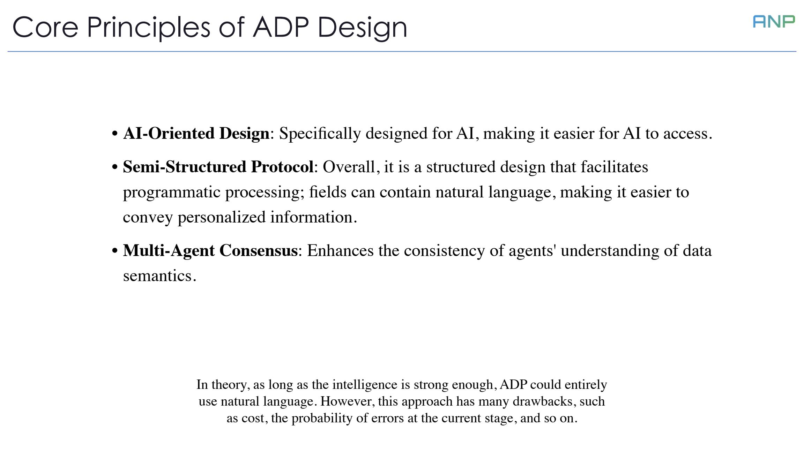

ADP的设计基于三个核心原则。

第一是AI导向设计：协议专门为AI设计，使其更容易被AI理解和访问。

第二是半结构化协议：总体上采用结构化设计，便于程序处理；同时字段可以包含自然语言，便于传递个性化信息。

第三是多智能体共识：增强智能体之间对数据语义的理解一致性。

理论上，只要智能水平足够高，ADP可以完全使用自然语言。但这种方法在当前阶段有许多缺点，如成本、错误率等。

### Page 16

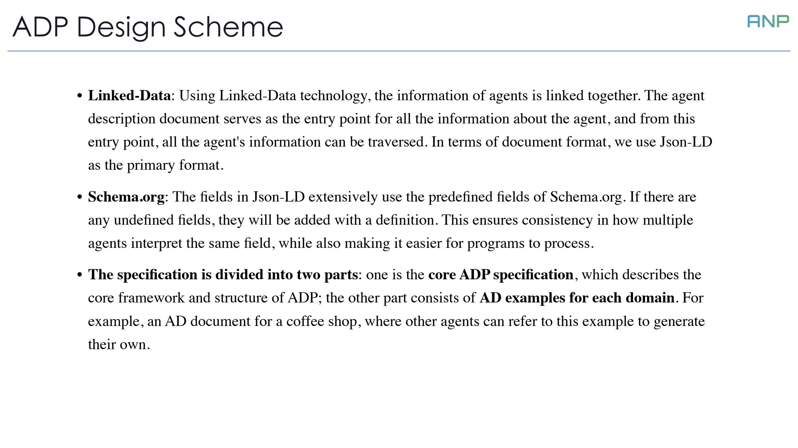

让我们来看看ADP的具体设计方案。

首先是Linked-Data技术的采用。我们使用这个技术将智能体的信息连接在一起。智能体描述文档作为入口点，可以遍历到所有相关信息。我们选择Json-LD作为主要文档格式。

其次是Schema.org的应用。Json-LD中的字段大量使用Schema.org的预定义字段。如果遇到未定义的字段，我们会添加定义。这样可以确保多个智能体对同一字段的理解一致，并且更利于程序处理。

最后，规范分为两部分：核心ADP规范和领域示例。核心规范描述了ADP的基本框架和结构，而领域示例部分则提供了各个领域的AD文档示例，比如咖啡店的AD文档，其他智能体可以参考这些示例来生成自己的文档。

### Page 17

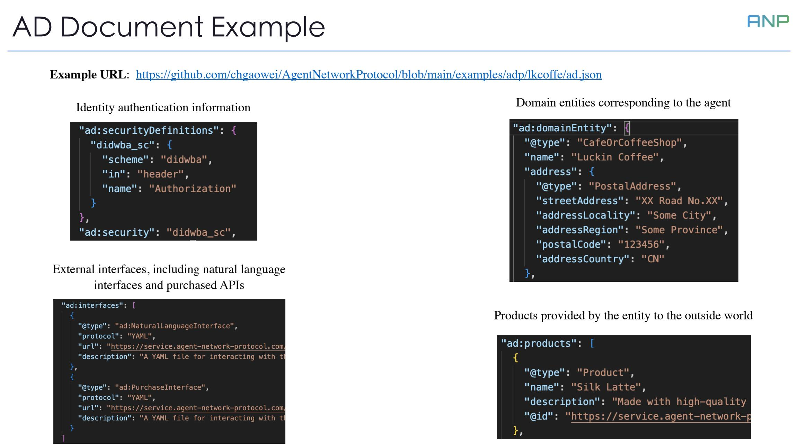

让我们通过一个具体的咖啡店AD文档来理解ADP。这个文档包含四个重要的自定义模块。

第一个是身份认证信息模块（ad:securityDefinitions），定义了使用did:wba进行认证的方式。

第二个是外部接口模块（ad:interfaces），包含了自然语言交互和购买接口的API定义。

第三个是领域实体模块（ad:domainEntity），描述了该智能体对应的咖啡店信息，如名称、地址等。

第四个是产品信息模块（ad:products），列出了咖啡店提供的产品。

### Page 18

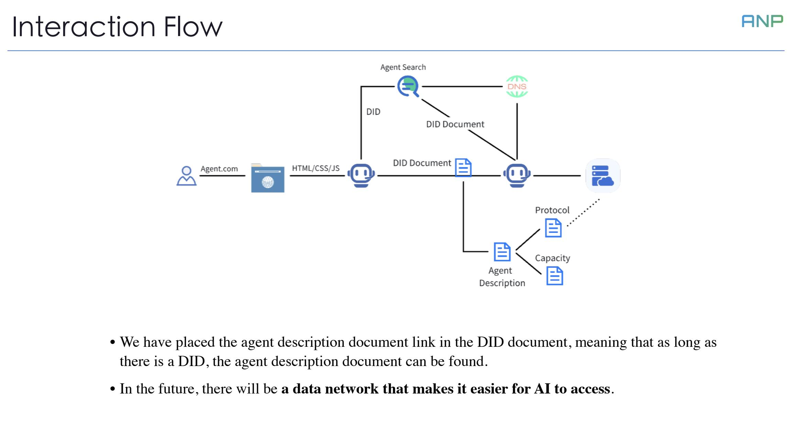

让我们来看看ADP的交互流程。

首先，用户通过智能体与其他的智能体进行交互。用户的智能体有了另外一个智能体的DID后，可以在DID文档中找到它的智能体的AD文档的URL，根据AD文档，用户的智能体就知道，另外一个智能体提供了哪些能力，用什么样的协议交互。

这意味着只要有DID，就能找到相应的智能体描述文档。只要有智能体描述文档，就可以和智能体进行交互。

在未来，我们认为会出现一个数据网络，一个专门面向AI设计，使得AI更容易访问的数据网络。

### Page 19

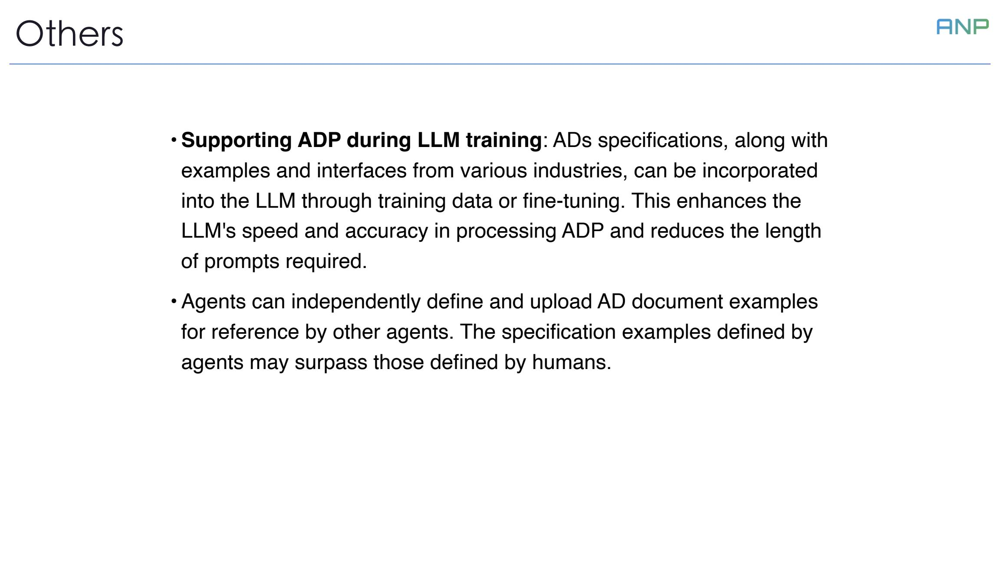

关于ADP，还有两个重要的设计考虑。

第一是在LLM训练中支持ADP。我们可以将AD规范以及各行业的示例和接口，通过训练数据或精调的方式引入到LLM中。这样可以提高LLM处理ADP的速度和准确性，减少所需的提示词长度。

第二是智能体可以自主定义和上传AD文档示例，供其他智能体参考。有趣的是，智能体定义的规范示例可能会超越人类定义的。

### Page 20

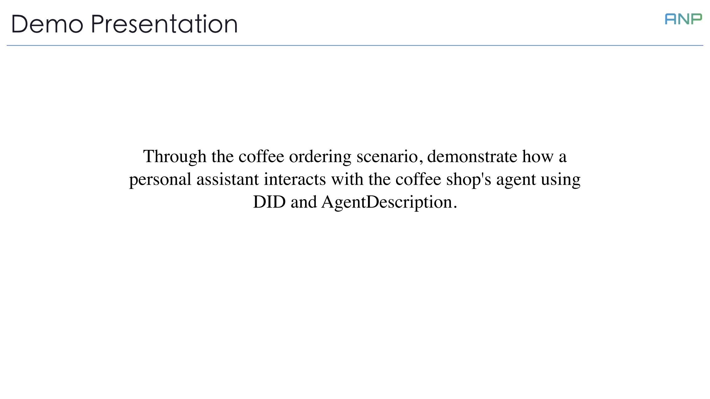

接下来，我们通过一个实际的场景来演示ANP的工作原理。

我们将通过一个咖啡点单的场景，来展示个人助理如何使用DID和智能体描述文档与咖啡店的智能体进行交互。

这个演示将展示整个ANP协议的工作流程，包括智能体发现、身份认证、能力查询和业务交互等环节。

### Page 21

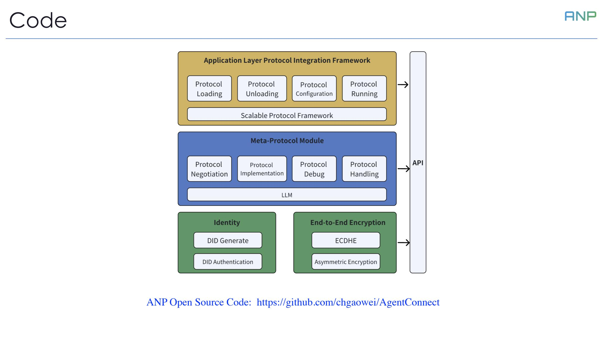

我们已经完成了ANP的开源实现，包括身份和端到端加密模块、元协议模块、ADP模块。欢迎大家在GitHub上访问和使用。

### Page 22 Thanks

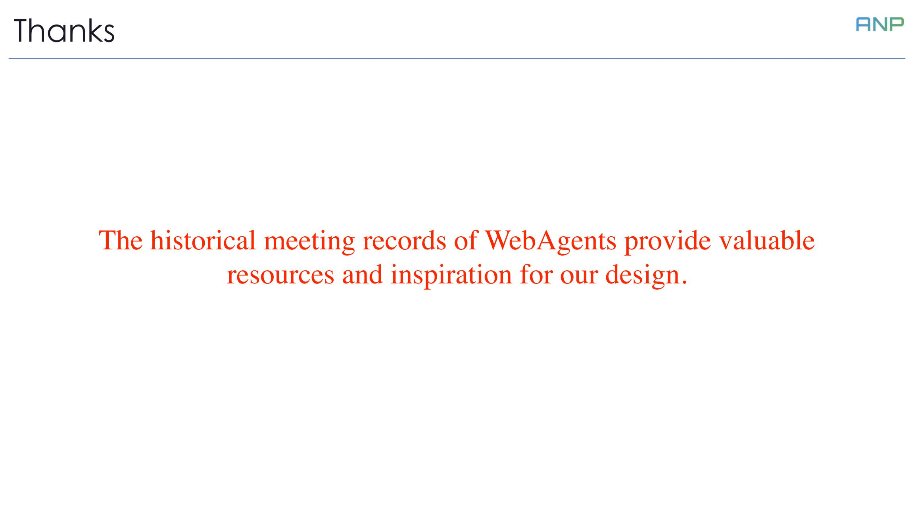

我要特别感谢WebAgents的历史会议记录，为我们的设计提供了宝贵的参考和灵感。

## 问答环节

### 什么是不追求完全的去中心化

我们认为区块链的方案是一种完全的去中心化，整个结构中没有中心化模块的存在。但是区块链的扩展性难题目前还没有好的解决方案。

所以，我们追求的去中心化，不是区块链类似的完全去中心化，而是类似email的去中心化。即任意一个email账号，都可以和另外一个email账号进行互发邮件。email服务商是中心化的，但是整个业务又是去中心化的，任意账号之间都可以互通，同时又能够服务十亿级的用户。

我们的去中心设计思路与email是一样的。我认为这是现阶段最适合的方案。

### json-LD -> TTL/RDF 映射问题

详细问题：您有 json-LD -> TTL/RDF 映射吗？在我看来，Json-LD 设计通常存在与未识别的空白节点相关的问题

回答（后面补充回答）：我们暂时不存在json-LD -> TTL/RDF 映射。我们使用JSON-LD，主要使用它的两个能力：
- 数据连接能力：可以将数据连接成一个便于AI访问的网络，而不是让AI访问为人类设计的网络。
- 语义理解一致性：利用语义网技术已经定义好的Schema.org，提升不同智能体之间的语义理解一致性。

### 怎么保证对数据理解的一致性

详细问题：你提到了咖啡，怎么保证两个智能体对咖啡的理解是一致的。

回答：实际上，即便是我们什么都不做，目前智能体也能够对咖啡保持一致的理解，在99%的场景中。我们要做的，是进一步提升语义理解一致性，以保证两个智能体之间的咖啡理解一致。

具体的做法是，在智能体描述规范的JSON-LD设计中，大量使用当前语义网已经定义好的Schema.org字段，这样可以确保多个智能体对同一字段的理解一致，并且更利于程序处理。

如果有字段未定义，我们会重新定义的，并且把Schema.org的定义、我们的定义，我们的规范，全部作为预训练的资料，让LLM进行学习。这样，两个LLM对同一个字段的理解就能保持一致。

### 是否能够访问物联网设备

详细问题：智能体可以访问到物联网设备吗？

回答：理论上是可以访问的。只要定义好物联网设备的接口，并且将接口描述放到ADP（智能体描述协议）文档中，AI就可以理解并且发起对物联网设备的方案。

### http与OpenAPI不一定是更好的传输协议

详细问题：在物联网场景，http与OpenAPI不一定是更好的传输协议，特别是面临异步通信的时候。

回答：是的。ANP理论上对传输层协议是没有要求的，目前是承载在HTTP、WSS上，也可以在其他的协议中使用。不过需要底层协议做些修改。比如，现在HTTP的身份认证信息携带在HTTP头中，使用其他协议则要设计新的身份认证方案。

### 如何使用现有的API接口，比如现有的OpenAPI规范

详细问题：在智能体描述规范中，是否可以使用现在已经存在的接口，比如现存的OpenAPI接口？

回答（补充回答）：是的。智能体描述规范中，智能体对外提供的接口是一个开放性的设计，可以将现有规范的接口，比如OpenAPI的接口文档，放到智能体描述规范中，AI就可以理解，并且发起对这些接口的调用。

这是一种情况。我认为更加令人兴奋的是另外一种情况，即两个智能体可以互相协商他们要用什么接口进行通信，并且将协商好的接口作为规范共享给其他的智能体。这就是元协议的作用。

### 为什么智能体代表了一个咖啡店，而不是服务器

详细问题（会议后问题）：示例中智能体代表了一个咖啡店，而不是代表了一个服务器？

回答： 智能体可以代表任意的实体，包括人、组织、组织中的子组织，甚至是物体。在示例中，智能体代表咖啡店，是因为我们的场景是人购买一杯咖啡，和人互动的对象是咖啡店。人的智能体可以和咖啡店的智能体进行自然语言的互动，比如解决一些售后问题、个性化问题。这个时候结构化的API解决不了，需要个性化的自然语言接口来解决。

## 联系我们

如果你对这个话题感兴趣，欢迎联系我们：

- Discord: [https://discord.gg/sFjBKTY7sB](https://discord.gg/sFjBKTY7sB)  
- 官网：[https://agent-network-protocol.com/](https://agent-network-protocol.com/)  
- GitHub：[https://github.com/agent-network-protocol/AgentNetworkProtocol](https://github.com/agent-network-protocol/AgentNetworkProtocol)

