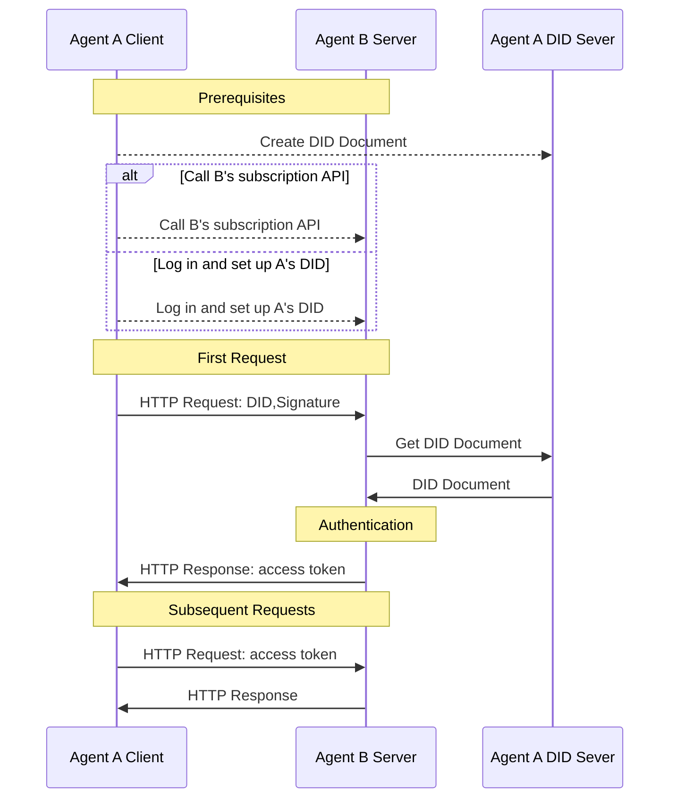

# did:wba-基于web的去中心化身份标识符

## 1. 介绍

did:wba方法是W3C去中心化标识符(DIDs)标准下的一个草案方法规范。[W3C DIDs](https://www.w3.org/TR/did-core/)标准于2022年发布为W3C推荐标准，是一种支持可验证、去中心化数字身份的新型标识符。基于DIDs，可以让用户真正掌握自己的身份，也可以提高不同应用之间身份的互操作性。DIDs已被包括Bluesky在内的许多应用广泛采用。

DID 的核心组件是 DID 文档，其中包含与特定 DID 相关的关键信息，比如用于验证 DID 所有者身份的公钥。DID方法定义了如何创建、存储、更新、撤销 DID 文档。

我们设计了一个[did:wba方法](/chinese/03-did-wba方法规范.md)。did:wba 方法能够充分利用现有的成熟技术和Web基础设施，在不需要彻底重构现有系统的情况下，轻松实现去中心化身份认证。各平台可以使用中心化方式管理自己的账户体系，同时为每个用户创建did:wba DID，以此实现平台之间的互联互通。

使用did:wba方法的身份系统，可以实现类似email的业务特点，各个平台以中心化的方式实现自己的账户体系，同时，各个平台之间可以互联互通。

相对API keys，did:wba方法在安全性上更胜一筹；相对OpenID Connect，did:wba方法交互更加简单，更加的去中心化。他们之间的详细对比可以参考[did:wba对比OpenID Connect、API keys](/blogs/cn/did:wba对比OpenID%20Connect、API%20keys.md)。

did:wba方法也具有与OpenID Connect同等的安全性，可以参考[did:wba安全性原理解析](/blogs/cn/did-wba安全性原理解析.md)。

## 2. DID文档

使用did:wba方法，一个最基本的DID文档如下：

```json
{
    "@context": [
      "https://www.w3.org/ns/did/v1",
      "https://w3id.org/security/suites/jws-2020/v1",
      "https://w3id.org/security/suites/secp256k1-2019/v1",
      "https://w3id.org/security/suites/ed25519-2020/v1",
      "https://w3id.org/security/suites/x25519-2019/v1"
    ],
    "id": "did:wba:example.com%3A8800:user:alice",
    "verificationMethod": [
      {
        "id": "did:wba:example.com%3A8800:user:alice#WjKgJV7VRw3hmgU6--4v15c0Aewbcvat1BsRFTIqa5Q",
        "type": "EcdsaSecp256k1VerificationKey2019",
        "controller": "did:wba:example.com%3A8800:user:alice",
        "publicKeyJwk": {
          "crv": "secp256k1",
          "x": "NtngWpJUr-rlNNbs0u-Aa8e16OwSJu6UiFf0Rdo1oJ4",
          "y": "qN1jKupJlFsPFc1UkWinqljv4YE0mq_Ickwnjgasvmo",
          "kty": "EC",
          "kid": "WjKgJV7VRw3hmgU6--4v15c0Aewbcvat1BsRFTIqa5Q"
        }
      }
    ],
    "authentication": [
      "did:wba:example.com%3A8800:user:alice#WjKgJV7VRw3hmgU6--4v15c0Aewbcvat1BsRFTIqa5Q",
      {
        "id": "did:wba:example.com%3A8800:user:alice#key-1",
        "type": "Ed25519VerificationKey2020",
        "controller": "did:wba:example.com%3A8800:user:alice",
        "publicKeyMultibase": "zH3C2AVvLMv6gmMNam3uVAjZpfkcJCwDwnZn6z3wXmqPV"
      }
    ],
    "keyAgreement": [
      {
        "id": "did:wba:example.com%3A8800:user:alice#key-2",
        "type": "X25519KeyAgreementKey2019", 
        "controller": "did:wba:example.com%3A8800:user:alice",
        "publicKeyMultibase": "z9hFgmPVfmBZwRvFEyniQDBkz9LmV7gDEqytWyGZLmDXE"
      }
    ]
}
```

其中，authentication中的公钥用于身份验证。也就是说，只要对方能够安全的获取正确的DID文档，就可以获得正确的公钥。然后就可以使用公钥对用户的签名进行验证，从而验证用户的身份。

DID文档的创建、更新、撤销有用户自己决定，比如用户可以选择将DID文档保存在自己的服务器上，也可以选择保存在第三方服务器上。无论存储在哪里，都要保证用户对DID文档的控制权。

同时，用户还需要提供一个HTTP方法，用于让其他人安全的获取自己的DID文档。而获取DID文档的HTTP地址可以从DID转换得来。也就是说，只要用户有了DID，就可以使用HTTP获得对应DID文档。转换方法如下：

```plaintext
示例：
did:wba:example.com:user:alice
 -> https://example.com/user/alice/did.json
```

## 2. 跨平台的身份认证过程

did:wba可以和HTTP协议结合使用，在一个HTTP请求中，完成身份认证、权限认证、数据交换等操作。他不增加额外的交互次数。下面是did:wba和HTTP协议结合的交互流程：



1. 前置条件：
  - 用户A创建DID，并且将DID文档保存在Agent A 的DID server上。
  - 需要让Agent B知道Agent A的DID，有两种方式可以实现，下面两种方式任选一种:
    - 用户A登录到Agent B的系统，并且设置A的DID。
    - 或者调用Agent B的订阅API，并设置订阅的DID为A的DID。**这种方式可以极大的降低两个智能体之间连接的成本。**

2. 身份验证流程：
  - Agent A作为客户端发起HTTP请求，请求中除了请求数据外，还携带DID、nonce、时间戳、签名等信息。
  - Agent B作为server收到请求后，从请求头中提取DID、nonce、时间戳、签名等信息。
  - Agent B根据DID从Agent A的DID server中读取DID文档。
  - Agent B使用DID文档中的公钥对客户端的签名进行验证。
  - 验证通过后，Agent B处理客户端的业务请求，返回业务数据的同时，返回token。
  - Agent A在后续请求中携带token，Agent B通过对token的验证，完成对客户端的身份认证。

从整个流程可以看出，使用HTTP，did:wba可以在不增加交互次数的情况下，完成身份认证。并且可以实现两个智能体（或应用）在互相通信的过程中，发起者直接调用对方的订阅接口订阅服务。而不用人工去对方系统注册。这降低了两个智能体之间互联互通的门槛。

## 3. 用例


1. 用例 1：用户通过智能助理访问其他网站上的文件

Alice在example.com网站上存储了一个文件，后来她希望通过智能助理访问该文件。为此，Alice首先在智能助理上创建了一个基于did:wba方法的DID，并登录到example.com，将这个DID与自己的账户关联，并授予DID访问文件的权限。完成设置后，智能助理就可以使用该DID登录example.com，经过身份验证后，example.com允许智能助理访问Alice存储的文件。这个DID也可以配置到其他网站，以便智能助理访问不同平台上的文件。

2. 用例 2：用户通过智能助理调用其他平台服务的API

Alice希望通过智能助理调用一个名为example的第三方服务API。首先，Alice在智能助理上创建了一个基于did:wba方法的DID，并使用该DID，调用API接口订购example平台的相关服务。example服务通过DID完成身份认证，确认购买者是Alice，并记录下她的DID。认证通过后，Alice便可以通过智能助理使用该DID调用example服务的API进行操作。

> 当前用例中并未列举客户端对服务端的身份认证，事实上这个流程也是可以工作的。


## 4. 代码

我们已经开发完成并且开源，详细可以参考：[https://github.com/agent-network-protocol/AgentConnect/blob/master/README.md#decentralized-authentication-based-on-didwba-and-http](https://github.com/agent-network-protocol/AgentConnect/blob/master/README.md#decentralized-authentication-based-on-didwba-and-http)

## 5. 参考资料

[did:wba Method Specification](https://github.com/agent-network-protocol/AgentNetworkProtocol/blob/main/chinese/03-did%3Awba%E6%96%B9%E6%B3%95%E8%A7%84%E8%8C%83.md)

[DID-CORE](https://www.w3.org/TR/did-core/)

[AgentNetworkProtocol Technical White Paper](https://github.com/agent-network-protocol/AgentNetworkProtocol/blob/main/chinese/01-AgentNetworkProtocol%E6%8A%80%E6%9C%AF%E7%99%BD%E7%9A%AE%E4%B9%A6.md)

## Copyright Notice
Copyright (c) 2024 GaoWei Chang  
This file is released under the [MIT License](./LICENSE). You are free to use and modify it, but you must retain this copyright notice.
