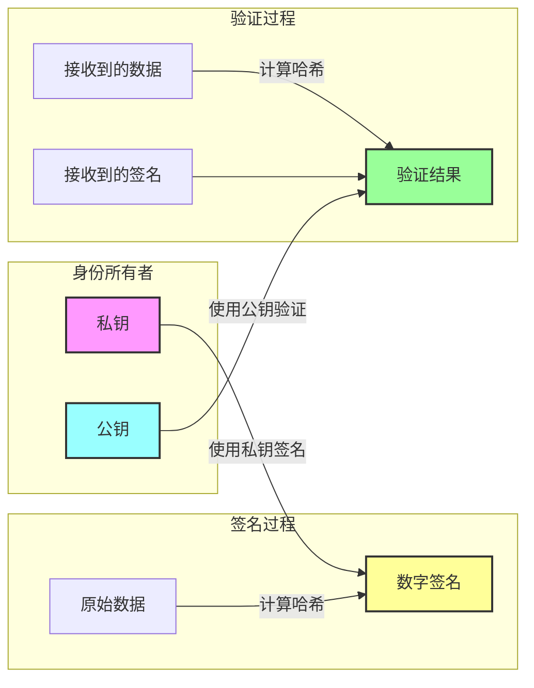

# did:wba 安全性原理解析

did:wba作为一种基于 Web 的去中心化身份标识符方法，其安全性设计是其核心特征之一。本文将深入探讨 did:wba 的安全性原理，分析其如何保证身份验证的可靠性和安全性。

did:wba相关资料链接：
- did:wba规范文档：[did:wba 规范](https://github.com/chgaowei/AgentNetworkProtocol/blob/main/chinese/03-did%3Awba%E6%96%B9%E6%B3%95%E8%A7%84%E8%8C%83.md)
- 这是一个did:wba的简要介绍：[did:wba-基于web的去中心化身份标识符](blogs/did:wba-基于web的去中心化身份标识符.md)
- 我们对比了did:wba与OpenID Connect、API keys等技术方案的区别：[did:wba对比OpenID Connect、API keys](blogs/cn/did:wba对比OpenID%20Connect、API%20keys.md)

## 1. 安全性的基石：非对称加密

did:wba 的安全性主要建立在非对称加密的基础之上。这种加密方式使用一对密钥：

- 私钥：仅由身份所有者持有，用于签名
- 公钥：可以公开，用于验证签名



这种加密机制确保了：
1. 只有持有私钥的人才能生成有效签名
2. 任何人都可以使用公钥验证签名的真实性
3. 无法从公钥推导出私钥

## 2. DID Document 的安全性

did:wba 的 DID Document 包含了以下安全相关的关键要素：

1. **验证方法（VerificationMethod）**：
   - 包含公钥信息
   - 明确指定加密算法
   - 定义密钥的用途和权限

2. **认证（Authentication）**：
   - 指定哪些密钥可用于身份认��
   - 防止未授权的密钥进行身份验证

3. **服务端点（Service）**：
   - 提供安全的服务访问入口
   - 支持 HTTPS 协议确保传输安全

## 3. 身份验证流程的安全保障

did:wba 的身份验证流程采用了多重安全机制：

### 3.1 请求签名机制

每个认证请求都包含以下要素：
```
Authorization: DID <did> Nonce <nonce> Timestamp <timestamp> VerificationMethod <key-id> Signature <signature>
```

其中：
- Nonce：防重放攻击的随机数
- Timestamp：确保请求时效性
- Signature：对关键信息的签名

### 3.2 防护措施

1. **防重放攻击**：
   - 服务器为每个请求生成唯一 nonce
   - nonce 仅能使用一次
   - 服务器维护已使用 nonce 的黑名单

2. **时间戳验证**：
   - 限制请求的有效时间窗口
   - 防止历史请求重放
   - 服务器校验时间戳的合理性

3. **签名验证**：
   - 验证签名的完整性
   - 确保签名使用了授权的密钥
   - 验证签名数据的格式正确性


## 4. Token 机制的安全性

did:wba 支持基于 token 的身份验证：

1. **Token 生成**：
   - 服务器在验证初始请求后生成
   - 包含必要的身份和权限信息
   - 设置合理的有效期

2. **Token 使用**���
   - 后续请求使用 Bearer token
   - 简化重复认证的过程
   - 支持临时授权机制

## 5. 安全最佳实践

使用 did:wba 时的安全建议：

1. **私钥保护**：
   - 安全存储私钥
   - 避免私钥泄露
   - 定期轮换密钥

2. **通信安全**：
   - 使用 HTTPS 进行传输
   - 验证服务器证书
   - 加密敏感数据

3. **错误处理**：
   - 合理处理认证失败
   - 实现重试机制
   - 记录安全事件日志

## 总结

did:wba 的安全性建立在现代密码学的基础之上，通过多层次的安全机制确保身份验证的可靠性。其核心优势在于：

1. 基于非对称加密的强安全性
2. 完善的防重放攻击机制
3. 灵活的 token 认证支持
4. 标准化的安全实践指导

通过这些机制的组合，did:wba 为去中心化身份认证提供了一个安全可靠的解决方案。 