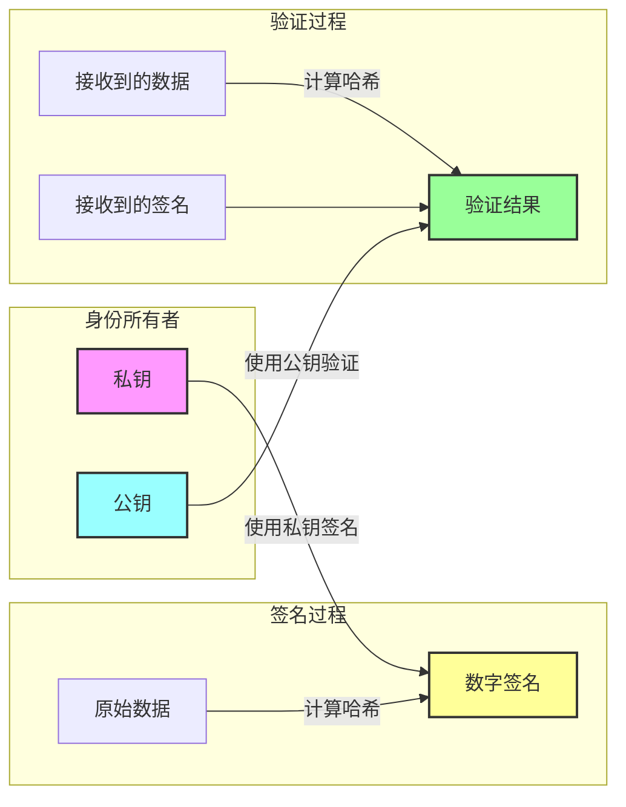

# did:wba 安全性原理解析

did:wba作为一种基于 Web 的去中心化身份标识符方法，其安全性设计是其核心特征之一。本文将深入探讨 did:wba 的安全性原理，分析其如何保证身份验证的可靠性和安全性。

did:wba相关资料链接：
- did:wba规范文档：[did:wba 规范](https://github.com/chgaowei/AgentNetworkProtocol/blob/main/chinese/03-did%3Awba%E6%96%B9%E6%B3%95%E8%A7%84%E8%8C%83.md)
- 这是一个did:wba的简要介绍：[did:wba-基于web的去中心化身份标识符](https://github.com/chgaowei/AgentNetworkProtocol/blob/main/blogs/did%3Awba-%E5%9F%BA%E4%BA%8Eweb%E7%9A%84%E5%8E%BB%E4%B8%AD%E5%BF%83%E5%8C%96%E8%BA%AB%E4%BB%BD%E6%A0%87%E8%AF%86%E7%AC%A6.md)
- 我们对比了did:wba与OpenID Connect、API keys等技术方案的区别：[did:wba对比OpenID Connect、API keys](https://github.com/chgaowei/AgentNetworkProtocol/blob/main/blogs/cn/did%3Awba%E5%AF%B9%E6%AF%94OpenID%20Connect%E3%80%81API%20keys.md)

## 1. 安全性的基石：非对称加密

did:wba 的安全性主要建立在非对称加密的基础之上。这种加密方式使用一对密钥：

- 私钥：仅由身份所有者持有，用于签名
- 公钥：可以公开，用于验证签名



这种加密机制确保了：
1. 只有持有私钥的人才能生成有效签名。私钥必须保密，不能泄露。
2. 任何人都可以使用公钥验证签名的真实性，签名验证通过，则说明签名是由持有私钥的人生成的。
3. 无法从公钥推导出私钥。公钥和私钥是成对生成的，公钥不能推导出私钥。

## 2. DID Document 的安全性保证

从上面流程可以看到，只要保证两点，就可以保证did:wba的安全性：

1. 私钥必须保密，不能泄露。
2. 验证者能够获的正确的公钥。

在did:wba中，私钥由用户自己保管，公钥是包含在DID Document中的。而DID Document是存储用户DID服务器上，任何人都可以根据DID生成获取DID Document的URL，然后使用https协议访问。

所以，在根本上，只要用户能够获得正确的DID Document，就可以验证对方的身份。在did:wba中，我们推荐用户使用dns-over-https解析域名，使用https协议访问DID Document，并且在https中使用安全的加密算法，以及严格的证书校验。做到这几点，我们就能够保证用户能够获得正确的DID Document，进而验证对方的身份。

## 3. 身份验证流程的安全保障

did:wba 的身份验证流程采用了多重安全机制：

### 3.1 请求签名机制

每个认证请求都包含以下要素：
```
Authorization: DID <did> Nonce <nonce> Timestamp <timestamp> VerificationMethod <key-id> Signature <signature>
```

其中：
- Nonce：防重放攻击的随机数
- Timestamp：确保请求时效性
- Signature：对关键信息的签名

### 3.2 防护措施

1. **防重放攻击**：
   - 客户端为每个请求生成唯一 nonce
   - nonce 仅能使用一次
   - 服务器维护已使用 nonce 的黑名单

2. **时间戳验证**：
   - 限制请求的有效时间窗口
   - 防止历史请求重放
   - 服务器校验时间戳的合理性

3. **域名验证**：
   - 将服务端域名作为签名的数据，防止签名被用于其他服务

4. **签名验证**：
   - 验证签名的完整性
   - 确保签名使用了授权的密钥
   
```mermaid
sequenceDiagram
    participant C as 客户端
    participant S as 服务器
    
    Note over C,S: 初始认证请求
    C->>S: GET /protected-resource
    S-->>C: 401 Unauthorized<br/>WWW-Authenticate: Bearer nonce="xyz987"
    
    Note over C: 生成签名:<br/>1. 获取时间戳<br/>2. 使用私钥签名
    
    C->>S: GET /protected-resource<br/>Authorization: DID <did> Nonce <nonce><br/>Timestamp <timestamp> VerificationMethod <key-id><br/>Signature <signature>
    
    Note over S: 验证过程:<br/>1. 检查 nonce 是否使用过<br/>2. 验证时间戳<br/>3. 验证签名
    
    alt 验证成功
        S-->>C: 200 OK + Access Token
        Note over C,S: 后续请求使用 Token
        C->>S: GET /protected-resource<br/>Authorization: Bearer <token>
        S-->>C: 200 OK + Resource
    else 验证失败
        S-->>C: 401 Unauthorized
    end

    style C fill:#f9f,stroke:#333,stroke-width:2px
    style S fill:#9ff,stroke:#333,stroke-width:2px 
```

## 4. 其他安全性考虑

### 4.1 私钥泄漏

如果用户的私钥不小心泄漏，应该尽快的生成新的公私钥，并且更新DID Document。因为DID Document是存储在用户自己的DID服务器上，所以用户可以随时更新DID Document。

### 4.2 私钥定期轮换

私钥应该定期轮换，以保证安全性。

## 总结

did:wba 的安全性建立在现代密码学的基础之上，通过非对称加密、DID Document的存储和验证流程，以及私钥的定期轮换，确保了身份验证的可靠性和安全性。

其最底层的原理，仍然是基于非对称加密的强安全性。在基础设施层，它并没有发明或依赖新的设施，仍然是依赖现有非常成熟的域名系统、公钥基础设施、https协议等。

