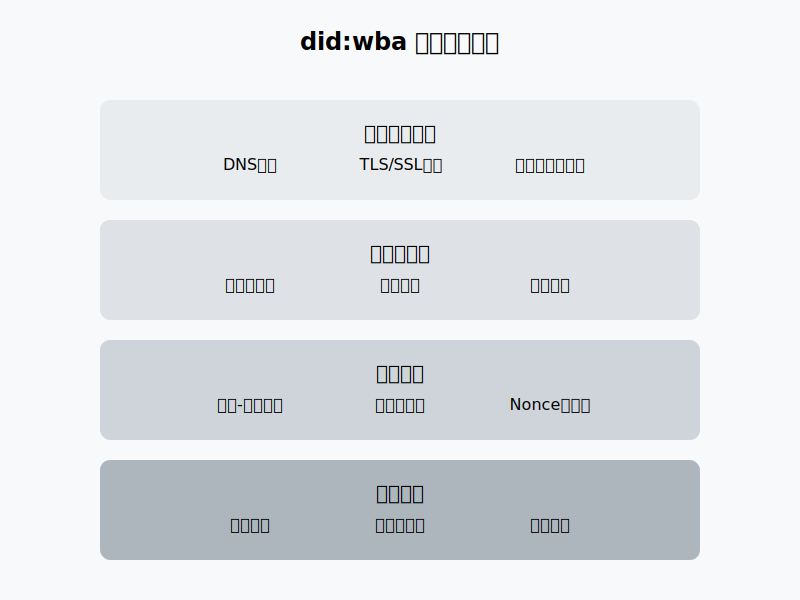
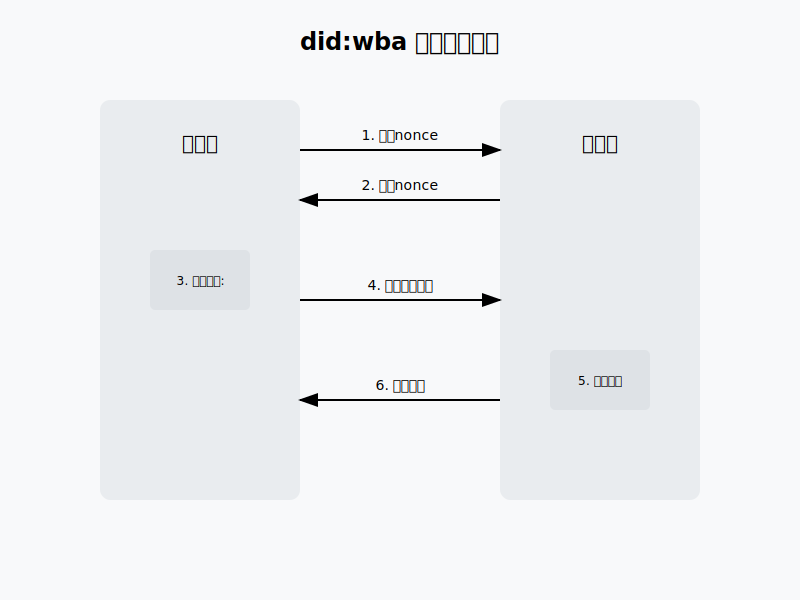
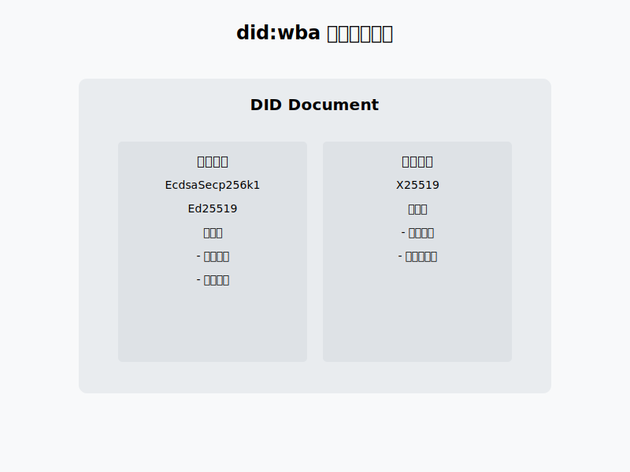

# did:wba的安全性原理

did:wba作为一种基于Web的去中心化标识符(DID)方法，其安全性设计贯穿了整个身份验证和通信过程。本文将深入分析did:wba的安全性原理。

## 1. 基础安全保障



### 1.1 域名和TLS/SSL证书

did:wba的第一层安全保障来自于域名系统(DNS)和TLS/SSL证书：

1. **域名所有权验证**: did:wba使用域名作为身份标识的基础。域名的所有权通过域名注册商的严格审核流程来保证，确保了身份的唯一性和可追溯性。

2. **TLS/SSL加密**: 所有的did:wba通信都必须基于HTTPS进行，通过TLS/SSL证书提供：
   - 通信加密：确保数据传输的机密性
   - 服务器身份验证：防止中间人攻击
   - 数据完整性：确保传输过程中数据不被篡改

### 1.2 密钥体系

did:wba采用了多层次的密钥体系来保障安全：

1. **验证密钥(VerificationMethod)**:
   - 支持多种密码学算法：EcdsaSecp256k1、Ed25519等
   - 用于身份验证和数字签名
   - 可以轮换和撤销，提高系统安全性

2. **密钥协商(KeyAgreement)**:
   - 使用X25519等算法进行安全的密钥协商
   - 支持端到端加密通信
   - 确保通信双方的隐私性

## 2. 身份验证流程的安全性



did:wba的身份验证流程采用了多重安全机制：

### 2.1 挑战-响应机制

1. **Nonce机制**:
   - 服务器生成随机nonce
   - 每个nonce只能使用一次
   - 防止重放攻击

2. **时间戳验证**:
   - 请求必须包含时间戳
   - 服务器验证时间戳的新鲜度
   - 防止历史请求重放

### 2.2 签名验证流程

1. **规范化处理**:
   - 使用JCS(JSON Canonicalization Scheme)对数据进行规范化
   - 确保签名数据的一致性和可重复性

2. **多层签名验证**:
   - 对规范化数据进行SHA-256哈希
   - 使用私钥对哈希值进行签名
   - 服务器通过公钥验证签名
   - 确保请求的真实性和不可否认性

## 3. 安全性的技术实现

### 3.1 DID文档的安全设计



```json
{
    "@context": [
      "https://www.w3.org/ns/did/v1",
      "https://w3id.org/security/suites/jws-2020/v1"
    ],
    "id": "did:wba:example.com:user:alice",
    "verificationMethod": [
      {
        "id": "#key-1",
        "type": "EcdsaSecp256k1VerificationKey2019",
        "controller": "did:wba:example.com:user:alice",
        "publicKeyJwk": {
          "crv": "secp256k1",
          "x": "...",
          "y": "...",
          "kty": "EC"
        }
      }
    ],
    "authentication": ["#key-1"],
    "keyAgreement": [
      {
        "id": "#key-2",
        "type": "X25519KeyAgreementKey2019",
        "controller": "did:wba:example.com:user:alice",
        "publicKeyMultibase": "z..."
      }
    ]
}
```

DID文档通过以下方式保障安全：

1. **密钥分离原则**:
   - 验证密钥和密钥协商密钥分离
   - 不同用途使用不同的密钥对
   - 降低密钥泄露的影响范围

2. **密钥格式标准化**:
   - 支持JWK和Multibase格式
   - 确保密钥的互操作性
   - 便于密钥的管理和更新

### 3.2 认证请求的安全处理

1. **请求头规范**:
```
Authorization: Bearer did:wba:example.com:user:alice?
  nonce=abc123&
  timestamp=2023-12-21T05:34:47Z&
  signature=xxx...
```

2. **验证流程**:
   - 检查时间戳有效性
   - 验证nonce未被使用
   - 获取DID文档中的公钥
   - 验证请求签名

## 4. 总结

did:wba的安全性建立在多个层面：

1. **基础设施安全**：
   - DNS系统
   - TLS/SSL加密
   - 域名所有权验证

2. **密码学安全**：
   - 非对称加密
   - 数字签名
   - 密钥协商

3. **协议安全**：
   - 挑战-响应机制
   - 时间戳验证
   - Nonce防重放

4. **实现安全**：
   - 密钥分离
   - 标准化处理
   - 严格的验证流程

通过这些多层次的安全机制，did:wba为智能体之间的身份认证和安全通信提供了可靠的保障。它不仅继承了Web PKI体系的安全特性，还通过现代密码学技术和严格的协议设计，确保了整个系统的安全性和可靠性。
