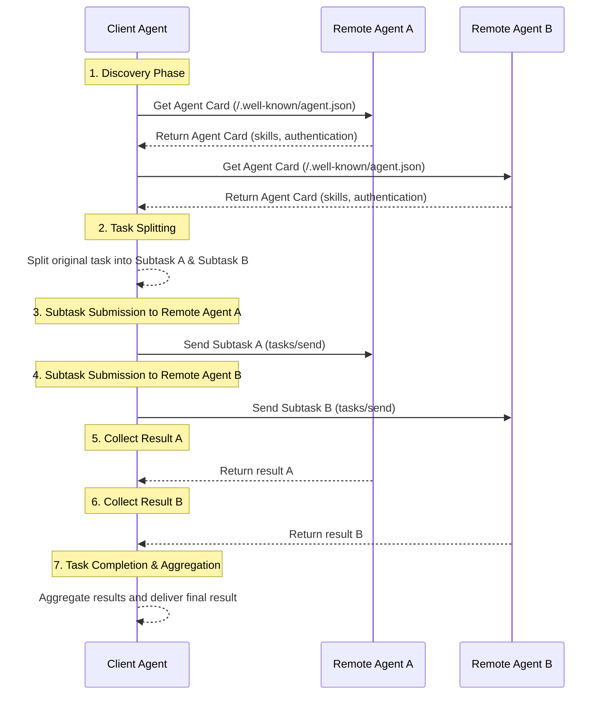

# 深入对比MCP、A2A、ANP的交互模式：信息组织方式的差异

这是MCP、A2A、ANP对比系列的第三篇文章，前面的两篇：
- [多角度全面对比Google最新的A2A、ANP、MCP](/blogs/cn/多角度全面对比Google最新的A2A、ANP、MCP.md)
- [深入对比谷歌A2A与ANP：找到协议的原点](/blogs/cn/深入对比谷歌A2A与ANP：找到协议的原点.md)

这篇文章将深入对比每个协议在交互模式上的差异，它们决定了一个工具或者智能体如何组织其信息，进而决定了信息处理的方式以及交互的特点。

**先说结论**：

- **MCP（远程调用）**：server直接向客户端公开全部工具与资源列表，客户端将这些信息传递给模型，模型根据需要通过RPC调用特定工具或访问特定资源。

- **A2A（任务分包）**：智能体对外展示自身的能力概述，客户端智能体将复杂任务分解成子任务，并将子任务分配给有相应专长的智能体执行，最终整合结果。

- **ANP（数据爬取）**：智能体将自身信息和接口组织为一个由URL链接的数据网络，客户端智能体如同网络爬虫一般，从描述文档入口开始，按需获取信息并在本地做决策，最后通过发现的接口执行操作。

**三者核心区别**：

- **A2A vs MCP**：A2A封装了实现细节，客户端只关心“做什么”而非“怎么做”，仅需提交任务并等待结果。

- **ANP vs MCP**：MCP一次性返回所有工具/资源，而ANP只提供分级链接和描述，允许智能体按需探索和获取信息。

- **ANP vs A2A**：两者都解决智能体交互，但A2A更注重复杂任务分解与协作，ANP更注重信息的灵活获取和本地决策，以降低隐私泄露风险。

ANP基于现代Web技术构建，支持ANP协议的智能体通常被称为WebAgent。

## MCP的交互方式

MCP 的交互模式采用经典的 客户端-服务器（C/S）架构。在初始请求中，会协商相互的能力，包括是否支持工具、资源等。

server一般都会支持两个核心的接口：tools/list和resources/list，客户端可以通过这两个接口获得所有的工具和资源的信息。这些信息包括元数据，即工具和资源的描述，用于让模型知道工具的能力以及如何调用，以及资源的详细信息。

模型根据需要，调用不同的工具，读取不同的资源。

以工具为例，交互如下：

这种交互模式下，Server作为被动的一方，被动提供工具与资源，决定权在客户端的模型。

## A2A的交互方式

A2A是一种灵活的P2P交互方式。在这种模式下，一个智能体（客户端Agent）可以直接与一个或多个其他智能体（远程Agent）对话协作，将一个大任务拆解为小任务，与其他智能体共同完成，类似于多个专业助手协同工作。

交互流程通常如下：
1.  **发现与选择**：客户端 Agent 首先需要发现并定位适合当前任务的远程 Agent。它可以查询多个 Agent 的“Agent Card”（智能体能力卡片）—— 这就像一份技能简历，列出了每个 Agent 擅长的能力和服务方式。客户端 Agent 根据任务需求，选择一个或多个最合适的远程 Agent。

2.  **任务拆分（可选）**：对于复杂任务，客户端 Agent 可以将其拆分成多个子任务。

3.  **任务分派与协作**：客户端 Agent 通过 A2A 协议与选定的远程 Agent 建立连接，并将相应的（子）任务请求发送给它们。例如，将子任务 A 发送给远程 Agent A，子任务 B 发送给远程 Agent B。

4.  **多轮交互与结果收集**：每个远程 Agent 独立执行分配给它的任务。在执行过程中，它们可以通过消息与客户端 Agent 进行多轮交互，反馈进展、提出澄清问题或返回中间结果。客户端 Agent 会分别接收来自不同远程 Agent 的反馈和结果。

5.  **结果聚合与完成**：所有子任务完成后，客户端 Agent 收集并整合来自各个远程 Agent 的结果，最终形成整个任务的完整解决方案。

整个沟通过程可以包含任务上下文和状态跟踪，确保围绕特定（子）任务的对话有序进行。

这种模式下，Client Agent和Remote Agent都会根据输入进行任务的处理，双方通过明确的任务描述和结果交互实现协作。

## ANP的交互方式

ANP（Agent Network Protocol）也是一种P2P的交互方式，目标同样是解决智能体之间的通信问题。与A2A有一个根本区别：

- A2A采用“任务分包”模式，智能体将任务拆分并分配给其他智能体执行
- ANP采用“数据爬取”模式，智能体只会获取其他智能体的信息，自己在本地做决策，再通过API调用执行操作

ANP的核心特点是使用“链接数据”（Linked Data）技术，将一个智能体的所有能力、接口和信息组织成一个可导航的数据网络。这与MCP直接返回所有工具和资源列表的方式不同。

### ANP交互流程

ANP交互过程就像网络爬虫浏览网页：

1. **入口发现**：智能体首先获取另一个智能体的“智能体描述文档”的URL（类似网站的首页）

2. **能力发现**：从描述文档中，智能体了解到对方的技能、接口和可用资源，以及更详细文档的URL链接

3. **选择性获取**：智能体根据当前任务的需要，只访问那些相关的URL，获取必要的信息（而不是所有信息）

4. **递归导航**：每个文档又可能包含新的URL链接，智能体可以根据需要继续导航和拉取

5. **本地决策**：收集足够信息后，智能体在自己的模型中进行逻辑判断和决策

6. **接口调用**：最后通过找到的API接口执行具体操作

这种方式的优势是智能体只获取它真正需要的信息，节省数据传输，并保持决策控制权在自己手中。

## 信息组织方式的差异

上面描述的交互方式的差异，本质上是每个协议在智能体对外公开信息的组织方式不同：

- **MCP（全部公开）**：通过RPC调用的方式，一次性公开全部工具和资源列表，客户端智能体可直接选择并调用所需的工具

- **A2A（能力卡片）**：通过Agent Card展示智能体的技能和能力概述，不透露具体实现细节，客户端只需要提交任务并等待结果

- **ANP（链接网络）**：使用Linked-Data技术将智能体的信息组织成网状结构，客户端智能体可以像网络爬虫一样，按需选择性地获取特定信息

