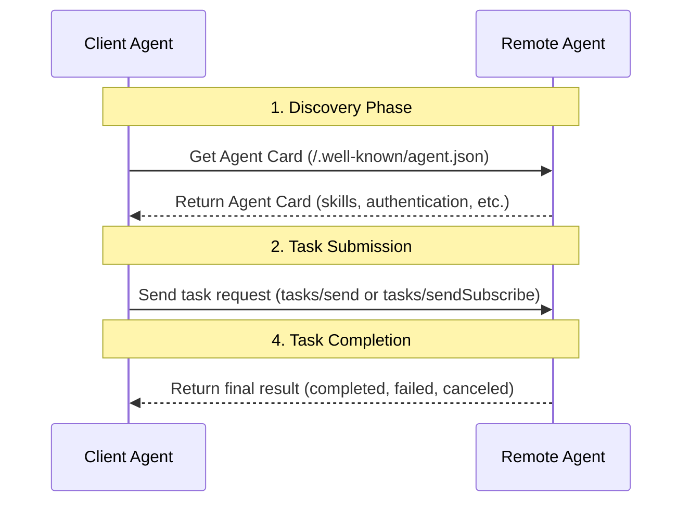
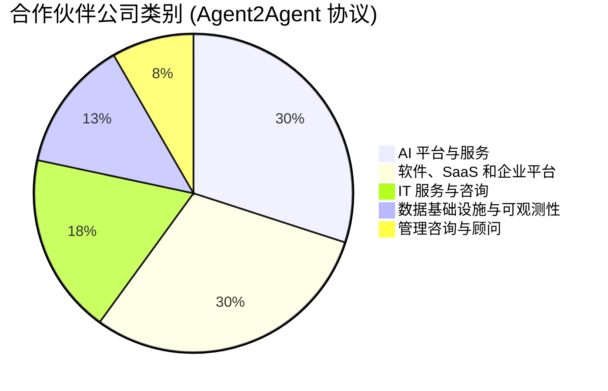

# 深入对比谷歌A2A与ANP：找到协议的原点

谷歌的A2A协议出来后，很多关注ANP社区的朋友第一时间发来消息，问对我们影响大不大，并且给我们献言献策，再次感谢。

我认为A2A对ANP最大的影响是，有了谷歌的“盖章“Follow：ANP的路线是对的，ANP看的很长远，我也来了 ：）。我不用再去解释为什么智能体通信协作重要了。

当天我花了半天的时候研究，写了一篇文章：[多角度全面对比Google最新的A2A、ANP、MCP](/blogs/cn/多角度全面对比Google最新的A2A、ANP、MCP.md)。

后来又花了一天的时间仔细研究了A2A，与ANP做了一个深度的对比，我认为我应该找到了A2A的原点，我也看到了A2A与ANP的更深层次的差异。

一句话总结：
- MCP的原点是：**模型与工具、资源的连接**
- A2A的原点是：**企业内部智能体之间的复杂协作**
- ANP的原点是：**智能体在互联网上的连接与协作**

## 技术层面的差异对比

虽然说A2A和ANP都是解决智能体通信与协作，但是从技术层面，A2A与ANP还是有很大的差异。

### 智能体描述与信息组织

在协议设计中，一个智能体如何对另外一个智能体暴露其信息，是一个关键的问题。

在智能体描述方面，A2A使用了一个名为Agent Card的JSON格式的文档，用于描述智能体的能力、技能、身份认证方法等，Agent Card的核心是技能（skill），表达智能体能够干什么事情，比如能够进行地图路径规划等。

ANP也是用的JSON，不过基于JSON-LD（Linked Data）和schema.org描述智能体信息（基本信息、身份验证、对外产品/服务、交互Interface），这是语义网的技术，目的是提高两个智能体对信息理解的一致性，以及让智能体的公开信息能够链接成一个数据网络，智能体描述文件是网络的入口：


比如，一个酒店智能体，使用ANP，可以将酒店的房间、设施、服务、交互接口等信息（包括图片）描述出来，并且链接成一个数据网络，让其他智能体能够爬取并且理解。

这也导致，在智能体的交互上，A2A与ANP有非常大的差异：
- A2A通过Agent Card描述智能体的技能（skills），其他智能体获取skills，然后通过JSON-RPC发送一个任务请求，任务使用自然语言描述，并且携带任务需要的相关信息。任务完成后返回结果。



- ANP则是通过智能体描述文档（Agent Description），将智能体对外提供的产品、服务、交互接口等信息用URL连接到一起，另外一个智能体像一个网络爬虫，通过URL不断的爬取自己需要的信息。这个过程中可以通过自然语言接口与智能体进行交互，也可以通过结构化接口与智能体进行交互。


这里的核心差异：
- **A2A是智能体对外公开自己的技能，另外一个智能体发送处理任务过来，处理完成后返回结果。**
- **ANP是智能体对外公开自己信息（包含交互接口），其他智能体爬取信息进行处理，必要的时候通过自然语言接口或结构化接口与智能体进行交互**

### 智能体发现

在智能体的发现上A2A的方案和ANP基本是一样的，都是在域名的.well-known目录下增加一个元数据文档，A2A的文件名是agent.json，ANP的文件名是agent-descriptions。

同时也都支持智能体主动注册到私有注册表，这个在局域网中的协作是非常有必要的。

不同的地方在于，A2A是直接将Agent Card内容放到.well-known/agent.json中，而ANP则是在.well-known/agent-descriptions中存放智能体描述文件的URL。

A2A目前看起来是一个域名一个Agent Card（还要进一步确认），ANP则是一个域名可以有很多个智能体。

### 身份验证

在身份验证上，A2A和ANP有所不同。

A2A 智能体在 A2A 协议中并不交换身份信息。相反，它们通过带外方式获取认证材料（如 token），并通过 HTTP 头部传递这些材料。

所谓的带外，是指通过A2A之外的其他协议获取认证材料。A2A 遵循 OpenAPI 的身份认证规范进行身份认证，支持包括 HTTP Basic Auth、API Key、OAuth 2.0等多种认证方式，具体由每个智能体在其 Agent Card 中声明。


ANP则基于W3C DID技术构建去中心化的身份认证，在协议中直接携带身份信息，包括身份验证信息。智能体使用自己的身份就能够和其他所有的智能体进行交互，不需要带外获得身份验证材料。

不过，在某些场景中，带外获取身份验证材料是必要的，特别是在企业级应用中。ANP未来会支持带外身份验证材料的获取，设计上预留了扩展性。


**核心差异：**
- A2A 采用带外获取身份验证材料，是为了最大程度兼容美国主流企业应用生态的安全合规要求，复用现有的企业身份认证体系，确保协议本身轻量、灵活且安全。核心是为了解决企业级应用的身份问题，并且没有解决互联网上智能体互联互通的身份问题。

- ANP则是未来解决智能体在互联网上如何进行身份认证的问题，核心是让互联网上任意两个智能体都能够互联互通，这需要一个互操作性更好的身份认证方案。

### 核心概念

A2A与ANP在协议的核心概念上有很大差异。

**A2A的核心概念**包括Skill（技能）、Task（任务）、Artifact（产物）、Message（消息）、Part（部分）。

同时，Task又定义了多种状态，包括：submitted（已提交）、working（处理中）、input-required（需要输入）、completed（完成）、canceled（取消）、failed（失败）、unknown（未知）。

Task也定义了一些操作，包括：Send（发送）、Get（获取）、Cancel（取消）等，以及一些通知相关的操作。

**ANP的核心概念**包括描述信息与接口（Interface）。

描述信息主要是JSON-LD格式的文档，以及JSON-LD文档中通过URL链接到的其他资源，包括图片、音频、视频等多媒体文件。

Interface又分为自然语言接口（Natural Language Interface）和结构化接口（Structured Interface）。结构化接口支持现有大部分的规范，比如OpenAPI、JSON-RPC等。

**核心差异：**
- A2A在协议层面定义了详细的任务协作概念，包括任务的状态、操作等，这有助于解决智能体之间复杂任务的协作问题。缺点是会导致两个智能体之间的耦合度较高。

- ANP简化了智能体之间的交互，降低了智能体之间的耦合度，在跨平台的智能体协作场景下有较大的优势。缺点是原生协议不支持复杂任务协作，需要自己定义Interface来实现。

## A2A与ANP的原点

要想真正的理解一个协议的设计，必须找到这个协议的原点。

比如，ANP的原点一直都是**智能体在互联网上的连接与协作**。MCP的原点一直都是**模型与工具、资源的连接**，构建更好的智能体。

通过上面的技术分析，我们可以确认A2A的原点是：**企业内部智能体之间的复杂协作**。

协议的官网并没有明确的说出这一点，但是谷歌的新闻发布稿中有提到过一些：

```
AI 智能体为人们带来了独特的机会，能够通过自主处理许多日常重复性或复杂任务，帮助提升工作效率。如今，企业越来越多地构建并部署自主智能体，以帮助在整个工作场景中实现规模化、自动化并优化各类流程——从订购新笔记本电脑，到辅助客户服务代表，再到协助供应链规划。（https://developers.googleblog.com/en/a2a-a-new-era-of-agent-interoperability/）
```

从A2A生态企业的分布也大概可以看出这一点，大部分都是AI平台与服务、软件、SaaS和企业平台。




从技术上看，目前A2A的实现也不大适合智能体互联网的需求。

以个人助手使用A2A去酒店智能体预订房间为例，按照目前A2A的实现，个人助手需要发送一个任务，用自然语言描述用户的要求（价格、房型、时间等）信息，酒店智能体处理后返回任务执行信息。在中间可能要经过多次的任务交互、任务状态的迁移等。

这会有两个问题：一个是用户的隐私可能会被泄露，因为个人助手要将任务发送给另外一个智能体执行；另外一个就是交互耦合度过高。

ANP的逻辑则是个人助手爬取酒店智能体的信息在本地进行处理，需要交互的时候才调用酒店智能体的接口。这是本质的区别。当然，除此之外A2A还有智能体在互联网上的身份互联互通问题没有解决。

不过，也不排除未来A2A通过协议升级扩展到智能体互联网的场景。

## 未来智能体协议的一些预判

短期内MCP成为模型连接工具和资源的事实标准，这个基本上已经确定，目前很难有第二个MCP出现。

中长期来看，我认为有一个趋势大概率会发生：**工具智能体化，智能体工具化**。如果这个趋势发生，那么智能体协议会挤压MCP的空间。

更长期来看，AGI实现后，也许人类设计的协议是AI的束缚而非助力，AI有办法自己设计协议并达成共识。

不过，在当下智能体协议是非常重要的，它是智能体的重要拼图，也是智能体与互联网交互最AI原生的方式，是比Computer Use、Browser Use，甚至AI浏览器都更高效的连接方式。

无论如何，**ANP最有价值的部分，是社区对未来智能体互联网的设想，是社区独特的互联网理念（连接即权力），以及DID+语义网的技术路线。这是支撑ANP走下去的核心动力**。

## 关于创新

A2A出来之后看着"炸裂、一夜变天、颠覆"这些标题心情复杂，特别是我们做ANP做了一年，也推广了很长时间。

我们都在说，我们需要"0到1"的创新——我们不单需要创新者，也需要媒体能够去发现这些创新者。

最后感谢开源社区的每一位贡献者和开发者，现在已经有40多位开发者了。

也感谢公众号、社区对我们的支持，包括RTE开发者社区、OSC开源社区、Founder Park、觉察流、侯宏文存、AIGCLink、智能体AI等等（可能不全），还有很多给我们提供分享机会的组织，以及为社区提供服务器资源的AWS和阿里云。

