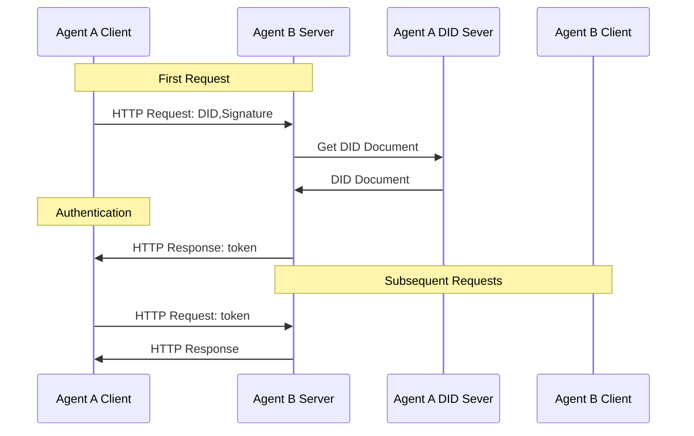

## did:wba, a Web-based Decentralized Identifier

### 1. Introduction
did:wba is a Web-based Decentralized Identifier (DID) specification designed to support cross-platform authentication and agent communication.

The did:wba method leverages existing mature technologies and Web infrastructure to implement decentralized authentication without requiring a complete overhaul of existing systems. Platforms can maintain their centralized account systems while issuing did:wba DIDs to users, enabling interoperability between platforms.

Similar to email, did:wba allows platforms to maintain their centralized account systems while enabling cross-platform communication and interoperability.

### 2. Cross-Platform Authentication

did:wba can be integrated with HTTP protocol to complete identity authentication, permission verification, and data exchange in a single HTTP request without additional interactions. Below is the interaction flow of did:wba with HTTP protocol:

- Prerequisites: User creates a DID and stores the DID document on Agent A's DID server. The DID is also configured on Agent B's server with appropriate permissions.
- Agent A, as the client, initiates an HTTP request containing the DID and signature along with the request data.
- Agent B, as the server, extracts the DID and signature from the request headers.
- Agent B retrieves the DID document from Agent A's DID server using the DID.
- Agent B verifies the client's signature using the public key from the DID document.
- Upon successful verification, Agent B processes the client's business request and returns both business data and a token.
- Agent A includes the token in subsequent requests, and Agent B authenticates the client by validating the token.

### 3. Use Cases

1. Use Case 1: User Accessing Files on Other Websites via AI Assistant

Alice has stored a file on example.com and wants to access it through an AI assistant. She first creates a did:wba-based DID on the AI assistant, logs into example.com, associates this DID with her account, and grants file access permissions to the DID. After setup, the AI assistant can log into example.com using this DID, and upon authentication, example.com allows the AI assistant to access Alice's stored files. This DID can be configured on other websites to enable the AI assistant to access files across different platforms.

2. Use Case 2: User Calling Third-Party API Services via AI Assistant

Alice wants to call APIs of a third-party service named "example" through an AI assistant. She first creates a did:wba-based DID on the AI assistant and uses it to subscribe to services on the example platform. The example service authenticates using the DID, confirms Alice as the purchaser, and records her DID. After authentication, Alice can use this DID through the AI assistant to call example service's APIs.

> While client-to-server authentication is not detailed in the current use cases, this process is also functional.

### 4. Code

We are currently under development and expect to complete it next week.

### 5. References

[did:wba Method Specification](https://github.com/chgaowei/AgentNetworkProtocol/blob/main/03-did%3Awba%20Method%20Design%20Specification.md)

[DID-CORE](https://www.w3.org/TR/did-core/)

[AgentNetworkProtocol Technical White Paper](https://github.com/chgaowei/AgentNetworkProtocol/blob/main/01-AgentNetworkProtocol%20Technical%20White%20Paper.md)

