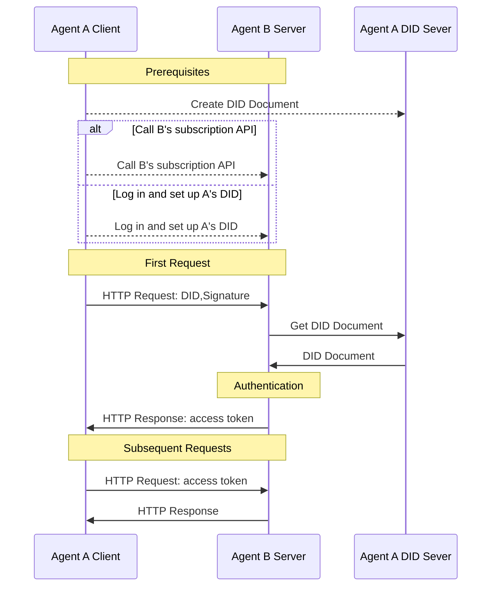

# did:wba - A Web-based Decentralized Identifier

## 1. Introduction

The did:wba method is a draft method specification under the W3C Decentralized Identifiers (DIDs) standard. The [W3C DIDs](https://www.w3.org/TR/did-core/) standard, published as a W3C Recommendation in 2022, is a new type of identifier that enables verifiable, decentralized digital identity. Based on DIDs, users can truly control their own identity while improving interoperability between different applications. DIDs have been widely adopted by many applications, including Bluesky.

The core component of a DID is the DID Document, which contains key information related to a specific DID, such as public keys used to verify the identity of the DID owner. The DID method defines how to create, store, update, and revoke DID documents.

We have designed a [did:wba method](/03-did:wba%20Method%20Design%20Specification.md). The did:wba method can fully utilize existing mature technologies and Web infrastructure to easily implement decentralized identity authentication without requiring a complete reconstruction of existing systems. Platforms can manage their account systems in a centralized way while creating did:wba DIDs for each user to achieve interconnection between platforms.

Identity systems using the did:wba method can achieve business characteristics similar to email, where each platform implements its own account system in a centralized manner while enabling interconnection between platforms.

Compared to API keys, the did:wba method offers superior security; compared to OpenID Connect, the did:wba method features simpler interactions and greater decentralization. For a detailed comparison, please refer to [did:wba vs OpenID Connect and API keys](/blogs/Comparison%20of%20did:wba%20with%20OpenID%20Connect%20and%20API%20keys.md).

The did:wba method also provides security equivalent to OpenID Connect, as explained in [did:wba Security Principle Analysis](/blogs/did:wba-security-principles.md).

## 2. DID Document

Using the did:wba method, a basic DID document looks like this:

```json
{
    "@context": [
      "https://www.w3.org/ns/did/v1",
      "https://w3id.org/security/suites/jws-2020/v1",
      "https://w3id.org/security/suites/secp256k1-2019/v1",
      "https://w3id.org/security/suites/ed25519-2020/v1",
      "https://w3id.org/security/suites/x25519-2019/v1"
    ],
    "id": "did:wba:example.com%3A8800:user:alice",
    "verificationMethod": [
      {
        "id": "did:wba:example.com%3A8800:user:alice#WjKgJV7VRw3hmgU6--4v15c0Aewbcvat1BsRFTIqa5Q",
        "type": "EcdsaSecp256k1VerificationKey2019",
        "controller": "did:wba:example.com%3A8800:user:alice",
        "publicKeyJwk": {
          "crv": "secp256k1",
          "x": "NtngWpJUr-rlNNbs0u-Aa8e16OwSJu6UiFf0Rdo1oJ4",
          "y": "qN1jKupJlFsPFc1UkWinqljv4YE0mq_Ickwnjgasvmo",
          "kty": "EC",
          "kid": "WjKgJV7VRw3hmgU6--4v15c0Aewbcvat1BsRFTIqa5Q"
        }
      }
    ],
    "authentication": [
      "did:wba:example.com%3A8800:user:alice#WjKgJV7VRw3hmgU6--4v15c0Aewbcvat1BsRFTIqa5Q",
      {
        "id": "did:wba:example.com%3A8800:user:alice#key-1",
        "type": "Ed25519VerificationKey2020",
        "controller": "did:wba:example.com%3A8800:user:alice",
        "publicKeyMultibase": "zH3C2AVvLMv6gmMNam3uVAjZpfkcJCwDwnZn6z3wXmqPV"
      }
    ],
    "keyAgreement": [
      {
        "id": "did:wba:example.com%3A8800:user:alice#key-2",
        "type": "X25519KeyAgreementKey2019", 
        "controller": "did:wba:example.com%3A8800:user:alice",
        "publicKeyMultibase": "z9hFgmPVfmBZwRvFEyniQDBkz9LmV7gDEqytWyGZLmDXE"
      }
    ]
}
```

The public keys in the authentication section are used for identity verification. This means that as long as the other party can securely obtain the correct DID document, they can obtain the correct public key. They can then use the public key to verify the user's signature, thereby verifying the user's identity.

The creation, update, and revocation of DID documents are decided by the users themselves. For example, users can choose to store their DID documents on their own servers or on third-party servers. Regardless of where it is stored, users must maintain control over their DID documents.

Additionally, users need to provide an HTTP method for others to securely obtain their DID documents. The HTTP address for obtaining the DID document can be derived from the DID. In other words, once a user has a DID, the corresponding DID document can be obtained via HTTP. The conversion method is as follows:

```plaintext
Example:
did:wba:example.com:user:alice
 -> https://example.com/user/alice/did.json
```

## 3. Cross-Platform Identity Authentication Process

did:wba can be used in conjunction with the HTTP protocol to complete identity authentication, permission verification, and data exchange in a single HTTP request without adding extra interactions. Below is the interaction flow of did:wba combined with the HTTP protocol:



1. Prerequisites:
  - User A creates a DID and stores the DID document on Agent A's DID server.
  - Agent B needs to know Agent A's DID, which can be achieved in one of two ways:
    - User A logs into Agent B's system and sets up A's DID.
    - Or call Agent B's subscription API and set the subscription DID to A's DID. **This approach can greatly reduce the connection cost between two agents.**

2. Identity Authentication Process:
  - Agent A, as the client, initiates an HTTP request containing DID, nonce, timestamp, signature, and other information in addition to the request data.
  - Agent B, as the server, receives the request and extracts the DID, nonce, timestamp, signature, and other information from the request header.
  - Agent B retrieves the DID document from Agent A's DID server using the DID.
  - Agent B verifies the client's signature using the public key from the DID document.
  - After verification passes, Agent B processes the client's business request and returns both the business data and a token.
  - Agent A includes the token in subsequent requests, and Agent B completes client authentication by verifying the token.


From the entire process, we can see that using HTTP, did:wba can complete identity authentication without increasing the number of interactions. It also enables two agents (or applications) to directly call each other's subscription interfaces to subscribe to services during mutual communication, without requiring manual registration in each other's systems. This reduces the barriers to interconnection between agents.

## 4. Use Cases

1. Use Case 1: User Accessing Files on Other Websites Through an Intelligent Assistant

Alice has stored a file on example.com, and later she wants to access it through an intelligent assistant. To do this, Alice first creates a DID based on the did:wba method on the intelligent assistant, logs into example.com, associates this DID with her account, and grants the DID permission to access the file. After setup is complete, the intelligent assistant can use this DID to log into example.com, and after identity verification, example.com allows the intelligent assistant to access Alice's stored file. This DID can also be configured on other websites to allow the intelligent assistant to access files on different platforms.

2. Use Case 2: User Calling Third-Party Platform Service APIs Through an Intelligent Assistant

Alice wants to call a third-party service API named "example" through an intelligent assistant. First, Alice creates a DID based on the did:wba method on the intelligent assistant and uses this DID to call the API interface to subscribe to relevant services on the example platform. The example service completes identity authentication through the DID, confirms that the purchaser is Alice, and records her DID. After authentication is complete, Alice can use this DID through the intelligent assistant to call example service's APIs for operations.

> While client-to-server authentication is not illustrated in the current use case, this process can indeed work.

## 5. Code

We have completed development and open-sourced it. For details, please refer to: [https://github.com/chgaowei/AgentConnect/blob/master/README.md#decentralized-authentication-based-on-didwba-and-http](https://github.com/chgaowei/AgentConnect/blob/master/README.md#decentralized-authentication-based-on-didwba-and-http)

## 6. References

[did:wba Method Specification](https://github.com/chgaowei/AgentNetworkProtocol/blob/main/english/03-did-wba-method-specification.md)

[DID-CORE](https://www.w3.org/TR/did-core/)

[AgentNetworkProtocol Technical White Paper](https://github.com/chgaowei/AgentNetworkProtocol/blob/main/english/01-AgentNetworkProtocol-technical-white-paper.md)
