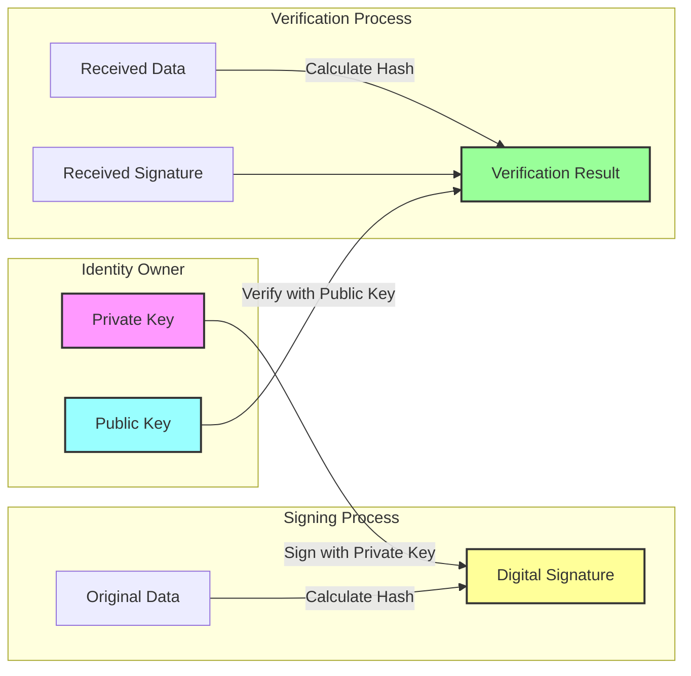
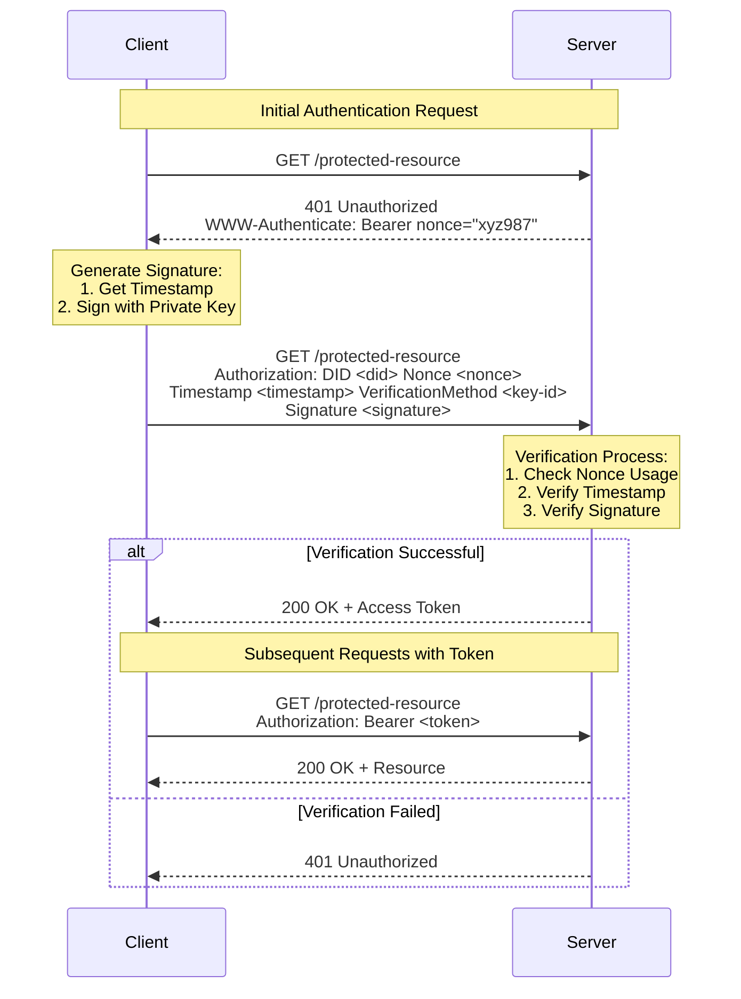

# Security Principles of did:wba

did:wba, as a Web-based Decentralized Identifier method, has security at its core. This article delves into the security principles of did:wba and analyzes how it ensures reliable and secure identity verification.

Related did:wba resources:
- did:wba Specification: [did:wba Specification](https://github.com/chgaowei/AgentNetworkProtocol/blob/main/03-did%3Awba%20Method%20Design%20Specification.md)
- A brief introduction to did:wba: [did:wba - Web-based Decentralized Identifier](https://github.com/chgaowei/AgentNetworkProtocol/blob/main/blogs/did%3Awba%2C%20a%20Web-based%20Decentralized%20Identifier.md)
- Comparison between did:wba and other solutions: [did:wba vs OpenID Connect and API keys](https://github.com/chgaowei/AgentNetworkProtocol/blob/main/blogs/Comparison%20of%20did%3Awba%20with%20OpenID%20Connect%20and%20API%20keys.md)

## 1. Foundation of Security: Asymmetric Encryption

The security of did:wba is primarily built on asymmetric encryption. This encryption method uses a key pair:

- Private Key: Held only by the identity owner, used for signing
- Public Key: Can be publicly shared, used for signature verification



This encryption mechanism ensures:
1. Only the private key holder can generate valid signatures. The private key must remain confidential.
2. Anyone can verify signature authenticity using the public key. A successful verification confirms the signature was generated by the private key holder.
3. The private key cannot be derived from the public key. The key pair is generated together, but the public key cannot reveal the private key.

## 2. DID Document Security Assurance

From the above process, two key points ensure did:wba's security:

1. Private key confidentiality must be maintained.
2. Verifiers must obtain the correct public key.

In did:wba, users maintain their private keys, while public keys are contained in the DID Document. The DID Document is stored on the user's DID server and can be accessed by anyone through a URL generated from the DID using the HTTPS protocol.

Fundamentally, as long as users can obtain the correct DID Document, they can verify the other party's identity. In did:wba, we recommend users use DNS-over-HTTPS for domain resolution, access DID Documents via HTTPS, employ secure encryption algorithms, and implement strict certificate validation.

## 3. Identity Verification Process Security

did:wba's identity verification process incorporates multiple security mechanisms:

### 3.1 Request Signing Mechanism

Each authentication request contains:
```
Authorization: DID <did> Nonce <nonce> Timestamp <timestamp> VerificationMethod <key-id> Signature <signature>
```

Components include:
- Nonce: Random number preventing replay attacks
- Timestamp: Ensures request timeliness
- Signature: Signs critical information

### 3.2 Security Measures

1. **Replay Attack Prevention**:
   - Unique nonce generation for each request
   - Single-use nonce policy
   - Server-maintained blacklist of used nonces

2. **Timestamp Validation**:
   - Limited request validity window
   - Prevention of historical request replay
   - Server-side timestamp reasonability check

3. **Domain Validation**:
   - Server domain inclusion in signature data
   - Prevention of signature reuse across services

4. **Signature Verification**:
   - Signature integrity verification
   - Authorized key usage confirmation
   


## 4. Additional Security Considerations

### 4.1 Private Key Compromise

In case of private key compromise, users should promptly generate a new key pair and update their DID Document. Since the DID Document is stored on the user's DID server, updates can be made immediately.

### 4.2 Regular Key Rotation

Private keys should be rotated regularly to maintain security.

## Conclusion

did:wba's security is founded on modern cryptography, utilizing asymmetric encryption, secure DID Document storage and verification processes, and regular private key rotation to ensure reliable and secure identity verification.

Its fundamental principle remains rooted in the robust security of asymmetric encryption. At the infrastructure level, it relies on existing mature systems like DNS, Public Key Infrastructure, and HTTPS protocols rather than introducing new infrastructure. 