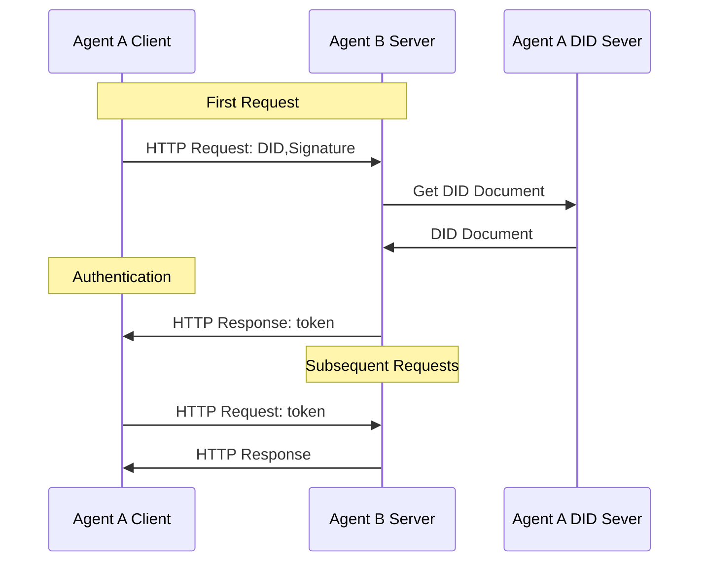

### 1. 介绍
did:wba 是一种基于Web的去中心化标识符（DID）规范，旨在支持跨平台身份认证和智能体通信。

did:wba 方法能够充分利用现有的成熟技术和Web基础设施，在不需要彻底重构现有系统的情况下，轻松实现去中心化身份认证。各平台可以使用中心化方式管理自己的账户体系，同时为每个用户申请did:wba DID，以此实现平台之间的互联互通。

使用did:wba，可以实现类似email的特点，各个平台以中心化的方式实现自己的账户体系，同时，各个平台之间可以互联互通。

### 2. 跨平台身份认证

did:wba可以和HTTP协议结合使用，在一个HTTP请求中，完成身份认证、权限认证、数据交换等操作。不增加额外的交互次数。下面是did:wba和HTTP协议结合的交互流程：

- 前置条件：用户创建DID，并且将DID文档保存在Agent A 的DID server上。同时将DID配置到Agent B server中，并设置权限。
- Agent A作为客户端发起HTTP请求，请求中除了请求数据外，还携带DID和签名。
- Agent B作为server收到请求后，从请求头中提取DID和签名。
- Agent B根据DID从Agent A的DID server中读取DID文档。
- Agent B使用DID文档中的公钥对客户端的签名进行验证。
- 验证通过后，Agent B处理客户端的业务请求，返回业务数据的同时，返回token。
- Agent A在后续请求中携带token，Agent B通过对token的验证，完成对客户端的身份认证。

### 3. 用例

1. 用例 1：用户通过智能助理访问其他网站上的文件

Alice在example.com网站上存储了一个文件，后来她希望通过智能助理访问该文件。为此，Alice首先在智能助理上创建了一个基于did:wba方法的DID，并登录到example.com，将这个DID与自己的账户关联，并授予DID访问文件的权限。完成设置后，智能助理就可以使用该DID登录example.com，经过身份验证后，example.com允许智能助理访问Alice存储的文件。这个DID也可以配置到其他网站，以便智能助理访问不同平台上的文件。

2. 用例 2：用户通过智能助理调用其他平台服务的API

Alice希望通过智能助理调用一个名为example的第三方服务API。首先，Alice在智能助理上创建了一个基于did:wba方法的DID，并使用该DID订购了example平台的相关服务。example服务通过DID完成身份认证，确认购买者是Alice，并记录下她的DID。认证通过后，Alice便可以通过智能助理使用该DID调用example服务的API进行操作。

> 当前用例中并未列举客户端对服务端的身份认证，事实上这个流程也是可以工作的。

### 4. 代码

我们目前正在开发中，预计下周完成。

### 5. 参考文献

[did:wba Method Specification](https://github.com/chgaowei/AgentNetworkProtocol/blob/main/chinese/03-did%3Awba%E6%96%B9%E6%B3%95%E8%A7%84%E8%8C%83.md)

[DID-CORE](https://www.w3.org/TR/did-core/)

[AgentNetworkProtocol Technical White Paper](https://github.com/chgaowei/AgentNetworkProtocol/blob/main/chinese/01-AgentNetworkProtocol%E6%8A%80%E6%9C%AF%E7%99%BD%E7%9A%AE%E4%B9%A6.md)
