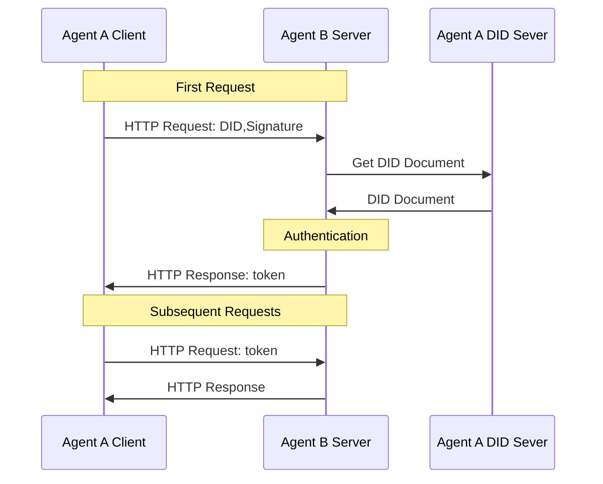

# Agent Network Protocol技术白皮书：

## 摘要  

随着大模型和自主决策AI的发展，智能体（Agent）正迅速成为继移动App之后互联网的新型主体。然而，现有互联网基础设施主要面向人类交互设计，存在数据孤岛、接口不友好、智能体协作成本高等问题，难以支撑智能体规模化互联与协作的需求。互联网正经历深刻变革，呈现出智能体取代传统软件、智能体普遍互联互通、基于原生协议连接、智能体自主组织协作四大核心趋势。

为顺应这一趋势，Agent Network Protocol（ANP）提出了面向智能体互联网的新一代通信协议。ANP坚持AI原生设计，兼容并复用现有互联网协议，采用模块化可组合架构，遵循极简而可扩展的原则，并基于现有基础设施实现快速部署。通过三层协议体系——身份与加密通信层、元协议协商层、应用协议层，ANP系统性地解决了智能体身份认证、动态协商及能力发现互操作问题。

在应用层，ANP通过智能体描述协议（ADP）和智能体发现协议，构建了一个面向AI友好的原生数据网络，使智能体能够以结构化方式开放能力、互联互通。安全与隐私设计方面，ANP引入人类授权与智能体授权区分机制，支持多DID隐私保护策略，并推行最小信息披露和端到端加密通信，保障用户与智能体在开放网络环境下的自主性与数据安全。

展望未来，ANP致力于打破数字孤岛，推动互联网从封闭平台生态回归到以开放协议为核心的协作网络。它秉持“连接即力量”的设计哲学，通过促进高质量、低摩擦的智能体连接与协作，释放集体智能的巨大潜力。ANP不仅是一套通信标准，更代表着智能体互联网时代重塑开放性、公平性与创新活力的重要基础设施。我们诚邀全球开发者、研究者与组织，共同参与ANP生态建设，共创智能体驱动的全新互联网未来。

## 1. 前言

### 1.1 背景与问题

随着大模型和自主决策AI的发展，智能体正成为继移动App之后互联网的新型主体。智能体有望替代现有软件，成为互联网的重要组成部分。然而，当下互联网的技术基础和连接范式难以满足智能体的需求，主要体现在以下方面：

- **数据孤岛与上下文受限**：智能体需要整合全面的上下文信息以做出决策，但当前各互联网平台间互不连通，数据被隔离在不同的应用和服务器中。这种数据孤岛现象限制了智能体获取完整信息，难以发挥其智能决策优势。

- **接口不友好（非原生）**：现有互联网应用主要面向人类，通过GUI提供服务，智能体若要利用现有人类界面，需要模拟人类操作，效率低且易出错。智能体更擅长直接使用API或通信协议与数字世界交互，因此需要为智能体提供原生的数据接口，减少信息处理中介，提高交互效率。

- **协作成本高**：目前不同智能体彼此隔离，缺乏直接通信机制。虽然大型语言模型使智能体具备了用自然语言协商的能力，但缺少标准协议支撑，自组织协作仍困难重重。如果任意智能体之间能够直接通信并自主协商，将构建比现有互联网更低成本、更高效率的协作网络。

### 1.2 智能体互联网的四大趋势

基于以上分析，我们认为互联网正经历着以智能体为核心的新一轮深刻变革。这种变革体现在以下四个关键趋势中。

#### 1.2.1 智能体将全面取代传统软件

未来，智能体将逐渐替代现有的软件应用，成为互联网的重要基础设施。在个人层面，AI助手将取代绝大部分现有的APP，成为用户进入互联网的主要入口。相比传统APP，个人AI助手在信息整合、决策辅助及场景交互的体验上可实现数量级的提升。在企业层面，企业将通过部署智能体，直接与用户在互联网上进行连接和互动，提供精准、高效的服务。同时，以个人助手与企业智能体之间的点对点、去平台化连接模式为代表，一种全新的连接范式正在形成。

#### 1.2.2 智能体之间实现普遍互联互通

智能体互联网的第二个核心趋势是实现任意智能体之间的自由连接，这将彻底打破当前互联网的数据孤岛格局，实现信息的自由流动。全面互联的智能体网络，使AI能够充分获取跨领域、跨平台的完整上下文信息，从而帮助个人与企业作出更全面、更精准的决策。同时，这种开放连接模式允许智能体调用全网所有工具能力，极大扩展了智能体的协作深度和复杂度，智能体间的交互也因此将成为未来互联网中最为主流的连接方式。

#### 1.2.3 智能体基于协议的原生连接模式

当前，AI与互联网的交互方式主要是通过浏览器或软件界面等以人为中心设计的方式（Computer Use / Browser Use）。然而，这些方式仅是暂时过渡方案，并不能充分释放AI自身的潜力。AI本质上更擅长直接处理底层的结构化数据与语义信息，而非人类界面和网页HTML。因此，我们认为，未来智能体之间必将通过专为AI原生设计的通信协议（Protocol）进行连接，这种协议将类似HTTP一样广泛应用，成为行业标准。以此协议为基础，一个专门面向AI设计、更易于智能体访问和操作的全新数据网络也将随之诞生。

#### 1.2.4 智能体可自主组织和协作

智能体互联网的第四个核心趋势是智能体具备自主组织与协作的能力。通过标准协议支持，智能体能够利用自然语言进行灵活的自动协商，快速明确彼此需求并动态形成协作关系，共同完成复杂任务。这种无需固定结构化接口的协作模式，大幅提升了网络运行效率和任务响应能力，并显著降低了人工介入和沟通成本。由此，一个高度灵活、高效运行、低成本的智能体网络将逐渐形成。

鉴于上述趋势，我们迫切需要新的通信协议来支撑智能体互联网的发展。Agent Network Protocol（ANP）正是在此背景下提出，旨在为智能体提供开放统一的连接机制，解决互联互通、原生接口和高效协作这三大难题，从而释放AI智能体的全部潜能。

## 2. 设计核心原则

Agent Network Protocol（ANP）从一开始就以智能体互联网的需求为核心，力求构建一个开放、灵活、可落地的智能体通信标准。其设计遵循以下核心原则：

### 2.1 AI原生设计（AI-Native Design）

ANP不是为人机交互设计的协议（如HTML或GUI界面），而是为AI智能体之间直接通信而原生设计。它强调结构化数据、语义表达和自然语言结合，使智能体能够无需模拟人类操作，即可理解、发现、协作。

目标：让智能体以最高效、最自然的方式接入互联网世界，释放AI决策与行动的潜力。

### 2.2 兼容与复用（Compatibility and Reuse）

ANP尊重并兼容已有广泛应用的互联网协议标准，如OpenAPI、JSON-RPC、音视频协议（如WebRTC）等。在不重复造轮子的前提下，ANP通过轻量的元协议和描述标准，将这些已有协议封装到智能体可理解和协商使用的语义框架中。

目标：在确保创新的同时，最大程度降低学习成本和迁移门槛，促进现有生态快速接入智能体互联网。

### 2.3 可组合性（Composability）

ANP采用模块化设计，核心组件如智能体身份（DID）、智能体描述（ADP）、智能体发现可以单独使用或自由组合。开发者可以根据实际需求，灵活选择使用某一个协议组件或完整集成。

目标：支持不同复杂度、不同阶段的应用场景，从最小可用单元到大规模系统都能按需适配。

### 2.4 简单可扩展（Simplicity and Extensibility）

ANP遵循极简主义原则（Keep It Simple），设计初期就力求协议本身简洁直观，降低理解和实现门槛。同时，保留充分的扩展接口和灵活的Schema机制，支持未来智能体生态演进中新功能的自然叠加。

目标：保持核心协议小而稳定，同时为多样化应用需求预留成长空间。

### 2.5 基于现有基础设施可实施性（Pragmatic Deployability）

ANP在设计时充分考虑实际部署的可行性，尽量基于现有互联网基础设施（如DNS、HTTPS、Web服务器、DID系统）运行，不依赖复杂或难以普及的新技术或专有组件。任何开发者或企业可以快速搭建支持ANP的智能体服务。

目标：降低初期部署门槛，推动协议在真实世界中快速试点、应用与推广。

## 3. 协议核心设计

### 3.1 协议分层设计

我们设计了一个由三层组成的协议架构，如下图所示：

  

ANP协议架构自下而上分为三层，各自承担不同的核心职能：

1. 身份与加密通信层（Identity and Secure Communication Layer）

此层定义智能体之间身份认证与加密通信的基础标准，解决跨平台身份互认与端到端加密通信问题。

ANP基于W3C DID标准，设计了轻量、可扩展的去中心化身份认证机制（如 did:wba 方法），确保任意两个智能体能够在无需中心化机构介入的前提下，安全验证彼此身份并建立私密、可靠的加密通信通道。

2. 元协议层（Meta-Protocol Layer）

该层定义智能体如何基于自然语言协商进行通信协议的动态协定与适配。

通过自然语言交换需求、能力与协作意图，智能体可灵活地协商出适合双方当前场景的通信细节（如请求格式、接口调用方式、会话管理策略等），实现高度适应性的协议联调与运行时优化。

3. 应用协议层（Application Protocol Layer）

该层有两个核心模块，分别是智能体描述、智能体发现。智能体通过结构化的描述文档（如ADP智能体描述协议）公开自身功能与接口，并基于发现协议主动或被动暴露服务入口。

### 3.2 身份与加密通信层

为了实现所有智能体之间的互联互通，首要任务是解决智能体之间的身份认证问题。当前，互联网应用大多采用中心化身份技术，不同技术实现导致系统间的账户难以相互认证。尽管 OAuth2.0 技术在一定程度上缓解了这一问题[^2]，但由于 OAuth2.0 并非专为跨系统身份认证设计，其流程相对复杂，且在去中心化方面存在局限。因此，亟需一种便捷、跨平台且去中心化的身份认证技术。

基于区块链的去中心化身份认证方案虽然提供了可能的解决途径，但由于区块链在大规模应用中面临扩展性挑战，目前尚未成为最优解决方案。

针对上述问题，我们引入了 W3C 的去中心化标识符标准（Decentralized Identifier，DID）[^3]。DID 是一种新型标识符标准，旨在解决传统中心化身份管理系统的依赖性。它使用户能够掌握自己的身份并进行相互认证，无需依赖中心化系统。DID 核心规范未限定实现者必须采用特定的计算基础设施来构建去中心化标识符，这使我们能够充分利用现有的成熟技术和完善的 Web 基础设施来构建 DID。此外，各种类型的标识符系统都可以添加对 DID 的支持，从而在集中式、联合式和去中心化标识符系统之间架起互操作的桥梁。这意味着现有的中心化标识符系统无需彻底重构，只需在其基础上创建 DID，即可实现跨系统互操作，从而大大降低了技术实施的难度。

  

DID 的核心组件是 DID 文档，其中包含与特定 DID 相关的关键信息，用于验证 DID 所有者的身份，并支持对 DID 相关的操作、权限和访问控制进行管理。

  

在身份验证过程中，DID 文档包含用于验证用户身份的方法和相应的公钥（私钥由用户自行保管）。客户端可以在首次HTTP请求时，在HTTP头中携带DID和签名。在不增加交互次数的情况下，服务端可以使用DID文档中的公钥快速验证客户端的身份。首次验证通过后，服务端可以返回token，客户端后续请求中携带token，服务端不用每次验证客户端的身份，而只要验证token即可。整个过程的核心在于验证者使用可信的公钥对用户签名信息进行验证，并且能够在一次请求中完成身份认证、权限认证、数据交换等操作，流程简洁高效。

DID 方法定义了如何创建、解析、更新和停用 DID 与 DID 文档，以及如何进行身份验证和授权。在现有的 DID 方法草案中，`did:web` 方法[^5] 基于成熟的 Web 技术构建，允许系统使用中心化技术（如云计算）来创建、更新、停用 DID 和 DID 文档。不同系统之间通过 HTTP 协议实现互操作，其效果类似于互联网的emai服务，各个平台以中心化的方式实现自己的账户体系，同时，各个平台之间可以互联互通。

基于 `did:web` 方法，我们针对智能体通信的场景，添加了跨平台身份认证流程和智能体描述服务等规范，提出了一种新的 DID 方法——`did:wba`（Web-Based Agent）。`did:wba` 方法继承了 `did:web` 的优势，进一步优化了智能体间的身份认证机制，提升了在智能体网络中的适用性。

此外，用户通常为 DID 创建一个或多个公私钥对，这些密钥对不仅用于身份验证，还可用于端到端加密通信。基于 DID 的公私钥对，我们采用椭圆曲线 Diffie-Hellman 临时密钥交换协议（Elliptic Curve Diffie-Hellman Ephemeral，ECDHE）[^6]，设计了一种端到端加密通信方案，实现了两个 DID 之间的安全通信，确保中间节点无法解密通信内容。端到端加密可以用于智能体的反向代理，比如，一个智能体未来降低运营成本，可以租用三方平台的端口作为对外服务端口，三方平台转发智能体的消息，但是无法解密消息内容。

### 3.3 元协议层

元协议（Meta-Protocol）是一种定义通信协议操作、解析、组合和交互规则的协议。本质上，它是用于协商通信协议的协议，不直接处理具体的数据传输，而是提供一个灵活、通用且可扩展的通信框架。

目前，智能体之间的通信主要有两种方法：

1. **人类工程师设计通信协议**：例如常见的行业标准。人类工程师为智能体设计通信协议，开发协议代码，进行调试、测试和部署。然而，这种方法往往面临开发成本高、协议更新迭代慢、难以适应新场景等问题。

2. **智能体直接使用自然语言通信**：智能体之间使用自然语言进行通信，内部利用大型语言模型（LLM）处理自然语言数据。但这种方法存在数据处理成本高、处理准确率低等问题。

为了解决上述问题，可以使用元协议和AI代码生成的方案。通过使用元协议并利用AI代码生成技术，能够显著提高智能体之间的通信效率，降低通信成本，同时保持通信的灵活性和个性化[^7]。

使用元协议进行通信的基本过程如下：

1. **元协议请求**：智能体A首先向智能体B发送一个元协议请求。请求主体使用自然语言描述自己的需求、输入、期望获得的输出，并提出候选通信协议。候选通信协议一般包括传输层协议、数据格式、数据处理方式等。

2. **协议协商**：智能体B收到元协议请求后，利用AI处理请求中的自然语言描述，并结合自身能力，判断是否接受A的请求和候选协议。如果B的能力无法满足A的请求，则直接拒绝；如果B不接受A的候选协议，则可以提出自己的候选协议，进入下一轮协商。协商过程持续，直到双方达成一致或协商失败为止。

3. **代码生成与部署**：双方达成一致后，各自根据协商的协议生成协议处理代码，并进行部署。

4. **联调测试**：代码部署完毕后，双方协商联调的测试数据，对协议以及AI生成的协议处理代码进行联调和测试。

5. **正式通信**：联调完成后，协议正式上线。之后，智能体A和智能体B开始使用最终协商的协议进行通信，并利用AI生成的代码处理数据。

6. **需求变更处理**：如果需求发生变化，则重复上述过程，直到双方再次协商一致。

  

然而，元协议协商过程耗时较长，且依赖于AI代码生成能力。如果每次通信都进行元协议协商，将会带来巨大的成本消耗和较差的交互体验。鉴于智能体之间存在大量相同或类似的通信过程，智能体可以将元协议协商的结果保存下来。后续遇到类似需求时，可以直接使用之前的协商结果作为正式协议进行通信，或作为候选协议进行协商。同时，智能体也可以分享协商结果，供其他智能体查询和使用。

如何在经济层面激励智能体主动上传协商结果，并选取智能体之间的共识协议，是元协议层仍需深入研究的问题。

### 3.4 应用协议层

应用协议层有两个核心模块，分别是智能体描述和智能体发现。

#### 3.4.1 智能体描述（Agent Description Protocol，ADP）

智能体描述协议（Agent Description Protocol, ADP）为每个智能体提供了标准化的自我描述方式。ADP 基于 JSON-LD（基于 JSON 的链接数据格式）编写描述文档，采用 schema.org 提供的通用词汇扩展，并结合ANP自定义词汇，为智能体定义统一的元数据格式。一个智能体描述（AD）文档相当于该智能体在网络世界的名片或简介，其他智能体可通过读取此文档了解如何与之交互。

智能体描述文档通常包含以下关键信息：

- **基本信息**：智能体名称、唯一标识符、所属主体（个人、组织或其他智能体）等标识性元数据。
- **能力描述**：智能体提供的功能、产品或服务清单，以及对应的说明。例如，它是否是一个聊天助手、数据分析服务，抑或具备机器人执行能力等。
- **接口与协议**：与该智能体交互的方法，包括可调用的API端点、支持的通信协议版本或规范。其它智能体据此知道如何向其发出请求或消息。
- **安全与授权**：智能体的身份验证方式和权限要求。例如采用何种DID标识及公钥，用于验证其身份。ADP规范推荐使用did:wba方法作为统一的安全机制，满足跨平台身份认证需求。
- **联络信息**：可选的技术支持或联系渠道（如服务端点URL、维护者联系email等），便于在自动交互之外进行人工介入或调试。

上述信息以 JSON-LD 文档形式结构化呈现，使智能体描述既能被机器解析，又保留丰富的语义含义。通过 JSON-LD 的上下文，AD文档中的词汇可链接到公开的本体定义，实现不同系统间语义一致。例如，ADP定义了诸如"Agent"（智能体）、"Service"（服务）、"Interface"（接口）等核心词汇，其含义对所有遵循该规范的智能体都是统一的。这为智能体之间理解彼此的能力提供了基础。

值得一提的是，ADP 将去中心化身份融入描述文档的安全架构中。每个智能体描述可绑定一个DID，自带验证方法和公钥信息，用于鉴别智能体身份。当其他智能体读取该描述并与之通信时，可通过验证 DID 签名来确认对方身份可信，从而在开放网络中建立安全连接。这种设计确保了智能体互信，为进一步合作奠定基础。

最后，智能体描述文档是智能体在智能体网络中的入口点，类似网站的首页，其他智能体通过读取智能体描述文档了解如何与之交互。

#### 3.4.2 智能体发现协议 

有了智能体描述，还需要一种机制让智能体彼此发现存在、建立连接。智能体发现协议（Agent Discovery Protocol）就是为此而设计的标准协议。智能体发现协议规定了如何在网络中发布和检索智能体描述文档，使任何智能体或搜索服务都能够方便地找到其它智能体的入口。本质上，智能体发现协议充当智能体的"搜索引擎协议"，确保智能体互联网中的节点可见可达。

智能体发现协议 提供了两种互补的发现方式：

1. **主动发现（Active Discovery）**：基于 Web 常见的.well-known路径约定，允许通过已知域名查询该域名下公开的所有智能体描述列表。具体而言，在一个互联网域名下保留统一的目录入口（默认路径为/.well-known/agent-descriptions），访问该URL将返回包含该域名下所有智能体AD文档URL的JSON-LD清单。清单文档类型为CollectionPage，列举了每个智能体描述文档的链接地址，可分页呈现以支持海量智能体。借助主动发现机制，任意智能体只需知道对方的域名，即可获取其下的智能体目录，从而逐级遍历整个智能体网络。

2. **被动发现（Passive Discovery）**：类似于搜索引擎收录网页，智能体可以主动将自身的信息提交给专门的搜索服务型智能体。具体做法是由搜索服务提供一个注册API接口（在其智能体描述中公开说明），其他智能体调用该接口提交自己的AD文档URL进行注册。搜索服务收到注册请求后，将定期抓取该URL获取最新的智能体描述，并将其索引到数据库中。当有智能体或用户查询相关服务时，搜索服务即可返回已注册的智能体信息。通过被动发现，新的智能体能够宣告其存在，让索引服务收录自己，从而被更多节点找到。

这两种机制相辅相成：主动发现侧重于利用分布式的域名目录公开智能体列表，被动发现则引入集中化的搜索代理来汇总索引。所有发现信息同样采用JSON-LD格式表示，与ADP规范保持一致。无论通过哪种途径获取，发现的结果最终指向的是各智能体的描述文档。

借助智能体发现协议，ANP确保了智能体网络的开放性：新加入的智能体不会默默无闻地成为信息孤岛，只要遵循协议发布或注册了描述文档，就能在网络中被检索到。这为大规模智能体生态的形成提供了基础支持。

值得注意的是，智能体发现协议还规定了结果分页、链接的标准方法，以便高效管理海量智能体信息。当某一域名下智能体数量很多时，.well-known/agent-descriptions文档可通过next字段链接后续页，实现逐页加载。搜索服务在返回查询结果时亦可采用类似分页机制。这些细节保证了发现过程的可扩展性和健壮性。

通过智能体描述协议和发现协议的配合，ANP在应用层实现了一个闭环：智能体使用ADP来描述自我，使用智能体发现协议来曝光自身并发现他人。这套机制正是解决了智能体互联网中"如何互识对方"的难题，满足了前文所述智能体互联互通的需求。结合安全的身份层和灵活的元协议层，ANP为智能体之间建立开放、高效、可信的连接提供了完整方案。

### 3.5 AI原生的数据网络

现有的互联网基础设施，是为人类访问而设计的。网页通过超链接（HTML+HTTP）连接，信息以页面、表单、图像等视觉界面形式呈现，主要服务于人类浏览与操作。然而，这种以人类为中心的连接方式，并不适合AI智能体的高效访问和处理。AI要使用现有互联网，需要模拟人类行为（点击、浏览、解析网页），这极大限制了智能体的能力发挥。

为了解决这一问题，Agent Network Protocol（ANP）提出了一套面向AI原生设计的数据网络结构。通过智能体描述协议（ADP）和智能体发现协议，每个智能体能够以结构化、标准化的方式公开自身的服务接口、能力信息与数据资源，并通过开放发现机制，自动暴露到整个智能体网络中。

在这一框架下，所有智能体及其承载的数据资源（如文本、API、音视频、图像等）形成了一个面向机器友好的开放网络：

- 每个节点都是可描述、可发现、可调用的智能体或数据单元。
- 每个链接都是语义明确、结构统一的协议连接，而非仅供人阅读的超文本。
- 智能体能够基于统一标准快速检索、理解并调用其他智能体提供的资源与服务。

这一AI原生数据网络，使得智能体无需依赖网页爬取或界面模拟，而是可以直接、高效、批量地访问互联网中广泛分布的能力与知识，极大释放了AI自主学习、推理与协作的潜力。

随着越来越多的个人智能体、服务智能体和搜索智能体通过ANP接入，这张以智能体为节点、以结构化数据为连接的网络将不断壮大，最终形成一个覆盖全球、动态演化的智能体互联网。

## 4. 安全与隐私

在智能体互联网中，安全与隐私保护是基础性且不可妥协的要求。Agent Network Protocol（ANP）在设计之初，就将**身份认证安全、操作授权区分、隐私保护与细粒度权限控制**作为核心机制加以支持，确保智能体在开放网络环境下也能实现可信通信与数据安全共享。

本节将从身份与授权管理、隐私保护机制、通信过程安全三个方面，系统阐述ANP的安全与隐私设计。

### 4.1 人类授权与智能体授权的区分

为实现敏感操作的人类可控性，ANP在DID文档中引入了专门的验证方法 `humanAuthorization`。  
- **低风险操作**（如查询公开信息、浏览数据等）允许智能体基于自主密钥进行自动授权，无需人类介入。  
- **高风险操作**（如资金转账、重要数据提交、隐私信息泄露等）必须由人类用户显式授权。

在执行高风险请求时，用户智能体需要使用`humanAuthorization`方法进行签名。这一过程要求智能体首先向人类用户发起授权请求，经用户明确确认（例如通过生物识别、密码验证或硬件安全模块确认）后，方可调用与该方法绑定的私钥进行签名和提交。

该机制有效确保了**重要决策操作的最后一跳必须由人类意志主导**，防止智能体被滥用或在不知情情况下执行高风险指令。

### 4.2 私钥管理与权限隔离

智能体开发者需对各类密钥，尤其是`humanAuthorization`密钥，实施严格的权限隔离与安全管理，包括但不限于：

- **分级管理**：将普通请求密钥与高敏感密钥分离，分别保管与使用。
- **本地加密存储**：私钥应存储于安全加密的本地设备（如TEE、HSM）或受保护的密钥管理系统中。
- **动态验证**：访问高敏感私钥时需附加动态验证（如指纹、人脸识别、一次性密码等）。
- **操作日志记录**：每一次敏感签名操作需记录完整的操作日志，便于事后审计与追踪。

通过上述机制，可以最大限度防止密钥泄露、被盗用或被滥用的风险。

### 4.3 多DID策略与细粒度隐私保护

为增强隐私保护与匿名性，ANP推荐用户和智能体采用**多DID管理策略**。具体做法包括：

- **主DID与子DID分离**：主DID用于维持长期社交关系（如朋友、企业合作伙伴），而针对不同应用场景（如电商购物、外卖订餐、在线服务等），生成独立子DID。
- **最小权限原则**：每个子DID仅赋予完成特定任务所必需的最小权限与角色。
- **定期轮换与失效**：子DID应设定生命周期，使用后定期废弃并重新申请，防止跨场景追踪与身份关联攻击。

通过多DID体系，可以有效实现身份与行为的隔离，降低用户在大规模数据分析下的隐私暴露风险，同时提高整体身份安全性。

### 4.4 最小信息披露与通信隐私

在智能体之间的通信过程中，ANP强调遵循**最小信息披露原则（Minimal Disclosure Principle）**：

- 智能体在完成请求时，仅传输必要的信息字段，避免无关数据泄露。
- 敏感字段应采用端到端加密传输，即使通信链路被截获，也无法泄露数据内容。
- 所有通信会话应绑定相应的身份验证信息，防止中间人攻击与伪造通信。

此外，ANP鼓励在应用层进一步采用匿名通信技术（如可验证加密、选择性披露凭证等），加强对隐私数据的保护与访问控制。

## 5. 未来展望：通过连接重塑开放网络

互联网的发展历程深刻印证了一个核心理念：“连接即力量（Connection is Power）” 。在一个真正开放、互联的网络中，节点间的自由交互能够最大限度地激发创新潜力并创造巨大价值 。然而，当前的互联网生态系统正日益被少数大型平台所主导，海量的数据和服务被禁锢在封闭的“数字孤岛”之中 ，使得连接的权力高度集中在少数科技巨头手中 。   

智能体互联网时代的到来，为我们提供了一个历史性的契机，去重塑这种不平衡的格局。我们的目标是推动互联网从当前普遍存在的封闭、碎片化的状态，回归其开放、自由连接的本源 。在未来的智能体互联网络中，每一个智能体都将同时扮演信息消费者和服务提供者的双重角色。更重要的是，每一个节点都应能够无障碍地发现、连接并与网络中的任何其他节点进行交互。这种全域互联的愿景将极大地降低信息流动和协作的门槛，使连接的权力真正回归到每一个用户和智能体个体手中 。   

这标志着一个重要的转变：从以平台为中心的封闭生态系统，转向以协议为中心的开放生态系统。在后者中，价值的获取更多地依赖于参与者通过遵循开放协议为网络带来的独特能力和贡献，而不是依赖于对某个封闭平台的控制权。这种转变将激发更激烈的应用层创新和竞争，因为成功的关键不再是“锁定”用户，而是提供最优越的智能体服务，这与开放协议（如TCP/IP、SMTP）历史上促进的创新模式类似 。  

智能体互联网络的建设是一项宏伟的事业，需要广泛的协作和共同的努力。ANP作为一个基础性的协议框架，其成功依赖于开发者社区的采纳、实现和持续贡献。我们邀请所有对智能体技术、开放互联网未来感兴趣的研究者、开发者、企业和组织，共同参与到ANP的开发、测试和应用推广中来，携手共筑智能体高效协作的美好未来。

## 参考文献

[^1]: Bill Gates, AI is about to completely change how you use computers, [https://www.gatesnotes.com/AI-agents](https://www.gatesnotes.com/AI-agents)

[^2]: The OAuth 2.0 Authorization Framework, [https://tools.ietf.org/html/rfc6749](https://tools.ietf.org/html/rfc6749)

[^3]: Decentralized Identifiers (DIDs) v1.0:Core architecture, data model, and representations[https://www.w3.org/TR/did-core/](https://www.w3.org/TR/did-core/)

[^4]: Use Cases and Requirements for Decentralized Identifiers [https://www.w3.org/TR/did-use-cases/](https://www.w3.org/TR/did-use-cases/)

[^5]: did:web Method Specification, [https://w3c-ccg.github.io/did-method-web/](https://w3c-ccg.github.io/did-method-web/)

[^6]: The Transport Layer Security (TLS) Protocol Version 1.3，[https://www.rfc-editor.org/rfc/rfc8446.html](https://www.rfc-editor.org/rfc/rfc8446.html)

[^7]: A Scalable Communication Protocol for Networks of Large Language Models, [https://arxiv.org/pdf/2410.11905](https://arxiv.org/pdf/2410.11905)

## 版权声明  
Copyright (c) 2024 GaoWei Chang  
本文件依据 [MIT 许可证](./LICENSE) 发布，您可以自由使用和修改，但必须保留本版权声明。  
