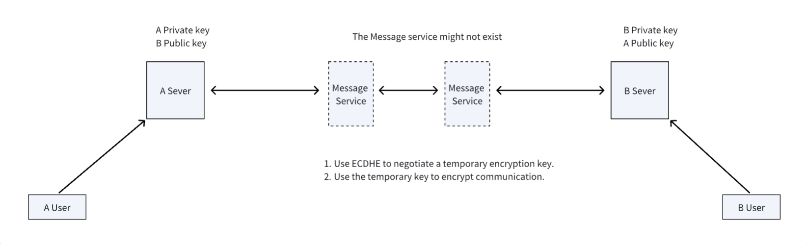

# 基于did:all方法的端到端加密通信技术协议

## 1. 背景

端到端加密通信（End-to-End Encryption，简称E2EE）是一种加密通信方法，确保信息在发送端和接收端之间的传输过程中保持加密状态，从而防止第三方（包括网络服务提供商、中间人攻击者以及服务器本身）访问未授权的明文内容。

在[AgentNetworkProtocol技术白皮书](01-AgentNetworkProtocol技术白皮书.md)一文中，我们提出了一种基于DID的端到端加密通信技术，本文我们详细介绍下技术的实现细节。

## 2. 方案概述

该方案借鉴了TLS、区块链等已经在实践中得到检验的高安全性技术，对这些技术进行组合，设计了一个基于DID的端到端加密通信方案，可以用于两个不同平台之间的用户进行安全加密通信。

我们基于WSS协议之上设计了一套基于DID的消息路由机制以及短期密钥协商机制，持有DID的双方可以使用DID文档中的公钥与自己的私钥，使用ECDHE（Elliptic Curve Diffie-Hellman Ephemeral）进行短期密钥协商，之后在密钥有效期内使用密钥加密消息实现安全通信。ECDHE能够保证消息即便经过三方消息代理等中间人转发，也无法被恶意破解。

整体流程如下图：



备注：三方的Message service可能不存在，用户可以使用自己的消息服务。

我们第一个版本基于WSS设计端到端加密方案，主要的考虑是WSS在互联网中应用非常广泛，有非常多可用的基础设施，能够降低用户的接入成本，这对方案的早期推广至关重要。

后面我们会推出传输层（基于TCP or UDP）的端到端加密方案，因为基于WSS的一个问题是消息可能会被加解密两次，WSS内部已经包含了一次TLS加解密。

## 3. 加密通信流程

假如有两个平台的用户，一个是A（DID-A），一个是B（DID-B），A和B都可以通过DID SERVER获得对方的DID文档，did文档中，包含各自的公钥。

A和B要进行加密通信，首先需要发起创建短期密钥流程。创建短期密钥的过程和TLS生产临时加密密钥的过程类似，这个密钥有一个有效期，在邻近失效前，需要再次发起创建短期密钥流程，生成新的密钥并更新。

当A和B持有协商后的短期密钥后，如果A想发送消息给B，可以用密钥对消息进行加密，然后使用消息发送协议，通过message server发送给B。B收到后，根据消息中的密钥ID，找到之前存储的短期密钥，然后对加密消息进行解密。如果未找到对应的密钥，或者密钥已经过期，则发送错误消息，通知A发起更新短期密钥流程，短期密钥更新后，再次发送消息。

```plaintext
Client (A)                                      Client (B)
|                                                 |
| -- Initiate Short-term Key Creation Process --> |
|                                                 |
|      (Create Temporary Encryption Key)          |
|                                                 |
| <---- Temporary Key Created ----                |
|                                                 |
|       (Key has an expiration time)              |
|                                                 |
|      (Monitor Key Validity)                     |
|                                                 |
|   (Before expiration, restart creation process) |
|                                                 |
| (A and B now have a negotiated short-term key)  |
|                                                 |
| ---- Encrypted Message ---->                    |
|                                                 |
|     (Encrypt message using short-term key)      |
|     (Send via message server)                   |
|                                                 |
| <---- Receive Encrypted Message ----            |
|                                                 |
|     (Find stored key using key ID)              |
|     (Decrypt message)                           |
|      (If key not found or expired)              |
|                                                 |
| <---- or Error Message ----                     |
|                                                 |
|      (Notify A to update short-term key)        |
|                                                 |
```

## 4. 短期密钥协商过程

短期密钥创建过程和TLS1.3中交换加密密钥过程基本类似，使用ECDHE（Elliptic Curve Diffie-Hellman Ephemeral），一种基于椭圆曲线的密钥交换协议，属于Diffie-Hellman密钥交换协议的一个变种。它结合了椭圆曲线密码学（ECC）和临时密钥（Ephemeral Key），用于在不安全的网络上安全地交换加密密钥，从而实现安全通信。

ECDHE过程简要描述：

1. 密钥对生成：
  - 客户端和服务器各自生成一个临时的椭圆曲线密钥对，包括一个私钥和一个公钥。

2. 公钥交换：
  - 客户端将其生成的公钥发送给服务器。
  - 服务器将其生成的公钥发送给客户端。

3. 共享密钥计算：
  - 客户端使用自己的私钥和服务器发送的公钥计算共享密钥。
  - 服务器使用自己的私钥和客户端发送的公钥计算共享密钥。
  - 由于椭圆曲线Diffie-Hellman算法的性质，这两个计算结果是相同的共享密钥。

我们的流程与TLS过程的不同：

- 整个流程只有三个个消息，SourceHello、DestinationHello、Finished，分别对应TLS的ClientHello和SeverHello、Finished。因为在我们的流程中，没有客户端和服务端，只有源和目的。

- 其他消息的比如EncryptedExtensions、Certificate、CertificateVerify都不需要。其中：
  - EncryptedExtensions暂时不要，后面可能会添加，用来传递加密扩展。
  - Certificate、CertificateVerify不需要。因为这两个消息的主要目的是保证服务端的公钥是安全的，我们通过DID地址和公钥的对应关系来验证DID对应公钥的正确性，即一个公钥确定，那它有且只有一个DID；一个DID确定，那它有且只有一个公钥。

- Finished不再对握手消息进行哈希和加密，因为SourceHello和DestinationHello中已经包含了各自的签名，能够保证消息的完整性。

- Source和Destination之间可以同时发起多个短期密钥协商，同一时间可以存在多个密钥，用于不同类型的消息加密中。

整体流程图如下：
```plaintext
Client (A)                                          Server (B)
   |                                                    |
   |  ---------------- SourceHello ---------------->    |
   |                                                    |
   |                  (包含公钥和签名)                    |
   |                                                    |
   |                                                    |
   |  <------------- DestinationHello ------------      |
   |                                                    |
   |                  (包含公钥和签名)                    |
   |                                                    |
   |                                                    |
   |  -------- Finished (包含verify_data) ------->       |
   |                                                    |
   |  <-------- Finished (包含verify_data) --------      |
   |                                                    |
   |                                                    |
```

## 5. 协议定义

我们的协议基于WSS设计，json格式。一个DID用户的消息接收地址在DID文档保存，字段"service"中类型为messageService的端点。(参见DID all方法设计规范)

### 5.1 SourceHello消息

SourceHello 消息用于发起加密通信握手，包含源的身份信息、公钥、支持的加密参数、会话ID、版本信息以及消息的签名，以确保消息的完整性和身份验证。

消息示例
```json
{
  "version": "1.0",
  "type": "sourceHello",
  "timestamp": "2024-05-27T12:00:00.123Z",
  "messageId": "randomstring",
  "sessionId": "abc123session",
  "sourceDid": "did:example:123456789abcdefghi",
  "destinationDid": "did:example:987654321abcdefghi",
  "verificationMethod": {
    "id": "did:example:987654321abcdefghi#keys-1",
    "type": "EcdsaSecp256r1VerificationKey2019",
    "publicKeyHex": "04a34b4c8d2e48f37a6c6c6f6d7b7a6e4b4d5f6c4e4f7a6b4c8d2e48f37a6c6c6f6d7b7a6e4b4d5f6c4e4f7a6"
  },
  "random": "b7e4b4d5f6c4e4f7a6b4c8d2e48f37a6c6c6f6d7b7a6e4b4d5f6c4e4f7a6b4c8d2e48f37a6c6c6f6d7b7a6e4b4d5f6c4e4f7a6",
  "supportedVersions": ["1.0", "0.9"],
  "cipherSuites": [
    "TLS_AES_128_GCM_SHA256",
    "TLS_AES_256_GCM_SHA384",
    "TLS_CHACHA20_POLY1305_SHA256"
  ],
  "supportedGroups": [
    "secp256r1",
    "secp384r1",
    "secp521r1"
  ],
  "keyShares": [
    {
      "group": "secp256r1",
      "expires": 864000,
      "keyExchange": "0488b21e000000000000000000000000000000000000000000000000000000000000000000000000000000000000000000000000000000000000000000000000000000"
    },
    {
      "group": "secp384r1",
      "expires": 864000,
      "keyExchange": "0488b21e000000000000000000000000000000000000000000000000000000000000000000000000000000000000000000000000000000000000000000000000000000"
    }
  ],
  "proof": {
    "type": "EcdsaSecp256r1Signature2019",
    "created": "2024-05-27T10:51:55Z",
    "verificationMethod": "did:example:987654321abcdefghi#keys-1",
    "proofValue": "eyJhbGciOiJFUzI1NksifQ..myEaggpdg0-GflPHibRZWfDEdDOqzZzBcBM5TKvaUzCUSv1_7anUvtgdFXMd12E_qM6RmAAaSWWBGwLY-Srvyg"
  }
}
```

#### 5.1.1 字段说明

- version：字符串，当前协议使用的版本号。
- type：字符串，消息类型，例如 "SourceHello"。
- timestamp：消息发送时间，ISO 8601格式的UTC时间字符串，精确到毫秒
-  messageId: 消息唯一id，16位随机字符串
- sessionId：字符串，会话id，16位随机字符串，在一次短期会话协商中有效
- sourceDid：字符串，消息源也就是发送者的DID，这里永远填写消息发送者自己的DID。
- destinationDid：字符串，目的端也就是消息接收者的DID，这里永远填写消息接受者的DID。
- verificationMethod：消息发送者自己DID对应的公钥
  - Id: 字符串，验证方法id
  - type：字符串，公钥的类型，参考DID规范定义。
  - publicKeyHex：字符串，公钥的十六进制表示。
- random：字符串，32位随机字符串，确保握手过程的唯一性，参与密钥交换
- supportedVersions：数组，发送端支持的协议版本列表。
- cipherSuites：数组，支持的加密套件列表。当前支持TLS_AES_128_GCM_SHA256。
- supportedGroups：数组，支持的椭圆曲线组。
- keyShares：数组，包含多个密钥交换的公钥信息。
  - group：字符串，使用的椭圆曲线组。当前支持secp256r1
  - keyExchange：字符串，有本端产生用于密钥交换公钥的16进制表示。
  - expires： 数字，生成最终加密密钥=的有效期，单位秒。相互告知对方有效期，不会因有效期导致协商失败
- proof：
  - type：字符串，签名的类型。
  - created：字符串，签名的创建时间，ISO 8601格式的UTC时间字符串，精确到秒。
  - verificationMethod：签名使用的验证方法的id，根据id去找json一级字段verificationMethod。
  - proofValue：使用sourceDid的私钥对消息签名，保证消息的完整性。

#### 5.1.2 生成 proofValue 的过程
- 构造sourceHello消息的所有字段，proof中的proofValue字段除外。
- 将待签名的json转换为JSON字符串，使用逗号和冒号作为分隔符，并按键排序。
- 将JSON字符串编码为UTF-8字节。
- 使用椭圆曲线数字签名算法（EcdsaSecp256r1Signature2019）和SHA-256哈希算法，对字节数据进行签名。
- 将生成的签名值 proofValue 添加到消息json中proof字典的proofValue字段中。

```python
# 1. 创建json消息的所有字段，排除proofValue字段
msg = {
    # 其他必要的字段
    "proof": {
        "type": "EcdsaSecp256r1Signature2019",
        "created": "2024-05-27T10:51:55Z",
        "verificationMethod": "did:example:123456789abcdefghi#keys-1"
        # proofValue 字段除外
    }
}

# 2. 将msg转换为JSON字符串，按键排序，并使用逗号和冒号作为分隔符
msg_str = JSON.stringify(msg, separators=(',', ':'), sort_keys=True)

# 3. 将JSON字符串编码为UTF-8字节
msg_bytes = UTF8.encode(msg_str)

# 4. 使用私钥和ECDSA算法对字节数据进行签名
signature = ECDSA.sign(msg_bytes, private_key, algorithm=SHA-256)

# 5. 将签名值添加到json消息的proof字段中
msg["proof"]["proofValue"] = Base64.urlsafe_encode(signature)
```

#### 5.1.3 验证 SourceHello 消息

1. 解析消息：接收方解析 SourceHello 消息，提取各个字段。
2. 验证DID与公钥：读取sourceDid和verificationMethod中的公钥，使用DID all方法设计规范中DID生成的方法（DID all方法设计规范），用公钥生成DID，确认是否与sourceDid一致。
3. 验证签名：使用 sourceDid 对应的公钥，验证 proof 字段的签名是否正确。
4. 验证其他字段：检查 random 字段的随机性，防止重放攻击。检查proof的created字段，确保签名的时间没有过期。

### 5.2 DestinationHello消息

DestinationHello 是目的端发送的用于密钥交换的握手消息，包含目的的身份信息、公钥、协商的加密参数、会话ID、版本信息以及消息的签名，以确保消息的完整性和身份验证。

消息示例
```json
{
  "version": "1.0",
  "type": "destinationHello",
  "timestamp": "2024-05-27T12:00:00Z",
  "messageId": "randomstring",
  "sessionId": "abc123session",
  "sourceDid": "did:example:987654321abcdefghi",
  "destinationDid": "did:example:123456789abcdefghi",
  "verificationMethod": {
    "id": "did:example:987654321abcdefghi#keys-1",
    "type": "EcdsaSecp256r1VerificationKey2019",
    "publicKeyHex": "04a34b4c8d2e48f37a6c6c6f6d7b7a6e4b4d5f6c4e4f7a6b4c8d2e48f37a6c6c6f6d7b7a6e4b4d5f6c4e4f7a6"
  },
  "random": "e4b4d5f6c4e4f7a6b4c8d2e48f37a6c6c6f6d7b7a6e4b4d5f6c4e4f7a6b4c8d2e48f37a6c6c6f6d7b7a6e4b4d5f6c4e4f7a6",
  "selectedVersion": "1.0",
  "cipherSuite": "TLS_AES_128_GCM_SHA256",
  "keyShare": {
    "group": "secp256r1",
    "expires": 864000,
    "keyExchange": "0488b21e000000000000000000000000000000000000000000000000000000000000000000000000000000000000000000000000000000000000000000000000000000"
  },
  "proof": {
    "type": "EcdsaSecp256r1Signature2019",
    "created": "2024-05-27T10:51:55Z",
    "verificationMethod": "did:example:987654321abcdefghi#keys-1",
    "proofValue": "eyJhbGciOiJFUzI1NksifQ..myEaggpdg0-GflPHibRZWfDEdDOqzZzBcBM5TKvaUzCUSv1_7anUvtgdFXMd12E_qM6RmAAaSWWBGwLY-Srvyg"
  }
}
```

#### 5.2.1 字段说明

DestinationHello消息中的字段含义与SourceHello消息中的字段含义基本一致。下面重点介绍区别：

- version：字符串，当前协议使用的版本号。
- type：字符串，消息类型，例如 "SourceHello"。
- timestamp：消息发送时间，ISO 8601格式的UTC时间字符串，精确到毫秒
-  messageId: 消息唯一id，16位随机字符串
- sessionId：字符串，会话id，使用sourceHello消息中的sessionId。
- sourceDid：字符串，消息源也就是发送者的DID，这里永远填写消息发送者自己的DID。
- destinationDid：字符串，目的端也就是消息接收者的DID，这里永远填写消息接受者的DID。
- verificationMethod：消息发送者自己DID对应的公钥
  - Id: 字符串，验证方法id
  - type：字符串，公钥的类型，参考DID规范定义。
  - publicKeyHex：字符串，公钥的十六进制表示。
- random：字符串，32位随机字符串，确保握手过程的唯一性，参与密钥交换
- selectedVersion：选择的协议版本号
- cipherSuite：选择的加密套件，当前支持TLS_AES_128_GCM_SHA256。
- keyShare：目的端用于密钥交换的信息。
  - group：字符串，使用的椭圆曲线组。当前支持secp256r1
  - keyExchange：字符串，有本端产生用于密钥交换公钥的16进制表示。
  - expires： 数字，目的端设置的密钥的有效期。如果有效期超过sourceHello中的有效期，密钥协商发起者可以依然使用自己的有效期，在自己设置的有效期超期后拒绝接受此密钥加密的消息并发送错误，重新发起协商。
- proof：
  - type：字符串，签名的类型。
  - created：字符串，签名的创建时间，ISO 8601格式的UTC时间字符串，精确到秒。
  - verificationMethod：签名使用的验证方法的id，根据id去找json一级字段verificationMethod。
  - proofValue：使用sourceDid的私钥对消息签名，保证消息的完整性。

消息示例
```json
{
  "version": "1.0",
  "type": "destinationHello",
  "timestamp": "2024-05-27T12:00:00Z",
  "messageId": "randomstring",
  "sessionId": "abc123session",
  "sourceDid": "did:example:987654321abcdefghi",
  "destinationDid": "did:example:123456789abcdefghi",
  "verificationMethod": {
    "id": "did:example:987654321abcdefghi#keys-1",
    "type": "EcdsaSecp256r1VerificationKey2019",
    "publicKeyHex": "04a34b4c8d2e48f37a6c6c6f6d7b7a6e4b4d5f6c4e4f7a6b4c8d2e48f37a6c6c6f6d7b7a6e4b4d5f6c4e4f7a6"
  },
  "random": "e4b4d5f6c4e4f7a6b4c8d2e48f37a6c6c6f6d7b7a6e4b4d5f6c4e4f7a6b4c8d2e48f37a6c6c6f6d7b7a6e4b4d5f6c4e4f7a6",
  "selectedVersion": "1.0",
  "cipherSuite": "TLS_AES_128_GCM_SHA256",
  "keyShare": {
    "group": "secp256r1",
    "expires": 864000,
    "keyExchange": "0488b21e000000000000000000000000000000000000000000000000000000000000000000000000000000000000000000000000000000000000000000000000000000"
  },
  "proof": {
    "type": "EcdsaSecp256r1Signature2019",
    "created": "2024-05-27T10:51:55Z",
    "verificationMethod": "did:example:987654321abcdefghi#keys-1",
    "proofValue": "eyJhbGciOiJFUzI1NksifQ..myEaggpdg0-GflPHibRZWfDEdDOqzZzBcBM5TKvaUzCUSv1_7anUvtgdFXMd12E_qM6RmAAaSWWBGwLY-Srvyg"
  }
}
```

### 5.3 Finished消息

在TLS1.3中，Finished消息的内容是之前所有握手消息的哈希值，再经过HMAC（基于哈希的消息认证码）处理，用来确保双方的握手消息没有被篡改，防止重放攻击。

在我们的流程中，sourceHello和destinationHello两个消息都携带了签名，可以保证消息无法被篡改。finished消息在我们流程中主要的作用防止重攻击，具体的做法是将sourceHello和destinationHello两个消息中的随机数拼接起来，经过hash处理后，得到密钥id，然后再用密钥进行加密携带到finished中。这样可以通过解密消息，判断密钥ID是否相同，来防止重放攻击。

消息示例
```json
{
  "version": "1.0",
  "type": "finished",
  "timestamp": "2024-05-27T12:00:00Z",
  "messageId": "randomstring",
  "sessionId": "abc123session",
  "sourceDid": "did:example:987654321abcdefghi",
  "destinationDid": "did:example:123456789abcdefghi",
  "verifyData": {
    "iv": "iv_encoded",
    "tag": "tag_encoded",
    "ciphertext": "ciphertext_encoded"
  }
}
```

#### 5.3.1 字段说明
- version：字符串，当前协议使用的版本号。
- type：字符串，消息类型。
- timestamp：消息发送时间，ISO 8601格式的UTC时间字符串，精确到毫秒
-  messageId: 消息唯一id，16位随机字符串
- sessionId：字符串，会话id，使用sourceHello消息中的sessionId。
- sourceDid：字符串，消息源也就是发送者的DID，这里永远填写消息发送者自己的DID。
- destinationDid：字符串，目的端也就是消息接收者的DID，这里永远填写消息接受者的DID。
- verifyData：验证数据，AES-GCM模式是携带iv和tag。
  - iv：Initialization Vector，初始化向量，一个随机或伪随机的字节序列，长度通常为12字节（96位）对于AES-GCM模式。
  - tag：AES-GCM模式生成的一个认证码，用于验证数据的完整性和真实性。标签通常为16字节（128位）
  - ciphertext：加密数据，携带短期加密密钥id。详细生成方法见5.3.2

#### 5.3.2 verifyData生成方法

对下面的json使用流程协商的短期加密密钥加密，得到ciphertext：

```json
{
    "secretKeyId":"0123456789abcdef"
}
```

verifyData生成Python代码示例：

```python
# TLS_AES_128_GCM_SHA256加密函数
def encrypt_aes_gcm_sha256(data: bytes, key: bytes) -> Dict[str, str]:
    # 确保密钥长度为16字节（128位）
    if len(key) != 16:
        raise ValueError("Key must be 128 bits (16 bytes).")
    
    # 生成随机IV
    iv = os.urandom(12)  # 对于GCM，推荐的IV长度是12字节
    
    # 创建加密对象
    encryptor = Cipher(
        algorithms.AES(key),
        modes.GCM(iv),
        backend=default_backend()
    ).encryptor()
    
    # 加密数据
    ciphertext = encryptor.update(data) + encryptor.finalize()
    
    # 获取tag
    tag = encryptor.tag
    
    # 编码为Base64
    iv_encoded = base64.b64encode(iv).decode('utf-8')
    tag_encoded = base64.b64encode(tag).decode('utf-8')
    ciphertext_encoded = base64.b64encode(ciphertext).decode('utf-8')
    
    # 创建JSON对象
    encrypted_data = {
        "iv": iv_encoded,
        "tag": tag_encoded,
        "ciphertext": ciphertext_encoded
    }
        
    return encrypted_data
```

secretKeyId是sourceDid和destinationDid之间的短期加密密钥id，后面传递加密消息的时候，会携带这个密钥id，表示此次数据使用那个密钥加密的。这个密钥id仅在密钥有效期内生效，密钥超过有效期，密钥id也必须要废弃掉。

密钥id（secretKeyId）生成方法：
- 将sourceHello和destinationHello中的随机数拼接成一个字符串，sourceHello在前，destinationHello在后，中间没有连接符
- 将字符串使用UTF-8编码转换为字节序列
- 初始化HKDF（HMAC-based Extract-and-Expand Key Derivation Function），HKDF是一种基于HMAC（Hash-based Message Authentication Code）的密钥派生函数），指定SHA-256作为哈希算法；未指定盐值，默认使用无盐；上下文信息为空；使用默认的加密后端；Python示例代码：

```python
hkdf = HKDF(
    algorithm=hashes.SHA256(),  # 确保使用的是cryptography库中的哈希算法实例
    length=8,  # 生成8字节的密钥
    salt=None,
    info=b'',  # 可选的上下文信息，用于区分不同用途的密钥
    backend=default_backend()  # 使用默认的加密后端
)
```

- 使用HKDF的derive方法，从输入的字节序列 派生出一个长度为8字节的字节序列
- 将派生出的8字节序列编码为16个十六进制字符的字符串，即secretKeyId。

secretKeyId生成步骤Python代码：

```python
from cryptography.hazmat.primitives.kdf.hkdf import HKDF
from cryptography.hazmat.primitives import hashes
from cryptography.hazmat.backends import default_backend

def generate_16_char_from_random_num(random_num1: str, random_num2: str):
    content = random_num1 + random_num2
    random_bytes = content.encode('utf-8')
    
    # 使用HKDF派生8字节的随机数
    hkdf = HKDF(
        algorithm=hashes.SHA256(),  # 确保使用的是cryptography库中的哈希算法实例
        length=8,  # 生成8字节的密钥
        salt=None,
        info=b'',  # 可选的上下文信息，用于区分不同用途的密钥
        backend=default_backend()  # 使用默认的加密后端
    )
    
    derived_key = hkdf.derive(random_bytes)
    
    # 将派生的密钥编码为十六进制字符串
    derived_key_hex = derived_key.hex()
    
    return derived_key_hex
```

#### 5.3.3 finished消息验证
使用协商的短期加密密钥对消息中的加密数据解密，提取消息中的secretKeyId，判断与本地生成的secretKeyId是否一致。

### 5.4 生成短期加密密钥方法

当source和destination两端同时都拥有sourceHello和destinationHello后，就可以计算出短期加密密钥。

短期密钥创建过程和TLS1.3中交换加密密钥过程基本类似，使用ECDHE（Elliptic Curve Diffie-Hellman Ephemeral），一种基于椭圆曲线的密钥交换协议。

1. 获取对方公钥：
  1. 从十六进制字符串（keyExchange）中提取对方的椭圆曲线公钥。
2. 生成共享秘密：
  1. 使用本地的私钥和对方的公钥，通过ECDH（椭圆曲线Diffie-Hellman）算法生成共享秘密。这一步确保双方可以计算相同的共享秘密，而无需直接传输私钥。
3. 确定密钥长度：
  1. 根据选定的密码套件（cipher suite），确定需要生成的加密密钥长度。例如，TLS_AES_128_GCM_SHA256对应的密钥长度为128位（16字节）。
4. 生成加密和解密密钥
  1. 初始化HKDF提取阶段：
    1. 首先，使用指定的哈希算法（如SHA-256）和初始盐值（全零字节）初始化HKDF提取器。HKDF提取器用于从共享秘密中提取一个伪随机密钥。
  2. 提取伪随机密钥：
    1. 通过HKDF提取阶段，将共享秘密转换为一个提取密钥。提取密钥将作为后续派生密钥的基础。
  3. 生成握手流量密钥：
    1. 生成源端和目的端的握手密钥。这些密钥结合了提取密钥、特定标签（“s ap traffic”和“d ap traffic”）以及源端端和目的端的随机字符串拼接。

    def derive_secret(secret: bytes, label: bytes, messages: bytes) -> bytes:
        hkdf_expand = HKDFExpand(
            algorithm=hash_algorithm,
            length=hash_algorithm.digest_size,
            info=hkdf_label(hash_algorithm.digest_size, label, messages),
            backend=backend
        )
        return hkdf_expand.derive(secret)

    # Generate handshake traffic secrets
    source_data_traffic_secret = derive_secret(extracted_key, b"s ap traffic", source_hello_random + destination_hello_random)
    destination_data_traffic_secret = derive_secret(extracted_key, b"d ap traffic", source_hello_random + destination_hello_random)

  4. 扩展生成实际加密密钥：
    1. 使用HKDF扩展阶段，从握手流量密钥进一步派生出实际的加密密钥。这个过程使用了HKDF标签（“key”）和派生密钥长度。

```python
# Expand to generate actual handshake keys
source_data_key = HKDF(
        algorithm=hash_algorithm,
        length=key_length,  # 256-bit key for AES-256
        salt=None,
        info=hkdf_label(32, b"key", source_data_traffic_secret),
        backend=backend
    ).derive(source_data_traffic_secret)

    destination_data_key = HKDF(
        algorithm=hash_algorithm,
        length=key_length,  # 256-bit key for AES-256
        salt=None,
        info=hkdf_label(32, b"key", destination_data_traffic_secret),
        backend=backend
    ).derive(destination_data_traffic_secret)
```

## 6. 局限性

本方案第一个版本基于WSS设计，由于WSS本身会进行一次加密，我们的方案最终可能会导致加解密两次，整体的效率会稍差。

另外我们的加密数据是通过WSS上的json传输，如果传递大块二进制数据比如视频文件，效率也不高。

此方案我们建议仅用于文本以及控制指令消息的传递，对于大块的二进制比如视频文件，我们的建议是在WSS的json中传递视频文件的URL和解密密钥，接受者收到后，通过其他协议比如https下载视频文件，解密后使用。

后期我们会设计基于TCP或UDP的传输层的端到端加密方案，既可以解决传输效率问题，又可以传输大块二进制数据。

## 7. 总结与展望

本方案提出了一种基于DID端到端加密通信技术。通过结合TLS、区块链等高安全性技术，设计了一个基于DID的短期密钥协商机制。此方案可确保两端用户之间的通信安全，防止第三方访问未授权的明文内容。

具体来说，本方案在WSS协议之上实现了端到端加密通信，并利用ECDHE（椭圆曲线Diffie-Hellman Ephemeral）进行短期密钥协商，确保即便通过中间人转发消息，也无法被破解。我们详细介绍了加密通信流程、短期密钥协商过程及协议定义，包括SourceHello、DestinationHello和Finished消息的生成与验证。

尽管当前版本基于WSS协议，以便于利用现有的基础设施，未来我们计划推出基于TCP或UDP传输层的端到端加密方案，进一步提高传输的效率与应用范围。

通过这套方案，我们期待在不同平台用户之间实现安全、高效的加密通信，并为去中心化身份认证提供一个可靠的技术基础。后续的工作将包括优化现有协议，增加更多安全特性，以及扩展到更多应用场景。
