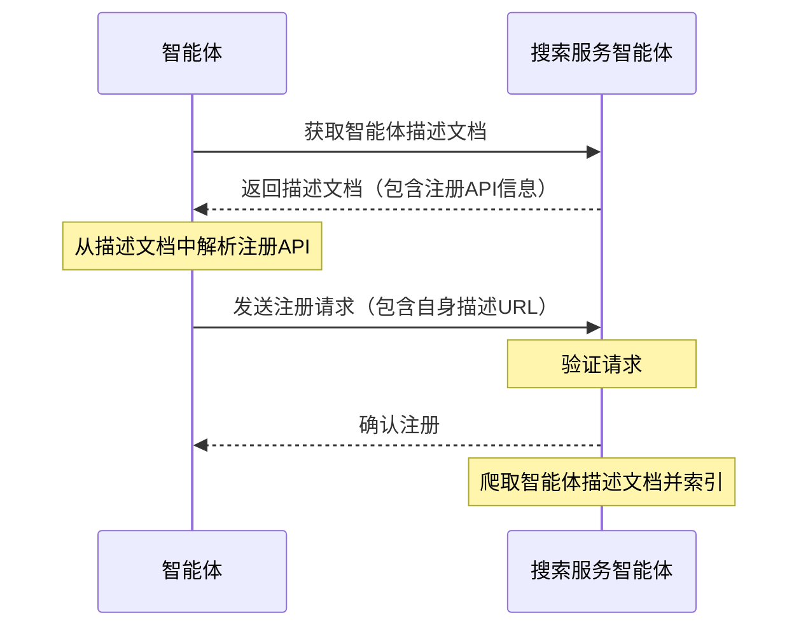

# ANP-智能体发现协议规范（Draft）

## 摘要

本规范定义了智能体发现协议（Agent Discovery Service Protocol, ADSP），这是一个用于发现智能体的标准化协议。该协议基于JSON-LD格式，提供了两种发现机制：主动发现和被动发现，旨在使智能体能够在网络中被其他智能体或搜索引擎有效地发现和访问。

协议的核心内容包括：
1. 使用JSON-LD作为基础数据格式，支持链接数据和语义网特性
2. 定义了主动发现机制，使用.well-known URI路径作为智能体发现入口点
3. 提供了被动发现机制，允许智能体将自身描述提交给搜索服务
4. 支持智能体描述的分页和链接，便于管理大量智能体信息

本规范旨在提高智能体在网络中的可发现性，为构建智能体网络生态系统提供基础支持。

## 引言

随着智能体数量的不断增加，如何有效地发现和访问这些智能体成为了一个关键问题。智能体发现协议（Agent Discovery Service Protocol, ADSP）旨在解决这一问题，通过标准化的方式使得智能体能够被其他智能体或搜索引擎发现。

本规范定义了两种智能体发现机制：主动发现和被动发现。主动发现允许搜索引擎或其他智能体通过已知的域名发现该域名下的所有公开智能体；被动发现则允许智能体主动将自身描述注册到搜索服务中。这两种机制相互补充，共同提高了智能体的可发现性。

## 概述

我们使用[JSON-LD](https://www.w3.org/TR/json-ld11/)(JavaScript Object Notation for Linked Data)作为智能体发现文档的格式，与智能体描述协议保持一致。通过使用JSON-LD，我们可以在保持简单易用的同时，实现丰富的语义表达和链接关系。

智能体描述文档是智能体的详细信息表达，参考文档 [ANP-智能体描述协议规范](07-ANP-智能体描述协议规范.md)。而智能体发现文档则作为一个集合页面，包含了域名下所有公开智能体描述文档的URL，便于搜索引擎或其他智能体进行索引和访问。

## 协议详情

### 主动发现

主动发现是指搜索引擎或智能体只需知道一个域名，即可发现该域名下所有公开的智能体描述文档。我们采用了Web标准的`.well-known` URI路径作为智能体发现的入口点。

#### .well-known URI

根据[RFC 8615](https://tools.ietf.org/html/rfc8615)，`.well-known` URI提供了一种标准化的方式来发现服务和资源。对于智能体发现，我们定义了以下路径：

```
https://{domain}/.well-known/agent-descriptions
```

此路径应返回一个JSON-LD文档，包含该域名下所有公开的智能体描述文档的URL。

#### 发现文档格式

主动发现文档采用JSON-LD格式，使用`CollectionPage`类型，包含以下核心属性：

- `@context`: 定义文档使用的JSON-LD上下文
- `@type`: 文档类型，值为"CollectionPage"
- `url`: 当前页面的URL
- `items`: 智能体描述项目的数组
- `next`: （可选）下一页的URL，用于分页场景

每个智能体描述项目包含：
- `@type`: 类型，值为"ad:AgentDescription"
- `name`: 智能体名称
- `@id`: 智能体描述文档的URL（资源的唯一标识符）

示例：

```json
{
  "@context": {
    "@vocab": "https://schema.org/",
    "did": "https://w3id.org/did#",
    "ad": "https://agent-network-protocol.com/ad#"
  },
  "@type": "CollectionPage",
  "url": "https://agent-network-protocol.com/.well-known/agent-descriptions",
  "items": [
    {
      "@type": "ad:AgentDescription",
      "name": "Smart Assistant",
      "@id": "https://agent-network-protocol.com/agents/smartassistant/ad.json"
    },
    {
      "@type": "ad:AgentDescription",
      "name": "Customer Support Agent",
      "@id": "https://agent-network-protocol.com/agents/customersupport/ad.json"
    }
  ],
  "next": "https://agent-network-protocol.com/.well-known/agent-descriptions?page=2"
}
```

#### 分页机制

当域名下有大量智能体时，应采用分页机制。分页通过`next`属性实现，指向下一页的URL。客户端应递归获取所有页面，直到没有`next`属性为止。

### 被动发现

被动发现是指智能体主动将自身的智能体描述URL提交给其他智能体（通常是搜索服务智能体），使其能够索引和爬取自身信息。

#### 注册API

被动发现通常需要使用搜索服务智能体提供的注册API。这些API由搜索服务智能体自行定义，应在其智能体描述文档中明确说明。智能体可以通过调用这些API将自身描述URL注册到搜索服务中。

#### 注册流程

1. 智能体获取搜索服务智能体的描述文档
2. 从描述文档中找到注册API的端点和参数要求
3. 构造注册请求，包含自身的智能体描述URL和其他必要信息
4. 发送注册请求到搜索服务
5. 搜索服务验证请求并索引该智能体



### 安全考虑

为确保智能体发现的安全性，建议采取以下措施：

1. **内容验证**: 搜索服务应验证智能体描述文档的有效性和完整性
2. **DID认证**: 使用did:wba方法进行身份认证，确保智能体身份的真实性
3. **限流机制**: 实施适当的限流措施，防止恶意请求和DoS攻击
4. **权限控制**: 区分公开和私有智能体，只在发现文档中包含公开智能体

## 与其他协议的关系

智能体发现协议与以下协议密切相关：

1. **智能体描述协议**: 发现协议提供了描述文档的索引和访问机制
2. **DID:WBA方法**: 提供了身份验证和安全保障
3. **元协议**: 在智能体通信中可基于发现结果进行协议协商

## 版权声明
Copyright (c) 2024 GaoWei Chang  
本文件依据 [MIT 许可证](./LICENSE) 发布，您可以自由使用和修改，但必须保留本版权声明。
