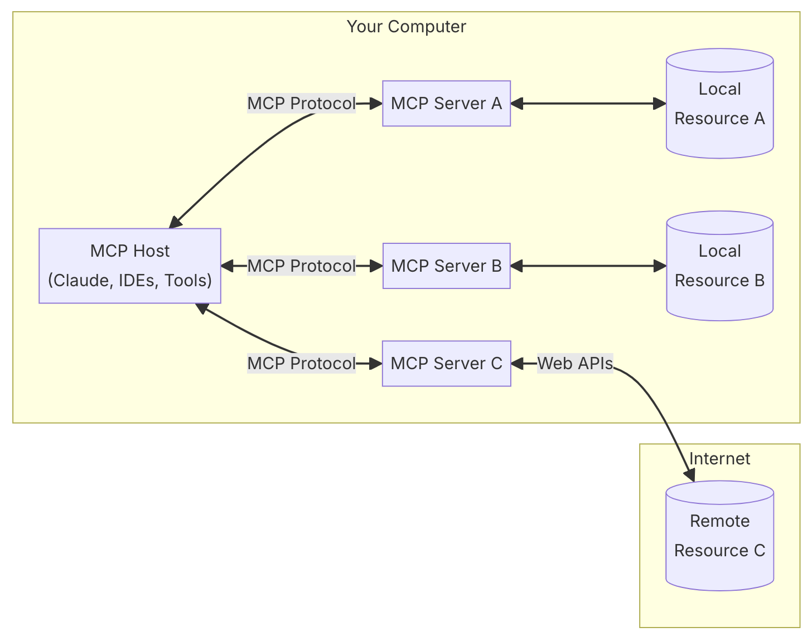
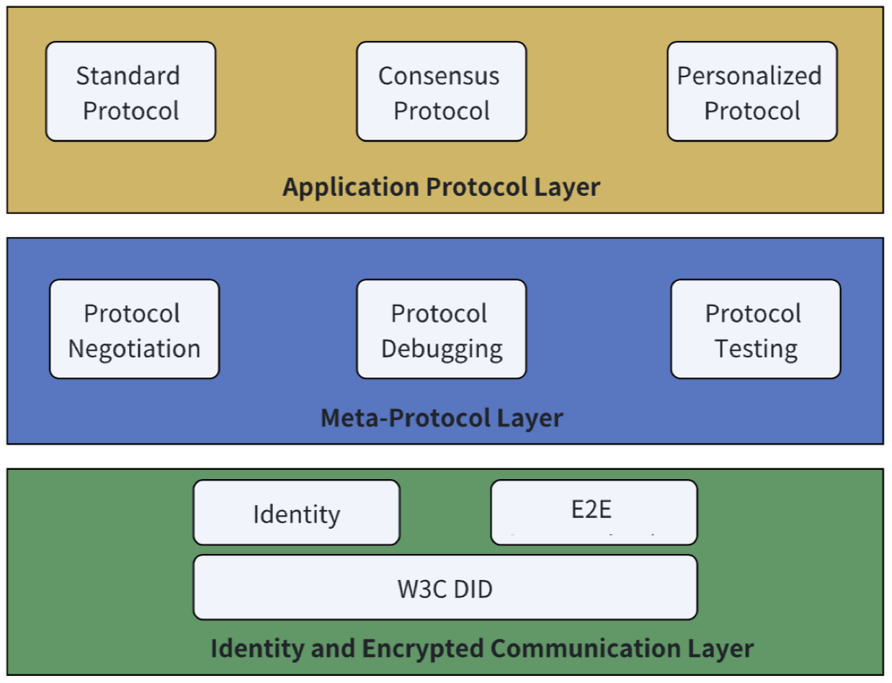
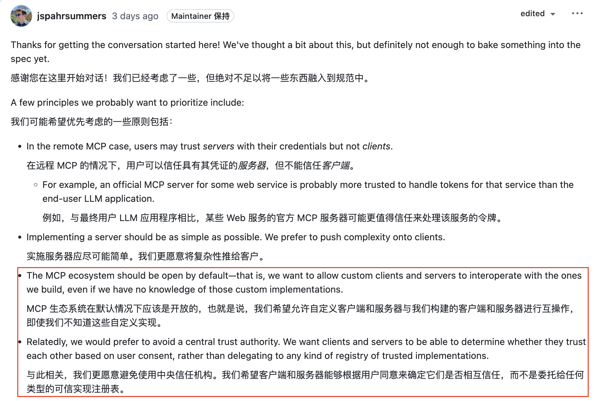
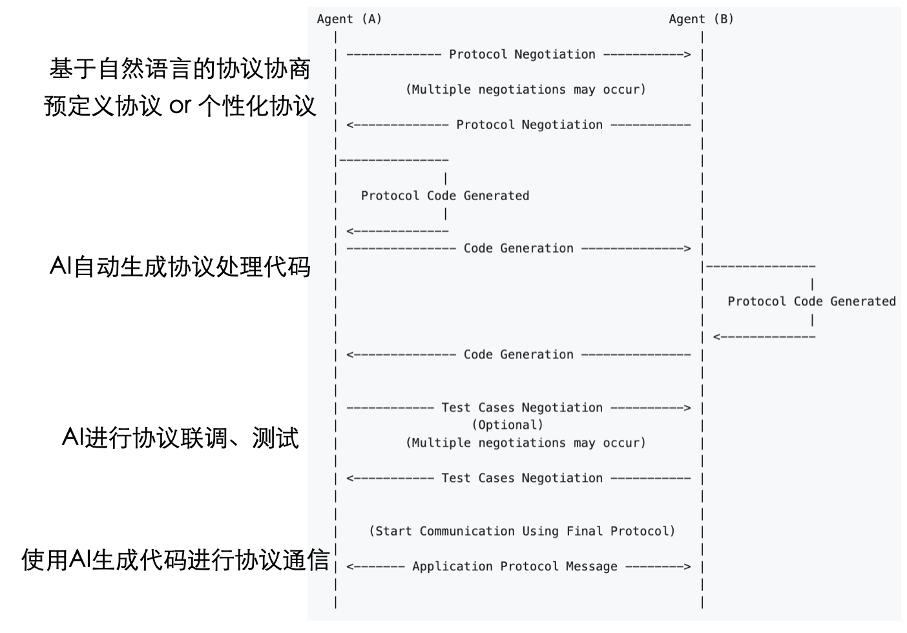
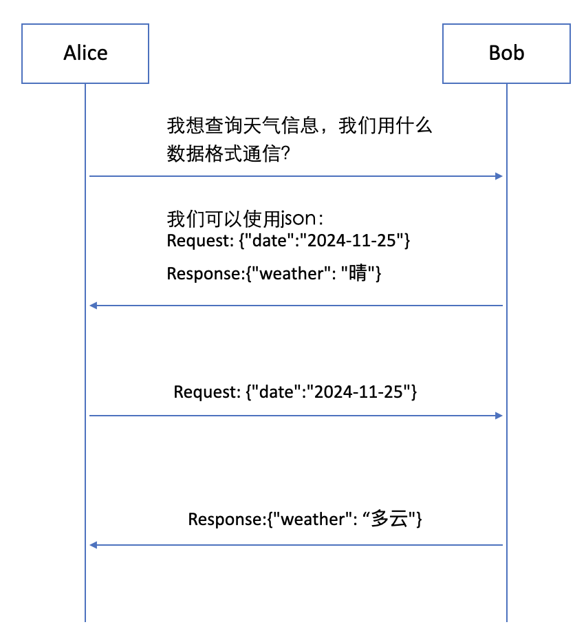
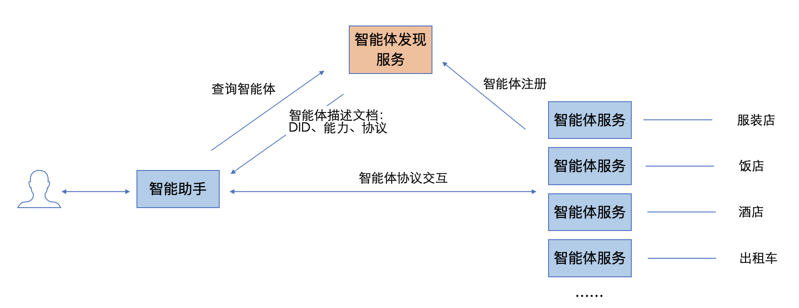

# 标题：对标Anthropic MCP，来自中国团队的这个开源协议已经能让智能体自己组网了
# 标题：对标Anthropic MCP，这个来自中国的开源协议也许是AI创业公司C端困境突破口

## 导读：
Anthropic前几天发布了一个开源协议MCP（Model Context Protocol），引起了全网热议。而来自中国的一个团队很早之前就投入在这个领域，并开源了一个类似的协议ANP（Agent Network Protocol），ANP最新版本已经能够让智能体自己组网。也许AI时代互联网的HTTP协议，正在被定义，并且彻底颠覆之前的互联网生态。 

## 什么是MCP？
MCP是一种让AI大模型和外部数据“对话”的新技术。它的作用就像一座桥梁，让AI可以轻松获取和使用各种工具或数据源。以前，AI应用常常因为数据连接困难，被困在“信息孤岛”里。现在有了MCP，AI就能像用万用插头一样连接所有需要的资源。这将会极大提供AI产品的体验，并且有可能彻底改变互联网的生态。

但是MCP现在还有一个致命的缺陷，就是不支持远程连接，只能访问本地服务，这将大大限制MCP的实用性。

究其根本原因，是MCP社区还没有想好如何在AI和外部服务之间做身份认证。而这个问题，来自中国的一个团队在几个月之前就已经解决了，并且开源了一个类似的协议ANP（Agent Network Protocol），致力于为智能体提供通信能力。

## ANP

ANP团队成员大部分来自于阿里巴巴，他们在2024年初就开始探索智能体通信，并且发布了开源的协议规范与代码实现。最新版本已经能够支持智能体之间的身份认证、端到端加密通信、元协议协商、应用层协议代码生成。有了这些能力，智能体就可以自己组成一个网络，并且相互之间协作。我们来看下它是怎么实现的。

协议规范：https://github.com/chgaowei/AgentNetworkProtocol
代码实现：https://github.com/chgaowei/AgentConnect

 

### 身份认证：最重要的问题

智能体之间做身份认证很重要，但是也很难，否则MCP也就不会在没有一个完整的身份认证方案的情况下发布了。

它难在什么地方？最难的点在于，AI时代的身份认证要求和互联网时代是完全不一样的。

互联网时代的身份认证往往是中心化的方案，比如微信，你的微信ID只能在微信的生态中使用，不能在淘宝、抖音中使用。这就造成了一个个数据孤岛，数据不互通，AI就无法获得你的全部信息，从而无法做出正确的决策和行动，AI产品的体验也就难以得到质的提升。

这一点很多创业公司其实已经意识到了，比如Anthropic的MCP团队，他们认为，MCP的生态应该是一个开放性的生态，他们更愿意避免使用中央信任机构。

为什么去中心化的身份认证对AI如此重要？

看看中国过去两年发生的案例我们也许就能明白。

会读是去年比较火的一款阅读类AI应用，主要在微信平台发展。但是当用户量起来之后，账号频繁的被微信封禁，最终导致项目失败。很多用户都非常喜欢这款AI产品，但是没有用，用户身份掌握在微信手中。

从这个角度看，中心化的传统互联网和移动互联网巨头，他们不是AI这个先进生产力的助力，而是阻碍。

结合近期中国大模型头部创业公司的困境，我们也许能清晰的看到，只有跳出传统互联网和移动互联网巨头构建的生态，才能真正释放AI的生产力，创业公司才能找到新的出路。

而这些的第一步，就是设计一个去中心化的身份认证方案。

ANP并没从头开始创建标准，而是基于W3C在2022年发布的DID（Decentralized Identifiers）标准来构建。DID设计之初就是为了解决互联网中心化身份问题，它能够让用户自己掌握的身份，并且能够进行跨平台的身份认证。

ANP最大的贡献在于，设计了一个DID方法，能够让身份认证依赖于密码学技术而非中心化机构，并且在去中心化和扩展性中间找到一个平衡点，让DID在去中心化的同时，也能够大规模的落地。

### 元协议让智能体自己组网

所谓的元协议，即协议的协议，是用来协商智能体之间的通信协议。

智能体与传统服务器最大的区别，是智能体可以利用AI的能力，自己寻找满足条件的智能体，并且两个智能体之间可以用自然语言协商通信协议，然后通过AI生成的协议代码，完成数据的通信。在这个过程中，两个智能体还能够使用元协议自动进行协议对接的联调和升级。下面是智能体使用ANP元协议建立连接的全过程：

下面以获取天气信息为例，展示智能体A和智能体B使用元协议进行协议协商的基本流程：

有了元协议，智能体就可以实现在无人参与下的自组网，并且相互协作。相信一张能够自组织自协商的智能体网络，会在未来释放出更大的生产力。

### 应用层协议层：智能体发现与描述

所有的连接都是用元协议协商建立，成本是相当高的，而且由于流程过长，耗时也更长。所以ANP在应用层设计了一个智能体能力发现与描述的机制。这一点和MCP的设计类似。

比如，智能体可以将自己的身份、能力以及支持的协议注册到一个智能体发现服务上，其他的智能体就可以根据条件搜索到这个智能体，并且根据智能体支持的协议和这个智能体进行通信。这可以极大的提高智能体之间的连接效率。

应用层的协议可以是人类现有的标准，也可能是智能体相互之间协商出来的共识标准，也可以是两个智能体之间的私有协议。也许未来，智能体之间自动协商的协议会远超过人类制定的协议。

## 未来

相对于Anthropic的MCP，ANP的行业影响力是远远不够的，不过我们能够从它的设计中，看到一些不错的设计思路。

最后，无论是MCP也好，还是ANP也好，这个领域目前都处于非常早期的阶段，一切都还不确定。

也许最重要的，不是MCP或ANP成为行业标准，而是未来行业一定要有一个标准，它是开放的、去中心化的，这样才能够最大程度释放AI的生产力。

