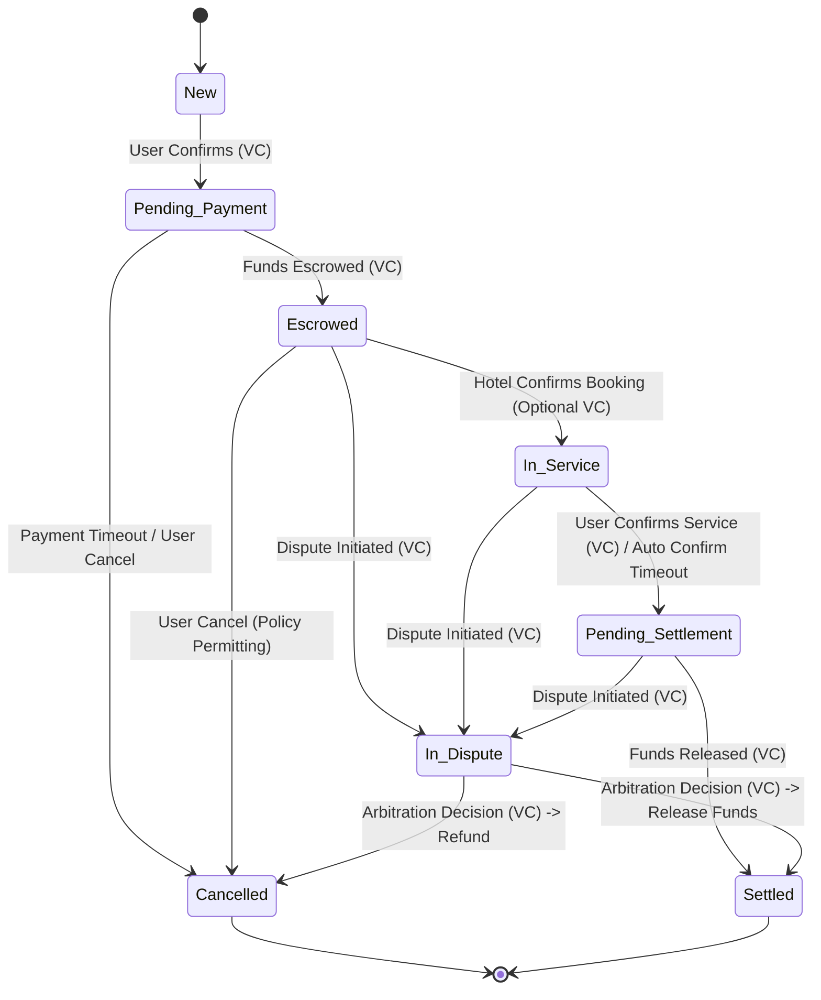

# 基于ANP的智能体交易方案：需求与技术设计文档

## 1. 引言

### 1.1. 问题陈述：对安全、可互操作的智能体交易的需求

当前的在线交易模型，尤其是在涉及多方参与的自动化或半自动化 B2C/B2B 交互场景（例如酒店预订、供应链协作等）中，面临诸多挑战。这些挑战包括参与方之间缺乏固有信任、数据孤岛导致信息不流通、支付与结算流程摩擦大、以及争议解决机制复杂低效等问题。随着人工智能和智能体技术的发展，自主智能体代表用户或机构进行交互和交易的需求日益增长。然而，若要让这些智能体能够安全、高效地进行协作，就必须克服上述挑战，建立一个无需依赖中心化中介机构的、健壮的交互框架。这要求有明确的协议来规范智能体的身份认证、安全通信以及可验证的数据交换。Agent Network Protocol (ANP) 的愿景正是为了解决智能体网络的互联互通和高效协作问题，打破数据孤岛，让AI能够访问完整的上下文信息 [1, 2]。

### 1.2. 解决方案概述：一个基于ANP的智能体交易框架

本方案提出一个基于智能体技术的交易框架，旨在解决上述问题。该框架利用代表各参与方（如用户、酒店、支付平台、仲裁机构）的智能体，通过 Agent Network Protocol (ANP) 进行交互 [2]。核心技术栈包括：

1.  **Agent Network Protocol (ANP):** 作为智能体之间通信的基础协议，定义发现、交互和消息传递机制，旨在实现安全、可互操作的通信 [2]。
2.  **去中心化标识符 (Decentralized Identifiers, DIDs):** 用于唯一标识各参与方及其智能体，并关联验证其身份所需的公钥等信息，是建立信任的基础 [3, 4]。
3.  **W3C 可验证凭证 (Verifiable Credentials, VCs) 及数据完整性证明 (Data Integrity Proofs):** 用于在交易过程中交换结构化、可验证的数据声明（如订单提议、支付确认），确保信息的真实性、完整性和不可否认性 [5, 6]。

本文档将以用户预订并支付酒店为例，详细阐述该框架的需求、核心流程、技术设计和安全机制。整个设计遵循最小信任、可追溯性、自动化、用户控制和互操作性等原则，旨在构建一个更安全、透明、高效的去中心化交易生态。

## 2. 系统需求

### 2.1. 功能需求

*   **智能体能力:**
    *   **用户智能体:** 必须能够发现服务、请求预订、验证酒店凭证、生成确认凭证、处理支付指令、发起支付、确认服务完成或发起争议。
    *   **酒店智能体:** 必须能够发布服务信息、生成订单提议凭证（含报价）、临时锁定库存、验证用户确认凭证、向支付方发起收款请求、确认收款并最终确认预订、记录服务履约、处理取消或争议回应。
    *   **支付智能体:** 必须能够接收并验证支付请求、生成支付指令凭证（如托管链接）、处理用户付款并将资金置于托管状态、发送资金状态通知凭证、根据指令（用户确认、超时、裁决）释放资金给酒店或退款给用户。
    *   **仲裁智能体 (可选):** 必须能够接收双方提交的证据凭证、依据规则进行调解或裁决、并生成具有约束力的“争议解决凭证”。
*   **交易生命周期:** 系统必须支持完整的交易流程，包括：服务发现、报价与提议、订单确认、支付请求与指令生成、资金托管、服务履约确认、资金结算或退款、争议发起与解决。这些步骤需映射至用户输入描述的核心流程（第三部分）。
*   **凭证处理:** 所有智能体必须具备签发、呈现、接收和验证特定类型可验证凭证 (VCs) 的能力。验证过程需包括对凭证数据完整性和签发者签名的密码学校验。凭证类型需覆盖交易各关键节点，如订单提议、预订确认、支付请求、资金托管确认等 [7, 5]。
*   **状态管理:** 系统必须维护交易订单的精确状态，状态的迁移由接收到的有效VCs或预定义的事件（如超时）触发。核心状态包括：`新建`、`待付款`、`托管中`、`履约中`、`待结算`、`已结算`，并可能包含`已取消`、`争议中`等。
*   **异常处理:** 系统必须能够处理用户输入描述的各种异常情况（第五部分），包括：凭证验证失败、用户未付款超时、酒店无房/超卖、用户取消（支付前/后）、服务纠纷、支付失败、自动放款超时、密钥泄露/身份异常、智能体/网络中断等。处理方式需明确定义，通常涉及发送特定的错误或状态通知VC。

### 2.2. 非功能性需求

*   **安全性:**
    *   **通信安全:** 智能体间通信必须使用端到端加密，防止窃听和篡改（依赖ANP的安全层 [1, 2]）。
    *   **身份认证:** 必须使用基于DID的强认证机制，确保交互对象的身份真实性 [1, 8]。
    *   **数据完整性:** 所有交换的关键凭证必须使用密码学证明（如Data Integrity proofs）保护，防止篡改 [6]。
    *   **不可否认性:** 凭证签发者不能否认其签发的有效凭证（通过数字签名实现）。
    *   **密钥管理:** 必须有安全的机制来生成、存储、使用、轮换和恢复各智能体的私钥。
*   **互操作性:** 系统设计必须严格遵守ANP、W3C DID、W3C VC等开放标准，以确保由不同开发商实现的智能体能够无缝交互 [2, 4, 5]。
*   **可追溯性/可审计性:** 所有关键的交易步骤和状态变更都必须通过带有时间戳和签名的可验证凭证记录下来，形成一个不可篡改的、可供审计的记录链。VC和Data Integrity机制是实现这一目标的核心 [9, 6]。
*   **可靠性/可用性:** 系统应具备高可用性，能够容忍部分智能体或网络节点的临时故障。需要明确消息传递的保证机制（例如，ANP是否提供消息队列或重试机制）和智能体自身的状态持久化能力 [1]。对ANP协议本身的健壮性存在依赖。
*   **可扩展性:** 架构设计应能支持未来智能体数量和交易量的增长。需要考虑ANP协议在大规模应用场景下的实际性能表现 [2]。
*   **隐私性:** 在满足交易需求的前提下，应考虑保护用户隐私。虽然基础流程未明确要求，但选用W3C VC标准为未来采用选择性披露技术（如基于BBS+签名的VCs [10]）提供了可能性。

## 3. 核心概念与架构

### 3.1. 关键术语

*   **ANP (Agent Network Protocol):** 一个旨在实现智能体之间安全、可互操作通信的开源协议框架。它定义了智能体的发现、交互和消息传递机制，其目标是成为智能体时代的HTTP [11, 2]。
*   **智能体 (Agent):** 代表特定实体（用户、酒店等）执行任务的自主软件程序，能够通过ANP协议进行交互。
*   **DID (Decentralized Identifier):** 去中心化身份标识符。一种新型的、全局唯一的标识符，使实体能够生成和控制自己的标识符，无需依赖中心化注册机构 [3, 4]。DID可解析为一个DID文档。
*   **DID 文档 (DID Document):** 包含与DID关联的信息的数据集，例如用于验证的密码学材料（公钥）、服务终端点等 [12, 4]。
*   **可验证凭证 (Verifiable Credential, VC):** 一组由签发者（Issuer）就某个主体（Subject）做出的声明（Claims），并附带密码学证明（Proof），使得验证者（Verifier）可以独立验证其真实性和完整性 [7, 5]。通常使用JSON-LD格式表示 [5]。
*   **数据完整性证明 (Data Integrity Proof):** 一种用于保护VC或其他数字文档真实性和完整性的密码学证明机制，通常嵌入在VC的`proof`属性中 [6]。
*   **状态机 (State Machine):** 描述交易（如订单）在其生命周期中所经历的一系列明确定义的状态，以及触发状态迁移的事件和条件。
*   **签发者 (Issuer):** 创建并签发VC的实体（例如，酒店智能体签发订单提议VC）[7, 5]。
*   **持有者 (Holder):** 持有并按需出示VC的实体（例如，用户智能体持有酒店的订单提议VC）[5]。
*   **验证者 (Verifier):** 接收VC并验证其有效性的实体（例如，酒店智能体验证用户确认VC）[5]。
*   **凭证主体 (Credential Subject):** VC中声明所涉及的实体（例如，酒店预订VC的主体是用户和预订详情）[7, 5]。
*   **密码套件 (Cryptosuite):** 定义了用于生成和验证Data Integrity证明的具体密码学算法组合（如转换算法、哈希算法、签名算法）[6]。
*   **DID 解析 (DID Resolution):** 将DID转换为对应的DID文档的过程，通常由DID解析器完成 [12, 13]。

### 3.2. 系统架构概述

本方案采用基于智能体的分布式架构。各个参与方（用户、酒店、支付平台、仲裁机构）由其各自的智能体代表。这些智能体分布在网络中，通过ANP协议进行点对点或多点通信。

[ 高层架构图概念：展示用户智能体、酒店智能体、支付智能体、仲裁智能体通过一个表示“ANP网络”的云或总线相互连接。每个智能体图标旁边标注其DID。交互箭头表示通过ANP传递VC消息。]

核心交互流程不依赖中心化的业务平台进行状态协调，而是通过在智能体之间传递和验证带有密码学证明（Data Integrity Proofs）的可验证凭证 (VCs) 来驱动状态转换和建立共识。信任的建立基于密码学而非平台信誉：

1.  **身份验证:** 通过DID及其关联的DID文档进行。智能体间的通信需先通过ANP的身份认证层进行身份确认 [11, 1, 2]。
2.  **数据验证:** 通过验证VC中的Data Integrity证明来确保信息的真实性、完整性和来源可信性 [6]。

ANP协议栈提供了底层的安全通信（加密）和身份认证（基于DID）能力，以及可能的上层协议协商（Meta-Protocol）和应用协议框架 [11, 1, 2]。本方案主要利用其身份/加密层和消息传递能力来交换预定义的VCs。

### 3.3. 参与方角色与职责

下表详细说明了系统中的主要参与方及其智能体的职责：

**Table 1: Participant Roles**

| 角色 | 职责关键词 (Keywords) | 详细说明 |
| :------------------------------------- | :----------------------------------------- | :--------------------------------------------------------------------------------------------------------------------------------------------------------------------------------------------------- |
| **用户 (User)** | 最终消费者 | 需要酒店服务的个人。 |
| **用户智能体 (User Agent)** | 选购 → 确认 → 付款 → 履约反馈 / 纠纷 | 代表用户的软件智能体。管理用户DID和私钥，**通过ANP发现服务**、请求预订、验证酒店凭证、生成确认凭证、处理支付指令、发起支付、确认服务完成或发起争议，**所有交互通过ANP进行**。 |
| **酒店 (Hotel)** | 服务提供商 | 提供住宿服务的实体。 |
| **酒店智能体 (Hotel Agent)** | 报价 → 锁房 → 校验确认 → 发起收款 → 提供服务 | 代表酒店的软件智能体。管理酒店DID和私钥，发布服务信息、生成订单提议凭证（含报价）、临时锁定库存、验证用户确认凭证、向支付方发起收款请求、确认收款并最终确认预订、记录服务履约、处理取消或争议回应，**所有交互通过ANP进行**。 |
| **支付基础设施 (Payment Infrastructure)** | 资金处理平台 | 如支付宝、银行等，提供支付、托管、结算服务的平台。 |
| **支付智能体 (Payment Agent)** | 托管资金 → 状态通知 → 结算 / 退款 | 代表支付基础设施的软件智能体。管理其DID和私钥，接收并验证支付请求、生成支付指令凭证（如托管链接）、处理用户付款并将资金置于托管状态、发送资金状态通知凭证、根据指令（用户确认、超时、裁决）释放资金给酒店或退款给用户，**所有交互通过ANP进行**。 |
| **仲裁智能体 (Arbitration Agent)** (可选) | 受理争议 → 调解 / 裁决 | 代表中立第三方争端解决机构的软件智能体。管理其DID和私钥，在用户和酒店无法协商解决争议时介入，接收双方提交的证据凭证，依据规则进行调解或裁决，并生成具有约束力的“争议解决凭证”，**相关交互通过ANP进行**。 |

*表1价值说明:* 此表清晰地界定了系统中的各个参与者及其核心职责。这对于理解后续的流程设计、智能体交互逻辑以及功能需求的分配至关重要。它确保了系统设计的完整性，明确了每个角色的预期行为。

## 4. 流程规范

### 4.1. 理想交易流程与状态转换

以下是用户预订并支付酒店的理想流程，所有智能体间的交互均通过ANP协议传递VC消息来驱动。

**步骤 1: 报价与锁房 (Offer & Lock Inventory)**

*   **触发:** 用户智能体向酒店智能体发送询价或预订请求（可通过ANP发现服务）。
*   **处理:** 酒店智能体检查库存和价格。
*   **凭证生成:** 酒店智能体生成 **“订单提议凭证 (Order Offer Credential)”** (VC Type: `OrderOfferCredential`)，包含房型、价格、有效期、取消政策、订单临时ID等信息，使用酒店私钥签名。
*   **状态:** 酒店侧临时锁定相应库存。订单进入 `提议中 (Offered)` 状态（或保持 `新建 (New)` 直至用户确认）。
*   **交互:** 通过ANP将 `OrderOfferCredential` 发送给用户智能体。

**步骤 2: 用户确认 (User Confirmation)**

*   **触发:** 用户智能体收到并验证 `OrderOfferCredential` 的签名和内容。用户决定确认预订。
*   **凭证生成:** 用户智能体生成 **“预订确认凭证 (Booking Confirmation Credential)”** (VC Type: `BookingConfirmationCredential`)，引用 `OrderOfferCredential` 的ID，表明接受提议，使用用户私钥签名。
*   **交互:** 通过ANP将 `BookingConfirmationCredential` 发送给酒店智能体。
*   **状态:** 酒店智能体验证 `BookingConfirmationCredential` 后，将订单状态更新为 **`待付款 (Pending Payment)`**。

**步骤 3: 收款申请 (Payment Request)**

*   **触发:** 酒店智能体收到有效的 `BookingConfirmationCredential`。
*   **凭证生成:** 酒店智能体生成 **“支付请求凭证 (Payment Request Credential)”** (VC Type: `PaymentRequestCredential`)，包含收款方(酒店DID)、付款方(用户DID)、金额、订单信息、指定的支付智能体DID等，使用酒店私钥签名。
*   **交互:** 通过ANP将 `PaymentRequestCredential` 发送给指定的支付智能体。
*   **状态:** 订单状态更新为 `付款待启动 (Payment Initiation Pending)`。

**步骤 4: 托管指令生成 (Escrow Instruction Generation)**

*   **触发:** 支付智能体收到并验证 `PaymentRequestCredential`。
*   **凭证生成:** 支付智能体生成 **“支付指令凭证 (Payment Instruction Credential)”** (VC Type: `PaymentInstructionCredential`)，包含支付交易ID、金额、支付方式详情（如托管支付链接/二维码）、支付截止时间等，使用支付平台私钥签名。
*   **交互:** 通过ANP将 `PaymentInstructionCredential` 发送给用户智能体，并可同时通知酒店智能体支付已发起。
*   **状态:** 支付任务进入 `待支付 (Awaiting Payment)` 状态。

**步骤 5: 用户付款与资金托管 (User Payment & Escrow)**

*   **触发:** 用户智能体收到并验证 `PaymentInstructionCredential`。用户通过凭证提供的链接/方式完成支付操作。
*   **处理:** 资金进入支付平台的托管账户。
*   **凭证生成:** 支付智能体确认资金到账（进入托管），生成 **“资金托管凭证 (Funds Escrowed Credential)”** (VC Type: `FundsEscrowedCredential`)，使用支付平台私钥签名。
*   **交互:** 通过ANP将 `FundsEscrowedCredential` 发送给用户智能体和酒店智能体。
*   **状态:** 订单状态更新为 **`托管中 (Escrowed)`**。

**步骤 6: 酒店确认与服务履约 (Hotel Confirms & Service Delivery)**

*   **触发:** 酒店智能体收到并验证 `FundsEscrowedCredential`。
*   **处理:** 酒店正式确认预订，锁定资源。
*   **凭证生成 (可选):** 酒店智能体可生成 **“预订完成凭证 (Booking Finalized Credential)”** (VC Type: `BookingFinalizedCredential`) 发送给用户。
*   **服务:** 用户按预订到店，酒店提供服务。
*   **状态:** 订单进入 **`履约中 (In Service / Fulfillment)`** 状态。
*   **履约完成:** 服务结束后，酒店智能体可通过ANP向用户智能体推送服务完成的提示信息或凭证（例如 `ServiceCompletedNotification`）。

**步骤 7: 用户确认放款 (User Confirms Service Completion)**

*   **触发:** 用户（通过用户智能体）确认服务已按约定完成。
*   **凭证生成:** 用户智能体生成 **“服务完成确认凭证 (Service Completion Confirmation Credential)”** (VC Type: `ServiceCompletionConfirmationCredential`)，表明同意支付托管资金，引用相关订单/交易ID，使用用户私钥签名。
*   **交互:** 通过ANP将 `ServiceCompletionConfirmationCredential` 发送给支付智能体。
*   **超时机制:** 若用户在规定时间内未确认也未发起争议，可设计自动确认逻辑，触发自动放款。
*   **状态:** 订单进入 **`待结算 (Pending Settlement)`** 状态。

**步骤 8: 结算结束 (Settlement)**

*   **触发:** 支付智能体收到并验证 `ServiceCompletionConfirmationCredential`，或触发了自动放款条件。
*   **资金操作:** 支付智能体将托管资金划转至酒店账户。
*   **凭证生成:** 生成 **“资金释放凭证 (Funds Released Credential)”** (VC Type: `FundsReleasedCredential`)，记录最终结算状态和交易详情，使用支付平台私钥签名。
*   **交互:** 通过ANP将 `FundsReleasedCredential` 发送给用户智能体和酒店智能体。
*   **状态:** 订单最终状态更新为 **`已结算 (Settled)`**。

**核心状态转换图 (概念):**

**Table 2: Core State Transitions**

| 当前状态 | 触发事件/凭证类型 | 主要动作/验证 | 下一状态 | 备注 |
| :------------------- | :--------------------------------------------------- | :---------------------------------------------------------------------------- | :------------------- | :------------------------------------------------------------------- |
| `New` / `Offered` | `BookingConfirmationCredential` (User) | 验证用户签名和提议引用 | `Pending Payment` | |
| `Pending Payment` | `FundsEscrowedCredential` (Payment) | 验证支付平台签名和托管金额 | `Escrowed` | |
| `Pending Payment` | 支付超时 | 支付智能体检测超时，发送通知 | `Cancelled` | 需要定义超时时长 |
| `Escrowed` | (内部逻辑/可选`BookingFinalizedCredential`) | 酒店确认预订资源 | `In Service` | 假设服务按期开始 |
| `In Service` | `ServiceCompletionConfirmationCredential` (User) | 验证用户签名，确认服务完成 | `Pending Settlement` | |
| `In Service` | 用户确认超时 | 支付智能体根据预设规则触发 | `Pending Settlement` | 需要明确定义自动确认规则和时长 |
| `Pending Settlement` | (内部资金划转完成) | 支付智能体执行结算，生成`FundsReleasedCredential` | `Settled` | |
| `Escrowed` / `In Service` / `Pending Settlement` | `DisputeInitiationCredential` (User/Hotel) | 验证签名，暂停资金操作（若适用） | `In Dispute` | |
| `In Dispute` | `DisputeResolutionCredential` (Arbitrator) | 验证仲裁者签名，根据裁决内容执行资金操作（结算/退款） | `Settled` / `Cancelled` | 仲裁结果驱动最终状态 |
| 任意状态 | `CancellationRequestCredential` (User) | 根据当前状态和取消策略处理（确认取消/退款/拒绝） | `Cancelled` / (不变) | 取消策略可能复杂，涉及不同状态和时间点 |
| 任意状态 | 凭证验证失败 | 拒绝凭证，发送错误通知 | (不变) | 流程暂停，可能需要人工介入或重试 |

*表2价值说明:* 此表提供了对理想流程中状态转换逻辑的精确描述。它明确了每个状态迁移的触发条件（通常是收到特定类型的VC）、需要执行的验证或动作，以及最终达到的状态。这对于实现智能体内部的状态机至关重要，确保了流程的确定性和一致性。

### 4.2. 异常处理流程

系统必须能够健壮地处理各种异常情况。以下是关键异常场景及其处理流程，所有通知和状态变更均通过ANP传递相应的VCs或错误消息驱动。

**Table 3: Exception Handling Summary**

| 场景 | 触发时机 (Trigger Point) | 简要处理 (Brief Handling via ANP/VCs) |
| :--------------------- | :-------------------------------- | :----------------------------------------------------------------------------------------------------------------------------------------------------------------------------------------------------------------------------- |
| **凭证验证失败** | 任意凭证接收环节 | 接收方智能体拒绝无效凭证（签名无效、格式错误、内容不符等），通过ANP返回包含错误信息的通知凭证（如 `CredentialValidationError` VC）。流程暂停，等待修正或人工介入。 |
| **用户未付款超时** | 步骤 4 支付指令发出后，超时 | 支付智能体检测到支付超时，生成并发送“支付超时凭证” (`PaymentTimeoutCredential`) 通知用户和酒店智能体。订单状态迁移至 `Cancelled`。酒店智能体收到通知后释放锁定的库存。 |
| **酒店无房/超卖** | 步骤 1 或 2 | 若酒店智能体在处理询价或确认时发现无法满足（如库存不足），应生成并发送“订单取消凭证” (`OrderCancellationCredential`) 给用户智能体，说明原因。订单状态迁移至 `Cancelled`。 |
| **用户取消 (支付前)** | 步骤 5 之前 | 用户智能体发送“取消请求凭证” (`CancellationRequestCredential`) 给酒店智能体。酒店智能体验证请求（可能基于取消策略），若同意，返回“取消确认凭证” (`CancellationConfirmationCredential`)。订单状态迁移至 `Cancelled`。 |
| **用户取消 (支付后/履约前)** | 步骤 5 之后，步骤 6 服务开始前 | 用户智能体发送 `CancellationRequestCredential` 给酒店和支付智能体。酒店智能体根据取消策略计算退款额度，生成并发送“取消处理凭证” (`CancellationProcessedCredential`) 给支付智能体（可能抄送用户），说明退款金额或无退款。支付智能体据此凭证执行相应退款操作，并发送最终状态凭证（如 `FundsRefundedCredential` 或 `Settled` 部分金额）。订单状态迁移至 `Cancelled`。 |
| **入住/服务纠纷** | 步骤 6 服务过程中或完成后 | 用户智能体（或酒店智能体）生成并发送“发起争议凭证” (`DisputeInitiationCredential`) 给对方及支付智能体。支付智能体收到后暂停放款（若资金仍在托管）。订单状态迁移至 `In Dispute`。双方智能体尝试通过ANP协商（交换消息/证据VCs）；若失败，将相关证据VCs提交给**仲裁智能体**。仲裁智能体进行调查/裁决，生成并发送“争议解决凭证” (`DisputeResolutionCredential`)。支付智能体根据此凭证执行资金操作（全额/部分结算给酒店，或全额/部分退款给用户）并发送最终状态凭证。 |
| **支付失败或被拒** | 步骤 5 用户尝试支付时 | 支付基础设施（通过支付智能体）检测到支付失败（如余额不足、卡被拒），生成并发送“支付失败凭证” (`PaymentFailedCredential`) 通知用户智能体和酒店智能体。订单状态可能回退至 `Pending Payment`（允许重试）或直接迁移至 `Failed/Cancelled`。 |
| **自动放款超时** | 步骤 7 用户确认环节超时 | 若配置了自动确认机制，支付智能体在用户确认超时后，自动触发放款流程（如同收到 `ServiceCompletionConfirmationCredential`），执行结算，并通过ANP发送 `FundsReleasedCredential` 通知双方。订单状态迁移至 `Settled`。 |
| **密钥泄露/身份异常** | 任意阶段 | 检测到密钥泄露或身份异常的一方（或其监控系统）应立即尝试撤销相关密钥（如更新DID文档），并通过ANP广播或定向通知相关交易方“安全警报凭证” (`SecurityAlertCredential`)。相关智能体应暂停交易，等待安全措施恢复或人工介入决定后续操作（可能导致交易取消）。 |
| **智能体/网络中断** | 任意阶段 | 依赖ANP协议的底层健壮性（如消息队列、重试机制，需确认ANP是否提供）和智能体自身的状态持久化与超时处理能力。发送方智能体应在超时后重试发送。接收方智能体应能处理重复消息（幂等性）。长时间中断可能导致交易因超时而失败（如支付超时、确认超时），状态迁移至 `Cancelled` 或 `Failed`，或需要人工介入恢复。 |

*表3价值说明:* 此表系统性地梳理了交易过程中可能出现的各种非理想情况，并概述了基于ANP和VC的应对策略。它确保了系统设计的鲁棒性，考虑了失败路径，为开发人员提供了处理异常情况的指导框架。

## 5. 技术设计规范

### 5.1. Agent Network Protocol (ANP) 集成

*   **ANP概述与架构:** ANP是一个旨在成为智能体时代HTTP的开源通信协议 [11, 2]。其核心目标是解决智能体间的互联互通、提供AI友好的原生接口（而非模拟人类交互）、并促进高效协作 [1, 2]。ANP的架构分为三层 [11, 1, 2]:
    *   **身份与加密通信层:** 基于W3C DID规范，构建去中心化认证方案和端到端加密通信，使跨平台智能体能在不依赖中心化系统的情况下相互认证 [11, 2]。AgentConnect实现基于`did:wba`和HTTP的认证以及ECDHE的端到端加密 [1]。
    *   **元协议层 (Meta-Protocol):** 用于智能体间协商通信协议的协议。这是实现智能体网络自组织、自协商的关键，可能利用LLM进行协议协商、代码实现和调试 [11, 1, 2]。
    *   **应用协议层:** 基于语义Web规范，使智能体能够描述其能力和支持的应用协议，并进行管理 [11, 2]。AgentConnect提供了一个集成框架来管理协议规范和代码 [1]。
    本方案主要依赖ANP的身份/加密层进行安全通信和基于DID的认证，并利用其消息传递机制承载VCs作为应用层数据。
*   **智能体通信 via ANP:**
    *   **发现:** 智能体可能通过查询ANP网络中的注册信息或直接访问已知的“智能体描述文档”URL来发现其他智能体及其服务 [1, 14]。ANP的Agent Network Explorer工具展示了通过URL发现和交互的能力 [1]。
    *   **安全通道建立:** 智能体在交互前，需通过ANP的身份认证层（目前基于`did:wba`和HTTP [1]）验证对方身份，并建立端到端加密的通信会话 [1, 2]。
    *   **VC消息交换:** 交易流程中的所有凭证（如`OrderOfferCredential`, `BookingConfirmationCredential`等）将作为结构化数据（JSON-LD格式）封装在ANP消息体中进行传输。
    *   **协议协商 (潜在):** 虽然本方案的核心流程预定义了VC交换序列，但未来可能利用ANP的元协议层来协商更复杂的交互模式或特定应用的协议细节 [1, 2]。
*   **依赖与风险 (ANP 成熟度):**
    *   **强依赖性与成熟度风险:** 本方案的成功实施**高度依赖**于ANP开源项目 ([https://github.com/agent-network-protocol/AgentNetworkProtocol](https://github.com/agent-network-protocol/AgentNetworkProtocol)) 及其实现AgentConnect ([https://github.com/agent-network-protocol/AgentConnect](https://github.com/agent-network-protocol/AgentConnect)) [1, 2]。这是一个正在积极开发中的项目，其稳定性和成熟度直接影响本方案的可行性。特别是，ANP的应用层协议框架目前仍在开发中 ("in progress") [1]，这对于需要复杂应用逻辑的场景可能构成风险。此外，项目缺乏公开的安全策略文件 [15]，且社区规模（从贡献者信息和活动看 [11, 1, 16]）相对较小，可能影响其长期维护和发展。因此，采用ANP意味着需要承担其技术演进带来的不确定性，可能需要投入资源参与其社区贡献或制定备用方案。
    *   **元协议的复杂性与影响:** ANP的元协议层旨在实现智能体间的自动协议协商，甚至利用LLM生成协议处理代码 [1, 2]。这虽然提供了极大的灵活性，但也引入了显著的复杂性。LLM驱动的协商可能存在可靠性、确定性和安全问题（例如，对提示注入或不当协议生成的脆弱性）。目前其实现仅支持Azure OpenAI [1]，也带来了供应商锁定的风险。在本方案的预定义流程之外，若要利用元协议进行更动态的交互，必须对其潜在风险进行深入评估和严格的安全设计。

### 5.2. 身份与信任层 (DID)

*   **DID 用途与标识:** 系统中所有核心参与实体（用户、酒店、支付提供商、仲裁机构）及其代理智能体都将通过一个 DID 进行唯一标识 [3, 4]。DID 提供了一种持久化、可验证且去中心化的身份基础。
*   **DID 文档结构与验证方法:** 每个 DID 关联一个 DID 文档，其结构遵循 W3C DID Core v1.0 规范 [12]。DID 文档必须包含用于验证该 DID 控制权的 `verificationMethod` 条目。这些条目描述了公钥信息，例如可以使用 `publicKeyJwk` (JSON Web Key) [12] 或 `publicKeyMultibase` (Multibase 编码的公钥) [12] 来表示。每个 `verificationMethod` 必须包含 `id` (该方法的标识符，通常是 DID URL)、`type` (密钥类型，如 `Multikey`) 和 `controller` (控制该密钥的 DID) [12]。此外，必须指定验证关系 (Verification Relationships)，例如，用于签发 VC 的公钥应关联 `assertionMethod`，用于智能体认证的公钥（如果需要）应关联 `authentication` [12, 17]。
*   **DID 解析要求:**
    *   **解析器基础设施依赖:** 系统的信任链条完全依赖于可靠的 DID 解析机制 [13]。必须部署或能够访问一个能够解析本方案所使用的特定 DID 方法（目前 ANP 示例中使用 `did:wba` [11, 1]）的 DID 解析器。验证 VC 的第一步就是解析签发者的 DID 以获取其公钥 [12]。因此，DID 解析器的可用性、性能和安全性是整个系统正常运行的关键基础设施依赖。任何解析失败都将导致凭证无法验证，信任链中断 [13]。
*   **密钥管理考量:**
    *   **密钥管理负担:** DID 的核心是基于公私钥对的密码学控制 [3, 18, 4]。每个智能体（代表用户、酒店、支付方等）都需要安全地管理其私钥。这是一个重大的实践挑战，尤其对于终端用户智能体。需要建立覆盖密钥生命周期的完整策略，包括安全生成、可靠存储（如使用硬件安全模块 HSM、可信执行环境 TEE 或专门的钱包软件）、授权使用、定期轮换以及意外丢失后的恢复机制。密钥管理的复杂性和潜在的用户体验障碍是推广此类去中心化系统的主要障碍之一 [18]。
    *   **认证方法特异性:** 当前 ANP 的实现和示例主要基于 `did:wba` 方法 [11, 1]。虽然 DID 旨在实现互操作性，但不同的 DID 方法具有不同的实现和底层依赖（例如，某些依赖特定区块链，`did:wba` 依赖 Web 基础设施）。如果未来系统需要与使用其他 DID 方法（如 `did:key`, `did:ethr`, `did:ion` 等）的智能体进行交互，可能需要实现对多种 DID 方法的解析和验证支持，或者依赖于能够处理多种方法的通用解析器 [19]，这会增加系统的复杂性。对 `did:wba` 的依赖可能限制了在更广泛的、异构 DID 生态中的直接互操作性。

### 5.3. 凭证管理 (Verifiable Credentials)

*   **凭证设计理念与要求:** 交易过程中的关键状态证明和责任界定依赖于可验证凭证。这些凭证必须是：可由第三方独立验证其来源和完整性、签发后不可否认、机器可读可解析、并且支持跨平台互操作，正如用户输入的凭证设计原则所述。
*   **选用标准: W3C Verifiable Credentials Data Model v2.0:** 本方案选用 W3C VC 数据模型 v2.0 [7] 作为凭证的基础标准。相比于 JWT [20] 或自定义 JSON 对象等替代方案，W3C VC 提供了更优越的特性：
    *   **标准化与互操作性:** 作为 W3C 标准，有利于构建开放生态，降低集成成本 [21, 5]。
    *   **与 DID 的原生集成:** 设计上与 DID 紧密结合，`issuer` 和 `credentialSubject` 通常使用 DID 标识，`proof` 机制直接关联 DID 文档中的公钥 [7, 5]。
    *   **丰富的语义表达:** 基于 JSON-LD [5]，允许通过 `@context` 定义清晰的语义，使凭证内容机器可读且含义明确。
    *   **灵活性与可扩展性:** 数据模型灵活，易于扩展以支持新的凭证类型和属性 [21, 22]。
    *   **隐私保护潜力:** 支持选择性披露等高级隐私保护技术（如基于BBS+签名的VCs [10]），为未来增强隐私能力奠定基础。
    *   **标准成熟度考量:** 尽管 VC DM v2.0 在编写本文档时尚处于 W3C Candidate Recommendation (CR) 阶段 [23]，意味着其最终版本可能仍有微调，但其相较于 v1.1 [24] 的改进以及社区的积极发展趋势，使其成为构建面向未来的智能体系统的更佳选择。其核心概念稳定，主要优势（如与 Data Integrity 的更好集成）已明确。采用 CR 标准是在拥抱先进特性与承担标准演进风险之间做出的权衡。
*   **核心 VC 结构 (JSON-LD):** 每个 VC 必须是一个有效的 JSON-LD 对象，包含以下关键属性 [7]:
    *   `@context`: (必需) 定义术语的上下文，首项必须是 `"https://www.w3.org/ns/credentials/v2"` [25]。
    *   `id`: (可选，推荐) VC 的唯一标识符 (URL)。
    *   `type`: (必需) 凭证类型数组，必须包含 `"VerifiableCredential"`，并可包含更具体的类型（如 `"OrderOfferCredential"`)。
    *   `issuer`: (必需) 签发者的 DID 或包含 DID 的对象。
    *   `issuanceDate` / `validFrom` / `validUntil`: (可选/必需，根据凭证类型) 凭证的签发时间、生效时间和过期时间 (XML Schema `dateTimeStamp` 格式)。
    *   `credentialSubject`: (必需) 一个或多个对象，包含关于凭证主体（如用户、订单详情）的声明。每个主体对象可有自己的 `id`。
    *   `proof`: (必需) 包含一个或多个证明对象，用于验证 VC 的完整性和来源。使用 Data Integrity 时，包含 `type`, `cryptosuite`, `created`, `verificationMethod`, `proofPurpose`, `proofValue` 等属性 [6]。
    *   `credentialSchema`: (可选) 描述 VC 所遵循的数据模式 [22]。
    *   `credentialStatus`: (可选) 指向凭证状态信息（如是否被吊销）的链接或对象。
*   **特定凭证类型定义:**

    **Table 4: Verifiable Credential Types**

| 凭证类型 (VC Type) | 签发者角色 (Issuer Role) | 主体角色 (Subject Role(s)) | 关键 `credentialSubject` 属性示例 | 用途/目的 (Purpose) |
| :---------------------------------------- | :----------------------- | :------------------------- | :------------------------------------------------------------------------------------------------ | :--------------------------------------- |
| `OrderOfferCredential` | Hotel Agent | User Agent, Order Details | `orderId`, `hotelDid`, `roomType`, `price`, `checkInDate`, `checkOutDate`, `cancellationPolicy`, `offerExpiry` | 酒店提供报价和预订条款 |
| `BookingConfirmationCredential` | User Agent | Hotel Agent, Order Details | `orderId`, `offerCredentialId`, `userDid`, `confirmationTimestamp` | 用户确认接受订单提议 |
| `PaymentRequestCredential` | Hotel Agent | Payment Agent, User Agent | `orderId`, `amount`, `currency`, `payeeDid` (Hotel), `payerDid` (User), `paymentAgentDid` | 酒店向支付平台请求收款 |
| `PaymentInstructionCredential` | Payment Agent | User Agent | `transactionId`, `orderId`, `amount`, `currency`, `paymentMethodDetails` (e.g., URL), `paymentDeadline` | 支付平台向用户提供支付指令 |
| `FundsEscrowedCredential` | Payment Agent | User Agent, Hotel Agent | `transactionId`, `orderId`, `amount`, `currency`, `escrowTimestamp` | 支付平台确认资金已进入托管状态 |
| `BookingFinalizedCredential` (可选) | Hotel Agent | User Agent | `orderId`, `bookingReference`, `confirmationTimestamp` | 酒店最终确认预订（资金到位后） |
| `ServiceCompletionConfirmationCredential` | User Agent | Payment Agent, Hotel Agent | `orderId`, `transactionId`, `confirmationTimestamp` | 用户确认服务已完成，同意放款 |
| `FundsReleasedCredential` | Payment Agent | User Agent, Hotel Agent | `transactionId`, `orderId`, `amountReleased`, `settlementTimestamp`, `payeeDid` | 支付平台确认托管资金已释放给收款方 |
| `FundsRefundedCredential` | Payment Agent | User Agent, Hotel Agent | `transactionId`, `orderId`, `amountRefunded`, `refundTimestamp`, `payerDid` | 支付平台确认资金已退还给付款方 |
| `DisputeInitiationCredential` | User Agent / Hotel Agent | Arbitration Agent, Counterparty | `orderId`, `disputeReason`, `evidenceCredentialIds`, `initiatorDid`, `timestamp` | 发起交易争议 |
| `DisputeResolutionCredential` | Arbitration Agent | User Agent, Hotel Agent, Payment Agent | `disputeId`, `orderId`, `decision`, `resolutionDetails`, `resolvedTimestamp` | 仲裁机构发布争议处理结果 |
| `CancellationRequestCredential` | User Agent | Hotel Agent, Payment Agent | `orderId`, `reason`, `requestTimestamp` | 用户请求取消订单 |
| `CancellationConfirmationCredential` | Hotel Agent / Payment Agent | User Agent | `orderId`, `cancellationResult` (e.g., confirmed, refund amount), `timestamp` | 确认订单取消处理结果 |
| `CredentialValidationError` | Any Agent | Sender Agent | `invalidCredentialId`, `errorDescription`, `timestamp` | 通知凭证验证失败 |
| `PaymentTimeoutCredential` | Payment Agent | User Agent, Hotel Agent | `transactionId`, `orderId`, `timeoutTimestamp` | 通知支付超时 |
| `PaymentFailedCredential` | Payment Agent | User Agent, Hotel Agent | `transactionId`, `orderId`, `failureReason`, `timestamp` | 通知支付失败 |
| `SecurityAlertCredential` | Any Agent | Relevant Parties | `alertType` (e.g., key compromise), `affectedDid`, `details`, `timestamp` | 广播安全警报 |

    *表4价值说明:* 此表将抽象的交易流程步骤具体化为实际需要在智能体间传递的数据凭证。它为每种关键凭证定义了其用途、签发者、主体以及核心数据字段，是开发人员实现凭证生成、解析和处理逻辑的基础规范。

### 5.4. 证明与验证机制 (Data Integrity)

*   **选用机制: Data Integrity Proofs:** 为了确保 VC 的真实性和完整性，本方案采用 W3C 的 Data Integrity 规范 [6]。该机制允许将密码学证明直接嵌入到 JSON-LD 格式的 VC 中，与 VC 数据模型紧密集成 [6]。相比于将整个 VC 序列化后进行外部签名（如 JWS [26]），Data Integrity 提供了更好的灵活性，例如支持对数据进行规范化处理后签名，以及未来支持选择性披露等高级功能 [27]。
*   **密码套件推荐:** 推荐使用基于 EdDSA 签名算法和 JSON Canonicalization Scheme (JCS) 的密码套件，例如 `eddsa-jcs-2022` (如果可用且库支持良好) 或类似的基于 Ed25519 密钥的套件 [9]。EdDSA 具有较好的性能和安全性。或者，也可以选用基于 ECDSA 的套件，如 `ecdsa-jcs-2019` 或 `ecdsa-rdfc-2019` [28]，需注意曲线选择（如 P-256）和 JCS 或 RDF Canonicalization (RDFCanon) 的选择。选择 JCS 相对简单，而 RDFCanon 更侧重于语义层面的规范化 [27]。
    *   **密码套件实现的复杂性:** 必须认识到，实现 Data Integrity 及其密码套件比简单的签名方案更复杂 [6]。开发者需要正确处理数据的规范化（如 JCS [28] 或 RDF Canon [28]）、哈希计算以及签名/验证算法的细节。强烈建议使用符合 W3C 相关规范并通过了互操作性测试的库 [29]，以避免安全漏洞和兼容性问题。
    *   **未来隐私增强:** 可考虑未来引入支持选择性披露和 ZKP (零知识证明) 的密码套件，如基于 BBS 签名的 `bbs-2023` [10]，允许持有者在不泄露全部信息的情况下证明某些属性，从而增强隐私保护 [10, 27]。
*   **证明生成与验证流程:**
    *   **生成 (Issuer):**
        1.  准备 VC 数据（JSON-LD 对象），移除任何已存在的 `proof` 属性。
        2.  根据选定的密码套件（如 `eddsa-jcs-2022`），使用其指定的转换算法（如 JCS）对 VC 数据进行规范化处理，得到规范化的字节串 [9]。
        3.  使用套件指定的哈希算法（如 SHA-256）计算规范化字节串的哈希值 [9]。
        4.  使用签发者的私钥（该私钥对应于将在 `proof` 中声明的 `verificationMethod`）对哈希值进行签名，得到签名值 [9]。
        5.  构建 `proof` 对象，包含 `type` ("DataIntegrityProof")、`cryptosuite` (如 "eddsa-jcs-2022")、`created` (时间戳)、`verificationMethod` (签发者公钥的 DID URL)、`proofPurpose` (如 "assertionMethod") 以及 `proofValue` (Base64Url 或 Multibase 编码的签名值) [9]。
        6.  将 `proof` 对象添加到 VC 数据中。
    *   **验证 (Verifier):**
        1.  从收到的 VC 中分离出 `proof` 对象和原始 VC 数据。
        2.  从 `proof` 对象中获取 `verificationMethod` (DID URL)。
        3.  通过 DID 解析器解析 `verificationMethod`，获取签发者的 DID 文档，并从中找到对应的公钥信息 [9]。
        4.  获取 `cryptosuite` 属性，确定使用的转换、哈希和签名算法 [9]。
        5.  使用与生成时相同的转换算法（如 JCS）对原始 VC 数据（不含 `proof`）进行规范化处理 [9]。
        6.  使用相同的哈希算法计算规范化字节串的哈希值 [9]。
        7.  使用从 DID 文档获取的公钥和 `proof` 对象中的 `proofValue` (签名值)，根据套件指定的签名算法验证签名是否有效（即签名是否确实是由该公钥对应的私钥对计算出的哈希值生成的）[9]。
        8.  （可选）进一步检查 `created` 时间戳、`proofPurpose` 等是否符合预期。
*   **可追溯性增强 (哈希锚定):**
    *   **凭证链的内在可追溯性:** 由于每个 VC 都由特定参与方在特定时间点签名签发，并且 VC 之间可以通过 ID 引用（如订单 ID）建立联系，因此这一系列按时间顺序产生的 VC 自然形成了一个可验证的交易历史记录 [9]。签发者的 DID 和签名确保了每一步操作的归属性和不可否认性，这对于事后审计和争议解决至关重要。
    *   **可选的链上锚定:** 为了进一步增强长期审计能力和抗篡改性（尤其是在对底层存储或通信渠道的信任有限的情况下），可以考虑将关键 VC 的哈希摘要（或一批 VC 的哈希树根）定期锚定到某个公开的、不可篡改的分布式账本（如区块链）上。这并非替代 VC 本身的验证，而是提供了一个额外的、公开可查的存证点，证明某个 VC 在特定时间点之前已经存在且内容未被篡改 [27]。

### 5.5. 安全设计

*   **认证与授权:**
    *   **认证:** 智能体间的身份认证依赖于 ANP 的身份层，通过 DID 和关联的密码学证明（如基于 `did:wba` 的 HTTP 签名认证）实现 [11, 1, 2]。
    *   **授权:** 本方案主要采用基于能力的授权模型，即持有并能成功验证某个特定 VC 被视为拥有执行下一步操作的授权。例如，酒店智能体只有在收到并验证了用户智能体签名的 `BookingConfirmationCredential` 后，才被授权发起支付请求。同样，支付智能体只有在收到用户签名的 `ServiceCompletionConfirmationCredential` 后才被授权释放资金。
*   **消息完整性与机密性:**
    *   **完整性:** 通过 VC 上的 Data Integrity 证明来保证核心业务数据的完整性 [6]。任何对 VC 内容的篡改都会导致证明验证失败。
    *   **机密性:** 依赖 ANP 提供的端到端加密通信层来保护智能体间传递的消息内容不被中间节点窃听 [11, 1, 2]。需要确保 ANP 加密实现的安全性和强度。
*   **不可否认性:** 通过对所有签发的 VC 进行数字签名（Data Integrity 证明）来实现 [6]。有效的签名与其 `verificationMethod` (指向签发者 DID) 绑定，使得签发者无法否认其签发行为。
*   **争议解决安全性:** 提交给仲裁智能体的证据必须是可验证的 VC。仲裁智能体本身也应有 DID，其发布的 `DisputeResolutionCredential` 必须带有其签名，确保裁决结果的权威性和不可否认性。
*   **密钥管理安全性:** **再次强调，安全地管理每个智能体的私钥是整个系统安全的基石**。必须采取强有力的措施保护私钥，防止丢失和泄露。策略应包括：使用强随机性生成密钥；将私钥存储在安全的环境中（如硬件安全模块、操作系统提供的安全存储、加密文件系统），避免明文存储；严格限制对私钥的访问和使用；制定密钥轮换计划；并考虑用户友好的密钥备份和恢复方案（这仍然是一个挑战领域 [18]）。密钥管理的失败将直接导致身份被冒用和系统安全崩溃。
*   **ANP 协议安全考量:**
    *   需要评估 ANP 协议本身可能存在的安全风险。例如，DID 解析过程是否可能被 DoS 攻击？ANP 节点间通信是否存在已知漏洞？`did:wba` 方法自身的安全性如何？
    *   特别是 ANP 的元协议层，如果使用 LLM 进行协议协商 [1, 2]，需要警惕针对 LLM 的攻击（如提示注入）可能导致生成不安全或恶意的协议代码。
    *   ANP 项目目前缺乏公开的安全策略文件 [15]，建议在投入生产前对其进行独立的安全审计。
*   **安全机制映射:**

    **Table 5: Security Mechanisms Mapping**

| 安全目标 (Security Goal) | 核心机制 (Mechanism) | 相关组件/协议 (Components/Protocols) | 备注/参考 (Notes/References) |
| :----------------------- | :----------------------------------------------------- | :----------------------------------- | :-------------------------------------------------------------------------------------------------------------------------- |
| **身份认证** | DID 身份验证 | DID, DID Document, ANP Identity Layer | 基于密码学证明，去中心化 [1, 2, 12] |
| **数据完整性** | Data Integrity Proofs on VCs | VC, Data Integrity, Cryptosuites | 确保凭证内容未被篡改 [6] |
| **数据机密性** | 端到端加密通信 | ANP Encryption Layer | 保护传输过程中的消息内容不被窃听 [1, 2] |
| **不可否认性** | 数字签名 (via Data Integrity Proofs) | VC Proof, DID Keys | 签发者无法否认其签发的有效凭证 [6] |
| **授权** | 基于 VC 的能力验证 | VC Verification Logic | 持有并验证特定 VC 隐含执行后续操作的权限 |
| **可追溯性/审计性** | 签名凭证链 (可选链上哈希锚定) | VC Sequence, Data Integrity Proofs | 提供不可篡改的交易历史记录 [9, 6] |
| **密钥安全** | 安全密钥生成、存储、使用、轮换、恢复策略 | Agent Key Management Module | **关键挑战**，需要硬件/软件/策略配合 [18] |
| **协议安全** | ANP 协议自身安全设计 (需评估), 安全审计 | ANP Protocol Stack | 依赖 ANP 项目的健壮性，需关注其安全实践和潜在漏洞 [15] |
| **抗 DoS** | (需 ANP 和 DID 解析器设计考虑) | ANP Network, DID Resolvers | 对抗针对智能体或关键基础设施（如解析器）的拒绝服务攻击 |
| **隐私保护 (未来)** | 选择性披露 (e.g., BBS+), 零知识证明 | Advanced Cryptosuites | 允许在不暴露所有信息的情况下证明某些属性 [10, 27] |

    *表5价值说明:* 此表从整体上描绘了系统的安全架构，将关键的安全需求（如认证、完整性、机密性）与所采用的具体技术机制（如DID、Data Integrity、ANP加密）以及涉及的系统组件清晰地对应起来。这有助于进行全面的安全风险评估，确保各项安全措施得到落实，并为安全审查提供依据。

## 6. 总结与未来考量

### 6.1. 方案回顾

本方案详细设计了一个基于 ANP 开源协议框架、DID 和 W3C 可验证凭证 (VC) 及数据完整性证明的智能体交易流程。通过以酒店预订为例，阐述了从服务发现到最终结算及异常处理的完整闭环。该方案的核心优势在于：

*   **自动化:** 利用智能体自动执行大部分交易交互。
*   **安全性:** 通过 DID 实现强身份认证，通过 VC 和 Data Integrity 保证数据完整性和不可否认性，通过 ANP 实现端到端加密通信。
*   **可追溯性:** 基于签名的 VC 链提供了透明且不可篡改的交易记录。
*   **互操作性:** 依赖开放标准 (ANP, DID, VC) 促进不同系统间的协作。
*   **去中心化:** 减少对中心化中介的依赖，增强用户控制权和系统韧性。

### 6.2. 实施挑战

尽管方案设计具备诸多优点，但在实际落地过程中仍面临显著挑战：

*   **ANP 成熟度与依赖风险:** 方案强依赖于 ANP 项目，其当前尚处发展阶段，特别是应用层协议仍在进行中，存在技术成熟度和社区支持方面的风险 [1]。
*   **密钥管理复杂性:** 安全有效地管理所有参与方的私钥，尤其是终端用户的私钥，是一个重大的技术和用户体验挑战 [18]。
*   **VC/Data Integrity 实现复杂度:** 实现 W3C VC 和 Data Integrity 及其密码套件需要较深的密码学知识和对规范的精确遵循，对开发团队要求较高 [6]。
*   **DID 解析基础设施:** 需要稳定、高效且安全的 DID 解析服务来支持 `did:wba` 或其他选用的 DID 方法 [13]。
*   **标准演进:** 所依赖的 W3C 标准（如 VC DM v2.0, Data Integrity）可能仍在演进中，需关注其最终定稿和潜在变更 [23, 6]。
*   **系统集成:** 将此新范式与现有系统（如酒店的物业管理系统 PMS、支付网关）集成，需要适配或开发代理智能体。
*   **用户体验与信任:** 需要设计对用户友好、易于理解和信任的智能体交互界面和流程。

### 6.3. 潜在增强方向

未来可以考虑以下方向对本方案进行增强：

*   **隐私增强:** 引入支持选择性披露的密码套件（如 BBS+ [10]），允许用户在保护隐私的前提下证明所需信息。
*   **协议协商:** 深入利用 ANP 的元协议层 [1, 2]，实现更灵活、动态的交易协议协商，适应更多样化的场景。
*   **跨协议互操作:** 研究 ANP 与其他智能体通信协议（如 Langchain Agent Protocol [30], Google A2A [31]）的互操作性，构建更广泛的智能体网络。
*   **标准化深化:** 推动特定行业（如旅游、支付）的 VC Schema 标准化，进一步提升互操作性。
*   **密钥管理创新:** 探索更便捷、安全的密钥管理方案，例如结合社交恢复、多方计算 (MPC) 或移动安全硬件。

### 6.4. 生态系统语境

将 ANP 置于更广泛的智能体通信协议生态中来看，其独特之处在于深度整合了去中心化身份 (DID) 和可验证凭证 (VC) 作为其核心组件，并包含了创新的元协议层用于自动协商 [11, 2]。这使其特别适合需要强身份验证、可信数据交换和高度灵活性的去中心化协作场景。相比之下，其他协议可能更侧重于标准的代理执行流程（如 Langchain Agent Protocol 定义了 Runs, Threads, Store API [30]）或特定于企业环境的、基于 HTTP 和 Agent Card 的互操作（如 Google A2A [31]）。理解 ANP 在这个生态中的定位，有助于评估其适用性，并为未来可能的跨协议集成或转换提供参考。选择 ANP 意味着拥抱其在去中心化信任和自适应协作方面的潜力，同时也需应对其相对较新、生态尚在建设中的挑战。
