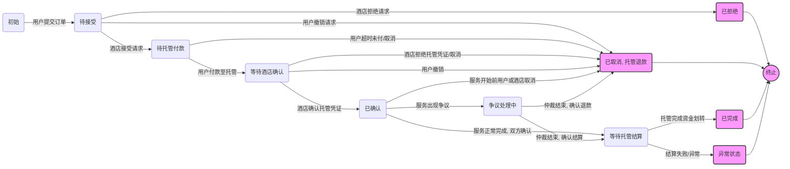

好的，我将把你提供的基于ANP协议的智能体交易方案整理成一份面向开发的Markdown格式文档，分为需求说明、流程说明、技术方案（特别是凭证、安全部分）等结构化内容，兼顾产品和技术视角，适用于团队开发协作。
我整理好后会立刻发给你审阅。

# 基于ANP协议的智能体交易方案开发文档

## 项目背景与目标

随着人工智能代理（智能体，Agent）和去中心化身份技术的发展，跨主体的在线交易正迎来新的范式。本方案旨在解决传统在线交易中的**信任与集成问题**，让不同平台的用户和服务方能够直接、安全地完成交易，而无需中心化中介。

* **问题痛点**：传统酒店预订等交易通常依赖中心化平台进行身份验证、订单处理和支付结算。不同平台接口各异，数据孤岛严重，AI 自动化代理往往需要模拟人为操作，缺乏标准化接口。此外，用户必须将数据和信任交给平台，存在隐私和安全隐患。
* **方案愿景**：利用开源的 *Agent Network Protocol (ANP)* 智能体通信协议和去中心化身份（DID）技术，构建类似“代理时代的HTTP”的通用交易网络。ANP的愿景是定义智能体互联方式，构建开放、安全、高效的协作网络。通过这一方案，不同组织/个人的智能体可以**安全自主地发现彼此、建立连接并达成交易**。这将打破平台孤岛，让AI 智能体以原生API通信，而非模拟人工网页操作。
* **为何使用ANP与智能体**：ANP采用去中心化的P2P架构，智能体间直接建立加密通信，**通过DID身份交换与验证建立信任**，再协商具体的数据交换协议。这意味着用户的个人代理和酒店的服务代理可以直接通信并验证彼此身份，而不依赖第三方。智能体能够自主执行预订、支付等任务，用户只需授权即可完成交易，提高自动化和效率。借助**W3C DID**提供的自我主权身份和\*\*可验证凭证（VC）\*\*提供的可验证证明，各方在无中心机构的情况下也能建立信任关系，提升安全与隐私。

**本方案的目标**是在确保安全、可信的前提下，实现一个通用的交易流程。例如在酒店预订场景中，用户代理可直接与酒店代理协商预订细节、交换凭证并完成结算。通过标准化的协议和凭证设计，方案具有可扩展性，可推广至票务、租车等多种场景，实现真正的平台无关、自主协作的交易网络。

## 核心概念与组件

为了理解本方案，需要掌握以下核心概念和组件：

* **智能体（Agent）**：独立自主的软件实体，代表某个参与方执行操作。智能体可以是个人用户的助手（如旅行助理AI），也可以是企业服务的代理（如酒店预订Agent）。它能根据预设策略或AI决策，自动与其他智能体通信，完成任务。
* **ANP 协议**：*Agent Network Protocol*，一种开源智能体通信协议，定位为“智能体互联网时代的HTTP”。ANP提供发现、连接和消息交换的标准，使任意智能体能够点对点加密通信。ANP在架构上包含身份与加密层、元协议协商层等。通过ANP，不同平台实现的Agent可以互相识别和交互，安全地协商交易。
* **DID（去中心化标识符）**：由W3C定义的新型全局唯一标识符，用于标识任何主体（个人、组织、设备等），不依赖中央注册机构。每个DID对应一个可解析的DID文档，其中包含控制该DID的公钥等元数据。本方案中，各智能体和参与方都有各自的 DID，用于身份认证和签名。通过DID，智能体可以在不借助集中式身份提供方的情况下验证对方身份，实现真正的去中心化认证。
* **可验证凭证（VC）**：由W3C标准定义的数字凭证格式，用于表达并证明某主体的一组声明。VC是纸质或电子证明的**加密安全数字版本**，持有者可将其出示给需验证的组织或个人。VC包含发行者签名，可由验证者通过发行者的 DID 公钥验签，确保凭证未被篡改且确系发行者签发。常见VC例子有数字身份证、学历证书，或本方案中的**预订确认凭证**等。
* **数据完整性证明（Data Integrity Proof）**：VC中用于保障数据真实性的数字签名证明形式。W3C的*可验证凭证数据完整性*规范描述了使用加密技术（数字签名和相关数学证明）确保凭证真实性和完整性的机制。本方案采用 Data Integrity Proof 来签名凭证，即在凭证数据内部嵌入一份包含签名值、验证方法、公钥引用等信息的 `proof` 对象。验证者通过DID文档获取公钥，验证该签名以确认凭证未被篡改且签发者真实可信。
* **状态机**：指订单/交易生命周期的有限状态机模型。交易从创建到完成会经历一系列状态变化和转移（例如“待接受”->“已确认”->“已完成”等）。状态机明确定义了每个状态的含义和可接受的状态迁移事件。本方案通过状态机跟踪订单进程，在不同状态触发相应处理逻辑，并借助凭证来记录重要状态的确认。

这些概念共同构成了方案的技术基础：智能体通过ANP协议相互通信，用DID进行身份认证，通过VC和数据完整性签名交换可信凭证，并以状态机管理交易流程。

## 角色定义与职责

本方案涉及多个参与方，每个参与方由相应的智能体代理执行交易交互。主要角色及其智能体职责如下：

* **用户（买方）及其用户代理**：用户是下单预订酒店的人，其智能体负责替用户执行预订流程，包括：查找酒店信息、发起订单请求、处理酒店的响应、完成支付，以及在完成预订后保存预订凭证。用户代理还负责使用用户的DID进行身份验证，提供用户必要的凭证（如身份凭证）给对方，并在需要关键操作（如支付）时请求用户授权。
* **酒店商家（卖方）及其酒店代理**：酒店提供住宿服务，其智能体代表酒店接收并处理预订请求。职责包括：发布酒店房型和价格信息，接收用户代理的下单请求，根据房态决定接受或拒绝预订；如果接受，则锁定房源并发出支付要求或预订确认；在收到用户付款凭证后签发**预订确认VC**给用户；在交易完成后执行后续服务交付。酒店代理也使用酒店的 DID 来签署凭证和验证用户身份，可根据需要要求用户提供身份/担保凭证，并在预订关键环节进行人工审核（如需要时由酒店工作人员通过代理确认）。
* **第三方服务**：根据实现，可能存在一些支持性角色：

  * **DID 提供方/解析服务**：负责DID的注册解析基础设施（例如DNS或其他Web机制），供智能体查询对方DID文档获取公钥和服务端点。本方案采用did\:wba等Web基础DID方法，可以利用现有Web基础设施发布DID文档。
  * **第三方资金托管服务（Escrow Service）**：处理实际的资金托管和转移。为保护用户权益，用户不直接支付给酒店，而是先将资金支付给中立的第三方托管服务。托管服务临时持有资金，在消费确认完成后将资金转给酒店。若消费过程有问题，托管服务可根据仲裁结果处理资金。支付完成后，托管服务出具**资金托管凭证VC**。该服务可视为一个独立Agent，与用户和酒店代理交互。
  * **仲裁者（Arbitrator）**：在争议发生时介入的角色。可以是由平台或社区指定的仲裁智能体或服务，当交易双方出现纠纷（如一方违约）时，仲裁者根据双方提交的凭证和记录做出裁决。正常情况下仲裁者不参与流程，仅在异常情况下作为后备机制。

在实际部署中，用户和酒店是主要当事方。双方的智能体直接通信即可完成绝大部分流程。第三方组件如支付网关或仲裁仅在需要时引入，以提供辅助功能。

## 业务流程（酒店预订示例）

以下以酒店预订为例，描述从用户下单到完成结算的**完整理想流程**。该流程假定用户通过其智能体直接与酒店智能体交互，在各关键步骤交换凭证并改变订单状态。

1. **发现与询价**（可选）：用户代理通过ANP网络发现目标酒店的代理（例如根据目的地搜索酒店Agent，或已有酒店Agent的DID/地址）。用户代理与酒店代理建立连接并获取房型、价格等信息。*(建立连接时，双方进行DID验证和安全信道建立，确保后续通信加密且身份可信。)*
2. **发起预订请求**：用户确认选择后，用户代理向酒店代理发送**预订请求**消息，其中包含所需房型、日期、用户DID等详情。用户代理使用自己的私钥对请求内容签名（或使用先前协商的会话令牌），以证明请求确系用户发起且未被篡改。此时订单状态进入 **“待接受（Pending）”**。
3. **酒店接受并锁定**：酒店代理收到请求，检查房间可用性和用户信誉（可选查看用户提供的相关凭证，如会员等级或信用凭证）。如果可以接受预订，酒店代理暂时锁定房间，并生成**预订要约**响应给用户代理。该响应包括预订详情、总价、付款期限等，并由酒店代理使用酒店的私钥签名或附上酒店DID认证。酒店代理可在此阶段要求**人工授权**：若预订属重大请求（比如高价套房长住），酒店可标记`humanAuthorization`要求人工确认。此时酒店工作人员在其系统中批准该要约，酒店代理才继续发送确认。*(若酒店因无房或其他原因拒绝，则跳至异常流程)*。接受预订后订单状态变为 **“待支付”**（酒店已接受，等待用户付款）。
4. **用户付款至托管服务**：用户代理解析酒店发来的要约信息，提示用户向指定的第三方资金托管服务付款。用户确认后，用户代理通过支付渠道（如银行API）将款项支付至托管服务。支付完成后，托管服务向用户代理签发**资金托管凭证VC**，证明资金已托管。用户代理随后向酒店代理发送**资金托管证明消息**，附上该VC。订单状态进入 **“等待酒店确认”**。
5. **酒店确认预订**：酒店代理收到用户代理发来的**资金托管凭证VC**后，验证该VC的有效性（签名、发行方、金额等）。验证通过后，酒店代理确认预订，并**签发预订确认VC**给用户代理。该VC包含预订详情，由酒店代理签名。酒店代理通过ANP信道发送此VC给用户代理，并将内部订单状态更新为 **“已确认（Confirmed）”**（资金已托管，预订已确认）。
6. **服务履行与确认**：用户代理收到酒店签发的**预订确认VC**，验证其签名与内容。验证通过后，用户代理存储该VC到用户的**数字凭证存储**中。用户在入住时可出示此VC，酒店代理验证后提供服务。服务完成后（例如用户退房），双方（或由酒店单方面，根据约定）向第三方资金托管服务发送**服务完成确认消息/VC**。
7. **资金结算**：第三方资金托管服务收到服务完成确认后，进行验证。验证通过后，托管服务将之前托管的资金释放给酒店商家。托管服务可签发**交易完成凭证VC**给双方，记录资金划转完成。此时，整个交易流程结束，订单状态进入 **“已完成（Completed）”**。

上述为理想情况下的流程：用户下单 -> 酒店同意 -> 用户付款至托管 -> 酒店确认预订 -> 服务履行 -> 双方确认完成 -> 托管释放资金给酒店。关键凭证包括：酒店的预订要约、托管服务的资金托管凭证、酒店的预订确认VC、服务完成确认VC、托管服务的交易完成凭证。这些凭证确保了各环节的可信度和资金安全。

交易完成后，后续还可扩展一些步骤，例如酒店代理签发**发票凭证VC**等，但这些均属于服务履行或后续阶段，不在本次交易核心流程的重点范围。

## 异常流程处理

在实际业务中，可能出现偏离理想路径的各种异常情况。方案设计了相应的处理逻辑以保证系统健壮性：

* **用户取消请求**：在订单“待接受”状态，酒店未确认前，用户可主动撤销请求。用户代理发送取消通知，酒店代理收到后停止处理该订单并释放房源。订单状态流转为 **“已取消”**（由用户）。如果用户已支付（在酒店未确认的情况下不应支付，但若发生错误支付，也应原路退款）。
* **酒店拒绝预订**：酒店代理因满房或其他原因无法接受请求，则发送拒绝响应。订单状态记为 **“已拒绝”**。用户代理通知用户预订失败，并可提示原因或引导用户选择其它选项。任何已交换的临时凭证作废。此种情况下交易结束，无后续结算。
* **用户逾期未支付**：酒店已接受订单并进入“待支付”状态后，若用户在规定期限内未完成支付，酒店代理将超时关闭订单。酒店可在后台设置计时器，超过期限后发送订单取消通知给用户代理，并将状态置为 **“已取消”**（因用户未付款）。酒店同时释放先前锁定的房间库存。如用户后来尝试支付，酒店应拒绝并可能要求重新下单。
* **酒店确认超时/未响应**：用户付款后一定时间内如未收到酒店确认（可能酒店代理崩溃或网络问题），用户代理应启动补救。首先重试与酒店通信，若仍无回应，可寻求仲裁或自动退款：例如如果付款是链上交易且酒店未签发凭证，智能合约可在超时后将款退还给用户。如果没有自动机制，则用户可凭支付凭证联系平台或仲裁方介入解决。
* **支付失败或错误**：如果用户在支付阶段遇到支付失败（如余额不足、网络错误导致支付未成功），用户代理会通知支付失败，订单仍停留在“待支付”。用户可重试支付或取消订单。如用户选择取消，则按用户取消流程处理。若支付金额不符（用户支付了错误金额），酒店代理验证时会发现凭证不符，视为支付未完成，可要求用户补足或取消订单并退款。
* **酒店单方面取消**：在少数情况下，酒店在确认后可能无法履约（如设施故障导致无法提供房间）。酒店代理应立即通知用户代理取消订单，状态设为 **“已取消”**（由酒店）。同时酒店需要向用户提供赔偿措施：例如签发一张**取消声明VC**说明取消原因，并附上退款或赔偿条款。用户代理收到后可验证酒店签名，随后执行退款流程，将交易结果存档以备日后追索。
* **凭证校验失败**：任一方收到对方发送的凭证如果验证不通过（签名无效或内容不符），应视为异常并中止流程。比如酒店收到用户的支付凭证VC，但签名验证失败，则酒店应拒绝确认并要求重发或走人工核实流程。再如用户收到酒店的预订确认VC，但发现签名不匹配酒店DID，这可能是伪造，用户应拒绝接受并通知酒店重新签发。通过严格的凭证校验，防止中间人篡改信息。
* **通信中断**：如果在流程中通信中断（智能体宕机、网络异常），另一方智能体应在等待一段时间后重试或终止交易。ANP协议层可实现一定的重试和故障转移机制。对于关键阶段（如支付后等待确认），一旦通信恢复，智能体应首先同步当前订单状态，确保双方一致。如果无法恢复联系，则按超时未响应处理。
* **争议处理**：若交易过程中或事后出现争议（如用户声称已付款但酒店否认，或酒店声称提供了服务但用户否认入住），双方可提交各自保存的**凭证证据**。例如用户出示支付凭证和酒店预订确认VC，酒店出示日志和链上记录。仲裁方核验这些凭证的签名和时间戳（配合链上不可篡改记录），判定事实归责。争议处理可能按预先约定的仲裁规则进行，比如由行业协会或智能合约预定义裁决逻辑。

通过上述异常分支处理，系统能在各种不利条件下**保证交易的一致性和资金安全**。大部分异常场景下，状态机会进入某个终止状态（取消/拒绝），并在必要时触发补偿动作（如退款、通知）。所有关键动作都应有凭证或日志留存，以便追溯和仲裁。这样即使无人为介入，智能体也能根据规则自动处理大多数异常，提升交易可靠性。

## 凭证与安全设计

**凭证体系**是本方案安全性的核心。我们采用 **W3C 可验证凭证（VC）** 标准并结合**数据完整性签名**机制，来设计交易中的各种凭证。下面详细说明凭证设计、结构、验证方式及其背后的安全考虑：

* **采用标准**：方案中的数字凭证均遵循 W3C 的 VC 数据模型标准，并使用 **数据完整性证明（Data Integrity Proof）** 作为签名方案。VC标准提供了颁发者、持有者、验证者三方模型和扩展性数据格式，使凭证**防篡改且可跨主体验证**。相比私有格式，采用这一国际标准有助于不同系统互操作，并利用社区已验证的安全方案。
* **凭证类型设计**：根据业务需要定义若干 VC 类型及其数据结构。例如：

  * *预订确认凭证*（BookingConfirmationCredential）：由酒店代理签发给用户，证明特定用户已预订特定酒店房间。它包含预订ID、酒店信息、房间与日期、用户DID等字段，类型可定义为`["VerifiableCredential", "BookingConfirmation"]`。
  * *支付凭证*（PaymentReceiptCredential）：（可选）由支付服务或用户代理签发，用于证明支付金额、时间、收款方等，用于传递给酒店作为付款证明。
  * 其他业务扩展如 *取消凭证*、*入住完成凭证* 等也可定义相应类型。所有凭证应在`@context`中声明所使用的语义扩展，以保证验证者正确理解字段含义。
* **凭证结构示例**：以下是“预订确认凭证”的JSON结构示例：

```json
{
  "@context": [
    "https://www.w3.org/ns/credentials/v2",
    "https://example.com/booking-context-v1.json"
  ],
  "id": "urn:uuid:123e4567-e89b-12d3-a456-426614174001",
  "type": ["VerifiableCredential", "BookingConfirmation"],
  "issuer": "did:wba:hotel.com:abc123",        // 酒店代理的DID
  "issuanceDate": "2025-05-02T16:45:00Z",
  "credentialSubject": {
    "id": "did:wba:user.com:xyz789",          // 用户的DID
    "reservation": {
      "hotelName": "示例酒店",
      "roomType": "豪华大床房",
      "checkIn": "2025-06-01",
      "checkOut": "2025-06-05",
      "reservationId": "ABC-20250601-0001"
    }
  },
  "proof": {
    "type": "DataIntegrityProof",
    "proofPurpose": "assertionMethod",
    "verificationMethod": "did:wba:hotel.com:abc123#key1",
    "created": "2025-05-02T16:45:00Z",
    "proofValue": "zK3F...Mg=="  // 酒店使用私钥对前面数据签名得到的值（经BASE64等编码）
  }
}
```

上述结构中，`proof`字段即数据完整性签名，包括签名类型、用途（assertionMethod表明这是证实某声明的签名）、验证方法（指向签名公钥的位置，通常是发行者DID文档内某公钥标识符，如`#key1`）、签名时间和签名值等。凭证的数据（除`proof`外部分）经规范的序列化和哈希后，再用发行者私钥签名得到`proofValue`。

* **签名验证方式**：验证者（例如用户收到酒店的预订VC，或酒店收到用户的支付VC）进行验证的流程一般如下：

  1. 通过凭证的`issuer`字段获取发行方DID，例如`did:wba:hotel.com:abc123`。通过DID解析机制获取该DID的DID文档，其中包含发行方的公钥信息。
  2. 从凭证的`proof.verificationMethod`中获取签名所用公钥的标识（如`...#key1`），在发行方DID文档中定位对应的公钥材料。
  3. 根据规范对凭证除`proof`外的主体内容进行规范化处理（如JSON Canonicalization，确保字段顺序和格式一致）并计算哈希。
  4. 使用提取的公钥对`proof.proofValue`进行数字签名验证。同时检查`proof.proofPurpose`是否符合预期用途（例如应为`assertionMethod`表示发行者有权签发此声明），以及`proof.created`时间是否在可信范围内等。
  5. 验证通过则说明：凭证内容自签发后未被篡改，并且确由声称的发行者签名；验证不通过则拒绝接受该凭证。

  通过上述机制，VC的真伪可独立于发行者实时在线与否而验证——只要持有发行者DID文档，就可验证签名可信度。这种分布式信任机制避免了传统集中CA或在线查询，提高了可靠性。

* **选择 Data Integrity Proof 的原因**：W3C VC规范实际上支持两种主要签名方案：一种是如上所述的嵌入式数据完整性签名（也称Linked Data Proof），另一种是基于JWT的紧凑证明形式。方案采用前者，主要基于以下考虑：

  * *去中心化信任*：Data Integrity Proof 直接使用DID的公私钥体系进行签名验证，无需依赖JWT的颁发机构集中验证。它适合**跨主体的自主信任**模型，各参与方只需信任对方的DID及其公钥绑定关系。
  * *丰富的语义扩展*：使用JSON-LD上下文，凭证可以包含语义明确的自定义字段，方便扩展更多场景。而JWT通常以固定的声明字段为主，在表达复杂结构化数据时不如JSON-LD灵活。
  * *安全性和完整性*：数据完整性签名将凭证原始数据进行规范化再签名，确保签名覆盖的数据范围明确且不可被遗漏（包括上下文语义）。它还能支持选择性披露等高级特性（通过特定加密套件，如BBS+签名，实现仅披露VC部分信息），增强隐私保护。
  * *社区支持*：W3C正推进VC Data Integrity 1.0成为新标准，已有Ed25519、ECDSA等成熟签名套件。采用此方案可获得更广泛的工具支持和标准更新保障。

  总体而言，凭证体系遵循**标准化、安全化、可验证**的原则设计，确保交易过程中的关键数据（订单确认、支付等）都有可信凭证作为依据。这为后续的争议解决和合规审计提供了技术保障。

## 状态机与流程图

为了直观描述引入第三方资金托管后的订单生命周期，我们使用一个有限状态机来表示预订交易的状态变化路径。下面总结酒店预订从下单到完成可能经历的状态及转换关系：



**状态说明**：

*   **初始**：订单尚未创建。
*   **待接受（Pending）**：酒店收到请求，尚未答复。
*   **待托管付款（AwaitingEscrowPayment）**：酒店接受预订，等待用户向托管服务付款。
*   **等待酒店确认（AwaitingHotelConfirmation）**：用户已付款至托管，等待酒店验证托管凭证并确认预订。
*   **已确认（Confirmed）**：酒店已确认预订，资金在托管中，等待服务履行。
*   **等待托管结算（AwaitingEscrowSettlement）**：服务已完成并确认，等待托管服务将资金划转给酒店。
*   **争议处理中（DisputeInProgress）**：服务履行出现争议，已通知托管服务暂停结算，等待仲裁结果。
*   **已拒绝（Rejected）**：酒店拒绝了预订请求，订单终止。
*   **已取消（Cancelled）**：订单在不同阶段被取消，如需退款，需通知托管服务处理。订单终止。
*   **已完成（Completed）**：服务完成，资金结算完毕，订单圆满结束。
*   **异常状态（ErrorState）**：出现未能自动处理的异常（如结算失败），需人工介入。

上述状态机及说明清晰地定义了引入资金托管后的交易流程和状态转换。每次重要状态改变都伴随着凭证的产生或交换。这种设计保证了业务流程的清晰可控，并为异常处理和资金安全提供了保障。

## 技术选型建议

在实现本方案时，需要在若干技术细节上进行选型权衡。以下是针对凭证签名、数据格式、链上记录等方面的建议：

* **凭证签名算法**：推荐采用**Ed25519**椭圆曲线签名算法。Ed25519 属于 EdDSA 家族，具有高速和安全的特性，已被W3C 数据完整性候选标准之一收录。具体而言，可使用 *Data Integrity EdDSA Cryptosuite v1.0*，以Ed25519密钥对凭证进行签名和验证。Ed25519 密钥长度短、签名验证开销低，适合移动设备和高并发场景。如果需要与现有系统兼容，也可考虑 ECDSA（如secp256k1或P-256）套件，但应注意实现正确性。所有参与方应使用一致的签名算法，便于互相验证。
* **上下文管理**：由于VC使用 JSON-LD 上下文定义凭证语义，建议制定**固定版本的上下文文件**。比如为预订凭证定义 `booking-context-v1.json`，包含 *reservation* 等字段的映射，托管在可信任的URL。为避免上下文动态加载的不确定性，可在文件中加入散列校验，或在验证端使用本地缓存的上下文。另一种思路是采用 W3C VC JSON模式规范，将凭证约束为特定JSON Schema，从而在不使用JSON-LD解析的情况下也能保证数据结构正确。无论哪种方式，目标是确保所有实现对关键字段的解释一致，避免上下文被恶意篡改或版本差异导致验证混乱。
* **数据交换格式**：ANP协议本身支持JSON等格式传输消息。本方案建议统一采用**JSON格式**作为智能体间数据交换的封装格式，并在需要描述语义时嵌入 JSON-LD 片段（如凭证部分）。JSON易于解析且被大多数编程语言原生支持。对于Agent的接口调用，可使用JSON-RPC 2.0标准以提高互通性。在高效性要求高的子系统间，可考虑使用CBOR（二进制JSON）或Protobuf来序列化数据，但要权衡兼容性。在保证安全的前提下，尽量选用开发者熟悉、生态成熟的格式以降低实现复杂度。
* **（可选）可信时间戳与存证**：为了增强凭证的不可否认性，可以将重要凭证（如预订确认、交易完成凭证）的哈希提交给独立的可信时间戳服务（Trusted Timestamping Authority, TSA）进行盖章，或记录在安全的、仅追加的日志系统中。这有助于在发生争议时证明凭证在特定时间点的存在性和完整性，而无需依赖特定的分布式账本技术。
* **密码学敏捷性**：系统设计应允许未来更换密码学算法（如哈希函数、签名算法等）而不影响已有的凭证或交易。例如，VC格式本身支持声明所用算法，未来可添加新的算法套件。避免硬编码特定算法。
* **模块化松耦合**：将整个交易流程拆解为可独立演进的模块（身份认证、凭证服务、业务流程、支付/托管接口等）。模块之间通过清晰接口交互，例如用标准消息或凭证桥接，使替换某一模块不会影响全局。例如，可替换DID方法或更换托管服务提供商而不影响核心业务逻辑。松耦合提高了系统的可维护性和升级弹性。
* **选择 DID 方法**：选择合适的 DID 方法实现去中心化身份。例如本方案示例使用 `did\:wba`（Web Based Agent）方法，它利用现有DNS系统发布DID文档。开发中也可考虑 **did\:web**（基于域名托管DID文档）或 **did\:ethr**（基于以太坊存储DID文档哈希）等方法。关键是方法应被双方实现支持，并满足性能要求。对于企业酒店，did\:web或did\:wba很实用（绑定其官网域名），对于个人用户，可由用户所在平台提供DID或使用公共DID网络。
* **存证与日志**：除链上记录外，系统也应在本地保存交互日志和原始凭证。建议用户代理和酒店代理都维护**审核日志**，记录每一步收到/发出的消息摘要、重要状态改变时间，以及相关凭证ID。这对于调试和纠纷解决很有帮助。在实现中可选用 append-only 日志结构并定期归档到安全存储，以防篡改。
* **性能与扩展**：在技术选型上也要考虑性能扩展性。比如，密码学库应选用经过审计优化的实现；DID解析过程可以做缓存（特别是常交互的对象）；对于高并发请求，状态机管理可以用轻量级并发结构或消息队列防止阻塞。数据格式上尽量减少不必要的大字段传输（如不在凭证里嵌入高分辨图片等），保证交互快速。

综合而言，技术选型需要在**标准合规**与**工程实用**之间取得平衡。上述建议提供了一个方向：采用成熟的加密算法与标准格式，充分利用链上可信机制，同时注意性能与实现简洁。这将有助于开发团队高效地构建出安全可靠的智能体交易系统。

## 安全考虑

安全性对于一个去中心化的交易方案至关重要。本方案在设计和实现中应重点关注以下安全要点：

* **密钥管理**：参与各方（用户、酒店）的DID私钥必须安全保管，杜绝泄露。建议在客户端使用**安全硬件或加密模块**存储私钥（如手机的安全元件、HSM模块），私钥从不明文出现在内存。支持定期轮换密钥，长周期使用的DID可以支持密钥更新，将新公钥发布到DID文档，同时废止旧公钥，以降低长期密钥泄露风险。用户层面，可采用助记词备份或多设备同步DID的方式保障不丢失。对于服务器端的酒店代理，私钥应存于服务器安全区域，并限制只有签名操作能使用。密钥管理的总原则是**最小暴露面**和**保密性**，任何时候私钥都不可导出或日志记录。
* **身份验证与授权**：在智能体初次通信时，需要相互验证身份来源可信。一方面，用户代理应验证自己连接的确实是目标酒店的代理（例如检查对方DID是否匹配官方域名，SSL证书是否可信等），防止连接到钓鱼Agent。另一方面，酒店代理通过DID签名挑战验证用户代理身份，建立会话后发放临时令牌用于后续请求认证，避免每次都重复签名开销。除身份认证外，还需关注**操作授权**：智能体默认可以自主执行部分操作，但对于涉及敏感信息或大额支付的行为，必须征得人类主人明确授权。例如在用户代理要执行扣款时，弹出用户生物识别验证或手动确认，获取授权签名（humanAuthorization），才继续操作。这种双重控制确保即便用户代理遭入侵或出错，也无法擅自做出不可挽回的动作。
* **通信安全**：所有Agent之间的通信必须采用加密通道传输，防止窃听和中间人攻击。建议使用**TLS 1.3+**协议进行HTTPS通信，并严格验证对方TLS证书链的有效性。ANP协议如果基于HTTP，可以直接复用HTTPS安全层。如果Agent通过消息中继或P2P网络通信，则应在应用层使用各自公私钥进行 **端到端加密**。DID提供了身份层的公钥，可用于协商对称会话密钥，加密后续通联。针对重放攻击，服务端必须检查每个请求附带的**时间戳和随机数（Nonce）**，避免旧消息被伪造重放。服务器应维护一定期限内已见过的Nonce列表，不接受重复Nonce的请求。同时，要求请求中的时间戳不得偏离当前时间太久，以防止截获消息延迟使用。通过这些措施，确保消息**机密性、完整性和抗重放**。
* **超时与重试**：在分布式环境中，超时机制是必要的安全保障，防止资源一直占用或攻击者拖延流程。设计应为关键等待环节设置**超时时间**：如等待支付确认、等待对方响应等。一旦超时，自动触发相应处理（取消订单、退款等），并通知用户/管理员。实现时可使用定时器或任务调度来监控状态机停留时长。对于可能的瞬时网络错误，允许**有限次重试**，但要注意如果对方长时间无响应，不应无限重试以免资源浪费。此外，超时的处理结果也要通知对方，以免对方稍后继续操作造成不一致。
* **争议解决机制**：尽管前述流程和凭证降低了争议可能，但仍需制定争议解决手段。例如，可以引入**仲裁智能合约**：在付款时资金进入合约托管，在消费确认完成后将资金释放给酒店。若有争议，则由预先选定的仲裁者来裁定合约把资金给哪方。这种机制确保经济利益有人担保。若未使用链上托管，则至少应在协议层规定争议提交流程——双方提交凭证给仲裁代理或仲裁人，人为介入判断。重要的是，所有凭证都具有可验证性，使得即使仲裁者不认识双方，也可通过凭证链证明来判断对错。另外，可考虑在智能体网络内建立**信誉体系**，记录各参与方的履约记录，一旦某方多次发生纠纷且被判负，有可能降低其信誉评分，促使各方珍惜信用，减少恶意争议。
* **最小权限原则**：智能体应只获取和暴露完成交易所需的信息，避免过度授权。比如用户代理在预订过程中只向酒店提供必要的凭证（预订相关和支付证明），不应泄露用户其他隐私数据。DID可以采用**多DID策略**，针对不同场景使用不同DID来保护隐私。酒店代理对外也只暴露预订接口，不应开放敏感管理接口。代码实现层面，尽量隔离各模块权限，防止一个组件被攻破后影响全局。
* **日志和监控**：建立完善的安全监控和日志审计机制。所有异常情况（认证失败、签名不符、重复消息等）都应记录日志，严重的触发报警通知运维人员。可以部署IDS/IPS在智能体网络入口，检测异常流量模式。还可对凭证验证失败的情况进行统计分析，判断是否存在伪造攻击企图。一旦监测到安全事件，应有相应应急处理（如暂时中止相关交易、通知受影响用户重置凭证等），将损失降到最低。

整体来说，安全设计贯彻在方案的各层面，从身份认证、通信、流程控制到后续审计都要覆盖。借助DID和VC提供的密码学保证，加上完善的策略和工程措施，该方案能够实现**零信任架构**下的可靠交易：各方不需事先信任，却可通过技术手段建立信任链条，安全地完成交易。

## 设计原则与可扩展性

在设计本方案的过程中，我们遵循了一系列重要原则，这些原则确保系统具有健壮性和长期演进能力。同时，方案的模块化设计使其易于扩展到更多业务场景。

**设计原则**：

* **去中心化**：系统不依赖单一中央实体来运作，身份认证和数据验证由分布式机制（DID+VC）完成。这避免了单点故障和垄断，赋予参与各方更大自主权，也符合自我主权身份（SSI）的理念。
* **标准化互操作**：采用W3C等国际标准（DID、VC、JSON-LD、OAuth2等），保证不同实现、不同机构的智能体能够互相通信理解。标准化降低了集成成本，使系统具备**跨平台互联互通**能力。例如，一个采用Java开发的用户Agent也能与Python开发的酒店Agent顺畅交互，只要遵循同一协议规范。
* **安全优先**：在架构和实现上始终将安全放首位，使用成熟的加密算法和协议，设计严格的验证和授权流程，防范已知攻击手法（MITM、重放等）。所有关键数据都有签名/哈希保护，实现**防篡改、可验证、可追溯**。同时注重用户隐私，非必要不收集或暴露多余信息。
* **用户控制与体验**：虽然是Agent自动交易，但最终控制权在用户。系统设计尊重用户的知情与 consent，提供透明的过程记录和可审核凭证。重要决策点让用户参与或预先配置策略，避免黑箱操作。另一方面，通过Agent自动处理繁琐步骤，大幅提升用户体验，让交易像对话一样自然流畅。
* **模块化松耦合**：将整个交易流程拆解为可独立演进的模块（身份认证、凭证服务、业务流程、支付接口等）。模块之间通过清晰接口交互，例如用标准消息或凭证桥接，使替换某一模块不会影响全局。例如，可替换DID方法或更换区块链类型而不影响业务逻辑。松耦合提高了系统的可维护性和升级弹性。
* **弹性和容错**：基于状态机和超时、重试机制，使系统具备应对异常的弹性。即使某环节出问题，系统能平稳转入异常处理，不会崩溃或卡死。冗余的日志和链上记录也提供了事后恢复依据。扩容方面，Agent可以水平部署多个，利用网络节点松散连接的特性，易于扩展参与节点数量。

**可扩展性**：

得益于以上原则和VC的灵活数据模型，本方案可以较容易地拓展到其他交易场景。以下举例说明如何支持更多应用：

* **票务场景**：类似酒店预订，演唱会门票预订也可用智能体完成。角色变为**观众代理**和**主办方代理**。流程：观众Agent下单购票 -> 主办方Agent确认席位待支付 -> 观众支付 -> 主办方签发**电子门票VC**给观众。门票VC可以包含演出信息、座位号、二维码等，由主办方签名。观众在入场时出示门票VC，由验票Agent验证签名真伪和未使用状态即可放行。状态机可增加“已使用”状态表示票已检。凭证和流程的框架与酒店方案类似，仅具体字段和角色名称不同。
* **租车场景**：角色为**租客代理**和**租车公司代理**。用户Agent选择车型和租期下单 -> 公司Agent确认车辆可用并发送租约待支付 -> 用户支付押金/租金 -> 公司Agent签发**租车确认VC**（相当于电子租赁合同）给用户，其中载明车辆信息、租期、责任条款等并有公司签名。取车时，用户Agent或用户本人可能需要出示驾照VC以验证资格，然后领取车辆。归还后，公司Agent检查车辆无误，可能签发**归还证明VC**给用户并退还押金。这个流程相对复杂，但都可通过扩展VC类型（租赁合同VC、归还VC等）和增加状态（使用中、已归还）实现。
* **电商购物场景**：用户Agent和商家Agent直接交易产品也是类似。可验证凭证可用作**电子发票**或**保修凭证**等。若引入物流Agent，则多方协作，凭证可包含物流签收信息等，但整体架构依然适用。
* **更多参与方协作**：本方案也支持**多方交易**。例如旅游度假套餐涉及用户、航空Agent、酒店Agent、景点门票Agent多方。用户Agent可同时与多个Agent交互，拿到各部分服务的报价凭证，综合呈现给用户。用户确认后，Agent分别锁定机票、酒店、景点并支付，最后汇总各方的确认凭证生成一个**行程组合VC**供用户保存。各子交易仍按各自的状态机执行，只是用户Agent作为 orchestrator 调度多个子Agent。因为用了标准协议和凭证，各方协作依然有序可循。
* **支持更多身份体系**：如果需要接入更多身份/信任源，例如政府签发的数字身份证明、信用评分等，也可以通过VC引入。比如酒店可要求用户提供一个由政府颁发的**身份VC**（证明年龄、姓名等）再接受预订。用户Agent在预订时就附上此VC，酒店Agent验证其签名和真实性后即可信任用户身份。这体现了方案对信任增强的扩展能力。

通过上述示例可以看到，本方案具备**场景通用性和扩展弹性**。大多数新的业务需求可以通过**增添新的VC类型**和**调整状态机流程**来支持，而无需推翻既有架构。设计理念上的去中心化和标准化，也使其容易融入未来更多元的Agent生态。例如，随着AI技术发展，不同行业的Agent会越来越多，而本方案奠定的通信和信任基础将支持它们以**一致的方式**开展协作。总体而言，我们秉持的原则是：**开放设计，渐进扩展**。在保证核心安全和稳定的前提下，让系统能够不断适应新的需求和技术潮流，真正做到“一次设计，长期演进，普适多场景”。

**结语**：基于ANP协议和智能体的交易方案，为未来互联网的自主协作提供了一种可能的蓝图。通过本开发文档的阐述，希望为工程实现提供清晰指引。从项目背景、概念、流程到安全细节，我们强调了标准与实践并重的方法。面向参与开发的工程师，这套方案既有理论依据也给出了落地建议，期待大家据此搭建出新一代安全、高效的智能体交易应用。
