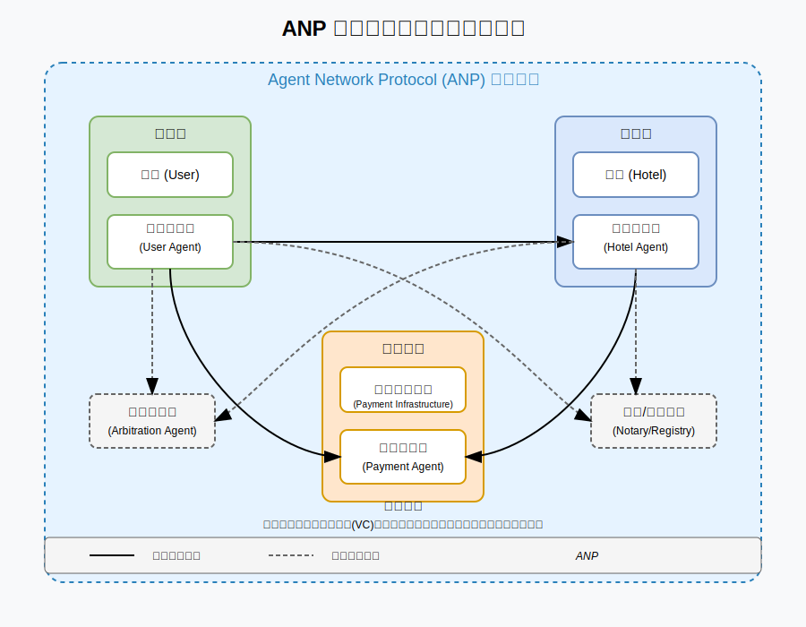
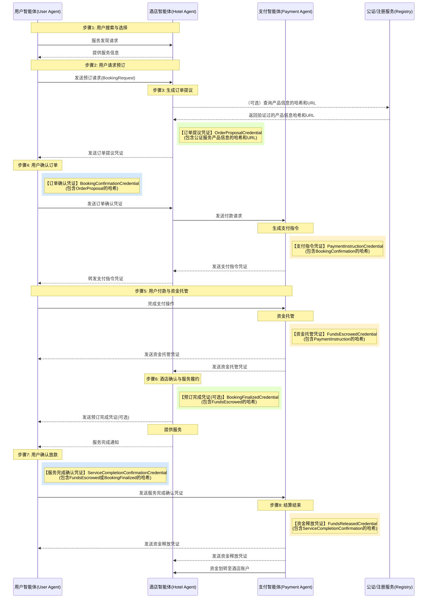
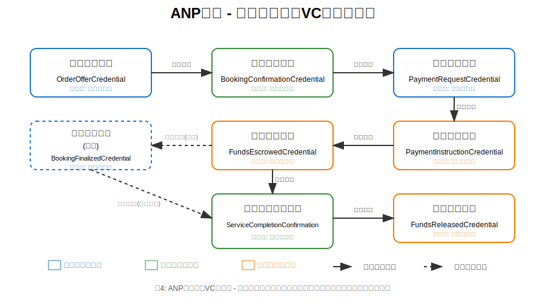

# 修改说明
使用VC Hash Chain替代Proof Chains。Proof Chains属于一个多签的方案，灵活性不是很好，并且也不好表达状态，所以使用了VC Hash Chain的方案代替。

# 基于ANP的智能体交易方案：需求与技术设计文档 (v3)

## 1. 引言

### 1.1. 问题陈述：对安全、可互操作的智能体交易的需求

当前的在线交易模型，尤其是在涉及多方参与的自动化或半自动化 B2C/B2B 交互场景（例如酒店预订、供应链协作等）中，面临诸多挑战。这些挑战包括参与方之间缺乏固有信任、数据孤岛导致信息不流通、支付与结算流程摩擦大、以及争议解决机制复杂低效等问题。随着人工智能和智能体技术的发展，自主智能体代表用户或机构进行交互和交易的需求日益增长。然而，若要让这些智能体能够安全、高效地进行协作，就必须克服上述挑战，建立一个无需依赖中心化中介机构的、健壮的交互框架。这要求有明确的协议来规范智能体的身份认证、安全通信以及可验证的数据交换。Agent Network Protocol (ANP) 的愿景正是为了解决智能体网络的互联互通和高效协作问题，打破数据孤岛，让AI能够访问完整的上下文信息 (1)。

### 1.2. 解决方案概述：一个基于ANP的智能体交易框架

本方案提出一个基于智能体技术的交易框架，旨在解决上述问题。该框架利用代表各参与方（如用户、酒店、支付平台、仲裁机构）的智能体，通过 Agent Network Protocol (ANP) 进行交互 (2)。核心技术栈包括：

1. **Agent Network Protocol (ANP)**: 作为智能体之间通信的基础协议，定义发现、交互和消息传递机制，旨在实现安全、可互操作的通信 (2)。
2. **去中心化标识符 (Decentralized Identifiers, DIDs)**: 用于唯一标识各参与方及其智能体，并关联验证其身份所需的公钥等信息，是建立信任的基础 (3)。
3. **W3C 可验证凭证 (Verifiable Credentials, VCs) 及数据完整性证明 (Data Integrity Proofs)**: 用于在交易过程中交换结构化、可验证的数据声明（如订单提议、支付确认），确保信息的真实性、完整性和不可否认性 (6)。通过在凭证主体中包含前序凭证的哈希值，实现凭证链的不可篡改性。

本文档将以用户预订并支付酒店为例，详细阐述该框架的需求、核心流程、技术设计和安全机制。整个设计遵循最小信任、可追溯性、自动化、用户控制和互操作性等原则，旨在构建一个更安全、透明、高效的去中心化交易生态。

## 2. 系统需求

### 2.1. 功能需求

- **智能体能力**:
  - **用户智能体**: 必须能够发现服务、请求预订、验证酒店凭证、生成确认凭证、处理支付指令、发起支付、确认服务完成或发起争议。
  - **酒店智能体**: 必须能够发布服务信息、生成订单提议凭证（含报价）、临时锁定库存、验证用户确认凭证、向支付方发起收款请求、确认收款并最终确认预订、记录服务履约、处理取消或争议回应。
  - **支付智能体**: 必须能够接收并验证支付请求、生成支付指令凭证（如托管链接）、处理用户付款并将资金置于托管状态、发送资金状态通知凭证、根据指令（用户确认、超时、裁决）释放资金给酒店或退款给用户。
  - **仲裁智能体** (可选): 必须能够接收双方提交的证据凭证、依据规则进行调解或裁决、并生成具有约束力的"争议解决凭证"。

- **交易生命周期**: 系统必须支持完整的交易流程，包括：服务发现、报价与提议、订单确认、支付请求与指令生成、资金托管、服务履约确认、资金结算或退款、争议发起与解决。这些步骤需映射至用户输入描述的核心流程（第四部分）。

- **凭证处理**: 所有智能体必须具备签发、呈现、接收和验证特定类型可验证凭证 (VCs) 的能力。验证过程需包括对凭证数据完整性（通过proof）和签发者签名的密码学校验，以及对凭证链完整性（通过credentialSubject中的前序凭证哈希）的校验。凭证类型需覆盖交易各关键节点，如订单提议、预订确认、支付请求、资金托管确认等 (6)。

- **状态管理**: 系统必须维护交易订单的精确状态，状态的迁移由接收到的有效VCs或预定义的事件（如超时）触发。核心状态包括：新建、待付款、托管中、履约中、待结算、已结算，并可能包含已取消、争议中等。

- **异常处理**: 系统必须能够处理用户输入描述的各种异常情况（第五部分），包括：凭证验证失败、用户未付款超时、酒店无房/超卖、用户取消（支付前/后）、服务纠纷、支付失败、自动放款超时、密钥泄露/身份异常、智能体/网络中断等。处理方式需明确定义，通常涉及发送特定的错误或状态通知VC。

### 2.2. 非功能性需求

- **安全性**:
  - **通信安全**: 智能体间通信必须使用端到端加密，防止窃听和篡改（依赖ANP的安全层 (1)）。
  - **身份认证**: 必须使用基于DID的强认证机制，确保交互对象的身份真实性 (1)。
  - **数据完整性**: 所有交换的关键凭证必须使用密码学证明（如Data Integrity proofs）保护，防止篡改 (12)。
  - **不可否认性**: 凭证签发者不能否认其签发的有效凭证（通过数字签名实现）。
  - **不可篡改性**: 交易流程中的凭证应形成可验证的链条，VC Hash Chain，防止事后篡改早期凭证（通过在credentialSubject中包含前序凭证哈希实现）。
  - **密钥管理**: 必须有安全的机制来生成、存储、使用、轮换和恢复各智能体的私钥。

- **互操作性**: 系统设计必须严格遵守ANP、W3C DID、W3C VC等开放标准，以确保由不同开发商实现的智能体能够无缝交互 (2)。

- **可追溯性/可审计性**: 所有关键的交易步骤和状态变更都必须通过带有时间戳和签名的可验证凭证记录下来，形成一个不可篡改的、可供审计的记录链。VC、Data Integrity机制以及凭证主体中的哈希链是实现这一目标的核心 (12)。

- **可靠性/可用性**: 系统应具备高可用性，能够容忍部分智能体或网络节点的临时故障。需要明确消息传递的保证机制（例如，ANP是否提供消息队列或重试机制）和智能体自身的状态持久化能力 (1)。对ANP协议本身的健壮性存在依赖。

- **可扩展性**: 架构设计应能支持未来智能体数量和交易量的增长。需要考虑ANP协议在大规模应用场景下的实际性能表现 (2)。

- **隐私性**: 在满足交易需求的前提下，应考虑保护用户隐私。例如，限制向支付智能体披露不必要的订单详情。选用W3C VC标准也为未来采用选择性披露技术（如基于BBS+签名的VCs (13)）提供了可能性。
## 3. 核心概念与架构

### 3.1. 关键术语

- **ANP (Agent Network Protocol)**: 一个旨在实现智能体之间安全、可互操作通信的开源协议框架。它定义了智能体的发现、交互和消息传递机制，其目标是成为智能体时代的HTTP (15)。
- **智能体 (Agent)**: 代表特定实体（用户、酒店等）执行任务的自主软件程序，能够通过ANP协议进行交互。
- **DID (Decentralized Identifier)**: 去中心化标识符。一种新型的、全局唯一的标识符，使实体能够生成和控制自己的标识符，无需依赖中心化注册机构 (3)。DID可解析为一个DID文档。
- **DID 文档 (DID Document)**: 包含与DID关联的信息的数据集，例如用于验证的密码学材料（公钥）、服务终端点等 (16)。
- **可验证凭证 (Verifiable Credential, VC)**: 一组由签发者（Issuer）就某个主体（Subject）做出的声明（Claims），并附带密码学证明（Proof），使得验证者（Verifier）可以独立验证其真实性和完整性 (6)。通常使用JSON-LD格式表示 (18)。
- **数据完整性证明 (Data Integrity Proof)**: 一种用于保护VC或其他数字文档真实性和完整性的密码学证明机制，通常嵌入在VC的proof属性中 (12)。
- **VC哈希链 (VC Hash Chain)**: 本方案采用的一种机制，通过在每个VC的credentialSubject中包含前一个VC的哈希值，将多个VC按顺序链接起来，以确保凭证序列的完整性和抗篡改性。
- **状态机 (State Machine)**: 描述交易（如订单）在其生命周期中所经历的一系列明确定义的状态，以及触发状态迁移的事件和条件。
- **签发者 (Issuer)**: 创建并签发VC的实体（例如，酒店智能体签发订单提议VC）(6)。
- **持有者 (Holder)**: 持有并按需出示VC的实体（例如，用户智能体持有酒店的订单提议VC）(7)。
- **验证者 (Verifier)**: 接收VC并验证其有效性的实体（例如，酒店智能体验证用户确认VC）(7)。
- **凭证主体 (Credential Subject)**: VC中声明所涉及的实体（例如，酒店预订VC的主体是用户和预订详情）(6)。在本方案中，除首个VC外，还包含前一个VC的哈希值。
- **密码套件 (Cryptosuite)**: 定义了用于生成和验证Data Integrity证明的具体密码学算法组合（如转换算法、哈希算法、签名算法）(12)。
- **DID 解析 (DID Resolution)**: 将DID转换为对应的DID文档的过程，通常由DID解析器完成 (16)。
- **可验证数据注册表 (Verifiable Data Registry, VDR)**: 用于记录和管理与VCs和DIDs相关数据的系统，如DID文档、VC模式、吊销列表等。可以是数据库、分布式账本或其他可信系统 。

### 3.2. 系统架构概述

本方案采用基于智能体的分布式架构。各个参与方（用户、酒店、支付平台、仲裁机构）由其各自的智能体代表。这些智能体分布在网络中，通过ANP协议进行点对点或多点通信。

核心交互流程不依赖中心化的业务平台进行状态协调，而是通过在智能体之间传递和验证带有密码学证明（Data Integrity Proofs）的可验证凭证 (VCs) 来驱动状态转换和建立共识。信任的建立基于密码学而非平台信誉：

1. **身份验证**: 通过DID及其关联的DID文档进行。智能体间的通信需先通过ANP的身份认证层进行身份确认 (15)。
2. **数据验证**: 通过验证VC中的Data Integrity证明来确保信息的真实性、完整性和来源可信性 (12)。
3. **流程完整性**: 通过在VC的credentialSubject中包含前序VC的哈希值，形成VC哈希链，确保历史记录的不可篡改性。

ANP协议栈提供了底层的安全通信（加密）和身份认证（基于DID）能力，以及可能的上层协议协商（Meta-Protocol）和应用协议框架 (15)。本方案主要利用其身份/加密层和消息传递能力来交换预定义的VCs。

下图展示了系统中各参与角色及其关系的架构概览：



*图1：ANP智能体点对点交易系统架构图 - 展示了用户、酒店、支付系统及可选的仲裁与公证服务之间的交互关系。所有智能体间通信均基于ANP协议，通过可验证凭证(VC)进行信息传递与验证。*

### 3.3. 参与方角色与职责

下表详细说明了系统中的主要参与方及其智能体的职责：

**Table 1: Participant Roles**
| 角色 | 职责关键词 | 详细说明 |
|------|------------|----------|
| **用户 (User)** | 最终消费者 | 需要酒店服务的个人。 |
| **用户智能体 (User Agent)** | 选购 → 确认 → 付款 → 履约反馈 / 纠纷 | 代表用户的软件智能体。管理用户DID和私钥，通过ANP发现服务、请求预订、验证酒店凭证、生成确认凭证、处理支付指令、发起支付、确认服务完成或发起争议，所有交互通过ANP进行。负责存储和验证凭证链（通过哈希链接）。 |
| **酒店 (Hotel)** | 服务提供商 | 提供住宿服务的实体。 |
| **酒店智能体 (Hotel Agent)** | 报价 → 锁房 → 校验确认 → 发起收款 → 提供服务 | 代表酒店的软件智能体。管理酒店DID和私钥，发布服务信息、生成订单提议凭证（含报价）、临时锁定库存、验证用户确认凭证、向支付方发起收款请求、确认收款并最终确认预订、记录服务履约、处理取消或争议回应，所有交互通过ANP进行。负责存储和验证凭证链（通过哈希链接）。 |
| **支付基础设施 (Payment Infrastructure)** | 资金处理平台 | 如支付宝、银行等，提供支付、托管、结算服务的平台。 |
| **支付智能体 (Payment Agent)** | 托管资金 → 状态通知 → 结算 / 退款 | 代表支付基础设施的软件智能体。管理其DID和私钥，接收并验证支付请求、生成支付指令凭证（如托管链接）、处理用户付款并将资金置于托管状态、发送资金状态通知凭证、根据指令（用户确认、超时、裁决）释放资金给酒店或退款给用户，所有交互通过ANP进行。负责存储和验证凭证链（通过哈希链接）。 |
| **仲裁智能体 (Arbitration Agent)** (可选) | 受理争议 → 调解 / 裁决 | 代表中立第三方争端解决机构的软件智能体。管理其DID和私钥，在用户和酒店无法协商解决争议时介入，接收双方提交的证据凭证，依据规则进行调解或裁决，并生成具有约束力的"争议解决凭证"，相关交互通过ANP进行。 |
| **公证/注册服务 (Notary/Registry Service)** (可选) | 存储/证明服务信息 | 提供一个可信的第三方服务，用于存储和证明酒店/产品信息的哈希值或其他关键属性，供VC引用。 |

表1价值说明: 此表清晰地界定了系统中的各个参与者及其核心职责。这对于理解后续的流程设计、智能体交互逻辑以及功能需求的分配至关重要。它确保了系统设计的完整性，明确了每个角色的预期行为。新增了可选的公证服务角色。

## 4. 流程规范

### 4.1. 理想交易流程与状态转换

以下是用户预订并支付酒店的理想流程，所有智能体间的交互均通过ANP协议传递VC消息来驱动。关键凭证之间通过在credentialSubject中包含前序凭证的哈希值进行链接，确保顺序和不可篡改性。

**步骤 1: 报价与锁房 (Offer & Lock Inventory)**
- **触发**: 用户智能体向酒店智能体发送询价或预订请求（可通过ANP发现服务）。
- **处理**: 酒店智能体检查库存和价格。
- **凭证生成**: 酒店智能体生成 "订单提议凭证 (Order Offer Credential)" (VC Type: OrderOfferCredential)。 
  - credentialSubject 必须包含关键服务详情：房型、价格、有效期、取消政策、订单临时ID等。
  - (可选) 可包含服务详情的哈希值及指向外部公证/注册服务  的指针。
  - 使用酒店私钥签名，生成proof。
- **状态**: 酒店侧临时锁定相应库存。订单进入 提议中 (Offered) 状态。
- **交互**: 通过ANP将 OrderOfferCredential 发送给用户智能体。

**步骤 2: 用户确认 (User Confirmation)**
- **触发**: 用户智能体收到并验证 OrderOfferCredential 的签名和内容。用户决定确认预订。
- **凭证生成**: 用户智能体生成 "预订确认凭证 (Booking Confirmation Credential)" (VC Type: BookingConfirmationCredential)。 
  - credentialSubject 包含引用 OrderOfferCredential 的ID，表明接受提议，并包含前一个VC (OrderOfferCredential) 的哈希值（例如，存储在 previousCredentialHash 属性中）。
  - 使用用户私钥签名，生成proof。
- **交互**: 通过ANP将 BookingConfirmationCredential 发送给酒店智能体。
- **状态**: 酒店智能体验证 BookingConfirmationCredential 及其proof和previousCredentialHash后，将订单状态更新为 待付款 (Pending Payment)。

**步骤 3: 收款申请 (Payment Request)**
- **触发**: 酒店智能体收到有效的 BookingConfirmationCredential。
- **凭证生成**: 酒店智能体生成 "支付请求凭证 (Payment Request Credential)" (VC Type: PaymentRequestCredential)。 
  - credentialSubject 仅包含必要支付信息：orderId (或引用BookingConfirmationCredential的ID)、amount、currency、payeeDid (Hotel)、payerDid (User)、paymentAgentDid。不包含详细的酒店或商品信息以保护隐私。 包含前一个VC (BookingConfirmationCredential) 的哈希值（例如，previousCredentialHash）。
  - 使用酒店私钥签名，生成proof。
- **交互**: 通过ANP将 PaymentRequestCredential 发送给指定的支付智能体。
- **状态**: 订单状态更新为 付款待启动 (Payment Initiation Pending)。

**步骤 4: 托管指令生成与转发 (Escrow Instruction Generation & Forwarding)**
- **触发**: 支付智能体收到并验证 PaymentRequestCredential 及其proof和previousCredentialHash。
- **凭证生成 (支付智能体)**: 支付智能体生成 "支付指令凭证 (Payment Instruction Credential)" (VC Type: PaymentInstructionCredential)，包含支付交易ID、金额、支付方式详情（如托管支付链接/二维码）、支付截止时间等。 
  - credentialSubject 包含前一个VC (PaymentRequestCredential) 的哈希值（例如，previousCredentialHash）。
  - 使用支付平台私钥签名，生成proof。
- **交互 1 (支付智能体 -> 酒店智能体)**: 支付智能体通过ANP将 PaymentInstructionCredential 发送给酒店智能体。
- **交互 2 (酒店智能体 -> 用户智能体)**: 酒店智能体收到并（可选地）验证 PaymentInstructionCredential 后，通过ANP将其转发给用户智能体。
- **状态**: 支付任务进入 待支付 (Awaiting Payment) 状态。

**步骤 5: 用户付款与资金托管 (User Payment & Escrow)**
- **触发**: 用户智能体收到（来自酒店智能体转发的）并验证 PaymentInstructionCredential 及其proof和previousCredentialHash。用户通过凭证提供的链接/方式完成支付操作。
- **处理**: 资金进入支付平台的托管账户。
- **凭证生成**: 支付智能体确认资金到账（进入托管），生成 "资金托管凭证 (Funds Escrowed Credential)" (VC Type: FundsEscrowedCredential)。 
  - credentialSubject 包含交易ID、订单ID、金额、时间戳等，并包含前一个VC (PaymentInstructionCredential) 的哈希值（例如，previousCredentialHash）。
  - 使用支付平台私钥签名，生成proof。
- **交互**: 通过ANP将 FundsEscrowedCredential 发送给用户智能体和酒店智能体。
- **状态**: 订单状态更新为 托管中 (Escrowed)。

**步骤 6: 酒店确认与服务履约 (Hotel Confirms & Service Delivery)**
- **触发**: 酒店智能体收到并验证 FundsEscrowedCredential 及其proof和previousCredentialHash。
- **处理**: 酒店正式确认预订，锁定资源。
- **凭证生成 (可选)**: 酒店智能体可生成 "预订完成凭证 (Booking Finalized Credential)" (VC Type: BookingFinalizedCredential) 发送给用户，其credentialSubject包含前一个VC (FundsEscrowedCredential) 的哈希值。
- **服务**: 用户按预订到店，酒店提供服务。
- **状态**: 订单进入 履约中 (In Service / Fulfillment) 状态。
- **履约完成**: 服务结束后，酒店智能体可通过ANP向用户智能体推送服务完成的提示信息或凭证（例如 ServiceCompletedNotification，也可作为VC链接到凭证链）。

**步骤 7: 用户确认放款 (User Confirms Service Completion)**
- **触发**: 用户（通过用户智能体）确认服务已按约定完成。
- **凭证生成**: 用户智能体生成 "服务完成确认凭证 (Service Completion Confirmation Credential)" (VC Type: ServiceCompletionConfirmationCredential)。 
  - credentialSubject 包含订单/交易ID和确认时间戳，并包含前一个VC (FundsEscrowedCredential或步骤6可选凭证) 的哈希值。
  - 使用用户私钥签名，生成proof。
- **交互**: 通过ANP将 ServiceCompletionConfirmationCredential 发送给支付智能体。
- **超时机制**: 若用户在规定时间内未确认也未发起争议，可设计自动确认逻辑，触发自动放款。
- **状态**: 订单进入 待结算 (Pending Settlement) 状态。

**步骤 8: 结算结束 (Settlement)**
- **触发**: 支付智能体收到并验证 ServiceCompletionConfirmationCredential 及其proof和previousCredentialHash，或触发了自动放款条件。
- **资金操作**: 支付智能体将托管资金划转至酒店账户。
- **凭证生成**: 生成 "资金释放凭证 (Funds Released Credential)" (VC Type: FundsReleasedCredential)。 
  - credentialSubject 记录最终结算状态和交易详情，并包含前一个VC (ServiceCompletionConfirmationCredential) 的哈希值。
  - 使用支付平台私钥签名，生成proof。
- **交互**: 通过ANP将 FundsReleasedCredential 发送给用户智能体和酒店智能体。
- **状态**: 订单最终状态更新为 已结算 (Settled)。

**理想状态下流程图：**



*图2：ANP智能体理想交易流程图 - 展示了从用户搜索到结算完成的完整流程，明确标记了凭证生成环节（VC标记），并清晰展现了用户智能体、酒店智能体和支付智能体之间的交互过程。*

**核心状态转换图 (概念):**
```stateDiagram-v2
    [*] --> 新建(New)
    新建(New) --> 待付款(Pending_Payment): 用户确认 (凭证包含订单提议哈希)
    待付款(Pending_Payment) --> 已托管(Escrowed): 资金托管 (凭证包含支付指令哈希)
    待付款(Pending_Payment) --> 已取消(Cancelled): 支付超时 / 用户取消
    已托管(Escrowed) --> 履约中(In_Service): 酒店确认预订 (可选凭证包含托管凭证哈希)
    已托管(Escrowed) --> 已取消(Cancelled): 用户取消 (符合政策)
    已托管(Escrowed) --> 争议中(In_Dispute): 发起争议 (凭证包含托管凭证哈希)
    履约中(In_Service) --> 待结算(Pending_Settlement): 用户确认服务 (凭证包含托管/预订完成凭证哈希) / 自动确认超时
    履约中(In_Service) --> 争议中(In_Dispute): 发起争议 (凭证包含履约中状态哈希)
    待结算(Pending_Settlement) --> 已结算(Settled): 资金释放 (凭证包含服务完成确认哈希)
    待结算(Pending_Settlement) --> 争议中(In_Dispute): 发起争议 (凭证包含待结算状态哈希)
    争议中(In_Dispute) --> 已结算(Settled): 仲裁决定 (凭证) -> 释放资金
    争议中(In_Dispute) --> 已取消(Cancelled): 仲裁决定 (凭证) -> 退款
    已取消(Cancelled) --> [*]
    已结算(Settled) --> [*]
```

*图3：基于VC凭证哈希链的核心状态转换图 - 清晰展示了整个预订流程中所有状态的迁移，以及驱动这些状态变化的凭证哈希链接关系。*

**表2: 核心状态转换 (凭证哈希链关系)**

| 当前状态 | 触发事件/凭证类型 | 主要动作/验证 | 下一状态 | 备注 |
|---------|-----------------|--------------|--------|------|
| 新建(New) / 提议中(Offered) | 订单确认凭证(BookingConfirmationCredential) (用户) | 验证用户签名，提议引用，验证credentialSubject中的哈希值与OrderOfferCredential匹配 | 待付款(Pending_Payment) | |
| 待付款(Pending_Payment) | 资金托管凭证(FundsEscrowedCredential) (支付平台) | 验证支付平台签名，托管金额，验证credentialSubject中的哈希值与PaymentInstructionCredential匹配 | 已托管(Escrowed) | |
| 待付款(Pending_Payment) | 支付超时 | 支付智能体检测超时，发送通知 | 已取消(Cancelled) | 需要定义超时时长 |
| 已托管(Escrowed) | (内部逻辑/可选预订完成凭证(BookingFinalizedCredential)) | 酒店确认预订资源，（若有VC）验证credentialSubject中的哈希值与FundsEscrowedCredential匹配 | 履约中(In_Service) | 假设服务按期开始 |
| 履约中(In_Service) | 服务完成确认凭证(ServiceCompletionConfirmationCredential) (用户) | 验证用户签名，确认服务完成，验证credentialSubject中的哈希值与FundsEscrowedCredential或BookingFinalizedCredential匹配 | 待结算(Pending_Settlement) | |
| 履约中(In_Service) | 用户确认超时 | 支付智能体根据预设规则触发 | 待结算(Pending_Settlement) | 需要明确定义自动确认规则和时长 |
| 待结算(Pending_Settlement) | (内部资金划转完成) | 支付智能体执行结算，生成资金释放凭证(FundsReleasedCredential)（其credentialSubject包含服务完成确认凭证的哈希） | 已结算(Settled) | |
| 已托管(Escrowed) / 履约中(In_Service) / 待结算(Pending_Settlement) | 争议发起凭证(DisputeInitiationCredential) (用户/酒店) | 验证签名，暂停资金操作，验证credentialSubject中的哈希值与当前状态最后一个VC匹配 | 争议中(In_Dispute) | |
| 争议中(In_Dispute) | 争议解决凭证(DisputeResolutionCredential) (仲裁者) | 验证仲裁者签名，根据裁决内容执行资金操作，（若有VC）验证credentialSubject中的哈希值与争议发起凭证匹配 | 已结算(Settled) / 已取消(Cancelled) | 仲裁结果驱动最终状态 |
| 任意状态 | 取消请求凭证(CancellationRequestCredential) (用户) | 根据当前状态和取消策略处理，（若有VC）验证credentialSubject中的哈希链接 | 已取消(Cancelled) / (不变) | 取消策略可能复杂 |
| 任意状态 | 凭证验证失败 | 拒绝凭证（包括签名或哈希链验证失败），发送错误通知 | (不变) | 流程暂停 |

**表2价值说明**: 此表提供了对理想流程中状态转换逻辑的精确描述，并强调了通过credentialSubject中的哈希值进行VC链验证在状态迁移中的作用。它明确了每个状态迁移的触发条件、需要执行的验证或动作，以及最终达到的状态，确保了流程的确定性、一致性和抗篡改性。

**理想状态下VC Hash Chain**

下图展示了ANP协议中理想状态下各凭证（VC）之间的哈希链接关系。每个凭证通过包含前一个凭证哈希值的方式形成一个不可篡改的链式结构，确保了整个交易过程的完整性和可验证性。图中不同颜色代表不同智能体发行的凭证，箭头表示哈希引用关系。



*图4：ANP协议中的VC哈希链 - 展示了从订单提议到最终结算的完整凭证链，每个凭证通过包含前一个凭证的哈希值形成不可篡改的链式结构，确保了交易的完整性和可验证性。*

凭证链关键特点：
1. **全流程追溯**：从最终的资金释放凭证可以通过哈希链一直追溯到最初的订单提议
2. **防篡改机制**：任何环节的凭证被修改都会导致后续凭证中的哈希值验证失败
3. **发行方职责明确**：不同颜色标识不同智能体发行的凭证，明确了责任界限
4. **选择性验证路径**：支持必选和可选的哈希引用路径，增强系统灵活性
5. **状态转换一致性**：每个凭证的生成和验证同时驱动了状态转换图中相应的状态变化

## 4.2. 异常处理流程

系统必须能够健壮地处理各种异常情况。以下是关键异常场景及其处理流程，所有通知和状态变更均通过ANP传递相应的VCs或错误消息驱动。异常处理相关的VCs也应尽可能通过credentialSubject中的哈希值链接到凭证链中相关的凭证上。

Table 3: Exception Handling Summary

| 场景 | 触发时机 (Trigger Point) | 简要处理 (Brief Handling via ANP/VCs) |
|------|------------------------|-----------------------------------|
| 凭证验证失败 | 任意凭证接收环节 | 接收方智能体拒绝无效凭证（签名无效、格式错误、内容不符、VC哈希链链接无效等），通过ANP返回包含错误信息的通知凭证（如 CredentialValidationError VC）。流程暂停，等待修正或人工介入。 |
| 用户未付款超时 | 步骤 4 支付指令发出后，超时 | 支付智能体检测到支付超时，生成并发送"支付超时凭证" (PaymentTimeoutCredential) 通知用户和酒店智能体（其credentialSubject包含PaymentInstructionCredential的哈希）。订单状态迁移至 Cancelled。酒店智能体收到通知后释放锁定的库存。 |
| 酒店无房/超卖 | 步骤 1 或 2 | 若酒店智能体在处理询价或确认时发现无法满足（如库存不足），应生成并发送"订单取消凭证" (OrderCancellationCredential) 给用户智能体，说明原因（其credentialSubject包含相关请求或OrderOfferCredential的哈希）。订单状态迁移至 Cancelled。 |
| 用户取消 (支付前) | 步骤 5 之前 | 用户智能体发送"取消请求凭证" (CancellationRequestCredential) 给酒店智能体（其credentialSubject包含BookingConfirmationCredential的哈希）。酒店智能体验证请求，若同意，返回"取消确认凭证" (CancellationConfirmationCredential)（其credentialSubject包含CancellationRequestCredential的哈希）。订单状态迁移至 Cancelled。 |
| 用户取消 (支付后/履约前) | 步骤 5 之后，步骤 6 服务开始前 | 用户智能体发送 CancellationRequestCredential 给酒店和支付智能体（其credentialSubject包含FundsEscrowedCredential的哈希）。酒店智能体根据取消策略计算退款额度，生成并发送"取消处理凭证" (CancellationProcessedCredential) 给支付智能体（其credentialSubject包含CancellationRequestCredential的哈希）。支付智能体据此凭证执行退款操作，并发送最终状态凭证（如 FundsRefundedCredential）（其credentialSubject包含CancellationProcessedCredential的哈希）。订单状态迁移至 Cancelled。 |
| 入住/服务纠纷 | 步骤 6 服务过程中或完成后 | 用户智能体（或酒店智能体）生成并发送"发起争议凭证" (DisputeInitiationCredential) 给对方及支付智能体（其credentialSubject包含引起争议的相关VC的哈希）。支付智能体收到后暂停放款。订单状态迁移至 In Dispute。双方智能体尝试协商；若失败，提交证据VCs给仲裁智能体。仲裁智能体进行裁决，生成并发送"争议解决凭证" (DisputeResolutionCredential)（其credentialSubject包含DisputeInitiationCredential的哈希）。支付智能体根据此凭证执行资金操作并发送最终状态凭证。 |
| 支付失败或被拒 | 步骤 5 用户尝试支付时 | 支付基础设施（通过支付智能体）检测到支付失败，生成并发送"支付失败凭证" (PaymentFailedCredential) 通知用户智能体和酒店智能体（其credentialSubject包含PaymentInstructionCredential的哈希）。订单状态可能回退至 Pending Payment或直接迁移至 Failed/Cancelled。 |
| 自动放款超时 | 步骤 7 用户确认环节超时 | 若配置了自动确认机制，支付智能体自动触发放款，执行结算，并通过ANP发送 FundsReleasedCredential 通知双方（其credentialSubject包含FundsEscrowedCredential或BookingFinalizedCredential的哈希）。订单状态迁移至 Settled。 |
| 密钥泄露/身份异常 | 任意阶段 | 检测到密钥泄露或身份异常的一方应立即尝试撤销密钥，并通过ANP广播或定向通知相关交易方"安全警报凭证" (SecurityAlertCredential)。相关智能体应暂停交易。 |
| 智能体/网络中断 | 任意阶段 | 依赖ANP协议的底层健壮性（如消息队列、重试机制）和智能体自身的状态持久化与超时处理能力。发送方应重试。接收方应能处理重复消息。长时间中断可能导致交易因超时而失败。 |

**表3价值说明**: 此表系统性地梳理了交易过程中可能出现的各种非理想情况，并概述了基于ANP和VC的应对策略，同时强调了在异常处理中通过credentialSubject中的哈希值维持凭证链链接的重要性。它确保了系统设计的鲁棒性，考虑了失败路径，为开发人员提供了处理异常情况的指导框架。

## 5. 技术设计规范

### 5.2. 身份与信任层 (DID)

- **DID 用途与标识**: 系统中所有核心参与实体及其代理智能体都将通过 DID 进行唯一标识 (3)。DID 提供持久化、可验证、去中心化的身份基础。
- **DID 文档结构与验证方法**: 每个 DID 关联一个 DID 文档，遵循 W3C DID Core v1.0 规范。DID 文档包含 verificationMethod 条目（含id, type, controller, 及公钥信息如 publicKeyJwk 或 publicKeyMultibase）和验证关系（如 assertionMethod 用于签发VC，authentication 用于认证）。
- **DID 解析要求**:
  - 解析器基础设施依赖: 系统信任链依赖可靠的 DID 解析机制。必须部署或访问能解析所用 DID 方法（如 did:wba (1)）的 DID 解析器。解析失败将导致凭证无法验证。
- **密钥管理考量**:
  - 密钥管理负担: DID 核心是公私钥对控制 (3)。安全管理各智能体私钥是重大挑战，尤其对用户。需完整策略覆盖生成、存储（HSM/TEE/钱包）、使用、轮换、恢复。这是推广去中心化系统的主要障碍 (21)。
  - 认证方法特异性: ANP 示例主要基于 did:wba (1)。不同 DID 方法有不同依赖。与使用其他 DID 方法的智能体交互可能需支持多种方法解析，增加复杂性。对 did:wba 的依赖可能限制在异构 DID 生态中的互操作性。

### 5.3. 凭证管理 (Verifiable Credentials)

- **凭证设计理念与要求**: 交易过程中的关键状态证明和责任界定依赖于可验证凭证。这些凭证必须是：可独立验证来源和完整性、签发后不可否认、机器可读可解析、支持跨平台互操作，并能通过credentialSubject中的哈希值链接成防篡改链条。

- **选用标准**: W3C Verifiable Credentials Data Model v2.0:
  - 标准化与互操作性: W3C 标准利于开放生态
  - 与 DID 的原生集成: 设计上与 DID 紧密结合
  - 丰富的语义表达: 基于 JSON-LD，允许通过 @context 定义清晰语义
  - 灵活性与可扩展性: 数据模型灵活，易于扩展
  - 隐私保护潜力: 支持选择性披露等高级技术（如 BBS+）
  - 标准成熟度考量: VC DM v2.0 在编写时为 W3C Candidate Recommendation (CR)

- **核心 VC 结构 (JSON-LD)**: 每个 VC 必须是有效的 JSON-LD 对象，包含关键属性:
  - `@context`: (必需) 定义术语上下文，首项必须是 "https://www.w3.org/ns/credentials/v2"
  - `id`: (可选，推荐) VC 的唯一标识符 (URL)
  - `type`: (必需) 类型数组，含 "VerifiableCredential" 及具体类型
  - `issuer`: (必需) 签发者的 DID 或含 DID 的对象
  - `issuanceDate` / `validFrom` / `validUntil`: (可选/必需) 时间戳
  - `credentialSubject`: (必需) 包含声明的对象集合。对于OrderOfferCredential，必须包含关键服务详情。对于除第一个VC外的所有VC，必须包含previousCredentialHash属性存储前一个VC的哈希值
  - `proof`: (必需) 包含证明对象，用于验证完整性和来源
  - `credentialSchema`: (可选) 描述 VC 所遵循的数据模式
  - `credentialStatus`: (可选) 指向凭证状态信息（如是否吊销）

- **VC Hash Chain实现**:
  - 机制: 从第二个VC开始，每个VC的credentialSubject中必须包含previousCredentialHash属性，值为前一个VC的哈希值
  - 哈希计算: 必须明确定义哈希计算过程。推荐对前一个VC进行规范化处理（如JCS）后，再使用SHA-256等算法计算哈希值
  - 验证: 验证者除验证proof外，还需计算前一个VC的哈希值，与当前VC中的previousCredentialHash值比对

- **可选：使用外部服务验证服务信息**:
  - 信息哈希: 在OrderOfferCredential的credentialSubject中包含酒店完整服务描述的哈希值
  - 公证/注册服务引用: 将酒店服务描述（或其哈希）注册到可信第三方公证服务或VDR，OrderOfferCredential中包含指向该注册表条目的链接及哈希

- **特定凭证类型定义**:

**Table 4: Verifiable Credential Types (v3 - VC Hash Chain)**

| 凭证类型 (VC Type) | 签发者角色<br>(Issuer Role) | 主体角色<br>(Subject Role(s)) | 关键 credentialSubject 属性示例 | 用途/目的<br>(Purpose) | 隐私/安全备注 |
|-------------------|------------------------|--------------------------|--------------------------------|---------------------|--------------|
| OrderOfferCredential | Hotel Agent | User Agent, Order Details | orderId, hotelDid, roomType, price, checkInDate, checkOutDate, cancellationPolicy, offerExpiry, (可选)serviceDescriptionHash, (可选)registryPointer | 酒店提供报价和预订条款 | 必须包含关键服务详情。可选外部验证。链中第一个VC，无previousCredentialHash。 |
| BookingConfirmationCredential | User Agent | Hotel Agent, Order Details | orderId, offerCredentialId, userDid, confirmationTimestamp, previousCredentialHash: <hash_of_OrderOfferCredential> | 用户确认接受订单提议 | credentialSubject包含前序VC哈希。 |
| PaymentRequestCredential | Hotel Agent | Payment Agent, User Agent | orderId (或confirmationCredentialId), amount, currency, payeeDid (Hotel), payerDid (User), paymentAgentDid, previousCredentialHash: <hash_of_BookingConfirmationCredential> | 酒店向支付平台请求收款 | 不包含详细订单/商品信息。credentialSubject包含前序VC哈希。 |
| PaymentInstructionCredential | Payment Agent | User Agent, Hotel Agent | transactionId, orderId, amount, currency, paymentMethodDetails (e.g., URL), paymentDeadline, previousCredentialHash: <hash_of_PaymentRequestCredential> | 支付平台提供支付指令（先发给酒店转发） | credentialSubject包含前序VC哈希。 |
| FundsEscrowedCredential | Payment Agent | User Agent, Hotel Agent | transactionId, orderId, amount, currency, escrowTimestamp, previousCredentialHash: <hash_of_PaymentInstructionCredential> | 支付平台确认资金已进入托管状态 | credentialSubject包含前序VC哈希。 |
| BookingFinalizedCredential (可选) | Hotel Agent | User Agent | orderId, bookingReference, confirmationTimestamp, previousCredentialHash: <hash_of_FundsEscrowedCredential> | 酒店最终确认预订（资金到位后） | credentialSubject包含前序VC哈希。 |
| ServiceCompletionConfirmationCredential | User Agent | Payment Agent, Hotel Agent | orderId, transactionId, confirmationTimestamp, previousCredentialHash: <hash_of_FundsEscrowed_or_BookingFinalized> | 用户确认服务已完成，同意放款 | credentialSubject包含前序VC哈希。 |
| FundsReleasedCredential | Payment Agent | User Agent, Hotel Agent | transactionId, orderId, amountReleased, settlementTimestamp, payeeDid, previousCredentialHash: <hash_of_ServiceCompletionConfirmation> | 支付平台确认托管资金已释放给收款方 | credentialSubject包含前序VC哈希。 |
| FundsRefundedCredential | Payment Agent | User Agent, Hotel Agent | transactionId, orderId, amountRefunded, refundTimestamp, payerDid, previousCredentialHash: <hash_of_triggering_VC> | 支付平台确认资金已退还给付款方 | credentialSubject包含前序VC哈希。 |
| DisputeInitiationCredential | User Agent / Hotel Agent | Arbitration Agent, Counterparty | orderId, disputeReason, evidenceCredentialIds, initiatorDid, timestamp, previousCredentialHash: <hash_of_disputed_VC> | 发起交易争议 | credentialSubject包含前序VC哈希。 |
| DisputeResolutionCredential | Arbitration Agent | User Agent, Hotel Agent, Payment Agent | disputeId, orderId, decision, resolutionDetails, resolvedTimestamp, previousCredentialHash: <hash_of_DisputeInitiation> | 仲裁机构发布争议处理结果 | credentialSubject包含前序VC哈希。 |
| CancellationRequestCredential | User Agent | Hotel Agent, Payment Agent | orderId, reason, requestTimestamp, previousCredentialHash: <hash_of_relevant_VC> | 用户请求取消订单 | credentialSubject包含前序VC哈希。 |
| CancellationConfirmationCredential | Hotel Agent / Payment Agent | User Agent | orderId, cancellationResult, timestamp, previousCredentialHash: <hash_of_CancellationRequest> | 确认订单取消处理结果 | credentialSubject包含前序VC哈希。 |
| CredentialValidationError | Any Agent | Sender Agent | invalidCredentialId, errorDescription, timestamp | 通知凭证验证失败 | 不参与哈希链。 |
| PaymentTimeoutCredential | Payment Agent | User Agent, Hotel Agent | transactionId, orderId, timeoutTimestamp, previousCredentialHash: <hash_of_PaymentInstruction> | 通知支付超时 | credentialSubject包含前序VC哈希。 |
| PaymentFailedCredential | Payment Agent | User Agent, Hotel Agent | transactionId, orderId, failureReason, timestamp, previousCredentialHash: <hash_of_PaymentInstruction> | 通知支付失败 | credentialSubject包含前序VC哈希。 |
| SecurityAlertCredential | Any Agent | Relevant Parties | alertType, affectedDid, details, timestamp | 广播安全警报 | 不参与哈希链。 |

- *表4价值说明*: 此表将抽象的交易流程步骤具体化为实际需要在智能体间传递的数据凭证。它为每种关键凭证定义了其用途、签发者、主体以及核心数据字段，并**明确了隐私保护措施（支付请求）、关键服务信息的强制包含（订单提议），以及通过credentialSubject中的previousCredentialHash属性实现的VC哈希链链接关系**。

### 5.4. 证明与验证机制 (Data Integrity & VC Hash Chain)

- **选用机制**: Data Integrity Proofs: 采用W3C的Data Integrity规范确保VC的真实性和完整性

- **VC Hash Chain for Immutability**:
  - 机制: 从第二个VC开始，每个VC的credentialSubject中包含previousCredentialHash属性，存储前一个VC的哈希值
  - 效果: 将交易流程中的所有VC按顺序链接，形成可验证链条。任何对链中早期VC的修改都会导致验证失败
  - 验证要求: 验证者不仅要验证VC自身的proof，还必须验证其与前序VC的哈希链接

- **密码套件推荐**: 推荐使用基于EdDSA或ECDSA的密码套件，并结合JCS进行规范化
  - 密码套件实现的复杂性: 实现Data Integrity比简单签名更复杂，建议使用符合W3C规范的库
  - 未来隐私增强: 可考虑引入支持选择性披露的密码套件（如BBS+）

- **证明生成与验证流程 (含 VC Hash Chain)**:
  - 生成 (Issuer):
    1. 准备VC数据，移除旧proof
    2. (非首个VC) 获取前一个VC，规范化并计算哈希值
    3. (非首个VC) 将计算出的哈希值添加到当前VC的credentialSubject.previousCredentialHash
    4. 对当前VC进行规范化处理
    5. 计算规范化数据的哈希
    6. 使用私钥对哈希签名
    7. 构建proof对象，包含type, cryptosuite, created等字段
    8. 将proof对象添加到VC数据中

  - 验证 (Verifier):
    1. 分离proof和VC数据
    2. 获取verificationMethod并解析DID获取公钥
    3. 获取cryptosuite
    4. 对当前VC数据进行规范化处理
    5. 计算哈希
    6. 使用公钥和proofValue验证签名
    7. (非首个VC) 获取previousCredentialHash值
    8. (非首个VC) 获取前一个VC，计算其哈希值
    9. (非首个VC) 比较计算出的哈希与previousCredentialHash值
    10. （可选）检查created时间戳、proofPurpose等

- **可追溯性增强 (哈希锚定)**:
  - 凭证链的内在可追溯性: VC哈希链机制本身提供了强大的可追溯性和抗篡改性
  - 可选的链上锚定: 可考虑将关键VC的哈希摘要锚定到公开账本上，作为额外的存证点

### 5.5. 安全设计

- **认证与授权**:
  - 认证: 依赖ANP身份层和DID
  - 授权: 基于能力的授权模型，通过验证有效VC及其在VC哈希链中的位置来授权操作

- **消息完整性与机密性**:
  - 完整性: 通过VC上的Data Integrity证明和VC哈希链保证
  - 机密性: 依赖ANP的端到端加密通信层

- **不可否认性**: 通过对VC的数字签名（Data Integrity证明）实现

- **不可篡改性**: 通过VC哈希链机制防止对历史凭证的修改

- **隐私保护**: 通过限制PaymentRequestCredential中传输的数据保护订单详情隐私

- **争议解决安全性**: 提交给仲裁智能体的证据必须是可验证的VC，并链接到凭证链

- **密钥管理安全性**: 安全管理私钥是基石，需采取强有力措施保护私钥

- **ANP协议安全考量**:
  - 需评估ANP协议本身风险，如DID解析DoS、通信漏洞等
  - LLM驱动的元协议协商需警惕提示注入等攻击
  - 建议对ANP进行独立安全审计

- **安全机制映射**:

**Table 5: Security Mechanisms Mapping (v3)**

| 安全目标 (Security Goal) | 核心机制 (Mechanism) | 相关组件/协议 (Components/Protocols) | 备注/参考 (Notes/References) |
|--------------------------|----------------------|--------------------------------------|------------------------------|
| 身份认证 | DID 身份验证 | DID, DID Document, ANP Identity Layer | 基于密码学证明，去中心化 [1] |
| 数据完整性 | Data Integrity Proofs on VCs | VC, Data Integrity, Cryptosuites | 确保凭证内容未被篡改 [12] |
| 数据机密性 | 端到端加密通信 | ANP Encryption Layer | 保护传输过程中的消息内容 [1] |
| 不可否认性 | 数字签名 (via Data Integrity Proofs) | VC Proof, DID Keys | 签发者无法否认其签发的有效凭证 [12] |
| 不可篡改性 (历史记录) | VC Hash Chain (via credentialSubject) | VC credentialSubject (previousCredentialHash), Hashing Algorithm | 防止对已发出凭证的修改 |
| 授权 | 基于 VC 的能力验证 (含VC哈希链验证) | VC Verification Logic | 持有并验证特定VC及其链位置隐含权限 |
| 可追溯性/审计性 | 签名凭证链 (VC Hash Chain) (可选链上哈希锚定) | VC Sequence, Data Integrity Proofs, Hashing | 提供不可篡改的交易历史记录 [12] |
| 隐私保护 (支付) | 限制PaymentRequestCredential内容 | VC Design (PaymentRequestCredential) | 最小化向支付方披露的信息 |
| 隐私保护 (未来) | 选择性披露 (e.g., BBS+), ZKP | Advanced Cryptosuites | 允许证明属性而不暴露所有信息 [18] |
| 密钥安全 | 安全密钥管理策略 | Agent Key Management Module | 关键挑战 [21] |
| 协议安全 | ANP 协议自身安全设计 (需评估), 安全审计 | ANP Protocol Stack | 依赖 ANP 项目健壮性 |
| 抗 DoS | (需 ANP 和 DID 解析器设计考虑) | ANP Network, DID Resolvers | 对抗拒绝服务攻击 |

  - *表5价值说明*: 此表更新了安全架构映射，**特别加入了VC哈希链（通过credentialSubject实现）作为实现不可篡改性的核心机制，并明确了针对支付隐私的保护措施**。

## 6. 总结与未来考量

### 6.1. 方案回顾

本方案详细设计了一个基于 ANP 开源协议框架、DID 和 W3C 可验证凭证 (VC) 及数据完整性证明的智能体交易流程。通过以酒店预订为例，阐述了从服务发现到最终结算及异常处理的完整闭环。该方案的核心优势在于：

- **自动化**: 利用智能体自动执行大部分交易交互。
- **安全性**: 通过 DID 实现强身份认证，通过 VC 和 Data Integrity 保证数据完整性和不可否认性，通过 ANP 实现端到端加密通信。通过 VC 哈希链机制确保交易历史的不可篡改性。
- **可追溯性**: 基于签名的 VC 哈希链提供了透明且不可篡改的交易记录。
- **互操作性**: 依赖开放标准 (ANP, DID, VC) 促进不同系统间的协作。
- **去中心化**: 减少对中心化中介的依赖，增强用户控制权和系统韧性。
- **隐私增强**: 限制了向支付方传输不必要的订单详情。

### 6.2. 实施挑战

尽管方案设计具备诸多优点，但在实际落地过程中仍面临显著挑战：

- **ANP 成熟度与依赖风险**: 方案强依赖于 ANP 项目及其发展 (1)。
- **密钥管理复杂性**: 安全有效地管理私钥是重大挑战 (21)。
- **VC/Data Integrity/VC Hash Chain 实现复杂度**: 实现 W3C VC、Data Integrity 及自定义的VC哈希链机制对开发团队要求较高 (12)。VC哈希链非W3C标准机制，需自定义实现和约定。
- **DID 解析基础设施**: 需要稳定、高效、安全的 DID 解析服务。
- **标准演进**: 所依赖的 W3C 标准（如 VC DM v2.0, Data Integrity）可能仍在演进中 (6)。
- **系统集成**: 与现有系统集成需要适配或开发代理智能体。
- **用户体验与信任**: 需要设计用户友好、易于理解和信任的交互界面和流程。

### 6.3. 潜在增强方向

未来可以考虑以下方向对本方案进行增强：

- **隐私增强**: 引入支持选择性披露的密码套件（如 BBS+ ）。
- **协议协商**: 深入利用 ANP 的元协议层 (1)。
- **跨协议互操作**: 研究 ANP 与其他智能体通信协议（如 Langchain Agent Protocol, Google A2A）的互操作性。
- **标准化深化**: 推动特定行业的 VC Schema 标准化 (6)。
- **密钥管理创新**: 探索更便捷、安全的密钥管理方案。
- **更强的服务信息验证**: 强制使用或标准化外部公证/注册服务来验证酒店/产品信息的真实性。
- **采用标准Proof Chains**: 考虑切换回W3C Data Integrity规范中定义的Proof Chains机制 (12) 以提高标准化和互操作性。

### 6.4. 生态系统语境

将 ANP 置于更广泛的智能体通信协议生态中来看，其独特之处在于深度整合了去中心化身份 (DID) 和可验证凭证 (VC) 作为其核心组件，并包含了创新的元协议层用于自动协商 (15)。这使其特别适合需要强身份验证、可信数据交换和高度灵活性的去中心化协作场景。

相比之下，其他协议可能更侧重于标准的代理执行流程（如 Langchain Agent Protocol）或特定于企业环境的互操作（如 Google A2A）。理解 ANP 在这个生态中的定位，有助于评估其适用性，并为未来可能的跨协议集成或转换提供参考。

选择 ANP 意味着拥抱其在去中心化信任和自适应协作方面的潜力，同时也需应对其相对较新、生态尚在建设中的挑战。