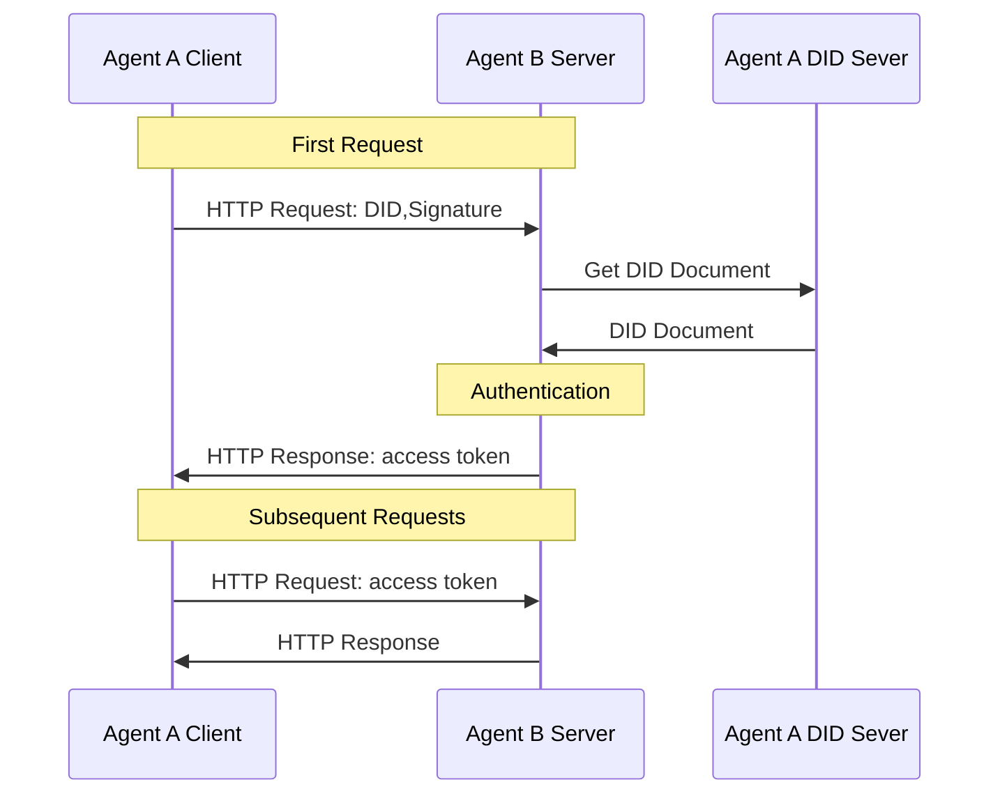

# ANP Getting Started Guide

## Overview

### What is ANP

ANP (Agent Network Protocol) is an open-source intelligent agent communication protocol, designed to be the HTTP protocol for the age of the agent internet. ANP enables agents to discover, connect, and interact with each other on the internet, establishing an open and secure network for agent collaboration.

ANP solves the key problem of agents being unable to communicate and collaborate efficiently, securely, and in a standardized way on the internet, providing a foundational communication protocol for the internet in the AI era.

### How ANP Helps Solve Practical Problems

#### Application Scenario Example: Cross-Platform Intelligent Assistant Collaboration

Imagine using a personal intelligent assistant to book a hotel. In the traditional model, this assistant would need to simulate human behavior to access the hotel website, or the hotel would need to develop a specific API for this particular assistant.

With ANP:

* Your personal assistant has its own decentralized identity (DID) and can directly interact with other agents using this identity, without needing to register an identity with other agents.
* It can directly discover and connect to any hotel agent that supports ANP, regardless of which company or platform they belong to.
* Both parties establish secure identity verification and encrypted communication based on DIDs, ensuring interaction security.
* They understand the services and data provided by the hotel agent through standardized methods.
* They complete the booking without simulating human behavior or relying on platform-specific APIs.

This not only improves efficiency but also solves data privacy issues (the personal assistant can process information locally and only send necessary information to the hotel agent).

#### More Problems ANP Can Solve

* **Data Silos**: Today's internet services are isolated from each other. ANP enables seamless communication between agents through standardized agent descriptions and interaction protocols, making it as natural as humans visiting different websites.
* **Identity Fragmentation**: Currently, you need separate accounts on each platform. ANP uses decentralized identities (DIDs), giving agents their own "digital passports" that can move freely between any services supporting ANP.
* **Inefficient AI-Internet Interaction**: Currently, AI must simulate human operations or use specific APIs to access network services. ANP provides an AI-native interaction method, just like HTTP provides a standard access method for human browsers.

### Key Principles

* **Decentralization**: Agents have independent identities, not relying on centralized platforms, promoting an open ecosystem.
* **Interoperability**: Agents created by different developers and companies can collaborate seamlessly, breaking down data silos.
* **Leveraging Existing Web Infrastructure**: Built on existing web technologies, requiring no new underlying infrastructure, enabling rapid deployment and adoption.
* **AI-Native & Autonomy**: A communication protocol specifically designed for AI agents, supporting autonomous decision-making and interaction.

### Comparison of ANP with MCP and A2A

ANP, MCP, and A2A are complementary protocols, each solving agent communication problems in different scenarios:

* **MCP (Model Context Protocol)**: A bridge connecting AI models with tools/resources, using a client-server architecture, suitable for a single model accessing multiple tools and resources, such as accessing search engines, calling calculators, etc.
* **A2A (Agent2Agent)**: Designed for complex agent collaboration within enterprises, focusing on task-driven collaborative processes, suitable for completing complex task chains in trusted environments, such as workflow automation within enterprises.
* **ANP (Agent Network Protocol)**: Created for agent interconnection on the open internet, using a peer-to-peer architecture, enabling cross-platform and cross-organization agent discovery and interaction, such as communication between agents from different companies.

**In short**: Use MCP to connect tools or resources, A2A for agent collaboration within enterprises, and ANP for agent connections on the open internet.

### Core Concepts and Mechanisms

#### ANP Protocol Architecture

ANP adopts a three-layer architecture design, allowing agents to communicate freely and securely on the internet:


* **Identity and Encrypted Communication Layer**: Solves the problems of "who am I" and "how to communicate securely," based on the W3C DID standard, implementing decentralized identity and end-to-end encryption.
* **Meta-Protocol Layer**: Solves the problem of "how to negotiate communication methods," allowing agents to automatically negotiate which protocol format and version to use for interaction.
* **Application Protocol Layer**: Solves the problems of "what functions are provided" and "how to be discovered," including agent description and discovery mechanisms.

This architecture ensures that agents can autonomously find each other on the internet, securely establish connections, and communicate effectively.

#### Transport & Format

ANP transmits data based on the HTTP protocol and organizes information using the JSON-LD format.

Why choose JSON-LD?

* **High Compatibility**: Based on JSON, supported by almost all programming languages.
* **Rich Semantics**: Introduces vocabularies through "@context" and uses schema.org, giving data clear meaning.
* **Easy for AI to Understand**: Provides unified data structures and semantics, making it easier for AI to correctly understand information.
* **Forms a Data Network**: Builds an associative network between agents through linked data.

JSON-LD example:

```json
{
  "@context": [
    "https://www.w3.org/ns/did/v1",
    "https://schema.org"
  ],
  "@type": "Agent",
  "name": "Travel Assistant",
  "description": "Helps plan travel and book services",
  "url": "https://travel-assistant.example.com",
  "potentialAction": {
    "@type": "SearchAction",
    "target": "https://travel-assistant.example.com/search?q={search_term}",
    "query-input": "required name=search_term"
  }
}
```

#### Agent Identity (DID)

Decentralized Identifiers (DID) are the foundation of ANP agent identity.

Why is agent identity so important? For agents to interconnect on the internet, they first need to solve the problems of "who am I" and "who are you." Without reliable identity, trust cannot be established, and communication security cannot be ensured.

Why choose DID?

* **W3C International Standard**, ensuring global interoperability, one identity usable worldwide.
* **Native decentralized design**, allowing agents to autonomously control their own identity.
* **Flexible support for multiple verification methods**, adapting to different scenarios.
* **No dependency on centralized identity providers**, avoiding single points of failure.

Compared to other solutions:

* **Blockchain Identity**: High deployment cost, slow transaction speed, high resource consumption.
* **OpenID Connect**: Depends on centralized identity providers, poor autonomy.
* **API Keys**: Lack of standardization, poor interoperability, complex management.

#### did:wba Method

did:wba (Web-Based Agent) is a DID method designed by ANP, based on the Web rather than blockchain. **It cleverly leverages existing Web infrastructure (such as HTTPS and DNS)**, combining the convenience of the Web with decentralized identity control, achieving an effect similar to email identity.

**The core idea is: each `did:wba` identifier maps to a specific HTTPS URL. This URL points to a DID document (usually named `did.json`) hosted on a web server controlled by the agent itself.**

did:wba format example:

```
did:wba:example.com:alice
```

Below is a minimal DID document example (`did.json`):

```json
{
    "@context": [ // Defines vocabularies and namespaces used in the document
      "https://www.w3.org/ns/did/v1", // W3C DID core vocabulary
      "https://w3id.org/security/suites/ed25519-2020/v1", // Ed25519 signature suite
    ],
    "id": "did:wba:example.com%3A8800:user:alice", // DID identifier, uniquely identifies this agent, note the port number ':' is URL encoded (%3A)
    "authentication": [ // Specifies verification methods that can be used for authentication (proving control of the DID)
      {
        "id": "did:wba:example.com%3A8800:user:alice#key-1",
        "type": "Ed25519VerificationKey2020", // Another signature algorithm (EdDSA - Edwards-curve Digital Signature Algorithm)
        "controller": "did:wba:example.com%3A8800:user:alice",
        "publicKeyMultibase": "zH3C2AVvLMv6gmMNam3uVAjZpfkcJCwDwnZn6z3wXmqPV" // Public key in Multibase format, the most important field, used for authentication
      }
    ],
    "service": [ // Optional: defines a list of service endpoints associated with this DID
      {
        "id": "did:wba:example.com%3A8800:user:alice#agent-description", // Unique identifier for the service endpoint
        "type": "AgentDescription", // Service type, used to discover the agent's description document
        "serviceEndpoint": "https://agent-network-protocol.com/agents/example/ad.json" // URL where the service can be accessed (in this example, the agent description file)
      }
      // There may be other service endpoints...
    ]
}
```

Features:

* **Not dependent on blockchain**, lowering the usage threshold.
* **Leverages existing Web infrastructure (HTTPS, DNS)**, easy to deploy and resolve.
* **Agents autonomously control their identity**, with DID documents hosted on their own servers.
* **Combines decentralized features with Web compatibility**.

Authentication process:



Essentially, DID authentication is based on public-private key encryption technology:

* Agent A initiates a connection request to Agent B, carrying its own DID.
* Agent B resolves A's DID to obtain A's DID document and public key.
* Agent B verifies the signature using A's public key, confirming A's identity.
* Agent B returns an access token to Agent A.
* Agent A carries the access token in subsequent requests, and Agent B verifies the access token to confirm Agent A's identity.

### Agent Description

#### Agent Description Definition

The agent description protocol defines how to describe an agent's information and interaction methods, which is the foundation for agents to be discovered and used.

#### Core Concepts of Agent Description

The core concepts of agent description are information and interfaces:

* **Information**: The agent's information, such as name, description, products, services, etc., helping other agents understand "who this is" and "what it can do."
* **Interface**: Defines how to interact with the agent, divided into two categories:
    * **Natural Language Interface**: Allows interaction with the agent through natural language dialogue, suitable for complex, open-ended communication.
    * **Structured Interface**: Defines standardized API call formats, suitable for precise data exchange and operation execution. Supports most existing specifications, such as OpenAPI, JSON-RPC, etc.

#### Agent Description Format

ANP uses the JSON-LD (JSON for Linked Data) format and schema.org vocabulary to describe agents, which is an implementation of semantic web technology.

#### Agent Description Example

Agent descriptions include:

* Basic information (name, description, creator, etc.)
* Authentication methods
* Services and products provided
* Supported interaction interfaces
* Capability descriptions

Advantages:

* **Standardized description method**, improving interoperability.
* **Based on existing schema.org standards**, easy to understand and extend.
* **Agent information can be linked into a data network**, forming an "agent network."
* **Improves consistency in AI understanding of information**.

Hotel agent description file example:

```json
{
  "@context": {
    "@vocab": "https://schema.org/",
    "did": "https://w3id.org/did#",
    "ad": "https://agent-network-protocol.com/ad#"
  },
  "@type": "ad:AgentDescription",
  "@id": "https://example.com/agents/hotel/ad.json",
  "name": "XX Beach Hotel",
  "did": "did:wba:example.com:hotel",
  "owner": {
    "@type": "Organization",
    "name": "Beach Resort Group",
    "@id": "https://xxx.example.com"
  },
  "description": "XX Beach Hotel is a luxury hotel located next to a beautiful beach, offering comfortable accommodations and quality service.",
  "version": "1.0.0",
  "created": "2024-12-31T12:00:00Z",
  "securityDefinitions": {
    "didwba_sc": {
      "scheme": "didwba",
      "in": "header",
      "name": "Authorization"
    }
  },
  "security": "didwba_sc",
  "products": [
    {
      "@type": "Product",
      "name": "Deluxe Ocean View Room",
      "description": "Luxury guest room offering stunning ocean views, equipped with high-end facilities.",
      "@id": "https://example.com/products/deluxe-ocean-view"
    },
    {
      "@type": "Product",
      "name": "SPA Services",
      "description": "Professional SPA therapy and relaxation services.",
      "@id": "https://example.com/products/spa-services"
    }
  ],
  "interfaces": [
    {
      "@type": "ad:NaturalLanguageInterface",
      "protocol": "YAML",
      "url": "https://example.com/api/nl-interface.yaml",
      "description": "Interact with the hotel agent through natural language to query room information, facility services, etc."
    },
    {
      "@type": "ad:StructuredInterface",
      "protocol": "YAML",
      "humanAuthorization": true,
      "url": "https://example.com/api/booking-interface.yaml",
      "description": "Structured interface for booking hotel rooms and services, requiring human authorization."
    },
    {
      "@type": "ad:StructuredInterface",
      "protocol": "JSON-RPC 2.0",
      "url": "https://example.com/api/hotel-api.json",
      "description": "Hotel API interface for querying room availability, prices, and facility information."
    }
  ]
}
```

### Agent Discovery

The agent discovery protocol defines mechanisms for discovering and connecting to agents on the internet.

#### Discovery Mechanism

ANP's agent discovery is based on the ".well-known" URI standard defined in RFC 8615:

* **Web Discovery**: Provides a list of agent description file URLs in the `.well-known` directory of the domain.
    ```
    https://example.com/.well-known/agent-descriptions
    ```
    `agent-descriptions` example:
    ```json
    {
      "@context": {
        "@vocab": "https://schema.org/",
        "did": "https://w3id.org/did#",
        "ad": "https://agent-network-protocol.com/ad#"
      },
      "@type": "CollectionPage",
      "url": "https://agent-network-protocol.com/.well-known/agent-descriptions",
      "items": [
        {
          "@type": "ad:AgentDescription",
          "name": "Smart Assistant",
          "@id": "https://agent-network-protocol.com/agents/smartassistant/ad.json"
        },
        {
          "@type": "ad:AgentDescription",
          "name": "Customer Support Agent",
          "@id": "https://agent-network-protocol.com/agents/customersupport/ad.json"
        }
      ],
      "next": "https://agent-network-protocol.com/.well-known/agent-descriptions?page=2"  // Pagination mechanism
    }
    ```
* **Active Registration**: Agents can actively register with private registries, suitable for local networks or closed environments.
* **Search Engine Discovery**: Standardized description documents placed in the `.well-known` directory of the domain, search engines discover agent-descriptions documents under domains through DNS and index the agent descriptions within them.

ANP allows multiple agents to be hosted under one domain, with each agent having its own unique functions and services.

### ANP Process Detailed Explanation

The overall ANP process is as follows:


The ANP process mainly includes the following steps:

1. **Agent Discovery**: Search engines crawl Agent B's information through the agent discovery mechanism (`.well-known/agent-descriptions`), including its description document URL, name, and other basic information.

2. **Agent Search**: Agent A finds Agent B's description document URL through a search engine. This step allows agents to find suitable service providers through semantic search without knowing the specific domain of the other party.

3. **Authentication Request**: Agent A signs the request using its private key and carries its own DID identifier, requesting a description document or service from Agent B. The signature ensures the authenticity and integrity of the request.

4. **Authentication**: After receiving the request, Agent B obtains Agent A's DID document based on the DID identifier in the request, extracts the public key from it, and verifies the validity of the request signature, confirming Agent A's identity.

5. **Service Interaction**: After authentication is successful, Agent B returns the requested data or service response. Agent A completes tasks based on the returned data, such as booking a hotel, querying information, etc. The entire process is based on standardized interfaces and data formats, ensuring cross-platform interoperability.

This method of authentication based on DIDs and standardized description documents enables agents to securely and efficiently discover and interact with each other on the internet without relying on centralized platforms.
