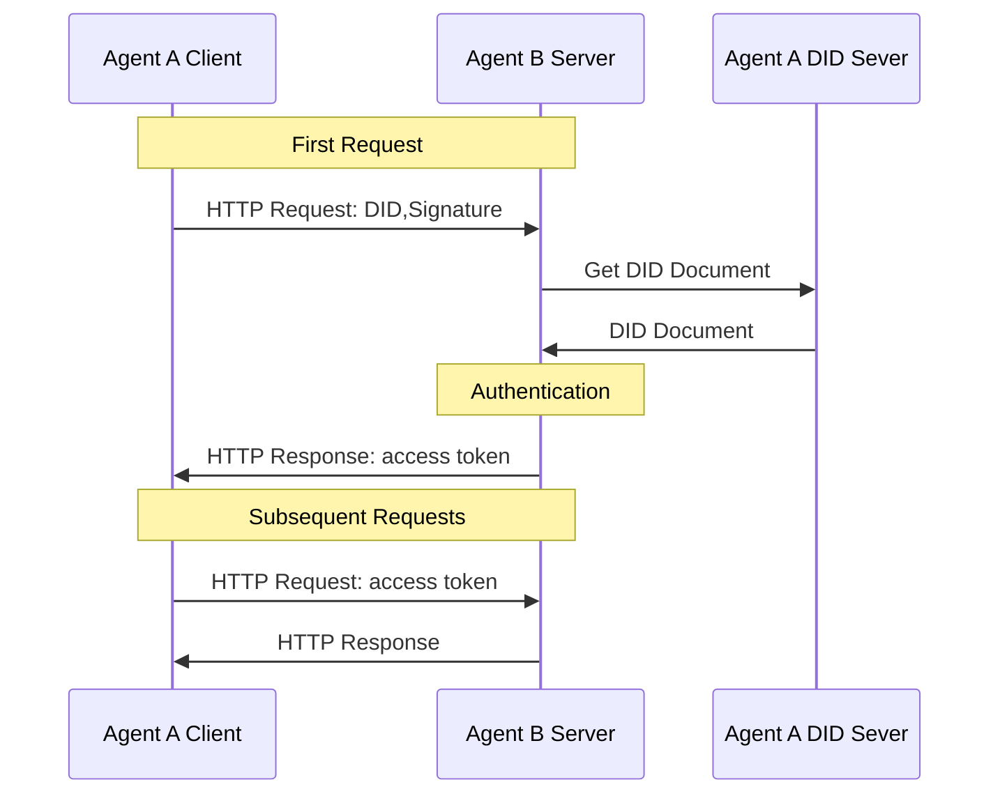

# ANP入门指南

## 概述

### 什么是ANP

ANP（Agent Network Protocol）是一个开源的智能体通信协议，旨在打造智能体互联网时代的HTTP协议。ANP使智能体能够在互联网上相互发现、连接和交互，建立一个开放、安全的智能体协作网络。

ANP解决了智能体在互联网上无法高效、安全、标准化沟通协作的关键问题，为AI时代的互联网提供了基础通信协议。

### ANP如何帮助解决实际问题

#### 应用场景示例：跨平台智能助手协作

想象一下，你使用一个个人智能助手需要预订酒店。在传统模式下，这个助手需要模拟人类行为访问酒店网站，或者酒店需要专门为这个特定助手开发API。

使用ANP后：

*   你的个人助手拥有自己的去中心化身份（DID），直接用这个身份与其他智能体交互，无需在其他智能体注册身份。
*   它可以直接发现并连接到任何支持ANP的酒店智能体，无论它们属于哪个公司或平台。
*   双方基于DID建立安全的身份验证和加密通信，确保交互安全。
*   通过标准化的方式了解酒店智能体提供的服务和数据。
*   完成预订而无需模拟人类行为或依赖特定平台的API。

这不仅提高了效率，还解决了数据隐私问题（个人助手可以在本地处理信息，只将必要信息发送给酒店智能体）。

#### 更多ANP可以解决的问题

*   **数据孤岛问题**：当今互联网上的服务彼此隔离，ANP通过标准化的智能体描述和交互协议，让智能体能够无缝沟通，就像人类可以访问不同网站一样自然。
*   **身份碎片化问题**：目前你在每个平台都需要单独的账号，ANP使用去中心化身份（DID），让智能体拥有自己的"数字护照"，可以在任何支持ANP的服务间自由移动。
*   **AI与互联网交互低效问题**：现在AI要访问网络服务必须模拟人类操作或使用特定API，ANP提供AI原生的交互方式，就像HTTP为人类浏览器提供了标准访问方式一样。

### 关键原则 (Key Principles)

*   **去中心化 (Decentralization)**: 智能体拥有独立身份，不依赖于中心化平台，促进开放生态系统。
*   **互操作性 (Interoperability)**: 不同开发者和公司创建的智能体可以无缝协作，打破数据孤岛。
*   **利用现有Web基础设施 (Leveraging Existing Web Infrastructure)**: 基于现有Web技术构建，无需新建底层设施，快速部署和采用。
*   **AI原生与自主性 (AI-Native & Autonomy)**: 专为AI智能体设计的通信协议，支持智能体自主决策和互动。

### ANP与MCP、A2A的对比

ANP、MCP和A2A是互补的协议，各自解决不同场景的智能体通信问题：

*   **MCP (Model Context Protocol)**: 是连接AI模型与工具/资源的桥梁，采用客户端-服务器架构，适合单个模型访问多种工具和资源，如访问搜索引擎、调用计算器等。
*   **A2A (Agent2Agent)**: 专为企业内部复杂智能体协作设计，侧重任务驱动的协作流程，适合在可信环境中完成复杂任务链，如企业内部的工作流自动化。
*   **ANP (Agent Network Protocol)**: 为开放互联网上的智能体互联互通而生，采用点对点架构，实现跨平台、跨组织的智能体发现和交互，如不同公司的智能体之间的沟通。

**简言之**：连接工具或资源用MCP，企业内部智能体协作用A2A，开放互联网上的智能体连接用ANP。

### 核心概念与机制

#### ANP协议架构

ANP采用三层架构设计，让智能体能够自由、安全地在互联网上交流：


*   **身份与加密通信层**：解决"我是谁"和"如何安全通信"的问题，基于W3C DID标准，实现去中心化身份和端到端加密。
*   **元协议层**：解决"如何协商通信方式"的问题，让智能体能够自动协商使用哪种协议格式和版本进行交互。
*   **应用协议层**：解决"提供什么功能"和"如何被发现"的问题，包含智能体描述和发现机制。

这种架构确保了智能体能够在互联网上自主寻找彼此，安全建立连接，并有效交流。

#### 传输与格式 (Transport & Format)

ANP基于HTTP协议传输数据，使用JSON-LD格式组织信息。

为什么选择JSON-LD？

*   **兼容性高**：基于JSON，几乎所有编程语言都支持。
*   **语义丰富**：通过"@context"引入词汇表，并使用schema.org，赋予数据明确含义。
*   **易于AI理解**：提供统一的数据结构和语义，AI更容易正确理解信息。
*   **形成数据网络**：通过链接数据，构建智能体之间的关联网络。

JSON-LD示例：

```json
{
  "@context": [
    "https://www.w3.org/ns/did/v1",
    "https://schema.org"
  ],
  "@type": "Agent",
  "name": "旅行助手",
  "description": "帮助规划旅行并预订服务",
  "url": "https://travel-assistant.example.com",
  "potentialAction": {
    "@type": "SearchAction",
    "target": "https://travel-assistant.example.com/search?q={search_term}",
    "query-input": "required name=search_term"
  }
}
```

#### 智能体身份 (DID)

去中心化身份标识符（Decentralized Identifiers, DID）是ANP智能体身份的基础。

为什么智能体身份非常重要？ 互联网上的智能体要互联互通，首先需要解决"我是谁"和"你是谁"的问题。没有可靠的身份，就无法建立信任，也无法确保通信安全。

为什么选择DID？

*   **W3C国际标准**，确保全球互操作性，一个身份全球通用。
*   **原生去中心化设计**，让智能体自主控制自己的身份。
*   **灵活支持多种验证方法**，适应不同场景。
*   **无需依赖中心化身份提供商**，避免单点故障。

相比其他方案：

*   **区块链身份**：部署成本高，交易速度慢，资源消耗大。
*   **OpenID Connect**：依赖中心化身份提供商，自主性差。
*   **API密钥**：缺乏标准化，互操作性差，管理复杂。

#### did:wba方法

did:wba（Web-Based Agent）是ANP设计的DID方法，基于Web而非区块链。**它巧妙地利用了现有的Web基础设施（如HTTPS和DNS）**，结合了Web的便利性和去中心化的身份控制，能够达到类似电子邮件身份的效果。

**其核心思想是：每个 `did:wba` 标识符都映射到一个特定的HTTPS URL。这个URL指向一个托管在智能体自己控制的Web服务器上的DID文档（通常命名为 `did.json`）。**

did:wba格式示例：

```
did:wba:example.com:alice
```

下面是一个最精简的DID文档示例（`did.json`）：

```json
{
    "@context": [ // 定义文档中使用的词汇表和命名空间
      "https://www.w3.org/ns/did/v1", // W3C DID核心词汇
      "https://w3id.org/security/suites/ed25519-2020/v1", // Ed25519 签名套件
    ],
    "id": "did:wba:example.com%3A8800:user:alice", // DID标识符，唯一标识该智能体，注意端口号':'进行了URL编码 (%3A)
    "authentication": [ // 指定可用于身份验证 (证明对DID的控制权) 的验证方法
      {
        "id": "did:wba:example.com%3A8800:user:alice#key-1",
        "type": "Ed25519VerificationKey2020", // 另一种签名算法 (EdDSA - Edwards-curve Digital Signature Algorithm)
        "controller": "did:wba:example.com%3A8800:user:alice",
        "publicKeyMultibase": "zH3C2AVvLMv6gmMNam3uVAjZpfkcJCwDwnZn6z3wXmqPV" // Multibase格式的公钥 ，最重要的字段，用于身份验证
      }
    ],
    "service": [ // 可选：定义与此DID关联的服务端点列表
      {
        "id": "did:wba:example.com%3A8800:user:alice#agent-description", // 服务端点的唯一标识符
        "type": "AgentDescription", // 服务类型，用于发现智能体的描述文档
        "serviceEndpoint": "https://agent-network-protocol.com/agents/example/ad.json" // 可以访问服务的URL (在此示例中是智能体描述文件)
      }
      // 可能还有其他服务端点...
    ]
}
```

特点：

*   **不依赖区块链**，降低使用门槛。
*   **利用现有Web基础设施（HTTPS, DNS）**，易于部署和解析。
*   **智能体自主控制身份**，DID文档托管在自己的服务器上。
*   **兼具去中心化特点与Web兼容性**。

身份验证流程：



本质上，DID身份验证基于公私钥加密技术：

*   智能体A向智能体B发起连接请求，携带自己的DID。
*   智能体B通过DID解析获取A的DID文档和公钥。
*   智能体B用A的公钥验证签名，确认A身份。
*   智能体B返回访问令牌给智能体A。
*   智能体A在后续请求中携带访问令牌，智能体B验证访问令牌，确认智能体A的身份。

### 智能体描述

#### 智能体描述定义

智能体描述协议定义了如何描述智能体的信息和交互方式，是智能体被发现和使用的基础。

#### 智能体描述的核心概念

智能体描述的核心概念是信息和接口(Interface)：

*   **信息**：智能体的信息，如名称、描述、产品、服务等，帮助其他智能体了解"这是谁"和"能做什么"。
*   **接口(Interface)**：定义如何与智能体交互，分为两类：
    *   **自然语言接口**：允许通过自然语言对话与智能体交互，适合复杂、开放式交流。
    *   **结构化接口**：定义标准化的API调用格式，适合精确的数据交换和操作执行。支持现有大部分规范，比如OpenAPI、JSON-RPC等。

#### 智能体描述格式

ANP使用JSON-LD（JSON for Linked Data）格式和schema.org词汇描述智能体，这是语义网技术的实现。

#### 智能体描述示例

智能体描述包含：

*   基本信息（名称、描述、创建者等）
*   身份验证方法
*   提供的服务和产品
*   支持的交互接口
*   能力描述

优势：

*   **标准化的描述方式**，提高互操作性。
*   **基于现有schema.org标准**，易于理解和扩展。
*   **智能体信息可链接成数据网络**，形成"智能体网络"。
*   **提高AI对信息的理解一致性**。

酒店智能体描述文件示例：

```json
{
  "@context": {
    "@vocab": "https://schema.org/",
    "did": "https://w3id.org/did#",
    "ad": "https://agent-network-protocol.com/ad#"
  },
  "@type": "ad:AgentDescription",
  "@id": "https://example.com/agents/hotel/ad.json",
  "name": "XX海滩酒店",
  "did": "did:wba:example.com:hotel",
  "owner": {
    "@type": "Organization",
    "name": "海滩度假村集团",
    "@id": "https://xxx.example.com"
  },
  "description": "XX海滩酒店是一家位于美丽海滩旁的豪华酒店，提供舒适的住宿环境和优质的服务。",
  "version": "1.0.0",
  "created": "2024-12-31T12:00:00Z",
  "securityDefinitions": {
    "didwba_sc": {
      "scheme": "didwba",
      "in": "header",
      "name": "Authorization"
    }
  },
  "security": "didwba_sc",
  "products": [
    {
      "@type": "Product",
      "name": "豪华海景房",
      "description": "提供绝美海景视野的豪华客房，配备高端设施。",
      "@id": "https://example.com/products/deluxe-ocean-view"
    },
    {
      "@type": "Product",
      "name": "SPA水疗服务",
      "description": "提供专业的SPA水疗和放松服务。",
      "@id": "https://example.com/products/spa-services"
    }
  ],
  "interfaces": [
    {
      "@type": "ad:NaturalLanguageInterface",
      "protocol": "YAML",
      "url": "https://example.com/api/nl-interface.yaml",
      "description": "通过自然语言与酒店智能体交互，查询房间信息、设施服务等。"
    },
    {
      "@type": "ad:StructuredInterface",
      "protocol": "YAML",
      "humanAuthorization": true,
      "url": "https://example.com/api/booking-interface.yaml",
      "description": "用于预订酒店房间和服务的结构化接口，需要人工授权。"
    },
    {
      "@type": "ad:StructuredInterface",
      "protocol": "JSON-RPC 2.0",
      "url": "https://example.com/api/hotel-api.json",
      "description": "酒店API接口，用于查询房间可用性、价格和设施信息。"
    }
  ]
}
```

### 智能体发现

智能体发现协议定义了如何在互联网上发现和连接智能体的机制。

#### 发现机制

ANP的智能体发现基于RFC 8615定义的".well-known" URI标准：

*   **Web发现**：在域名的`.well-known`目录下提供智能体描述文件URL列表。
    ```
    https://example.com/.well-known/agent-descriptions
    ```
    `agent-descriptions` 示例：
    ```json
    {
      "@context": {
        "@vocab": "https://schema.org/",
        "did": "https://w3id.org/did#",
        "ad": "https://agent-network-protocol.com/ad#"
      },
      "@type": "CollectionPage",
      "url": "https://agent-network-protocol.com/.well-known/agent-descriptions",
      "items": [
        {
          "@type": "ad:AgentDescription",
          "name": "Smart Assistant",
          "@id": "https://agent-network-protocol.com/agents/smartassistant/ad.json"
        },
        {
          "@type": "ad:AgentDescription",
          "name": "Customer Support Agent",
          "@id": "https://agent-network-protocol.com/agents/customersupport/ad.json"
        }
      ],
      "next": "https://agent-network-protocol.com/.well-known/agent-descriptions?page=2"  // 分页机制
    }
    ```
*   **主动注册**：智能体可以主动注册到私有注册表，适用于局域网或封闭环境。
*   **搜索引擎发现**：标准化的描述文档放到域名的`.well-known`目录下，搜索引擎通过DNS发现域名下的agent-descriptions文档，索引其中的智能体描述。

ANP允许一个域名下托管多个智能体，每个智能体可以有自己独特的功能和服务。

### ANP流程详解

ANP整体流程如下：


ANP流程主要包括以下几个步骤：

1. **智能体发现**：搜索引擎通过智能体发现机制（`.well-known/agent-descriptions`）爬取智能体B的信息，包括其描述文档URL、名称等基本信息。

2. **智能体搜索**：智能体A通过搜索引擎找到智能体B的描述文档URL。这一步使得智能体能够在不知道对方具体域名的情况下，通过语义搜索找到合适的服务提供者。

3. **身份验证请求**：智能体A使用自己的私钥对请求进行签名，并携带自己的DID标识符，向智能体B请求描述文档或服务。签名确保了请求的真实性和完整性。

4. **身份验证**：智能体B接收到请求后，根据请求中的DID标识符获取智能体A的DID文档，从中提取公钥，并验证请求签名的有效性，确认智能体A的身份。

5. **服务交互**：身份验证通过后，智能体B返回请求的数据或服务响应。智能体A根据返回的数据完成任务，如预订酒店、查询信息等。整个过程基于标准化的接口和数据格式，确保了跨平台互操作性。

这种基于DID的身份验证和标准化描述文档的方式，使得智能体能够在互联网上安全、高效地相互发现和交互，无需依赖中心化平台。
